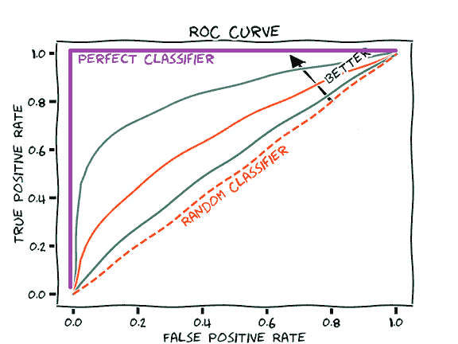

# 衡量业绩:AUC (AUROC)

> 原文：<https://towardsdatascience.com/measuring-performance-auc-auroc-8c8bbfe9be91?source=collection_archive---------16----------------------->

受试者操作特征(AUROC)下的面积是一个性能指标，可用于评估分类模型。AUROC 会告诉您您的模型是否能够正确排列示例:

*   对于临床风险预测模型，AUROC 告诉您随机选择的经历了某一事件的患者比随机选择的未经历该事件的患者具有更高的预测风险评分的概率( [ref](https://www.statisticshowto.datasciencecentral.com/c-statistic/) )。
*   对于二进制手写数字分类模型(“1”对“0”)，AUROC 会告诉您随机选择的“1”图像比随机选择的“0”图像具有更高的“1”预测概率

因此,【AUROC 是一个“区分”的性能指标:它告诉你模型区分案例(正面例子)和非案例(负面例子)的能力。)0.8 的 AUROC 意味着该模型具有良好的区分能力: [80%的时候，该模型将正确地为随机选择的有事件的患者分配比随机选择的无事件患者更高的绝对风险](https://www.ncbi.nlm.nih.gov/pmc/articles/PMC3673738/)。

**如何解释 AUROC** ( [ref](https://www.ncbi.nlm.nih.gov/pmc/articles/PMC3673738/) )

图:ROC 曲线(根据[这幅漫画](https://commons.wikimedia.org/wiki/File:Roc-draft-xkcd-style.svg)修改)

上图显示了一些 ROC 曲线示例。给定曲线的 AUROC 就是其下方的面积。

最差的 AUROC 是 0.5，最好的 AUROC 是 1.0。

*   0.5 的 AUROC(上图中红色虚线下的区域)对应于抛硬币，即无用的模型。
*   小于 0.7 的 AUROC 是次优性能
*   0.70–0.80 的 AUROC 是良好的性能
*   大于 0.8 的 AUROC 是极好的性能
*   AUROC 为 1.0(上图中紫色线下的区域)相当于一个完美的分类器

**如何计算 AUROC**

AUROC 计算为 ROC 曲线下的面积。ROC 曲线显示了跨不同决策阈值的真阳性率(TPR)和假阳性率(FPR)之间的权衡。有关 TPR、FPR 和决策阈值的回顾，请参见[衡量绩效:混淆矩阵](https://glassboxmedicine.com/2019/02/17/measuring-performance-the-confusion-matrix/)。

在绘制的 ROC 曲线中(例如上一节的图)，决策阈值是隐含的。决策阈值是显示为轴的*而不是*。AUROC 本身也没有明确显示；这意味着，显示的 ROC 曲线下的面积。

ROC 曲线的 x 轴是假阳性率，ROC 曲线的 y 轴是真阳性率。

*   ROC 曲线总是从左下角开始，即对应于决策阈值 1 的点(FPR = 0，TPR = 0 )(其中每个例子都被分类为阴性，因为所有预测的概率都小于 1)。)
*   ROC 曲线总是在右上角结束，即对应于决策阈值 0 的点(FPR = 1，TPR = 1 )(其中每个例子都被分类为阳性，因为所有预测的概率都大于 0)。)
*   创建曲线的中间点是通过针对 1 和 0 之间的不同决策阈值计算 TPR 和 FPR 来获得的。对于一个粗糙的、有角度的“曲线”，你可以只使用几个判决阈值:例如判决阈值[1，0.75，0.5，0.25，0]。对于更平滑的曲线，您可以使用许多决策阈值，例如[1，0.98，0.96，0.94，…，0.08，0.06，0.04，0.02，0]的决策阈值。

下图显示了根据真实数据计算的 ROC 曲线，在 ROC 曲线的锯齿状本质中，使用离散决策阈值更容易理解:

([图来源](https://en.wikipedia.org/wiki/Receiver_operating_characteristic#/media/File:Roccurves.png))

为二元分类任务计算测试集 AUROC 的步骤:

1.  训练你的机器学习模型
2.  使用定型模型对测试集进行预测，这样测试集中的每个示例都有介于 0 和 1 之间的分类概率。
3.  使用测试集的模型输出预测概率，计算不同决策阈值的 TPR 和 FPR，并绘制 ROC 曲线。
4.  计算 ROC 曲线下的面积。

实际上，您不需要编写代码来手动计算 AUROC。许多编程语言中都有计算 AUROC 的函数。例如，在 Python 中，您可以执行以下操作:

> *导入 sklearn.metrics*
> 
> *fpr，tpr，thresholds = sk learn . metrics . roc _ curve(y _ true = true _ labels，y_score = pred_probs，pos _ label = 1)#正类为 1；负类为 0
> auroc = sk learn . metrics . AUC(FPR，tpr)*

首先，向函数 sklearn.metrics.roc_curve()提供基本事实测试集标签(作为向量 y_true)和模型的预测概率(作为向量 y_score ),以获得输出 fpr、tpr 和阈值。fpr 是具有针对不同阈值计算的假阳性率的向量；tpr 是具有不同阈值的计算的真阳性率的向量；thresholds 是一个带有实际阈值的向量，只是在您想要检查它的情况下提供的(在下一个函数中，您不需要显式的 thresholds 向量。)向量 fpr 和 tpr 定义了 ROC 曲线。然后将 fpr 和 tpr 向量传递给 sklearn.metrics.auc()以获得 AUROC 最终值。

**何时使用 AUROC**

对于不平衡数据，AUROC 比准确性更能提供信息。这是一个非常常见的性能指标，使用各种软件包很容易计算，因此为执行二元分类任务的模型计算 AUROC 通常是一个好主意。

了解 AUROC 的局限性也很重要。AUROC 可能对模型的性能“过于乐观”,这些模型是为反面例子比正面例子多得多的数据集构建的。许多真实世界的数据集都符合这一描述:例如，您可能会认为在从普通人群中抽取的数据集中，健康的人(“疾病阴性”)比患病的人(“疾病阳性”)多得多。)在这些真阴性支配真阳性的情况下，可能很难用 AUROC 来区分两种算法的性能。

为什么？在负样本比正样本多得多的情况下，假阳性数量的大幅提高只会导致假阳性率的小幅变化。这是因为假阳性率被计算为假阳性/(假阳性+真阴性)，如果我们在分母中有大量的真阴性，那么仅仅通过改变假阳性就很难改变假阳性率。

假装算法 1 比算法 2 的假阳性少得多(即算法 1 更好)。如果数据有很多真阴性，算法 1 和算法 2 的假阳性率不会有太大差别，它们的 AUROCs 也不会有太大差别。

要点:AUROC 是一个有用的指标，但是你应该知道 AUROC 并没有捕捉到大量负面例子对算法性能的影响。另一个不会被真阴性“淹没”的性能指标是精确召回曲线下面积(AUPRC ),这将在以后的帖子中讨论。

本节的参考(也是额外深入讨论的重要资源):[精确召回和 ROC 曲线之间的关系](http://pages.cs.wisc.edu/~jdavis/davisgoadrichcamera2.pdf)

如果我的模型预测了两个以上的类怎么办？

你可以分别计算每个类的 AUROC，例如，假设你的任务由许多不同的二进制分类任务组成:A 类与非 A 类，B 类与非 B 类，C 类与非 C 类等等。

**命名法**

受试者操作特征下面积的最常见缩写是“AUC”这是一个糟糕的术语，因为 AUC 只是代表“曲线下面积”(并没有具体说明*什么*曲线；ROC 曲线仅仅是隐含的)。因此，在这篇文章中，我更喜欢缩写 AUROC。你也可以看到 AUROC 被称为 c 统计量或“一致性统计量”

上图是一个 ["auroch"](https://en.wikipedia.org/wiki/Aurochs) ，不要和一个" AUROC ":)混淆。奥罗克牛是一种现已灭绝的牛，曾经生活在北非、欧洲和亚洲。(杜克+DS 的另一名成员带给你的自然琐事，他在一次关于“AUROC”缩写的讨论中让我想起了 auroch。)

结束了！请继续关注未来关于 AUROC 的表亲 AUPRC 的帖子。

*原载于 2019 年 2 月 23 日*[*http://glassboxmedicine.com*](https://glassboxmedicine.com/2019/02/23/measuring-performance-auc-auroc/)*。*