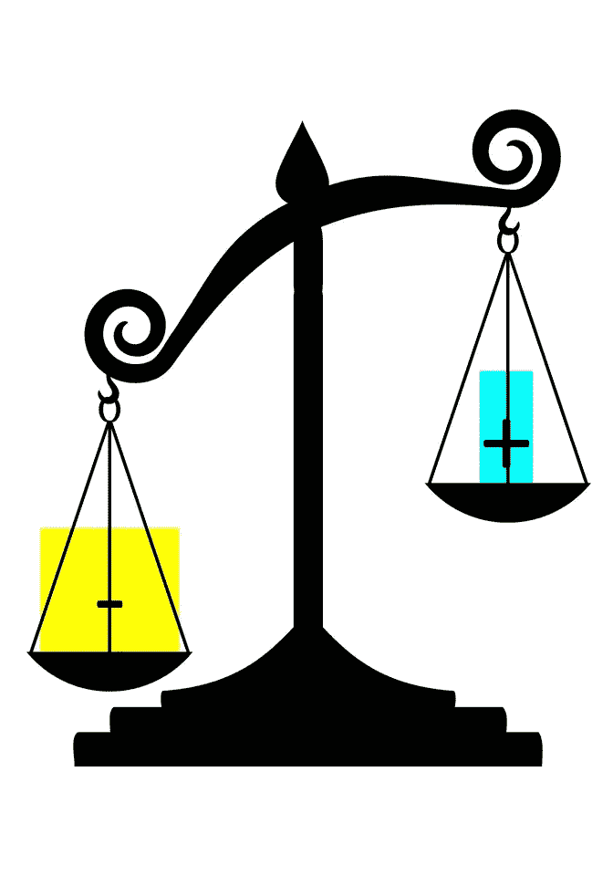
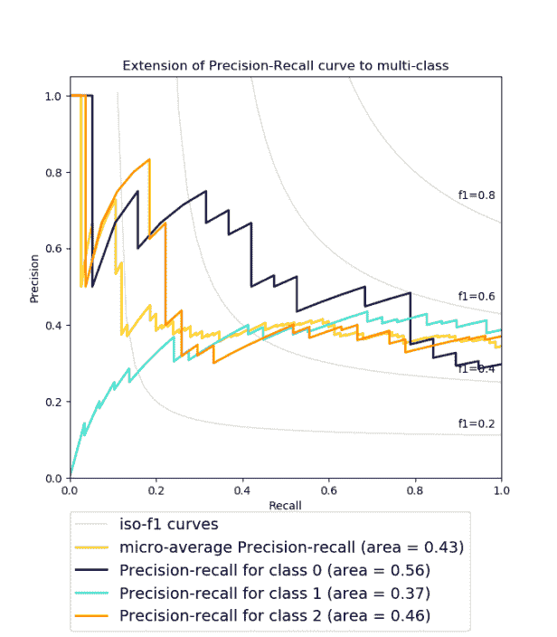

# 测量性能:AUPRC 和平均精度

> 原文：<https://towardsdatascience.com/measuring-performance-auprc-e71819c26425?source=collection_archive---------14----------------------->



精确召回曲线下的面积(AUPRC)是一个有用的性能指标，用于在您非常关心寻找正面例子的问题设置中的不平衡数据。例如，您可能正在构建一个分类器来检测胸部 x 射线中的气胸，并且您希望确保找到所有气胸，而不会错误地将健康肺标记为气胸阳性。如果您的模型获得了完美的 AUPRC，这意味着您的模型找到了所有的阳性样本/气胸患者(完美回忆),而没有意外地将任何阴性样本/健康患者标记为阳性(完美精确)。“平均精度”是计算 AUPRC 的一种特殊方法。

# **如何解读 AUPRC**



Figure: [PR Curves, from scikit-learn](https://scikit-learn.org/stable/auto_examples/model_selection/plot_precision_recall.html)

上图显示了一些 PR 曲线示例。给定类别的 AUPRC 就是其 PR 曲线下的面积。

解释 AUPRC 比解释 AUROC ( [接收器工作特性](http://glassboxmedicine.com/2019/02/23/measuring-performance-auc-auroc/)下的区域)要稍微棘手一些。这是因为 AUROC 的基线永远是 0.5——一个随机的分类器，或者一次抛硬币，会得到 0.5 的 AUROC。但是对于 AUPRC，基线等于阳性分数([斋藤等人](https://journals.plos.org/plosone/article?id=10.1371/journal.pone.0118432))，其中阳性分数计算为(#阳性样本数/总样本数)。这意味着不同的类别有不同的 AUPRC 基线。一个有 12%阳性的类的基线 AUPRC 是 0.12，所以在这个类上获得 0.40 的 AUPRC 是非常好的。然而，98%阳性的类的基线 AUPRC 为 0.98，这意味着在该类上获得 0.40 的 AUPRC 是不好的。

对于许多真实世界的数据集，尤其是医学数据集，阳性率通常小于 0.5，这意味着 AUPRC 的基线值低于 AUROC。因此，AUPRC 的绝对值通常小于 AUROC。例如，可以获得 0.8 的 AUROC 和 0.3 的 AUPRC。我认为这是 AUPRC 在文献中不像 AUROC 那样经常被报道的一个原因。获得 0.8 的性能“听起来更令人印象深刻”，尽管手头上更有意义的数字可能是 0.3 AUPRC。不要让趋势让你气馁；AUPRC 是一个关键的计算指标，适用于对阳性结果进行正确分类非常重要的问题，例如，根据实验室测试预测患者的诊断，或预测患者是否会出现并发症，或预测患者是否需要去医院。你可以同时报告 AUPRC 和 AUROC。

# **如何计算 AUPRC**

AUPRC 计算为 PR 曲线下的面积。PR 曲线显示了不同决策阈值的精确度和召回率之间的权衡。

(注意，“回忆”是真阳性率(TPR)的另一个名称。因此，AUPRC 和 AUROC 都利用 TPR。有关 TPR、精度和决策阈值的回顾，请参见[测量性能:混淆矩阵](http://glassboxmedicine.com/2019/02/17/measuring-performance-the-confusion-matrix/)。)

PR 曲线的 x 轴是召回率，y 轴是精确度。这与 ROC 曲线相反，ROC 曲线的 y 轴是召回，x 轴是 FPR。类似于绘制的 ROC 曲线，在绘制的 PR 曲线中，决策阈值是隐含的，并且不显示为单独的轴。

*   PR 曲线开始于左上角，即对应于决策阈值 1 的点(召回= 0，精度= 1 )(其中每个例子都被分类为否定的，因为所有预测的概率都小于 1)。)注意，具有最大输出值的示例的基础事实标签(正或负)对 PR 曲线的外观有很大影响。
*   PR 曲线在右下角结束，这里 recall = 1，precision 较低。这对应于决策阈值 0(其中每个例子都被分类为肯定的，因为所有预测的概率都大于 0。)注意，接近零的召回精度的估计往往具有高方差。
*   创建 PR 曲线的中间点是通过计算 1 和 0 之间的不同决策阈值的精度和召回率来获得的。对于一个粗略的“角度”曲线，你可以只使用几个决策阈值。对于更平滑的曲线，可以使用许多决策阈值。

为什么要看精度和召回率的权衡？同时考虑召回率和精确度是很重要的，因为您可以使用将所有内容标记为肯定的朴素分类器来实现完美的召回率(但精确度较差),也可以使用将所有内容标记为否定的朴素分类器来实现完美的精确度(但召回率较差)。

为了计算 AUPRC，我们计算 PR 曲线下的面积。有多种方法可以计算 PR 曲线下的面积，包括下梯形估计量、插值中值估计量和平均精度。

我喜欢用平均精度来计算 AUPRC。在 Python 中，平均精度的计算方法如下:

```
import sklearn.metrics
auprc = sklearn.metrics.average_precision_score(true_labels, predicted_probs)
```

对于此函数，您需要提供一个基本事实标签的向量(true_labels)和一个来自模型的相应预测概率的向量(predicted_probs)。) [Sklearn](https://scikit-learn.org/stable/modules/generated/sklearn.metrics.average_precision_score.html) 会利用这些信息为你计算平均精度。

在函数文档中,“平均精度”将精度-召回曲线总结为在每个阈值达到的精度的加权平均值，召回从前一个阈值的增量作为权重。[……]这种实现是不插值的，不同于使用梯形规则输出精度-召回曲线下的面积，后者使用线性插值，可能过于乐观。”

其他章节参考:Boyd 等人，[“精确度-召回曲线下的区域:点估计和置信区间。”](http://pages.cs.wisc.edu/~boyd/aucpr_final.pdf)

# AUPRC &真底片

PR 曲线的一个有趣特征是它们根本不使用真正的负值:

*   Recall = TPR =真阳性/(真阳性+假阴性)。回忆可以被认为是分类器将所有正例正确标记为正例的能力。
*   精度=真阳性/(真阳性+假阳性)。精确度可以被认为是分类器不将阴性样本错误标记为阳性样本的能力([参考](https://scikit-learn.org/stable/modules/generated/sklearn.metrics.precision_recall_fscore_support.html)

因为 PR 曲线在任何地方都不使用真负值，AUPRC 不会被数据中的大部分真负值“淹没”。您可以在具有 98%负样本/2%正样本的数据集上使用 AUPRC，它将“关注”模型如何处理 2%正样本。如果模型很好地处理了正例，AUPRC 就会很高。如果模型在正面例子上表现不佳，AUPRC 将会很低。

具有讽刺意味的是，AUPRC 通常在其基线最低时最有用，因为有许多数据集具有大量真阴性，其目标是尽可能好地处理一小部分阳性。

# **如果我的模型预测了两个以上的类怎么办？**

您可以假设您的任务由许多不同的二进制分类任务组成，并计算 A 类与非 A 类、B 类与非 B 类、C 类与非 C 类等的 AUPRC。

# **总结**

*   AUPRC 的计算方法有很多种，包括平均精度。
*   当一个模型找到所有的正例(完全回忆)而没有意外地将任何负例标记为正例(完全精确)时，它实现了完全 AUPRC。
*   AUPRC 的基线等于阳性分数。如果数据集包含 8%的癌症样本和 92%的健康样本，则基线 AUPRC 为 0.08，因此在这种情况下获得 0.40 的 AUPRC 是很好的！
*   当你非常关心你的模型正确处理正例时，AUPRC 是最有用的。
*   AUPRC 的计算根本不涉及真负值。

## **关于特色图片**

天平的特色图像从这里的[修改为](https://pixabay.com/vectors/justice-measure-scale-silhouette-1296381/)。

*原载于 2019 年 3 月 2 日*[*【http://glassboxmedicine.com*](https://glassboxmedicine.com/2019/03/02/measuring-performance-auprc/)*。*