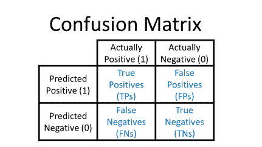
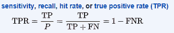
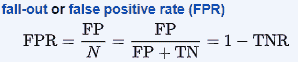
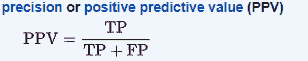

# 衡量绩效:困惑矩阵

> 原文：<https://towardsdatascience.com/measuring-performance-the-confusion-matrix-25c17b78e516?source=collection_archive---------19----------------------->

混淆矩阵是使用模型对数据集的预测来计算的。通过查看混淆矩阵，您可以更好地了解您的模型的优点和缺点，并且可以更好地比较两个备选模型，以了解哪一个更适合您的应用程序。传统上，混淆矩阵是使用模型对保留测试集的预测来计算的。

这是一个混淆矩阵:

列标签“实际阳性”和“实际阴性”是指数据集中的基本事实标签，即手写数字是真正的 1 还是 0，患者是否真正被诊断患有疾病(1)或不是(0)，胸部 x 光片是否实际显示肺炎(1)或不是(0)等。

行标签“预测正”和“预测负”指的是您的模型的预测，即您的模型认为标签是什么。

注意混淆矩阵(TPs，FPs，FNs，TNs)内的条目是*计数:*

*   真阳性(TPs):模型正确分类为阳性的阳性样本的数量
*   真实否定(TNs):模型正确分类为否定的否定例子的数量
*   假阳性(FPs):被模型错误分类为阳性的阴性样本的数量(即被错误分类为“阳性”的阴性样本)
*   假阴性(FNs):被模型错误分类为阴性的阳性样本的数量(即被错误分类为“阴性”的阳性样本)

**真阳性率和假阳性率**

您可以使用混淆矩阵来计算真阳性率(TPR)和假阳性率(FPR)。稍后将需要 TPR 和 FPR 来计算接收机工作特性(AUROC)下的面积，AUROC 是一个流行的性能指标。

真阳性率=真阳性/所有阳性=真阳性/(真阳性+假阴性)

假阳性率=假阳性/全部阴性=假阳性/(假阳性+真阴性)

即

( [ref](https://en.wikipedia.org/wiki/Confusion_matrix)

(在上面的公式中，FNR =假阴性率，TNR =真阴性率，这些是可以从混淆矩阵中计算出来的其他量。)

**精度**

你也可以使用混淆矩阵来计算精度。稍后将需要精度以及真实的阳性率(也称为“召回”)，来计算精度-召回曲线下的面积(AUPRC)，这是另一个流行的性能指标。

精度=真阳性/(真阳性+假阳性)

即

([参考](https://en.wikipedia.org/wiki/Confusion_matrix))

**决策阈值**

决策阈值允许您将预测概率转换为预测标签。如果模型输出概率，则必须使用决策阈值将这些概率转换为预测标签。一旦你有了预测的标签，你就可以计算一个混淆矩阵。您还需要预测标签来计算 AUROC 和 AUPRC，使用不同的决策阈值进行计算。

“决策阈值”就是您选择用来与某个概率进行比较的数字，以决定该概率应该指示正类还是负类。

常见的决策阈值是 0.5，这意味着任何小于 0.5 的概率都被认为是否定类别的一部分，而任何大于 0.5 的概率都被认为属于肯定类别。

然而，实际上你可以选择任何你想要的决策阈值。您可以将决策阈值设为 0.99，这样一个例子的预测概率必须大于 0.99 才能被认为是“肯定的”。这意味着你的大多数例子会被认为是负面的。

**极限决策阈值**

如果选择决策阈值为 0，则每个示例都将被认为是正面的:

*   这意味着每个例子要么是真阳性，要么是假阳性
*   真正的正率将是 1 (TPR = TP / (TP + FN)但 FN = 0，所以 TPR = TP/TP = 1)
*   假阳性率将是 1 (FPR = FP / (FP + TN)但是 TN = 0，所以 FPR = FP/FP = 1)
*   精度的值将取决于数据的偏差。如果数据集中实际阳性和实际阴性数量相等，则精度为 0.5(精度= TP / (TP + FP) = 50 / (50+50) = 0.5)。如果实际阳性多得多，精度会大于 0.5；如果实际底片多得多，精度会小于 0.5。

如果选择决策阈值 1，则每个示例都将被认为是负面的:

*   这意味着每个例子要么是真阴性，要么是假阴性
*   真正的正率将是 0 (TPR = TP / (TP + FN)但是 TP = 0，所以 TPR = 0)
*   假阳性率将是 0 (FPR = FP / (FP + TN)但是 FP = 0，所以 FPR = 0)
*   从技术上讲，精度将是未定义的(精度= TP / (TP + FP) = 0/0)

**如何选择决策阈值**

决策阈值的选择取决于模型的下游应用。

例如:在某些医疗应用中，假阴性可能比假阳性更糟糕，例如，在皮肤病学照片的自动分类中，您不想错过一个黑色素瘤病例。在这种情况下，您希望选择较低的决策阈值，以便将更多的示例分类为阳性，这将降低您的假阴性率，但会增加假阳性率。

例子:想象一下，在一个社会中，预测模型被用来决定罪犯是应该被说服还是被释放。在这种情况下，假阳性可能比假阴性更糟糕，例如，如果模型错误地确定一个无辜的人有罪，并把那个人送进监狱，那就太糟糕了。(谢天谢地，这一场景仍在反乌托邦科幻小说中，至少目前如此……)

AUROC 和 AUPRC 曲线还可以帮助您直观地了解不同决策阈值导致的权衡，并帮助您为模型的下游应用选择一个好的决策阈值。

**其他名称**

*   真正的阳性率也称为敏感度、回忆率或命中率
*   精确度也称为阳性预测值(PPV)

**混乱矩阵的更多细节**

维基百科上有[一篇关于混淆矩阵的伟大文章](https://en.wikipedia.org/wiki/Confusion_matrix)。它包括关于可以从混淆矩阵计算的其他量的更多细节，包括特异性(也称为选择性或真阴性率)和阴性预测值。

敬请关注未来关于 AUROC 和 AUPRC 的帖子，这两个都是机器学习模型非常有用的性能指标。

*原载于 2019 年 2 月 17 日*[*http://glassboxmedicine.com*](https://glassboxmedicine.com/2019/02/17/measuring-performance-the-confusion-matrix/)*。*