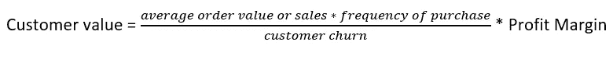
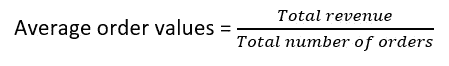
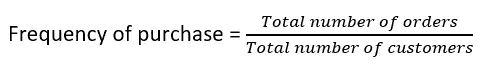
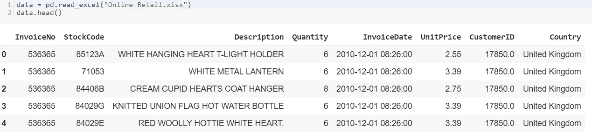
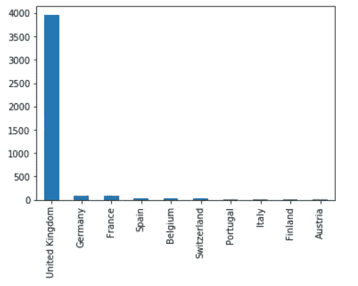
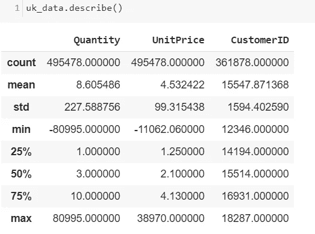
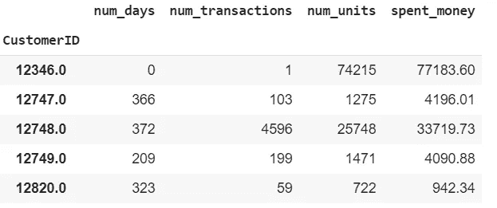
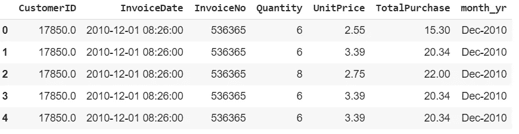
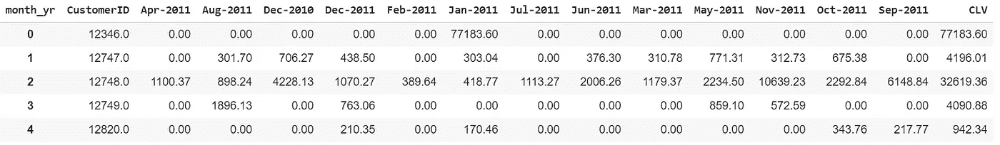

# 营销分析——衡量客户终身价值(CLTV)

> 原文：<https://towardsdatascience.com/measuring-users-with-customer-lifetime-value-cltv-94fccb4e532e?source=collection_archive---------13----------------------->

## CLTV 客户生命周期作为营销技术堆栈

## **CLTV 测量到设备有效的营销策略**


【https://sarit-maitra.medium.com/membership 号

C 客户生命周期价值(CLTV)是一项定量分析，是现代以客户为中心的商业场景中最重要的指标之一。多年来，它一直是直复营销的主要概念，并在营销领域得到越来越多的考虑。在这里，我们将试验一个可实施的 CLTV 模型，该模型对于市场细分和为获取、保留和交叉销售分配营销资源是有用的。模型的选择是基于系统的理论分类法和嵌入客户行为的假设。

## 数据收集:

相关数据总是任何预测的基础，CLTV 也不例外。以下是我们可能想要回答的一些例子/问题:

*   每位特定顾客已经在你的商店消费了多少钱？
*   每个特定的客户实际上已经成为客户多久了？
*   每个特定客户的年龄是多少？年龄是客户画像的重要组成部分。
*   每位顾客对折扣和优惠的反应如何？如果我们知道谁更有可能做出反应，我们就可以制定策略，将营销资金准确地花在这些人身上，并得到一个结果。

## *业务问题:*

本文的目的在于研究下面提到的商业问题。我将演示如何使用线性回归为 CLTV 建立预测模型。

*   如何识别最赚钱的客户？
*   一个公司怎样才能提供最好的东西并获得最大收益？
*   如何细分盈利客户？
*   需要花费多少预算来获得客户？

计算 CLTV 的方法很少。

让我们用一些简单的等式:



*   *客户价值=平均订单价值(AOV)*购买频率*



*   *流失率:流失率是没有再次订购的客户的百分比。*
*   *客户寿命= 1/流失率*
*   *流失率= 1-重复率*

让我们获取数据并深入了解数据中的信息。



## 数据的统计分布:



条形图清楚地显示，我们来自英国的业务数量最多。从描述性统计数据中，我们可以看出，这一部分的数量处于负值。这实际上是不可能的。这可能是订单取消或退货。因此，我们需要过滤大于零的数量。此外，我们还将为 CLTV 分析过滤所需的列。我们需要数据集中的 CustomerID、InvoiceDate、InvoiceNo、数量和单价。

```
data = uk_data[(uk_data[‘Quantity’]>0)]data=uk_data[[‘CustomerID’,’InvoiceDate’,’InvoiceNo’,’Quantity’,’UnitPrice’]]
data[‘TotalPurchase’] = uk_data[‘Quantity’] * uk_data[‘UnitPrice’]
```

现在，我们将计算(a)当前日期和每个客户最后一次购买日期之间的天数，(b)每个客户的订单数量，(c)每个客户的购买价格总和。还可以通过重命名列来进一步纯化数据。

```
data_group= data.groupby(‘CustomerID’).agg({‘InvoiceDate’: lambda date: (date.max() — date.min()).days,
 ‘InvoiceNo’: lambda num: len(num),
 ‘Quantity’: lambda quant: quant.sum(),
 ‘TotalPurchase’: lambda price: price.sum()})# Change the name of columns
data_group.columns=[‘num_days’, ’num_transactions’, ’num_units’, ’spent_money’]
data_group.head()
```



## CLTV 使用公式:

现在，我们将使用前面提到的公式计算 CLTV。

```
# Average Order Value
data_group[‘avg_order_value’]=uk_data_group[‘spent_money’]/uk_data_group[‘num_transactions’]#Purchase Frequency purchase_frequency=sum(uk_data_group[‘num_transactions’])/uk_data_group.shape[0]# Repeat Rate
repeat_rate=uk_data_group[uk_data_group.num_transactions > 1].shape[0]/uk_data_group.shape[0]#Churn Rate
churn_rate=1-repeat_rate
purchase_frequency,repeat_rate,churn_rate
```

#Output: (90.37107880642694，0.9818923743942872，0.018762577

## 利润率和 CLTV:

让我们假设企业赚取 25%的利润。

```
# Profit Margin
data_group[‘profit_margin’]= data_group[‘spent_money’]*0.25# Customer Value
data_group[‘CLTV’]= data_group[‘avg_order_value’]*purchase_frequency)/churn_rate#Customer Lifetime Value
data_group[‘cust_lifetime_value’]=data_group[‘CLTV’]*data_group[‘profit_margin’]
```

## CLTV 的预测模型:

现在我们将使用线性回归模型来预测 CLTV。在将数据推至回归模型之前，我们需要做一些数据准备。

```
uk_data['month_yr'] = uk_data['InvoiceDate'].apply(lambda x: x.strftime('%b-%Y')) # Extract month and year from InvoiceDate.
```



```
# creating a pivot table taking the columns as input, and groups the entries into a two-dimensional table in such a way that provides a multidimensional summation of the data.sale=uk_data.pivot_table(index=[‘CustomerID’],columns=[‘month_yr’],values=’TotalPurchase’,aggfunc=’sum’,fill_value=0).reset_index()sale[‘CLV’]=sale.iloc[:,2:].sum(axis=1) # sum all the months sale
sale.head()
```



现在，让我们为现有客户建立一个回归模型。我们需要一组因变量(y)和自变量(X)。因此，我们将把过去六个月的数据作为自变量，把三年的总收入作为因变量，然后按照通常的 ML 过程分割训练和测试数据。

```
X=sale[[‘Dec-2011’,“Nov-2011”, ‘Oct-2011’,“Sept-2011”,’Aug-2011',’Jul-2011']]
y=sale[[‘CLV’]]#split training set and test set
X_train, X_test, y_train, y_test = train_test_split(X, y, random_state=0)linreg = LinearRegression() # instantiate
linreg.fit(X_train, y_train) # fitting the model to the training datay_pred = linreg.predict(X_test) # make predictions on the testing setprint(linreg.intercept_)
print(linreg.coef_)
```

## 模型评估:

让我们打印 R 平方，这是由模型解释的方差的比例，平均绝对误差(MAE)，均方误差(MSE)，均方根误差(RMSE)。

```
print(“R-Square:”,metrics.r2_score(y_test, y_pred))
print(“MAE:”,metrics.mean_absolute_error(y_test,y_pred))
print(“MSE”,metrics.mean_squared_error(y_test, y_pred))
print(“RMSE:”,np.sqrt(metrics.mean_squared_error(y_test, y_pred)))
```

> r 平方值:0.96486386866
> 
> 梅伊:56860 . 68686868686
> 
> 最小二乘误差 21 . 58686868686
> 
> RMSE:18966 . 868686868686

当部署模型时，ML 算法有助于理解模式；它还会根据客户的 CLTV 预测对他们进行分类。考虑到 CLTV 可以找出最有利可图的客户，营销策略在这里很重要，但我们如何从他们那里获利，将取决于所采用的营销策略。此外，忠诚度计划可以基于这些见解来制定。

## 局限性:

目前还不清楚如何使用回归模型来预测未来很长一段时间内的购买者行为动态，然后将其全部绑定到每个客户的现值。

购买行为需要两个阶段——(a)定义 RFM 变量 1 和(b)得出因变量的值。如果我们能够仅仅使用第一阶段的数据来预测未来的购买行为，那就更好了。此外，最令人感兴趣的是利用所有可用数据进行模型校准，而不使用任何数据来创建回归型分析的因变量。

RFM 变量只是潜在行为特征的不完善指标。不同的数据“切片”将产生不同的 RFM 变量值，从而产生不同的评分模型参数。当我们利用一个时期的观察数据来预测未来的行为时，这具有重要的意义。

# 结论

LR 接近完美地预测了普通顾客一生中的消费。CLTV 帮助设计一个有效的商业计划，也提供了一个扩大业务的机会。然而，正如已经讨论过的，很多将取决于营销策略来获取利润。一般来说，营销自动化平台管理客户生命周期。营销平台协调营销活动，同时也自动化销售线索和客户在渠道中的流动。营销部门使用这些软件应用程序来计划、协调、执行、管理和衡量他们在多个渠道的营销活动，并自动执行重复性任务。

**我这里可以连接**[](https://www.linkedin.com/in/saritmaitra/)***。***