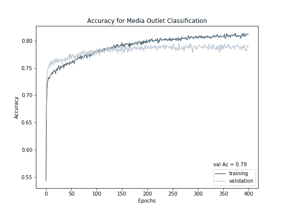

# 使用 Python 中的深度学习库的媒体偏见检测

> 原文：<https://towardsdatascience.com/media-bias-detection-using-deep-learning-libraries-in-python-44efef4918d1?source=collection_archive---------6----------------------->


Photo by [Pablo García](https://unsplash.com/@garciasaldana_?utm_source=unsplash&utm_medium=referral&utm_content=creditCopyText) on [Unsplash](https://unsplash.com/s/photos/left-or-right?utm_source=unsplash&utm_medium=referral&utm_content=creditCopyText)

我不止一次遇到过你能马上看出他们政治倾向的新闻故事。这是因为新闻媒体很可能总是有偏见。我在想，如果我们可以用眼睛识别这些模式，那么我们肯定可以建立一种算法，利用文本中的信息来识别书面媒体的偏见。在这份报告中，我将描述我是如何做到这一点的。我使用 Python 环境和 Tensorflow 和 Keras 构建了一个神经网络，能够很好地识别新闻故事是左倾还是右倾。我更进一步，试图不仅识别偏见，还识别故事的出口(或来源)。我将详细描述我用来构建和训练网络的方法，以及我用来可视化结果和性能的方法。开始了。

所有数据均来自 Andrew Thomson 创建的[All News](https://www.kaggle.com/snapcrack/all-the-news)数据集。它是免费的，你可以随时下载。它被分成三个大的 CSV 文件，每个文件都包含一个如下所示的表格:


News Outlets raw table

因为我们只对内容和经销店名称感兴趣，所以我们将关注两列。列 **3** 包含出版物或经销店名称，而 **9** 包含内容。然后，我们需要提取这些信息并相应地存储起来，以便我们可以继续进行分析。但是首先，让我们导入所有需要的模块(如果需要，为最新版本修改您的代码，例如:TensorFlow 2):

Modules for the pipeline

上面描述的每个文件包含大约 50，000 个条目，因此为了加快分析速度，我们可以提取一部分数据。为了节省时间，我决定用这个简单的技巧随机选择大约 40%的文章(当然你可以改变):

```
p = 0.4
df = pd.read_csv('articles.csv',header=None,skiprows=lambda i: 1>0 and random.random() > p)
```

这将从 *articles.csv* 中提取一小部分数据，等于 *p.*

下一步可能是我们整个流程中最主观的一步。我们给新闻媒体分配了左或右倾向。为了简单起见，我决定每边只使用两个，并使用[allsides.com](https://www.allsides.com/)和[mediabiasfactckeck.com](https://mediabiasfactcheck.com/)来分配他们的偏差。基于从这些网站和其他来源提取的信息，我决定将《大西洋》*、《纽约时报》*、*《纽约时报》*、*《纽约邮报》*、以及*《布莱巴特》*归为左偏。然后，我从原始文件中筛选出包含这些网点的所有行，使用:

创造了一系列的故事:

```
n_s = list(n_s_b.iloc[:,9].values) + list(n_s_p.iloc[:,9].values) \
 + list(n_s_a.iloc[:,9].values) + list(n_s_n.iloc[:,9].values)
```

请注意， **n_s** 是一个数组，它只包含根据从上述代码中提取的原始数组中的名称排序的所有故事的内容，因此*布莱巴特*和*邮报*故事排在第一位，然后是*大西洋*和*纽约时报。*

太好了！下一步做什么？一个重要的预处理步骤，特别是因为我们正在处理自然语言处理，是删除可能给分析增加噪声的单词。我决定删除经销店的名称，这通常在故事中被提及，因为它会给我们的分析增加“偏见”。这可以通过以下方式简单实现:

```
n_s = [word.replace('New York Post','') for word in n_s]
n_s = [word.replace('Breitbart','') for word in n_s]
n_s = [word.replace('New York Times','') for word in n_s]
n_s = [word.replace('Atlantic','') for word in n_s]
```

下一步是创建一个类数组。我们知道每个媒体有多少文章，也知道他们的政治偏见。我们可以创建两个数组，一个用于出口分类器，一个用于偏差分类器，其中:

如果您遵循这些方法，您可以看到 **classes_All** 是一个长度等于 *n_s* 的数组，它包含从 1 到 4 的整数，每个整数对应于四个出口中的一个，而 **classes_Bias** 包含 1 表示被认为向右倾斜的出口，包含 2 表示向左倾斜的出口(请参见前面的代码以进一步理解这一点)。像这样， **n_s** 是我们的特征数组(已经被清理过)，因为它包含一个故事列表，这两个数组是我们的类数组。这意味着我们几乎完成了预处理。

关键的最后一步是将故事(实际新闻)转换成神经网络可以理解的东西。为此，我使用了来自 TensorFlow Hub 的令人惊叹的通用句子编码器，它可以将任何给定的句子(在我们的例子中，是一个新闻故事)转换为长度为 512 的嵌入向量，因此最终我们将得到一个大小为 number_of_stories X 512 的数组。这是通过以下方式完成的:

注:我以前用类似的方法对文学运动进行分类，如果你愿意，你可以在这里查看。

要计算嵌入矩阵，我们只需运行我们刚刚定义的函数:

```
e_All = similarity_matrix(n_s)
```

终于！我们完成了预处理！ **e_All** 是我们的特征数组，而 **classes_All** 和 **classes_Bias** 是我们的类数组。现在，我们已经准备好用 Keras 构建一个分类器了。

我不想花太多时间解释如何建立一个神经网络，在《走向数据科学》和许多其他来源中发表了许多实践文章，你可以阅读并跟随非常好的教程来这样做，⁴ ⁵.在这里，我将简单地介绍一个产生良好结果的架构。这个架构是之前许多迭代中的一个，也是我个人发现有效的一个。说了这么多，我们来深究一下吧！我构建的分类器如下所示:


News Bias classifier. Image rendered with [ann-visualizer](https://github.com/Prodicode/ann-visualizer).

它有一个 512 个神经元的输入层(每个嵌入值一个)和两个 40 个神经元的隐藏层，每个隐藏层都有一个固定丢失分数为 0.25 的丢失层。它还有一个使用 Softmax 激活函数的输出层，其中有四个神经元对媒体出口进行分类，两个神经元对媒体偏差进行分类(此处未显示)。就代码而言，它看起来像这样:

Media Bias Classifier

对于这两种情况(出口和偏差)，除了优化器的学习速率以及输出层中的神经元数量(四个或两个)之外，所有参数都是相同的。直观地说，更简单的解决方案(偏差情况下的二进制)应该更快地得到优化。为此，我决定使用 0.00015 的学习率进行出口分类，0.0005 的学习率进行偏差分类。

最后，在检查结果之前，我们需要将数据分成训练集和测试集。为此，我们将使用一个[分层洗牌拆分器](https://stackoverflow.com/questions/35472712/how-to-split-data-on-balanced-training-set-and-test-set-on-sklearn)，所以看起来像这样:

这样做了，我们只需要训练网络。我们可以通过以下方式做到这一点:

现在我们准备检查结果！

我们先来看网点分类。训练后(在 8 核 CPU 机器上大约 15 分钟，不需要 GPU)，验证和训练精度曲线如下所示(可视化代码在本文后面提供):



这是什么意思？嗯，首先，验证集的精度几乎是 0.80，这可以认为是好的。记住，这是来自四家媒体的准确性！也就是说，这个神经网络仅基于书面语义内容，就能以相对较好的性能识别出被报道新闻**的来源，非常酷！现在让我们看看损失，以验证我们的模型是否合适:**


由于两条曲线“看起来”一样(它们之间的差异很小)，我们可以说，我们的神经网络已经学习了足够通用的规则，以避免过度拟合，但又足够具体，以在验证集上产生良好的性能，这是一种始终是 desirable⁶.的深度学习质量考虑到这一点，我们现在可以查看混淆矩阵以更深入地了解结果:


很明显，来自*和*【新工作岗位】的新闻故事被分类得更准确，但这可能是因为这两个类别的代表性更高。我们可以尝试重采样的方法来平衡类，但现在我会保持这种方式，并回到我们的二进制分类任务重采样，在接下来的段落中描述。**

*接下来，我们可以探索媒体偏见分类的结果。记住，这是一个二元分类器(要么向左倾斜，要么向右倾斜)。第一，精度和损耗曲线:*

**

*如果你问我，我会印象深刻！我们得到了几乎 0.9 的准确度，这意味着，有效地，如果一个新闻故事偏向左边或右边，我们可以很好地识别。混淆矩阵呢？*

**

*看起来不错，但很明显，左倾的报道没有被充分代表，因此准确性没有完全反映这里正在发生的事情。光是准确性就可能会误导人。另一个对不均匀的类别分布有帮助的度量是 F1 score⁷.我们可以很容易地用 sklearn 的内置函数来计算它，所以只需这样做就行了:*

```
*from sklearn.metrics import f1_score
f1_score(y_test,news_DNN.predict_classes(X_test))*
```

*这引发了:*

```
*>>> 0.78*
```

*很好，但不完美。我们可以尝试使用过采样器来平衡训练集 only⁸中的类，以获得更好的结果。我将使用惊人的 Python 库 [imblearn](https://imbalanced-learn.readthedocs.io/en/stable/api.html) 中的 SMOTE，所以只需在拟合之前添加这一行:*

*使用平衡数据进行训练后，混淆矩阵现在看起来像这样:*

**

*更平衡。F1 和精度呢？分别为 0.80 和 0.88。非常好！*

*注意:所有可视化都是使用 [seaborn](https://seaborn.pydata.org/) 完成的。下面是我编写的创建所有图形的代码:*

*Code to visualize results*

**

*Photo by [AbsolutVision](https://unsplash.com/@freegraphictoday?utm_source=unsplash&utm_medium=referral&utm_content=creditCopyText) on [Unsplash](https://unsplash.com/s/photos/news?utm_source=unsplash&utm_medium=referral&utm_content=creditCopyText)*

*在本文中，我向您介绍了我构建、训练和可视化新闻出口/偏见分类器的步骤，结果非常好。我们能够得到出口分类的相当准确的分数，这表明文本的性质本身就可能包含关于给定故事在哪里写的信息。对于这种规模的样本，很难得出精确的结论，但想法是存在的，我们可以使用 Keras、TensorFlow 和 Python 中的可视化库来对新闻故事进行分类。更值得注意的是，偏见可以与非常好的表现联系在一起，这意味着在某种程度上，书面媒体中的语义规则隐含着政治偏见。在某种程度上，我们从一开始就知道这一点，但有趣的是，我们注意到这些信息是存在的，并且使用适当的工具可以自动识别。你认为这种方法还能解决什么问题？*

*现在您已经有了工具，您可以复制代码并在自己的项目中使用它。*

*感谢阅读！*

*参考资料:*

*[1]媒体偏见图表，[https://www.adfontesmedia.com/](https://www.adfontesmedia.com/)*

*[2]布达克、c .戈埃尔、s .、&饶、J. M. [公正与平衡？通过众包内容分析量化媒体偏见。](https://www8.gsb.columbia.edu/media/sites/media/files/JustinRaoMediaBias.pdf) (2016) *舆情季刊*， *80* (S1)，250–271。*

*[3]Keras 深度学习简介，[https://towards data science . com/Introduction-to-Deep-learning-with-Keras-17c 09 E4 f 0 EB 2](/introduction-to-deep-learning-with-keras-17c09e4f0eb2)*

*[4]使用 Keras 的实用机器学习，[https://towards data science . com/Practical-machine-Learning-with-Keras-19 d0e 5b 2558](/practical-machine-learning-with-keras-19d0e5b2558)*

*[5]使用 Keras 构建深度学习模型，[https://towards data science . com/Building-A-Deep-Learning-Model-using-Keras-1548 ca 149d 37](/building-a-deep-learning-model-using-keras-1548ca149d37)*

*[6][https://machine learning mastery . com/how-to-choose-loss-functions-when-training-deep-learning-neural-networks/](https://machinelearningmastery.com/how-to-choose-loss-functions-when-training-deep-learning-neural-networks/)*

*[7]准确度、精密度、召回率还是 F1？[https://towards data science . com/accuracy-precision-recall-or-f1-331 FB 37 C5 CB 9](/accuracy-precision-recall-or-f1-331fb37c5cb9)*

*[https://beckernick.github.io/oversampling-modeling/](https://beckernick.github.io/oversampling-modeling/)*