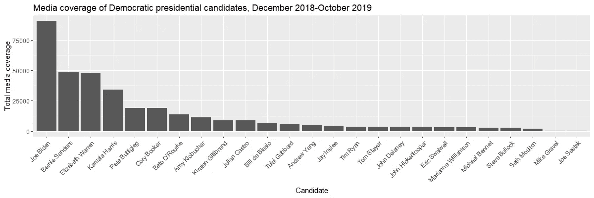
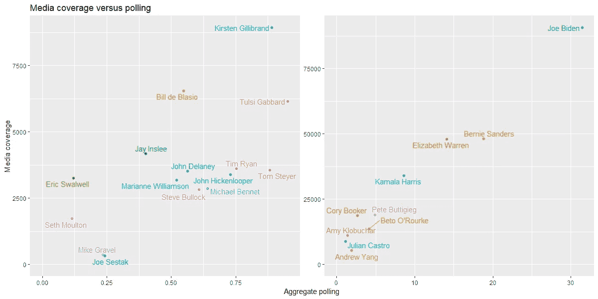
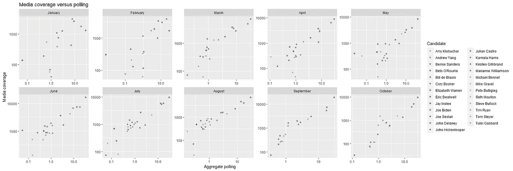
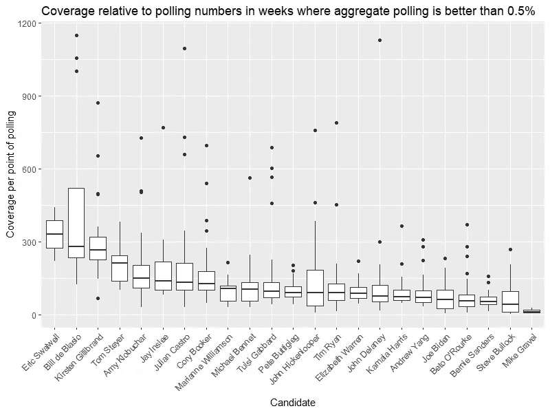
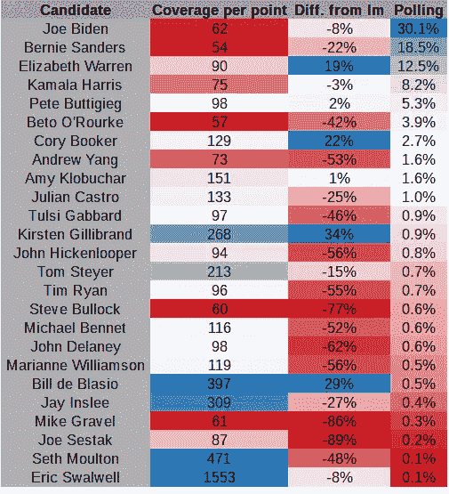
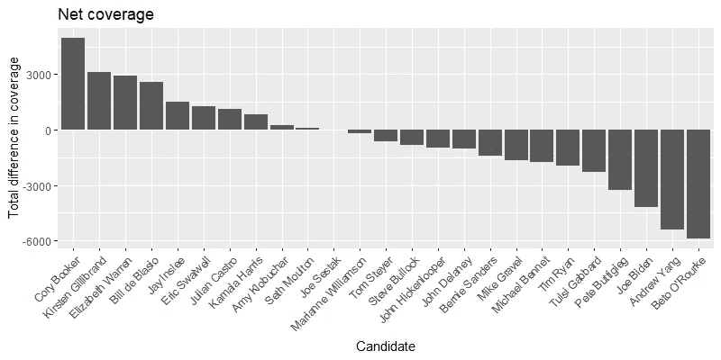
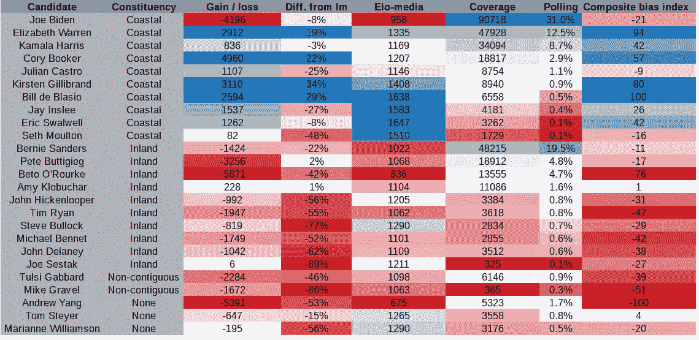
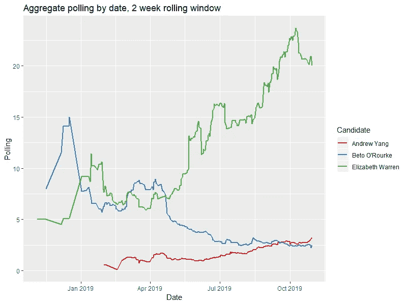
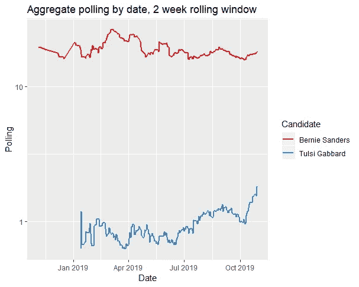

# 民主党初选中的媒体偏见

> 原文：<https://towardsdatascience.com/media-bias-in-the-democratic-primary-66ffb48084db?source=collection_archive---------13----------------------->

媒体中有两种类型的偏见在起作用，它们都造成了不公平:语气上的偏见和音量上的偏见。例如，一篇攻击贝托·奥罗克使用拉丁裔昵称的专栏文章在*语气*上带有偏见；一张候选人筹款信息图包括了除杨安泽之外的所有顶级筹款人*，这是*卷*中偏见的一个例子。*

One rating

这两种类型的偏置在 [2016](https://shorensteincenter.org/news-coverage-2016-general-election/) 中[非常](https://shorensteincenter.org/pre-primary-news-coverage-2016-trump-clinton-sanders/) [可见](https://shorensteincenter.org/news-coverage-2016-presidential-primaries/) [，但是确定](https://shorensteincenter.org/news-coverage-2016-national-conventions/)[音量偏置](https://decisiondata.org/news/political-media-blackouts-president-2016/)比音调偏置要容易得多，所以我将主要使用[五三十八](http://data.fivethirtyeight.com)中可用的数据，集中讨论音量偏置。除非另有说明，平均或合计投票数按照本文中的[生成。即使在对民主党人普遍友好的“蓝色”媒体中，对不同候选人报道的*基调*也有很大差异，我目前的印象是](https://medium.com/@tomasmcintee/the-democratic-horse-race-ed06e7952d95)[蓝色媒体更喜欢不太可能当选的候选人，](https://medium.com/@tomasmcintee/electability-the-blue-bubble-bf87c81447da)特别是[伊丽莎白·沃伦](https://www.washingtonpost.com/opinions/2019/10/03/no-wonder-elizabeth-warren-is-getting-great-press-media-looks-like-her-base/)。

我将介绍几种衡量媒体偏见的方法，大部分是基于比较民意测验数字和媒体报道。

# 哪些候选人得到了更多的媒体报道，为什么？

媒体在数量上的偏见既普遍又不公平。然而,[平等时间规则](https://en.wikipedia.org/wiki/Equal-time_rule)在很久以前就被废除了，候选人得到的报道量也大相径庭。民主党全国委员会曾试图公开表示赞同将辩论台上的候选人视为平等，但即使在辩论台上，候选人也没有获得平等的时间。

比较这两个职位是非常惊人的。乔·拜登在一周内获得的报道比乔·塞斯塔克在过去一年中获得的报道还多。然而，当我们考虑他们在民调数字、筹款和支持方面的差异时，媒体偏向于报道拜登作为领先者是可以理解的。

在某种程度上，这是不公平的；但这种不公平可以客观地基于这样一个事实:拜登比塞斯塔克更知名、更受欢迎。这是一场有利于领先者、不利于苦苦挣扎的竞争者的赛马偏见，而不是对塞斯塔克或拜登的偏见。

## 比较媒体报道和民意测验

大多数覆盖率差异的答案是投票。我认为在那之后剩下的就是媒体对特定候选人的支持和反对。

For legibility, candidates with aggregate polling less than 1% shown separately.

媒体报道既推动民意调查，也受民意调查的推动，因此从长远来看，两者密切相关。一些异常现象可以通过逐月分解数据来解释，比如汤姆·斯特耶在图表上的位置是一个迟到的候选人。然而，其他异常现象仍然无法解释。

从这一大背景来看，媒体显然更青睐伊丽莎白·沃伦而非伯尼·桑德斯，科里·布克而非贝托·奥罗克，以及许多其他候选人而非杨安泽。

在民调支持率较低的候选人的后场，来自内陆州的温和派(麦克·班尼、史蒂夫·布洛克、约翰·希肯卢珀和蒂姆·瑞恩)被忽视，而来自沿海州的政客(柯尔斯顿·吉利布兰德、杰伊·英斯利、埃里克·斯瓦尔韦尔和比尔·白思豪)则受到了青睐。然而——我要重复这一点——在低于 1%的范围内，很难对投票平均值的任何有意义的差异有任何信心。

Please note that the axes here are log-scaled, which means that the anomalies are very large anomalies.

Coverage is measured by total clips plus total stories from 538’s media tracking data. The exclusion of low polling weeks is quite significant for a handful of low-polling candidates, but is necessary to adequately show the relationship between the major candidates.

如果我们随着时间的推移更仔细地观察这些数字，它们通常在任何给定的一周和任何给定的一个月内相互关联。“赛马”覆盖面很广，大多数时候，大多数候选人在每个投票点都获得了类似的覆盖水平。

某一周或某一月的一些个别例外可以用新闻事件来解释。为了避免专注于任何单一新闻事件的影响，我将着眼于在一个中等或典型的一周内报道和投票之间的关系。当同一个候选人相对于他们的投票，一周又一周地重复和持续地被过度报道或报道不足时，媒体偏见是最简单的解释。

Median coverage per polling point; median difference between actual and predicted amount of coverage using a linear model; and median polling average.

民意测验和报道之间的关系并不完全相称；它倾向于在高端和低端偏离。这个问题的自然答案是做线性回归。

这向我们展示了两种略有不同但相关的媒体偏见的衡量标准。线性模型更可取，因为它考虑了更多的信息，并且不涉及除以接近零的数字。

从这两个指标来看，贝托·奥罗克显然受到了亏待，尽管他在民意调查中平均排名第七，但他的支持率在所有候选人中排名第二。我们同样可以强调杨安泽、史蒂夫·布洛克、乔·塞斯塔克和迈克·格拉维尔相对于他们的投票经常被低估。

在正面报道偏见方面，媒体更喜欢报道伊丽莎白·沃伦、科里·布克、柯尔斯顿·吉利布兰德和比尔·白思豪。或许值得注意的是，无论用哪种方法来衡量，皮特·布蒂吉格似乎都得到了恰到好处的覆盖。对于所有其他候选人来说，这些指标更加复杂；我们可以在其他候选人之间做出一些相对的决定，但不清楚他们在媒体报道量方面经历了净正面还是净负面的偏见。

## 候选人作为覆盖面的竞争者:评估每一个案例

这里我们谈到了几个主要问题。一个是民意调查和报道有一个很大的——但不是完全的——比例关系。我们能够自信地识别的异常是基于具有相对相似的投票数的候选人之间的成对比较。幸运的是，我们可以采用所有这些异常的成对比较，并使用它们来生成相对于投票的媒体偏向方向的评级。

根据我的分析，在数据中有 921 个案例，一个候选人在一周内得到的报道比另一个候选人少，尽管事实上他们在那一周和前一周的民调都更好。有一个很好的数学工具可以从一系列成对的比赛中梳理出竞争者的相对实力:它被称为 Elo 评级，以物理学家和国际象棋选手 Arpad Elo 命名。

Here, the polling average is determined by aggregating over all polls in the frame, so the figures are slightly different.

通过 Elo 评级公式进行 921 个两两比较，可以让我们衡量媒体对候选人无法解释的偏好。

有两个候选人的评分表明他们受到了媒体的强烈冷落:杨安泽(评分 675)和贝托·奥罗克(评分 836)。

尚不清楚第三名应该属于伯尼·桑德斯(1022)还是乔·拜登(958)。由于乔·拜登在每周的选举中都处于领先地位，他的支持率被人为压低了；他只能“输”给民调数字更低的候选人。温和派政治家作为一个群体往往低于平均水平。令人惊讶的是，这包括皮特·布蒂吉格(1068)，他在这个主题的其他方面看起来接近平均水平。

值得注意的高评级候选人包括柯尔斯顿吉利布兰德(1408)和伊丽莎白·沃伦(1335)；在仍在竞选的候选人中，伊丽莎白·沃伦显然是媒体的宠儿。用这种方法排名最高的候选人是埃里克·斯瓦尔维尔、比尔·白思豪、杰伊·英斯利和塞斯·莫尔顿。值得再问一次，重要程度是多少？

这些考生有多少故事和片段得与失？

如果我们将数据集中的 921 个两两比较，削减到每周，我们可以确定覆盖范围的最小变化，这将消除任何明显的冷落。这样做可以正确看待正音量偏差:塞斯·莫尔顿可能会被报道，而不是其他不知名的候选人，但几乎没有报道受到威胁。

根据这一标准，科里·布克脱颖而出，超过了克里斯汀·吉利布兰德和伊丽莎白·沃伦。最受冷落的候选人显然又是贝托·奥罗克和杨安泽。

## 关于媒体中音量偏差的地理位置的一个小说明

将候选人按其选区的地理位置(沿海大陆、内陆大陆、非毗邻地区或缺少以前的选区)进行分类显示了一个非常有趣的模式。

前十名候选人的选区是沿海州、区或城市，现在覆盖面更广了。内地考生被覆盖较少。这实际上是一个非常一致的划分；考虑到主要媒体的地理和人口统计，这也是可以理解的。

有*没有*内地考生有明确的正体积偏差；最接近的是皮特·布蒂吉格和艾米·克洛布查尔，他们在大多数方面都接近中立。有*没有*沿海候选明确负体积偏差；最接近的是乔·拜登，尽管如此，他在报道竞争中绝对领先。

由于选举团的政治战场既不在 Acela 走廊，也不在西海岸，媒体的地理偏见可能会阻碍提名更有可能当选的候选人。

# 影响和效果

从上面的分析中，有几个明确的结论。首先，我们可以清楚地发现少数候选人似乎吸引了过多的媒体报道。与民调数字相近的候选人相比，伊丽莎白·沃伦、科里·布克、柯尔斯顿·吉利布兰德和比尔·白思豪都在媒体报道中占据显著位置。由于伊丽莎白·沃伦在“蓝色”媒体上的报道也一直是积极的，这可能助长了她的崛起。

其次，我们可以确定两位候选人明显受到了媒体偏见的影响。杨安泽和贝托·奥罗克都经历了媒体过度稀少和负面的报道..难怪贝托挣扎着选择退出，也难怪杨安泽的支持者抱怨[#央媒封杀](https://twitter.com/search?q=%23YangMediaBlackout)。

根据他的筹款和民意调查，杨安泽早就应该成为公众讨论的一个重要部分。不这样做的后果是消极的。

第三，有一些知名度较低的候选人渴望得到报道，他们没有足够的时间向潜在选民宣传自己的观点。这包括已经退出的约翰·希肯卢珀和蒂姆·瑞恩；以及麦克·班尼、史蒂夫·布洛克、约翰·德莱尼和乔·塞斯塔克。所有这些候选人都有比皮特·布蒂吉格更典型的总统候选人背景。

Sanders’ polling is steady; Gabbard’s polling has been climbing in spite of (or perhaps because of) a recent spate of negative coverage.

第四，有一些证据支持伯尼·桑德斯和塔尔西·加巴德的支持者经常指责的语气偏见。这两位候选人和杨安泽似乎都不太可能退出。

显而易见的媒体偏见，如果继续下去，可能会对最终的民主党候选人造成伤害。民主党全国委员会可能面临另一轮关于试图操纵初选的指控。媒体本身也会因为在音量或语气上公然偏袒而失去信誉。

鉴于民主党全国委员会和“蓝色”媒体对偏见的指控是可信和有根据的，推动对进入初选的候选人进行公平、透明和公正的报道就更加重要了。