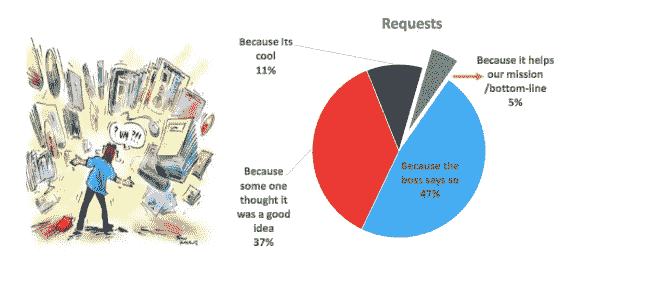

# 媒体监测 2.0:从数据到洞察

> 原文：<https://towardsdatascience.com/media-monitoring-2-0-from-output-to-insight-ecf0d926b4ec?source=collection_archive---------30----------------------->

在营销和传播专业人士的生活中，媒体监控是热门且不可或缺的。测量就是了解，事实上在我们当前的时代，可能性是无穷无尽的。监控工具和数字解决方案的数量正在增长，如今一切都可以测量。所以我们必须注意到这一点，对吗？数据无处不在，收集、监控和分析数据从未如此简单。然而，我们现在面临挑战。我们如何应对假新闻？我们如何继续在我们的数据中找到相关性，并将其转化为理解，并最终转化为具体行动？在本博客系列的第 1 部分，我们将讨论媒体监控领域需要的转变，以及如何将这种转变应用到您的媒体监控策略中。

# 它从“为什么”开始

西蒙·西内克的黄金圈，谁没听说过？他认为，为了取得成功，作为一家公司，你必须从“为什么”这个问题开始，然后从那里赋予“如何”和“什么”以实质内容。这听起来很有逻辑，而且现在已经被许多组织所使用，但是仍然有很多人主要用“如何”和“什么”来交流。

这个模型很实用，因此很容易应用到其他策略和日常事务中。作为一名营销和传播专业人士，不断问自己为什么要做这些事情是很重要的。你为什么要做某些决定？为什么这是你的策略？您会选择哪些定位和分析主题，为什么？你为什么要通过核心信息 X 和 Y 以及媒介 Z 来传达这一点？

这也可以通过监测和测量来转化；为什么你甚至需要监控？为什么需要这个输出？你想要什么，你能用这个做什么？这对证明你的策略有什么帮助？

> *“为了监控而监控是没有用的，浪费时间、金钱和精力。”*

# 衡量你想要衡量的东西，并正确地去做

从战略沟通目标和围绕这些目标形成的政策着手。可能这些没有被清楚地表达出来，这有助于观察整体的组织策略(也就是伞)。我们的定位是什么，我们为什么要这样做？我们如何通过交流赋予它实质内容，为此需要什么？从“为什么”开始可以确保更多地关注核心任务和战略规划，减少对当前问题的浪费。

这同样适用于监测及其实施。监控可以被视为“如何”，由“为什么”形成，并导致“什么”。但就其本身而言，它毫无意义。看看下面的例子:

**X 组织**

原因:可持续发展是我们 2019 年定位的重要支柱。我们希望创造更积极的媒体能见度和积极的基调，通过正确的媒体向正确的利益相关者传达正确的信息，并能够在必要时不断改进这些事情。
如何:监控媒体的可见性、影响力、情感、利益相关方、媒体来源和核心信息
如何:洞察主动活动和自有及盈利媒体的传播效果

如你所见，如果没有“为什么”，那么“如何”和“做什么”就没什么意义。此外，定义这一点不仅有助于您将更多的注意力放在媒体监控活动上，还可以创建内部支持来说服投资管理人员。毕竟，您提供了对监控所能提供的东西的洞察力。

# 获得更多洞察力和概览

为了使您的媒体监控活动具有针对性和相关性，将这些活动与沟通和/或业务战略和计划相协调是非常重要的。

以荷兰皇家航空公司为例，该公司在其网站上广泛交流对公司重要且相关的重要话题，以及所有这些问题的处理方式。

作为一名传播专业人员，使用这些类型的主题作为媒体监测的指南是有用的，以便深入了解围绕这些主题所做的努力的影响。作为一个组织，你的承诺和言论在多大程度上与你的实际行动相符？媒体在多大程度上(以正确的方式)采纳了你的核心信息，这些信息最终会到达正确的目标群体手中吗？通过这种方式，你可以更有针对性地进行监控，你会发现更容易找到真正重要的正确报告。

> *“控制媒体对自己的监控，而不是被过量的新闻淹没。”*

因此，在荷航的案例中，需要监控媒体对“荷航小心”主题的影响，以及主动报道的比例或媒体中的核心信息。

# 从输出到洞察

一旦你把重点放在了你的媒体监测上，并与战略主题联系起来，提供一个背景也是很重要的。好东西，所有的主题和话题的监控，但是这个输出告诉我什么？我们做得好吗？我们走上正轨了吗？这是由什么驱动的？

只有当您能够集成数据输出并将其与目标和 KPI 联系起来时，它才会变得有趣。您可以根据这个来设置输出，以便能够判断您需要按下哪个按钮，或者使用这个输出来制定 KPI。对于后者，您可以使用监控作为构建 KPI 的基线度量。

如果我们使用前面提到的组织 X 的例子作为起点，从输出到洞察的转换看起来是这样的:

**组织 X**
产出:
假设 2019 年 1 月监测的产出为主题可持续性的 500 条消息(占媒体总报道量的 5%)。这些信息中有 15%是您自己主动/ PR(主动)的结果，10%是积极的语气。这三大核心信息似乎只在地区新闻网站上可见。

集成:
就其本身而言，上面的输出并不能说明什么。想到的问题大概是“那又怎样？”。这里是上下文；2019 年 1 月，组织 X 的目标是至少 10%的可持续发展主题报告，除此之外，关于前 3 个核心信息的 KPI 至少有 10%的主动报告、5%的积极情绪和全媒体可见性。

洞察力
通过在目标和 KPI 之间建立联系，结果立即有了意义。我们从建立这种联系中得到了什么启示？1 月份可持续发展的可见性低于预期(5%对 10%)，但比预期更积极(15%对 10%)和更积极(10%对 5%)。换句话说，该公司的举措产生了影响，并以正确的语气采取了措施，但知名度仍然有限。此外，这显然与我们在媒体上的可见性目标和核心信息不匹配。为什么我们的核心信息似乎在地区新闻网站上传播得如此之好？我们可以采取什么措施来提高媒体在整个董事会中的知名度？

通过从“为什么”的角度来处理和组织媒体监督，你创造了相关性和价值，有了一个概览，并保持控制。这一转变非常重要，它将激励你更加关注战略项目和计划的影响，并向你所在组织的管理层展示这一点的附加价值。在本博客系列的第 2 部分中，我们将进一步阐述在管理层提供证据和创建内部支持的过程。