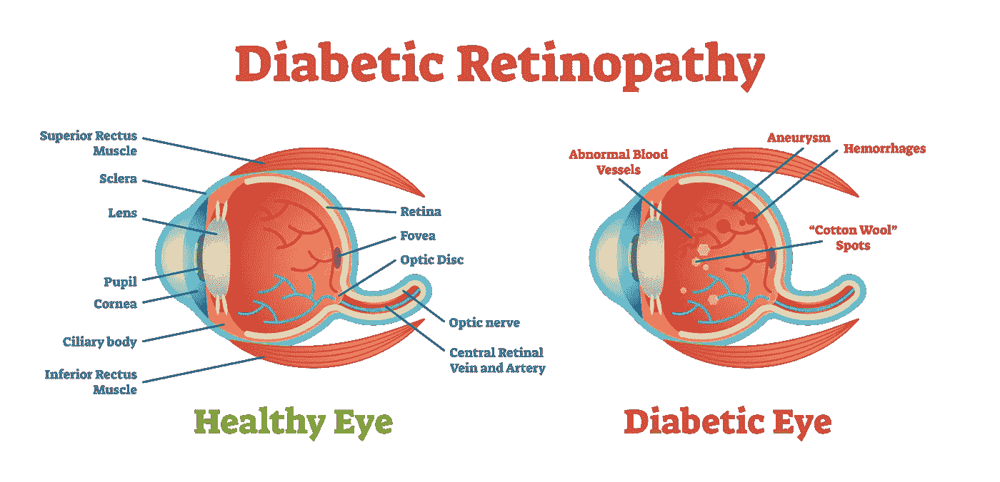
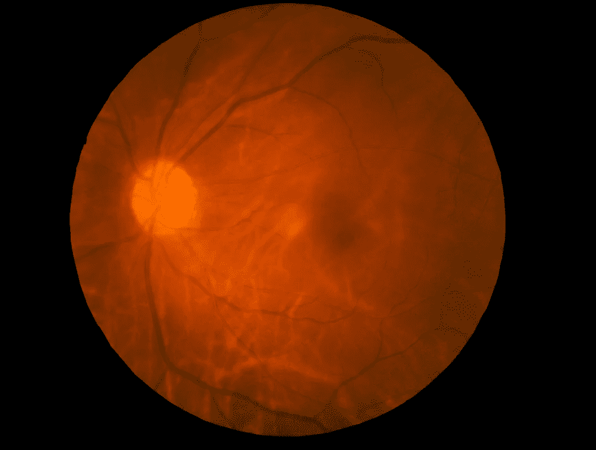
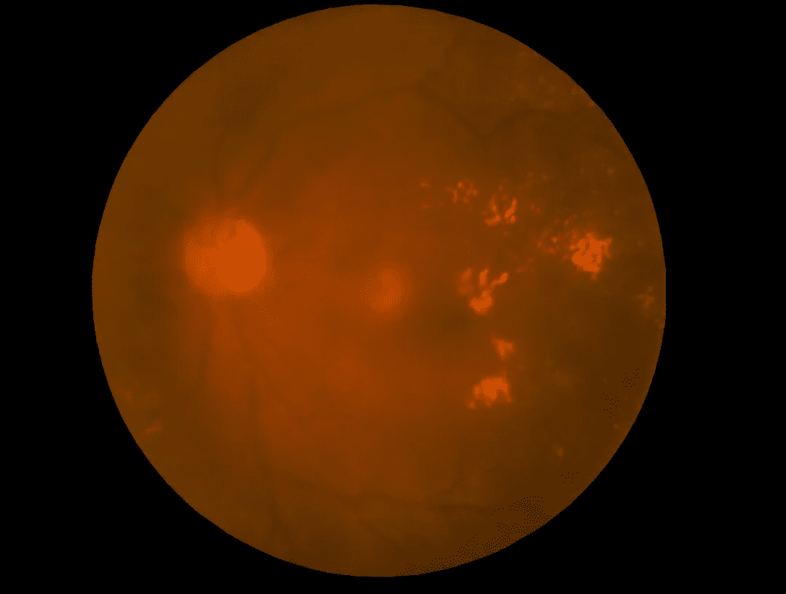
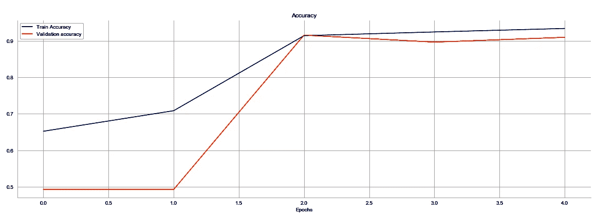
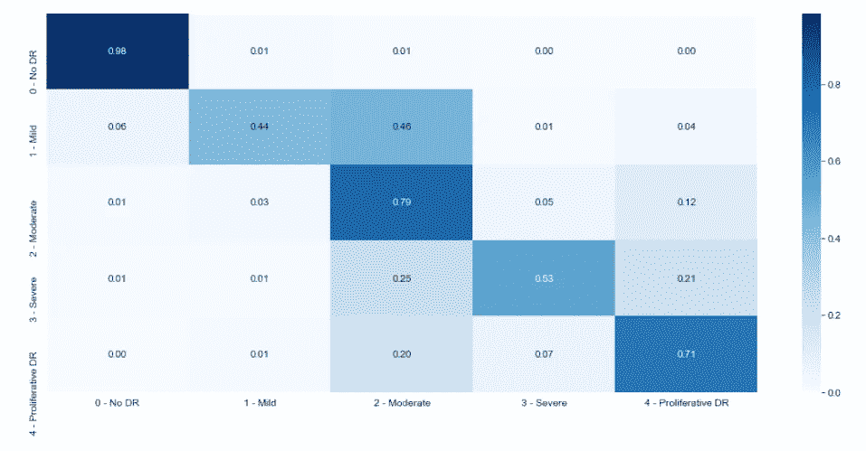

# 用卷积神经网络进行医学诊断

> 原文：<https://towardsdatascience.com/medical-diagnosis-with-a-convolutional-neural-network-ab0b6b455a20?source=collection_archive---------15----------------------->

浅谈人工智能在医疗保健中的应用。

Image licensed from Adobe Stock

2018 年美国美国食品药品监督管理局批准使用一种叫做*卷积神经网络*的人工智能形式的医疗设备来检测糖尿病成年人的糖尿病视网膜病变( [WebMD，2018 年 4 月](https://www.webmd.com/diabetes/news/20180412/fda-oks-ai-device-to-detece-diabetic-retinopathy))。医学图像处理代表了人工智能(AI)世界中的一些“低挂果实”，其使用才刚刚开始。人工智能有望将专业人士从数小时的乏味任务中解放出来。如果运用得当，它可以带来更好的患者结果和更低的医疗成本。

糖尿病视网膜病变是糖尿病患者失明的最常见原因，也是工作年龄成人失明的主要原因。总之，患有各种类型糖尿病的人都有风险，并且患糖尿病的时间越长，风险越大。这种疾病始于视网膜中微小血管的肿胀和微动脉瘤。在晚期病例中，这些受损的血管会导致生长因子的分泌，从而引发新血管的增殖。这些新血管生长在视网膜表面，并进入眼睛的玻璃体凝胶中。这些新血管很脆弱，可能会渗漏和出血，随着疤痕组织的积累，病情会变得更糟。视网膜脱落会导致视力受损和全盲，因此早期诊断至关重要([美国国家眼科研究所——糖尿病眼病相关事实](https://nei.nih.gov/health/diabetic/retinopathy))。

眼科医生诊断这种情况的一种工具是眼底照相术，它使用一种专门的相机来拍摄患者的视网膜照片。这是一个健康视网膜的图像:

Healthy Retina — Image licensed from Adobe Stock

这是一个被诊断为“增生性糖尿病视网膜病变”的视网膜，这是疾病阶段的最严重分类:

Proliferative Diabetic Retinopathy — Image licensed from Adobe Stock

在这种严重的情况下，很容易看到浅色的斑点，这是急性疾病的指标之一。在疾病的早期阶段，肿胀和微动脉瘤更难发现。幸运的是，这是一项非常适合人工智能的任务。

我的目标是创建一个卷积神经网络，这是几种最先进的人工智能方法之一，可以正确地将眼底图像分为五类:

*   不存在 DR(糖尿病视网膜病变)
*   轻度 DR
*   温和的 d
*   重度 DR
*   增生性 DR

卷积神经网络(CNN)可以用先前已经被正确分类的图像的例子来训练。

我从位于印度泰米尔纳德邦钦奈的亚太远程眼科协会举办的一场竞赛中获得了这个项目的原始图片。该数据集包括 3，662 个预先分类的眼底图像，包括疾病所有阶段的实例。

为了大大简化 CNN 的工作方式，CNN 通过使用多层“节点”和无数次“分析”和“加权”结构、模式等迭代来学习。它在图像中识别。帮助它正确识别的结构/模式(例如，这是狗还是猫？)或分类(我的用例)图像被“奖励”较高的“权重”，而一个有害或无用的图像被“惩罚”较低的“权重”构建这些“层”和“权重”的方式有无数种，处理它们所需的计算能力从微不足道到不可能。有用的 CNN 没有被广泛使用，直到非常非常快的计算机和 GPU 变得更加便宜——这是最近的发展。

这张图展示了我用来评估 CNN 的两个指标:

从左到右代表迭代(在机器学习中称为“时期”)，其中模型已经完成一次并生成预测。蓝线代表 CNN 对它“研究”的图像的预测的准确性，橙线代表对它没有“分析”但可以“自测”的图像的预测的准确性。当训练精度继续提高，但验证精度开始下降时，就是“过拟合”开始的时候。在这一点上，CNN 在识别它已经研究过的图像方面变得如此之好，以至于在对它没有“研究”过的图像进行分类方面变得“更差”一般来说，更高的验证准确性是目标，所以我们希望在验证准确性达到峰值时阻止 CNN 了解更多信息。如果 CNN 在这一点上的性能不够，则需要调整 CNN 中的一些或所有层和权重，以改善最终输出。

做出这些调整可能是一个非常复杂的过程。在我的 CNN 中，所有的图像都被缩小到只有 128 像素乘 128 像素的大小，然而 CNN 使用了超过 2700 万个“可训练的”参数。

CNN 的最终评估是使用一组 CNN 从未“见过”的眼底图像完成的。下图称为混淆矩阵，显示了 CNN 预测每个疾病阶段分类图像的准确程度:

Confusion Matrix

左上角的矩形显示，当 CNN 将一幅图像分类为“无 DR”时，其准确率为 98%，这是一个非常好的结果。不幸的是，当它预测“轻度 DR”时，只有 44%的时间是正确的。它似乎在区分“轻度”和“中度”类别的图像方面有最大的困难。46%的实际“轻度 DR”图像被错误地归类为“中度 DR”。我相信，通过对层和权重进行更多的“调整”，这种性能可以得到改善。

我对数据科学改善我们所有人生活的潜力充满热情，我期待着这些技术在现实生活中的应用。

这个项目的完整代码和数据集可以在我的 GitHub 库[这里](https://github.com/giorosati/dsc-4-final-project-online-ds-pt-100118)看到。