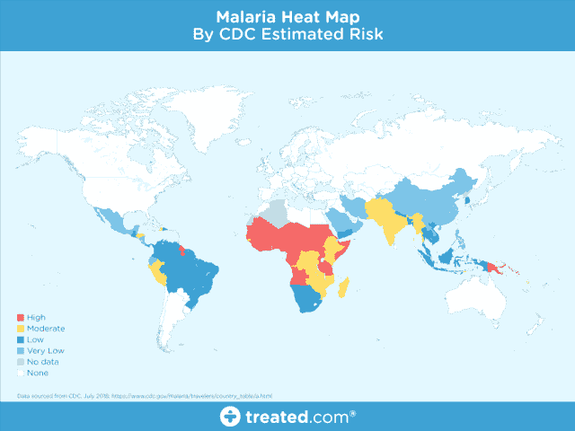
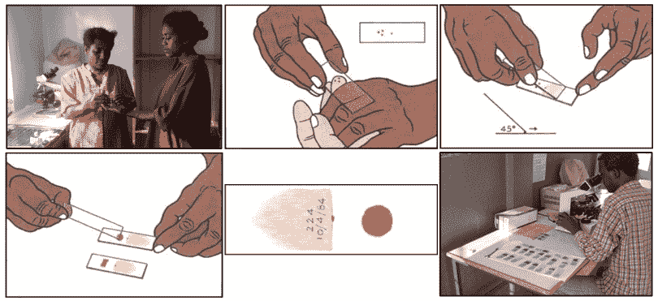
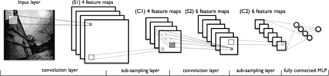
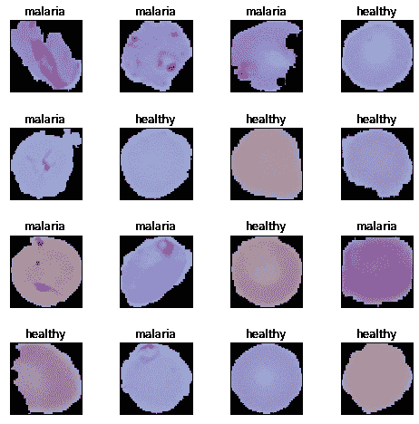
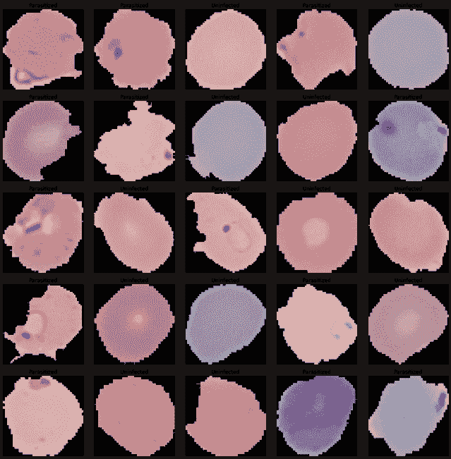
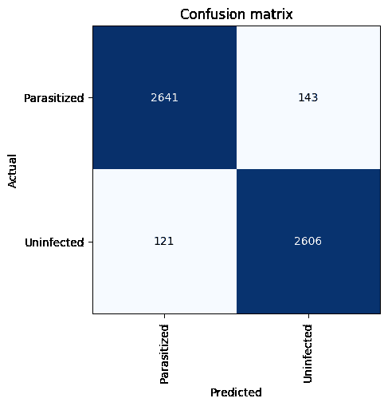
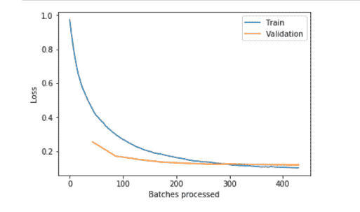
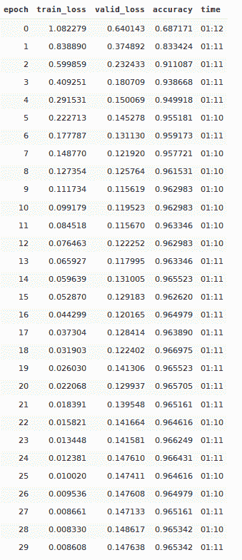
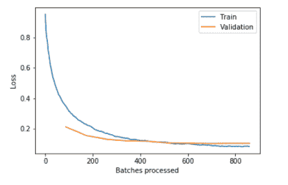

# 人工智能的好处——用于疟疾检测的医学图像分析

> 原文：<https://towardsdatascience.com/medical-image-analyses-for-malaria-detection-fc26dc39793b?source=collection_archive---------27----------------------->

在这篇博客中，我们将讨论为什么疟疾检测对于早期检测薄血涂片中寄生细胞的存在是重要的，以及一些人对此的实践。


# 介绍

疟疾是一种致命的传染性蚊媒疾病，由疟原虫寄生虫引起。这些寄生虫通过受感染的雌性按蚊的叮咬传播。虽然我们不会深入了解这种疾病的细节，但疟疾有五种主要类型。

现在让我们看看这种疾病在下面的情节中有多致命的意义。



很明显，疟疾在全世界流行，尤其是在热带地区。这个项目的动机是支持这种疾病的特性和致命性。最初，如果被感染的蚊子叮咬，蚊子携带的寄生虫会进入你的血液，并开始破坏携带氧气的红细胞。通常，疟疾的主要症状有点像流感或病毒，一旦被蚊子叮咬，你通常会在几天或几周内感到不适。然而，这些致命的寄生虫会在你的身体里沉睡一年多而没有任何问题！所以，延误正确的治疗会导致并发症甚至死亡。因此，疟疾的早期有效检测将拯救生命。

# 解决问题的方法

尽管疟疾病毒没有以变异蚊子的形式出现，但它确实让人感觉像是一个变异问题。这种致命的疾病在世界不同地区已经达到流行病*、*甚至**地方病**的比例——每年在**杀死大约 40 万**人。在世界上的其他地方，它几乎不存在。一些地区特别容易爆发疾病——某些因素使得一个地区更有可能被疟疾感染。

*   高度贫困
*   缺乏适当的医疗保健
*   政治不稳定
*   疾病传播媒介的存在(例如蚊子)〔6〕

由于这些问题的混合，我们在构建模型时必须记住一些事情:

*   可能缺少一个**可靠的电源**
*   电池供电的设备具有较少的**计算能力**
*   可能缺少**互联网连接**(所以在云上训练/存储可能很难！)

# 传统的疟疾检测方法

有几种方法和测试可用于疟疾的检测和诊断。

这些包括但不限于厚薄血涂片检查、聚合酶链反应(PCR)和快速诊断测试(RDT)。我不打算涵盖所有的方法，但事实是，传统的测试通常使用一种替代方法，特别是在高质量的显微镜服务不能轻易提供的情况下。

血液的显微镜检查是诊断疟疾最著名的方法。将患者的血液涂在载玻片上，并用造影剂染色，这有助于识别红细胞内的寄生虫。

一名训练有素的临床医生在 100 倍的放大倍数下检查 20 个微观视野，从 5000 个细胞中计数含有寄生虫的红细胞([世卫组织方案](http://www.wpro.who.int/mvp/lab_quality/2096_oms_gmp_sop_09_rev1.pdf))。

感谢 Carlos Atico】关于数据科学见解的博客



因此，疟疾检测肯定是一个密集的手动过程，也许可以通过深度学习实现自动化，这是本博客的基础。

# 用于疟疾检测的深度学习

深度学习模型，或者如果我必须说得更具体一些，卷积神经网络(CNN)已经被证明在各种各样的计算机视觉任务中非常有效。虽然我们假设你对 CNN 有所了解，但如果你不了解，请点击这里的[这篇文章](http://cs231n.github.io/convolutional-networks/)，深入了解它们。简而言之，CNN 模型中的关键层包括卷积层和池层，如下图所示。



卷积神经网络(CNN)可以自动提取特征和学习过滤器。在以前的机器学习解决方案中，特征必须手动*编程——例如，大小、颜色、细胞的形态。利用卷积神经网络(CNN)将大大加快预测时间，同时反映(甚至超过)临床医生的准确性。*

CNN 从我们的数据中学习等级模式。因此，他们能够学习图像的不同方面。例如，第一卷积层将学习小的和局部的图案，例如边缘和拐角，第二卷积层将基于来自第一层的特征学习更大的图案，等等。

您可以浏览 Rajaraman 等人的一篇非常有趣的研究论文' [*预训练卷积神经网络作为特征提取器，用于改进薄血涂片图像中的寄生虫检测*](https://lhncbc.nlm.nih.gov/system/files/pub9752.pdf) *'* 。它解释了上述论文中提到的数据的六个预训练模型。在检测疟疾和非感染样本时获得 95.9%的准确率。

# 数据集解释

让我们看看这个问题集使用了什么数据，我非常感谢李斯特山国家生物医学通讯中心(LHNCBC)的研究人员，他们是国家医学图书馆(NLM)的一部分，他们仔细收集并注释了健康和受感染血液涂片图像的数据集。你可以从官方网站下载这些图片。

他们还推出了一个移动应用程序，可以在连接到传统光学显微镜的 andriod 智能手机上运行(Poostchi 等人，2018 年)。在孟加拉国吉大港医学院医院收集 150 名恶性疟原虫感染患者和 50 名健康患者的吉姆萨染色薄血涂片并拍照。智能手机的内置摄像头可以获取每个微观视野的幻灯片图像。这些图像由泰国曼谷的玛希多-牛津热带医学研究中心的专家幻灯片阅读者手工注释。

**注意:**现在，在我们开始之前，我想指出，我既不是医生，也不是医疗保健研究人员，我远不如他们有资格。不过，我确实对将人工智能应用于医疗保健研究感兴趣。本文的目的不是深入宣传人工智能将取代工作岗位并接管世界，而是展示人工智能如何有助于疟疾检测、诊断并通过低成本有效且准确的开源解决方案减少人工劳动。

这是我们训练数据的样子



**注:**我正在使用谷歌 colab 和代码将根据相同的，我建议大家使用谷歌 colab 的方便。

让我们来看看代码:

# 密码

# 初始化

```
%reload_ext autoreload
%autoreload 2
%matplotlib inline
```

# google colab 上的虚拟机测试

如果谷歌的服务器很拥挤，你最终只能访问 GPU 的一部分。如果您的 GPU 与另一台 *Colab* 笔记本共享，您将看到可供您使用的内存量减少。

```
!/opt/bin/nvidia-smi
!nvcc --version
```

当我开始运行这里描述的实验时，我很幸运:我有 11441 MB 的 RAM！我的输出如下所示:

```
Mon Nov  4 05:40:26 2019       
+-----------------------------------------------------------------------------+
| NVIDIA-SMI 418.67       Driver Version: 418.67       CUDA Version: 10.1     |
|-------------------------------+----------------------+----------------------+
| GPU  Name        Persistence-M| Bus-Id        Disp.A | Volatile Uncorr. ECC |
| Fan  Temp  Perf  Pwr:Usage/Cap|         Memory-Usage | GPU-Util  Compute M. |
|===============================+======================+======================|
|   0  Tesla K80           Off  | 00000000:00:04.0 Off |                    0 |
| N/A   49C    P8    30W / 149W |      0MiB / 11441MiB |      0%      Default |
+-------------------------------+----------------------+----------------------+

+-----------------------------------------------------------------------------+
| Processes:                                                       GPU Memory |
|  GPU       PID   Type   Process name                             Usage      |
|=============================================================================|
|  No running processes found                                                 |
+-----------------------------------------------------------------------------+
nvcc: NVIDIA (R) Cuda compiler driver
Copyright (c) 2005-2018 NVIDIA Corporation
Built on Sat_Aug_25_21:08:01_CDT_2018
Cuda compilation tools, release 10.0, V10.0.130
```

# 导入库

在这里，我们导入所有必需的包。我们将使用 [fast.ai V1 库](http://www.fast.ai/2018/10/02/fastai-ai/)，它位于 [Pytorch 1.0](https://hackernoon.com/pytorch-1-0-468332ba5163) 之上。fast.ai 库提供了许多有用的功能，使我们能够快速轻松地建立神经网络并训练我们的模型。

```
from fastai.vision import *
from fastai.metrics import error_rate
from fastai.callbacks import SaveModelCallback# Imports for diverse utilities
from shutil import copyfile
import matplotlib.pyplot as plt
import operator
from PIL import Image
from sys import intern   # For the symbol definitions
```

# 一些实用程序功能:导出和恢复

现在，这里有一个用于部署的导出网络和一个用于创建拷贝的导出网络

```
# Export network for deployment and create a copydef exportStageTo(learn, path):
    learn.export()
    # Faça backup diferenciado
    copyfile(path/'export.pkl', path/'export-malaria.pkl')

#exportStage1(learn, path)
```

恢复部署模型，例如为了继续微调

```
# Restoration of a deployment model, for example in order to continue fine-tuningdef restoreStageFrom(path):
  # Restore a backup
  copyfile(path/'export-malaria.pkl', path/'export.pkl')
  return load_learner(path)

#learn = restoreStage1From(path)
```

现在让我们下载 NIH 数据集，我们今天将在上面工作:

```
!wget  --backups=1 -q https://ceb.nlm.nih.gov/proj/malaria/cell_images.zip
!wget  --backups=1 -q https://ceb.nlm.nih.gov/proj/malaria/malaria_cell_classification_code.zip
!ls -al
```

*wget* 的 *backups=1* 参数将允许您在下载失败的情况下多次重复命令行，而无需创建大量新版本的文件。

最后一行的输出应该是这样的:

```
total 690400
drwxr-xr-x 1 root root      4096 Nov  4 10:09 .
drwxr-xr-x 1 root root      4096 Nov  4 05:34 ..
-rw-r--r-- 1 root root 353452851 Apr  6  2018 cell_images.zip
-rw-r--r-- 1 root root 353452851 Apr  6  2018 cell_images.zip.1
drwxr-xr-x 1 root root      4096 Oct 30 15:14 .config
drwxr-xr-x 5 root root      4096 Nov  4 07:26 data
-rw-r--r-- 1 root root     12581 Apr  6  2018 malaria_cell_classification_code.zip
-rw-r--r-- 1 root root     12581 Apr  6  2018 malaria_cell_classification_code.zip.1
drwxr-xr-x 1 root root      4096 Oct 25 16:58 sample_data
```

让我们解压缩 NIH 细胞图像数据集:

```
!unzip cell_images.zip
```

这将产生一个非常大的详细输出，如下所示:

```
Archive:  cell_images.zip
   creating: cell_images/
   creating: cell_images/Parasitized/
 extracting: cell_images/Parasitized/C100P61ThinF_IMG_20150918_144104_cell_162.png  
 extracting: cell_images/Parasitized/C100P61ThinF_IMG_20150918_144104_cell_163.png  
 extracting: cell_images/Parasitized/C100P61ThinF_IMG_20150918_144104_cell_164.png  
 extracting: cell_images/Parasitized/C100P61ThinF_IMG_20150918_144104_cell_165.png  
 extracting: cell_images/Parasitized/C100P61ThinF_IMG_20150918_144104_cell_166.png  
 extracting: cell_images/Parasitized/C100P61ThinF_IMG_20150918_144104_cell_167.png  
 extracting: cell_images/Parasitized/C100P61ThinF_IMG_20150918_144104_cell_168.png  
 extracting: cell_images/Parasitized/C100P61ThinF_IMG_20150918_144104_cell_169.png  
 extracting: cell_images/Parasitized/C100P61ThinF_IMG_20150918_144104_cell_170.png  
 extracting: cell_images/Parasitized/C100P61ThinF_IMG_20150918_144104_cell_171.png  
 extracting: cell_images/Parasitized/C100P61ThinF_IMG_20150918_144348_cell_138.png  
 extracting: cell_images/Parasitized/C100P61ThinF_IMG_20150918_144348_cell_139.png  
 extracting: cell_images/Parasitized/C100P61ThinF_IMG_20150918_144348_cell_140.png  
 extracting: cell_images/Parasitized/C100P61ThinF_IMG_20150918_144348_cell_141.png  
 extracting: cell_images/Parasitized/C100P61ThinF_IMG_20150918_144348_cell_142.png  
 extracting: cell_images/Parasitized/C100P61ThinF_IMG_20150918_144348_cell_143.png  
 extracting: cell_images/Parasitized/C100P61ThinF_IMG_20150918_144348_cell_144.png  
 extracting: cell_images/Parasitized/C100P61ThinF_IMG_20150918_144823_cell_157.png  
 extracting: cell_images/Parasitized/C100P61ThinF_IMG_20150918_144823_cell_158.png  
 extracting: cell_images/Parasitized/C100P61ThinF_IMG_20150918_144823_cell_159.png  
 extracting: cell_images/Parasitized/C100P61ThinF_IMG_20150918_144823_cell_160.png  
 extracting: cell_images/Parasitized/C100P61ThinF_IMG_20150918_144823_cell_161.png  
 extracting: cell_images/Parasitized/C100P61ThinF_IMG_20150918_144823_cell_162.png  
 extracting: cell_images/Parasitized/C100P61ThinF_IMG_20150918_145042_cell_162.png  
 extracting: cell_images/Parasitized/C100P61ThinF_IMG_20150918_145042_cell_163.png  
 extracting: cell_images/Parasitized/C100P61ThinF_IMG_20150918_145042_cell_164.png  
 extracting: cell_images/Parasitized/C100P61ThinF_IMG_20150918_145042_cell_165.png  
 extracting: cell_images/Parasitized/C100P61ThinF_IMG_20150918_145042_cell_166.png  
 extracting: cell_images/Parasitized/C100P61ThinF_IMG_20150918_145042_cell_167.png  
 extracting: cell_images/Parasitized/C100P61ThinF_IMG_20150918_145422_cell_163.png  
 extracting: cell_images/Parasitized/C100P61ThinF_IMG_20150918_145422_cell_164.png  
 extracting: cell_images/Parasitized/C100P61ThinF_IMG_20150918_145422_cell_165.png  
 extracting: cell_images/Parasitized/C100P61ThinF_IMG_20150918_145422_cell_166.png  
 extracting: cell_images/Parasitized/C100P61ThinF_IMG_20150918_145422_cell_167.png  
 extracting: cell_images/Parasitized/C100P61ThinF_IMG_20150918_145422_cell_168.png  
 extracting: cell_images/Parasitized/C100P61ThinF_IMG_20150918_145422_cell_169.png  
 extracting: cell_images/Parasitized/C100P61ThinF_IMG_20150918_145609_cell_144.png  
 extracting: cell_images/Parasitized/C100P61ThinF_IMG_20150918_145609_cell_145.png  
 extracting: cell_images/Parasitized/C100P61ThinF_IMG_20150918_145609_cell_146.png  
 extracting: cell_images/Parasitized/C100P61ThinF_IMG_20150918_145609_cell_147.png  
 extracting: cell_images/Parasitized/C100P61ThinF_IMG_20150918_145609_cell_148.png  
 extracting: cell_images/Parasitized/C100P61ThinF_IMG_20150918_145609_cell_149.png  
 extracting: cell_images/Parasitized/C100P61ThinF_IMG_20150918_145609_cell_150.png  
 extracting: cell_images/Parasitized/C100P61ThinF_IMG_20150918_145609_cell_151.png  
 extracting: cell_images/Parasitized/C100P61ThinF_IMG_20150918_145938_cell_167.png  
 extracting: cell_images/Parasitized/C100P61ThinF_IMG_20150918_145938_cell_168.png  
 extracting: cell_images/Parasitized/C100P61ThinF_IMG_20150918_145938_cell_169.png  
 extracting: cell_images/Parasitized/C100P61ThinF_IMG_20150918_145938_cell_170.png  
 extracting: cell_images/Parasitized/C100P61ThinF_IMG_20150918_145938_cell_171.png  
 extracting: cell_images/Parasitized/C100P61ThinF_IMG_20150918_145938_cell_172.png  
 extracting: cell_images/Parasitized/C100P61ThinF_IMG_20150918_145938_cell_173.png  
 extracting: cell_images/Parasitized/C100P61ThinF_IMG_20150918_145938_cell_174.png  
and .......... so on
```

# 准备您的数据

将 **cell_images** 文件夹的名称改为 **train** ，然后将 *mv* 放在一个新的 *data* 文件夹的上面，这样 *fast.ai* 就可以用它来*自动*生成 *train，验证*和*测试*设置，不用再大惊小怪了

```
!mv cell_images train
!mkdir data
!mv train data
```

# 深入研究数据文件夹

如果还没有安装树命令，请安装它:

```
!apt install tree
```

让我们现在运行命令

```
!tree ./data --dirsfirst --filelimit 10
```

这将显示文件夹的树状结构:

```
./data
└── train
    ├── Parasitized [13780 exceeds filelimit, not opening dir]
    └── Uninfected [13780 exceeds filelimit, not opening dir]3 directories, 0 files
```

# 变量初始化

```
bs = 256                # Batch size, 256 for small images on a T4 GPU...
size = 128              # Image size, 128x128 is a bit smaller than most of the images...
path = Path("./data")   # The path to the 'train' folder you created...
```

# 创建培训和验证数据束

有了 *fast.ai* 就没必要了:如果你只有一个‘train’文件夹，你可以在创建 **DataBunch** 时通过简单地传递几个参数来自动分割它。我们将把数据分成一个*训练集* (80%)和一个*验证集* (20%)。这是通过*imagedatabunch . from _ folder()*构造函数方法中的 **valid_pct = 0.2** 参数完成的:

限制你的扩展:这是医学数据！你不要幻想数据…

例如，扭曲会让你的图像严重失真，所以不要这样做！

这个数据集很大，所以也不要旋转图像。让我们坚持翻转…

```
tfms = get_transforms(max_rotate=None, max_warp=None, max_zoom=1.0)
# Create the DataBunch!
# Remember that you'll have images that are bigger than 128x128 and images that are smaller,   
# so squish them all in order to occupy exactly 128x128 pixels...
data = ImageDataBunch.from_folder(path, ds_tfms=tfms, size=size, resize_method=ResizeMethod.SQUISH, 
                                  valid_pct = 0.2, bs=bs)
#
print('Transforms = ', len(tfms))
# Save the DataBunch in case the training goes south... so you won't have to regenerate it..
# Remember: this DataBunch is tied to the batch size you selected. 
data.save('imageDataBunch-bs-'+str(bs)+'-size-'+str(size)+'.pkl')
# Show the statistics of the Bunch...
print(data.classes)
data
```

*print()* 将输出转换和类:

```
Transforms =  2
['Parasitized', 'Uninfected']
```

最后一个中的数据命令将简单地输出 *ImageDataBunch* 实例的返回值:

```
ImageDataBunch;Train: LabelList (22047 items)
x: ImageList
Image (3, 128, 128),Image (3, 128, 128),Image (3, 128, 128),Image (3, 128, 128),Image (3, 128, 128)
y: CategoryList
Uninfected,Uninfected,Uninfected,Uninfected,Uninfected
Path: data;Valid: LabelList (5511 items)
x: ImageList
Image (3, 128, 128),Image (3, 128, 128),Image (3, 128, 128),Image (3, 128, 128),Image (3, 128, 128)
y: CategoryList
Uninfected,Parasitized,Parasitized,Parasitized,Parasitized
Path: data;Test: None
```

# 看一下扩充的数据集群

```
data.show_batch(rows=5, figsize=(15,15))
```



# ResNet18

ResNet18 要小得多，所以我们会有更多的 GPU RAM。我们将再次创建*数据批量*，这次批量更大。

我也用过 ResNet50，它给出了 92%的准确率。

但是 ResNet18 非常适合这些数据，在这篇博客中，我们将使用它，

现在，创建学习者:

```
learn18 = cnn_learner(data, models.resnet18, metrics=error_rate)
```

如果您的 Colab 环境没有 ResNet18 的预训练数据，fast.ai 会自动下载它:

```
Downloading: "https://download.pytorch.org/models/resnet18-5c106cde.pth" to /root/.torch/models/resnet18-5c106cde.pth
46827520it [00:01, 28999302.58it/s]
```

让我们来看看这个模型:

```
learn18.modelThis will list the structure of your net. It is much smaller than the ResNet34, but still has a lot of layers. The output will look like this:Sequential(
  (0): Sequential(
    (0): Conv2d(3, 64, kernel_size=(7, 7), stride=(2, 2), padding=(3, 3), bias=False)
    (1): BatchNorm2d(64, eps=1e-05, momentum=0.1, affine=True, track_running_stats=True)
    (2): ReLU(inplace=True)
    (3): MaxPool2d(kernel_size=3, stride=2, padding=1, dilation=1, ceil_mode=False)
    (4): Sequential(
      (0): BasicBlock(
        (conv1): Conv2d(64, 64, kernel_size=(3, 3), stride=(1, 1), padding=(1, 1), bias=False)
        (bn1): BatchNorm2d(64, eps=1e-05, momentum=0.1, affine=True, track_running_stats=True)
        (relu): ReLU(inplace=True)
        (conv2): Conv2d(64, 64, kernel_size=(3, 3), stride=(1, 1), padding=(1, 1), bias=False)
        (bn2): BatchNorm2d(64, eps=1e-05, momentum=0.1, affine=True, track_running_stats=True)
      )
      (1): BasicBlock(
        (conv1): Conv2d(64, 64, kernel_size=(3, 3), stride=(1, 1), padding=(1, 1), bias=False)
        (bn1): BatchNorm2d(64, eps=1e-05, momentum=0.1, affine=True, track_running_stats=True)
        (relu): ReLU(inplace=True)
        (conv2): Conv2d(64, 64, kernel_size=(3, 3), stride=(1, 1), padding=(1, 1), bias=False)
        (bn2): BatchNorm2d(64, eps=1e-05, momentum=0.1, affine=True, track_running_stats=True)
      )
    )
    (5): Sequential(
      (0): BasicBlock(
        (conv1): Conv2d(64, 128, kernel_size=(3, 3), stride=(2, 2), padding=(1, 1), bias=False)
        (bn1): BatchNorm2d(128, eps=1e-05, momentum=0.1, affine=True, track_running_stats=True)
        (relu): ReLU(inplace=True)
        (conv2): Conv2d(128, 128, kernel_size=(3, 3), stride=(1, 1), padding=(1, 1), bias=False)
        (bn2): BatchNorm2d(128, eps=1e-05, momentum=0.1, affine=True, track_running_stats=True)
        (downsample): Sequential(
          (0): Conv2d(64, 128, kernel_size=(1, 1), stride=(2, 2), bias=False)
          (1): BatchNorm2d(128, eps=1e-05, momentum=0.1, affine=True, track_running_stats=True)
        )
      )
      (1): BasicBlock(
        (conv1): Conv2d(128, 128, kernel_size=(3, 3), stride=(1, 1), padding=(1, 1), bias=False)
        (bn1): BatchNorm2d(128, eps=1e-05, momentum=0.1, affine=True, track_running_stats=True)
        (relu): ReLU(inplace=True)
        (conv2): Conv2d(128, 128, kernel_size=(3, 3), stride=(1, 1), padding=(1, 1), bias=False)
        (bn2): BatchNorm2d(128, eps=1e-05, momentum=0.1, affine=True, track_running_stats=True)
      )
    )
    (6): Sequential(
      (0): BasicBlock(
        (conv1): Conv2d(128, 256, kernel_size=(3, 3), stride=(2, 2), padding=(1, 1), bias=False)
        (bn1): BatchNorm2d(256, eps=1e-05, momentum=0.1, affine=True, track_running_stats=True)
        (relu): ReLU(inplace=True)
        (conv2): Conv2d(256, 256, kernel_size=(3, 3), stride=(1, 1), padding=(1, 1), bias=False)
        (bn2): BatchNorm2d(256, eps=1e-05, momentum=0.1, affine=True, track_running_stats=True)
        (downsample): Sequential(
          (0): Conv2d(128, 256, kernel_size=(1, 1), stride=(2, 2), bias=False)
          (1): BatchNorm2d(256, eps=1e-05, momentum=0.1, affine=True, track_running_stats=True).......... and so on
```

# 让我们训练它

我们将再次使用 *fit_one_cycle* HYPO 训练策略。将训练限制在 10 个时期，以观察这个较小网络的行为:

```
learn18.fit_one_cycle(10, callbacks=[SaveModelCallback(learn18, every='epoch', monitor='accuracy', name='malaria18-1')])
# Save the model
learn18.save('malaria18-stage-1')
# export the model stage
exportStageTo(learn18, path)
```

下表显示网络学习到大约 96.1%的准确度，并且建议网络不应该被进一步训练:时段#8 和#9 之间的损失显示出 0.005 的减少，但是准确度保持不变，这表明网络已经开始过拟合。

```
epoch 	train_loss 	valid_loss 	accuracy 	time
0 	0.543975 	0.322170 	0.901107 	01:08
1 	0.354574 	0.198226 	0.927055 	01:07
2 	0.256173 	0.173847 	0.938487 	01:08
3 	0.197873 	0.157763 	0.943930 	01:09
4 	0.163859 	0.148826 	0.947197 	01:08
5 	0.143582 	0.142058 	0.948104 	01:08
6 	0.130425 	0.134914 	0.949918 	01:09
7 	0.118313 	0.132691 	0.951551 	01:09
8 	0.112078 	0.132101 	0.952459 	01:09
9 	0.107859 	0.131681 	0.952096 	01:09
```

让我们生成一个*分类解释*并查看混淆矩阵和损失曲线。

```
interp = ClassificationInterpretation.from_learner(learn18)losses,idxs = interp.top_losses()len(data.valid_ds)==len(losses)==len(idxs)
```

让我们来看看混淆矩阵:

```
interp.plot_confusion_matrix(figsize=(5,5), dpi=100)
```



让我们来看看损失:

```
learn18.recorder.plot_losses()
```



ResNet18 在大约 290 批次后开始有点过度拟合。

记住我们的 *bs* 在这里是 512，在 ResNet34 是 256。

# 微调模型

这里我们将介绍另一个 fast.ai HYPO:自动选择的可变学习率。我们将让 fast.ai 为每个历元和每个层选择使用哪个学习速率，提供一个我们认为足够的学习速率范围。我们将训练 30 个纪元的网络。

```
# Unfreeze the network
learn18.unfreeze()

learn18.fit_one_cycle(30, max_lr=slice(1e-4,1e-5), 
                    callbacks=[SaveModelCallback(learn, every='epoch', monitor='accuracy', name='malaria18')])
learn18.save('malaria18-stage-2')
# export fo deployment
exportStageTo(learn18, path)
```



在这里，我们的 fast.ai 模型经过一些微调后达到了大约 97%的准确率，这已经足够好了。

然而，*验证失败*，成为**上一个时代更糟糕的**。这表明我们从大约第 20 纪元开始就已经*过度拟合*。

因此，如果我们要部署模型，请选择具有 20 个历元的模型，并注意这是最好的精度，至少对于此网络，我们可以使用不同的网络来获得更好的结果。

# 结果

```
interp = ClassificationInterpretation.from_learner(learn18)losses,idxs = interp.top_losses()len(data.valid_ds)==len(losses)==len(idxs)interp.plot_confusion_matrix(figsize=(5,5), dpi=100)
```


```
learn.recorder.plot_losses()
```

这比我们以前吃过的要好。让我们看看损失曲线:



在这里，我们看到网络似乎在 500 批次后开始过度拟合，这将证实我们从上面的结果表中推断的怀疑。如果你看上面的曲线，你会看到**验证损失**在训练的最后三分之一开始增加，表明这部分训练只是过度拟合了网络。

现在我将把这个任务交给你们，调整网络或使用任何技术来控制这种情况。

提示:在每个纪元后保存你的模型。

快乐学习

关注 MachineX 了解更多信息”

*   [领英](https://www.linkedin.com/showcase/machinex-by-knoldus)
*   [推特](https://twitter.com/MachinexWizards)

# 参考

*   [PyImagesearch::用 Keras 进行深度学习和医学图像分析](https://www.pyimagesearch.com/2018/12/03/deep-learning-and-medical-image-analysis-with-keras/) —以 Adrian rose Brock 2018 年 12 月 3 日的疟疾图像为例；
*   [来自 NIH](https://ceb.nlm.nih.gov/repositories/malaria-datasets/) 的疟疾数据集——来自疟疾筛查者研究活动的薄血涂片图像的分割细胞库；
*   [TowardsDataScience::利用深度学习检测疟疾——人工智能造福社会——医疗保健案例研究](/detecting-malaria-with-deep-learning-9e45c1e34b60)——Dipanjan(DJ)Sarkar 对上述内容的评论；
*   [PeerJ::Sivaramakrishnan Raja Raman 等人的预训练卷积神经网络作为特征提取器，用于改进薄血涂片图像中的疟原虫检测](https://peerj.com/articles/4568/) —上述帖子的作者基于其工作的原始科学论文。