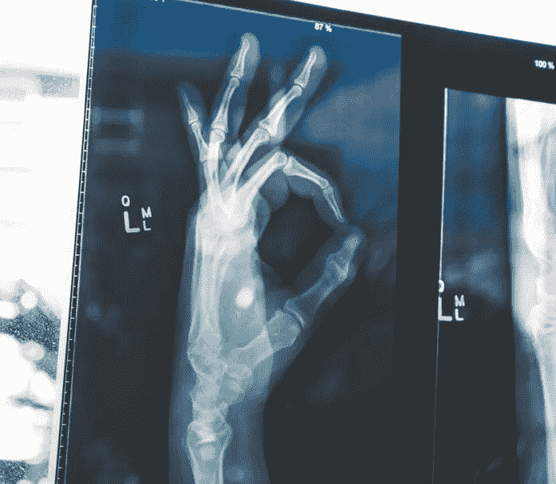
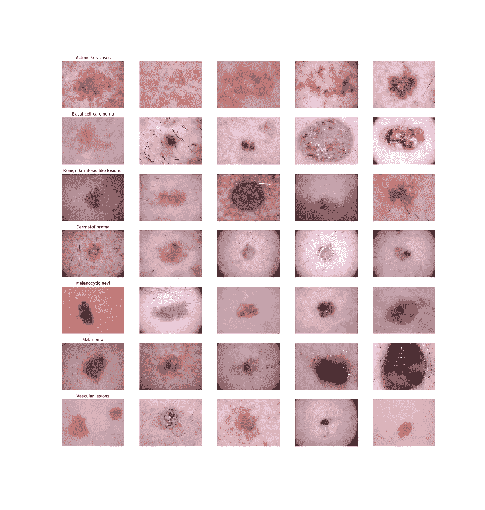
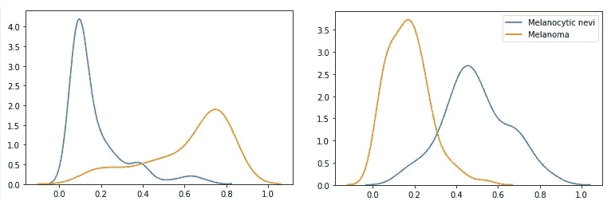
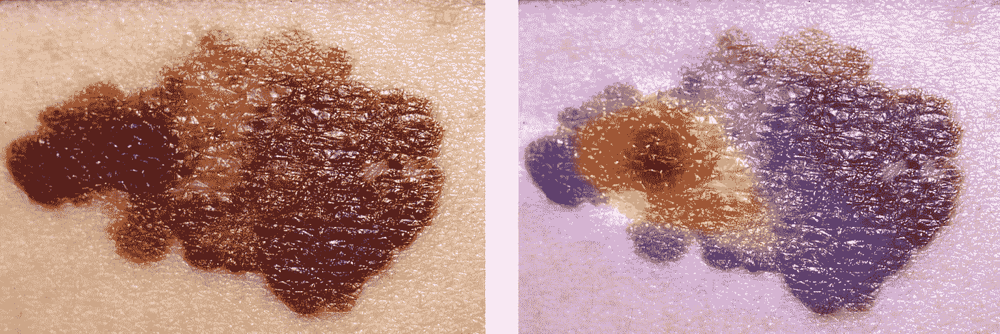

# 基于概率层和 Grad-Cam 的医学图像分析

> 原文：<https://towardsdatascience.com/medical-image-analysis-using-probabilistic-layers-and-grad-cam-42cc0118711f?source=collection_archive---------26----------------------->

## 解开卷积神经网络的“黑箱”

对医疗保健中用于图像分析的人工智能应用的兴趣正在快速增长。学术期刊中关于机器学习的出版物数量呈指数增长，因此在日常临床实践中已经实现了几种图像识别应用。准确的算法可以作为医生的额外诊断工具，以促进和加快工作流程，最重要的是，提高诊断过程的准确性。



图像分析算法应该被添加到医生的工具箱中，而不是被视为医学专家的潜在替代品。尽管医生关心并负责病人的健康，但大多数医生并不熟悉机器学习算法的数学细节。因此，医疗应用不应该充当“黑匣子”，而是提供关于模型如何得出其预测的额外信息。本博客展示了获取这些信息的两种可能的技术:概率层，可用于解决模型预测的不确定性，Grad-CAM 是一种展示哪些像素对模型结果贡献最大的方法。在这个博客中，我们将重点关注皮肤镜图像，但提出的技术也适用于其他医学领域(如放射学和病理学)。

# **基础架构**

将使用 Kaggle 的 public HAM(“人对机器”)10000 数据集来说明这两种技术，该数据集包含 7 类色素性皮肤损伤的超过 10000 个图像，包括几种类型的皮肤癌(即黑色素瘤和基底细胞癌)和侵入性较小的类型，如良性角化病样损伤和生理性黑素细胞损伤。



Examples of images in the HAM10000 dataset

尽管数据集包含了年龄和位置等对皮肤病变分类有价值的附加特征，但出于说明的目的，本博客将仅关注成像数据。在左边的几个例子图像，所有获得的皮肤镜描述。

首先，使用具有预定义权重的 VGG16 架构来训练基本卷积神经网络。第一层的重量被冻结，只有最后 6 层被重新训练。添加了具有 softmax 激活功能的额外致密层。

在 10 个时期的训练之后，迁移学习模型产生了 82%的验证准确度。此时，模型的输出由一个数组组成，该数组表示图像属于 7 个类别中的每一个类别的概率(见下文)。

```
[[2.3303068e-09 1.2782693e-10 1.4191615e-02 1.8526940e-14 3.9408263e-02 9.4640017e-01 2.1815825e-11]]
```

这些预测已经可以在正确的方向上指导医生，但是模型的“思考”方法的附加信息将增加对这些深度学习模型的理解和信任。接下来的章节将说明概率层和 Grad-CAM 在这方面的价值。

# **概率层**

向模型架构添加概率层是评估模型预测不确定性的一种有效方法。“正常”层和概率层之间的根本区别在于，概率层假设权重具有某种分布，而不是点估计。概率层通过变分推理逼近权值的后验分布。本质上，后验分布通过高斯分布替代函数来近似。在每次向前传递期间，概率层的权重从该代理分布中被采样。

因此，多次引入相同的输入将导致每次预测略有不同。在分类问题中，模型将产生每一类的概率分布。这种概率分布可用于评估模型预测的不确定性:如果不确定性有限，重复的预测将彼此非常接近，而预测的广泛分布意味着较大的模型不确定性。

本博客将重点介绍一个特定概率密集层(Flipout)的实现，使用 Tensorflow 概率模块可以轻松实现。我们使用相同的方法添加密集翻转层，而不是将普通密集层添加到预定义的 VGG16 网络。Flipout 的完整数学背景由 Wen 等人描述，可在的找到。

训练完模型后，我们的密集 Flipout 层的输出乍一看是相似的:一个数组表示 6 个类中每一个的概率。然而，如上所述，由于翻转层在每次向前传递时从分布中采样权重，所以同一图像的每次预测略有不同。通过多次重复对某一图像的预测，可以获得 7 类皮肤损伤中每一类的概率分布。



Density plots of two images passing through the network 100 times

左边的每幅图像显示了属于“黑色素细胞痣”(蓝色)或“黑色素瘤”(橙色)类别的图像的概率分布，这是通过将每幅图像通过网络 100 次而产生的。x 轴反映图像属于其中一个类别的概率，而图的高度表示分布密度。

医生的附加信息的价值可以用所描绘的密度图来说明。让我们看看左边的图:通过“正常”卷积神经网络传递第一幅图像将产生“黑色素细胞痣”(蓝色)类的低点估计和“黑色素瘤”(橙色)类的高点估计。概率翻转层能够评估这些预测的不确定性。具体来说，左图显示“黑色素细胞痣”类别的预测(低)概率变化很小。然而,“黑色素瘤”类别的分布有更多的变化，这意味着图像属于“黑色素瘤”类别的概率是相当不确定的。

总之,“正常的”卷积神经网络将为每一类提供一个概率，而包含概率翻转层的模型产生每一类的概率分布，因此可以用于评估模型预测的不确定性。医生可以使用这些额外的信息来更好地理解预测，并使用他/她的知识来确认或排除某个诊断。

# Grad-CAM

梯度加权类激活映射(Grad-CAM)是一种从卷积神经网络的最终卷积层提取梯度的方法，并使用该信息来突出显示对图像属于预定义类的预测概率最负责的区域。

Grad-CAM 的步骤包括用随后的全局平均池提取梯度。添加了 ReLU 激活函数，以仅描绘对预定义类别有积极贡献的图像区域。可以在原始图像上绘制所得到的注意力地图，并且可以将其解释为用于识别模型“关注”的区域的视觉工具，以预测图像是否属于特定类别。鼓励对 Grad-CAM 背后的数学理论感兴趣的读者通过 https://arxiv.org/abs/1610.02391[阅读 Selvaraju 等人的论文。](https://arxiv.org/abs/1610.02391)

下面的代码演示了用我们的基本模型实现 Grad-CAM 的相对容易性。



这些图像展示了黑色素瘤的原始图像和使用 Grad-CAM 算法创建的叠加注意力图的相同图像。这些图像清楚地说明 Grad-CAM 产生了对日常临床实践有用的额外信息。该注意力图反映了皮肤损伤的哪些部分对模型的预测影响最大。这一信息可能对指导皮肤活检寻找可疑诊断的确认有价值。此外，如果该算法的预测是准确的，那么在不同的患者中重复使用该算法并结合视觉特征将增加医生对该算法预测的信任。

# **结论**

卷积神经网络有可能为放射科医生、皮肤科医生和病理学家等几个医学专业提供额外的诊断工具。然而，仅仅提供类别预测的模型是不够的。我们认为，引入方法，如添加概率推理和 Grad-CAM，可以深入了解模型的决定性属性，因此对于医生理解并开始在日常临床实践中采用机器学习算法至关重要。

## 关于作者

[Rik Kraan](https://www.linkedin.com/in/rikkraan/) 是医学博士，在荷兰数据科学咨询公司 **Vantage AI** 担任数据科学家。请随时通过[rik.kraan@vantage-ai.com](mailto:rik.kraan@vantage-ai.com)联系

*特别感谢* [*理查德*](https://medium.com/u/6637acb5a331?source=post_page-----42cc0118711f--------------------------------) *和* [*洛克*](https://medium.com/u/67c88c5676e2?source=post_page-----42cc0118711f--------------------------------)