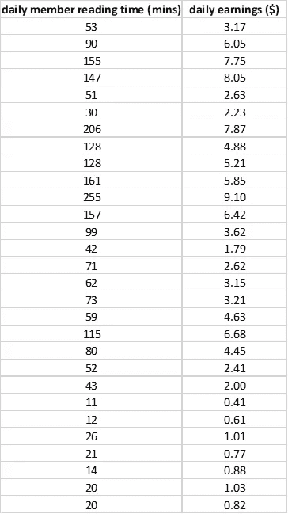
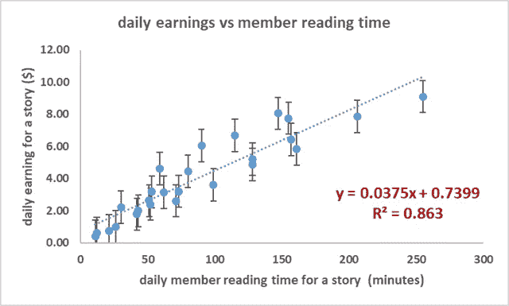
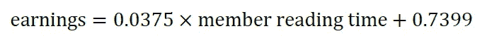
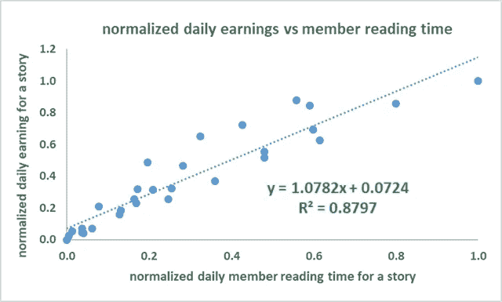

# 媒介合伙人计划计算作家收入的新模型——线性回归分析

> 原文：<https://towardsdatascience.com/medium-partner-programs-new-model-for-calculating-writer-s-earnings-using-basic-linear-regression-bddf8ef7e431?source=collection_archive---------22----------------------->

2019 年 10 月 22 日，medium 公布了计算作家收入的新模型。根据这种新模式，**收益将根据媒介会员的*阅读时间*来计算。**你可以从这篇文章中找到更多关于新模式的信息: [**改进我们计算作家收入的方式**](https://blog.medium.com/improving-how-we-calculate-writer-earnings-d2d3f4329b26) 。

新模式自 2019 年 10 月 28 日起生效。我查看了过去 5 天(2019 年 10 月 28 日至 2019 年 11 月 2 日)我在这种新模式下的收益。对于给定的故事，我很好奇，也很兴奋地想知道我的日常收入与媒体成员的阅读时间之间的关系，所以我转向数据分析来寻找答案。

## 1.使用新模型赚钱的所选故事的数据集

这是我的一些故事的数据集，这些故事使用新的模式赚了钱。

**Daily earnings versus member reading time for selected stories using the new partner program model.**

## 2.收入与会员阅读时间相关系数的计算

使用 Excel 中的 **CORREL()** 函数，我们发现相关系数为 0.93，表明收益与会员阅读时间之间存在较强的正相关关系。

## 3.基本线性回归分析

为了量化收入与会员阅读时间之间的关系，我们使用 Excel 进行了基本的线性回归分析。

通过简单的回归分析，我们发现了收入($)和会员阅读时间(分钟)之间的关系:

**注意:**这种关系仅适用于成员阅读时间在 11 分钟到 255 分钟的范围内，该范围用于训练模型。

我们使用拟合模型预测每日收入，使用会员阅读次数的原始训练数据，发现均方误差由下式给出:

## 4.使用归一化特征的线性回归

由于成员读取时间包含范围[11，255]内的值，我们决定在执行线性回归分析之前对我们的特征进行归一化。以下是使用归一化要素的线性回归分析的输出:

我们使用使用归一化特征的拟合模型，使用会员阅读次数的原始训练数据来预测每日收入，并发现均方误差由下式给出:

将其与我们的原始拟合进行比较，我们看到有轻微的改进，但是 **MSE** 值的差异并不太显著。

因此，基于我们的简单模型，我们已经证明了收入与会员阅读时间的关系如下:

该等式可用于预测会员阅读时间在[11，255]分钟范围内的收入。

## **5。每日收入可变性的来源**

我认为收益的可变性可以用一个非常简单的模型来解释。根据对数据的观察，收入似乎是根据所有成员的平均每日阅读时间计算的。

由于每个成员每月支付 5 美元的费用，让我们假设 medium 使用 2 美元的维护费，这样剩下 3 美元的余额可用于支付给作者。

假设一个月有 30 天，这意味着一个成员每天的价值是 3 美元除以 30，即 0.1 美元。在所有会员平均每天阅读时间为 5 分钟的一天，收益率将为 0.1 美元除以 5 分钟或**$ 0.02/分钟**。然而，在所有会员平均每天阅读时间为 10 分钟的一天，收益率将是 0.1 美元除以 10 或**0.01 美元/分钟**。

这个简单的模型可以解释收益率的每日变化。

总之，我们已经展示了如何使用合作伙伴计划的最新模型，使用简单的线性回归模型来预测作家的收入。随着越来越多的收入数据从新的媒体合作伙伴计划模型中获得，我们希望在未来扩展这种计算方法。