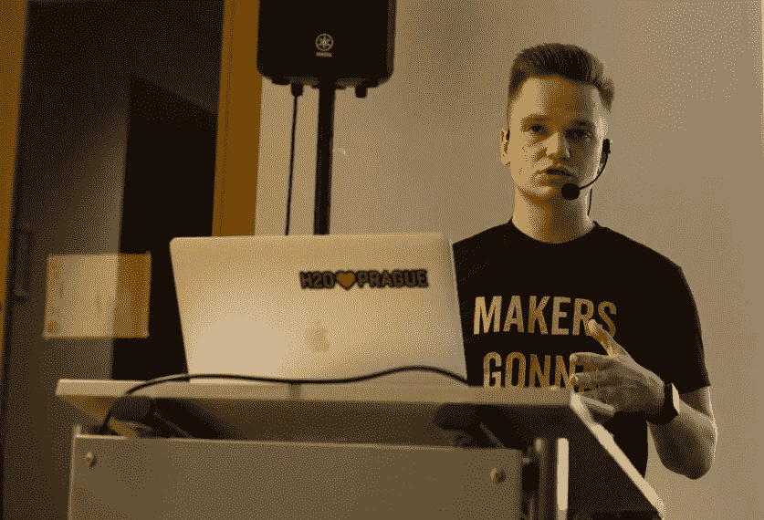
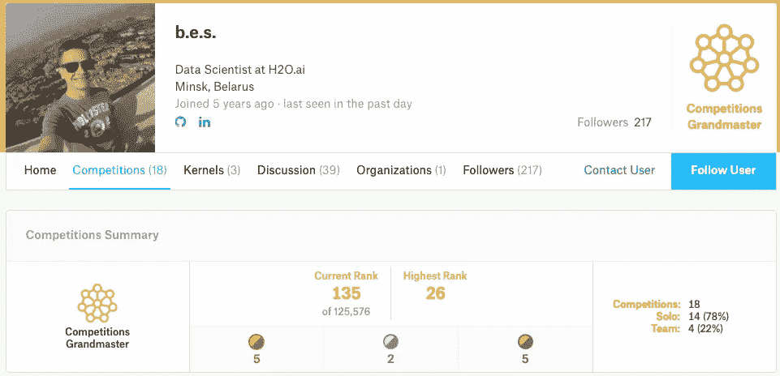
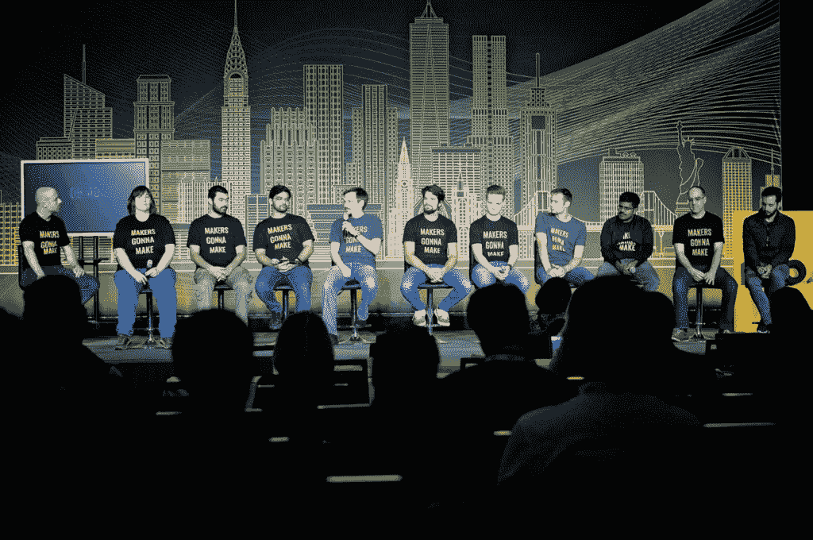
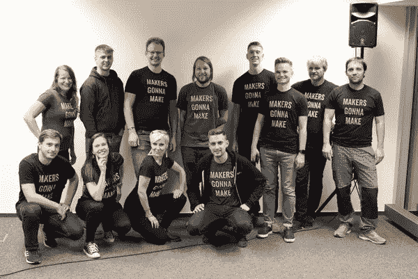
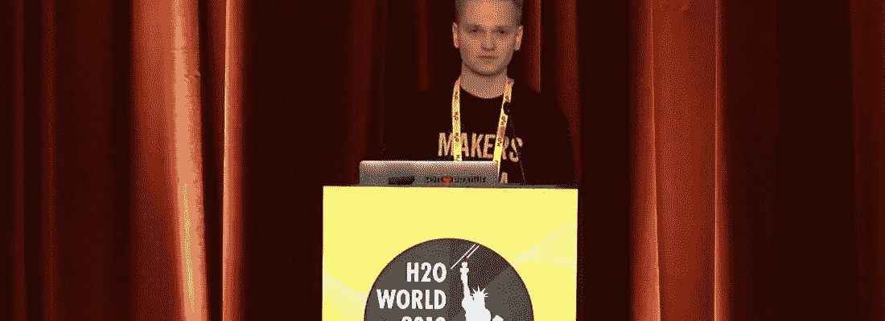

# 认识一下 Yauhen:白俄罗斯第一位也是唯一一位 Kaggle 特级大师。

> 原文：<https://towardsdatascience.com/meet-yauhen-the-first-and-the-only-kaggle-grandmaster-from-belarus-ee6ae3c86c65?source=collection_archive---------18----------------------->

## 与 Yauhen Babakhin 的对话:H2O.ai 的数据科学家和 Kaggle 竞赛的特级大师。

竞争数据科学不仅仅是简单地应用算法来获得最佳模型。参加这些比赛的主要收获是，它们提供了一个学习和培养技能的绝佳机会。这些知识可以用于一个人的学术或职业生活中。 [**Kaggle**](https://www.kaggle.com/) 是[数据科学竞赛](/top-competitive-data-science-platforms-other-than-kaggle-2995e9dad93c)最知名的平台之一，它提供了一个就一些最有趣的机器学习问题进行竞争的机会。经验丰富的人参加这些比赛。有些人做得非常好，并获得了卡格尔大师的称号。在这个系列中，我揭示了卡格尔大师们的惊人故事。

在本次采访中，我将与[**yau hen Baba Khin**](https://www.kaggle.com/ybabakhin)**、** a **Kaggle 竞赛特级大师、**和**数据科学家**在 **H2O.a** i. Yauhen 拥有应用数据分析硕士学位，在数据科学领域拥有超过五年的经验。Yauhen 恰好是白俄罗斯第一届 Kaggle 比赛的特级大师，在经典机器学习和深度学习比赛中都获得了金牌。

以下是我与雅亨对话的摘录:

*   ***你是白俄罗斯第一位 Kaggle 比赛特级大师。Kaggle 最初吸引你的是什么，你是什么时候赢得第一次胜利的？***

***Yauhen:*** 我从 [Edx](https://www.edx.org/course/the-analytics-edge) 上的一门在线课程开始了我的数据科学之旅。作为课程的一部分，有一个 Kaggle 比赛，这是我第一次接触到 Kaggle 的概念。我在比赛中排名第 450 位(在公共排行榜上排名前 50 位)，但这是一次很好的学习机会，也是继续学习数据科学的动力。大约六个月后，我参加了第二次 Kaggle 比赛，并在那里获得了银牌。

[Yauhen’s Kaggle Profile](https://www.kaggle.com/ybabakhin/competitions)

目前，我是白俄罗斯第一个也是唯一一个 Kaggle 特级大师，但是有很多 Kaggle 大师，数据科学社区发展非常快。

*   ***你在经典的机器学习和深度学习比赛中都有金牌。你觉得哪些比赛更有挑战性？***

***Yauhen:*** 我会说所有的比赛都具有挑战性，但如果让我选择，我会说参加深度学习比赛相对更难。深度学习比赛需要很长的训练时间，所以不可能快速迭代。这使得评估所有的假设变得很困难，人们犯错误的可能性也小得多。

*   你通常如何处理一个难题？

***Yauhen:*** 我一般会在一个比赛推出后等一两个星期。如果竞争存在一些问题，如数据泄露、数据不正确等。，这些都位于前几周，节省了很多时间。

然后，就像其他人一样，我从探索性数据分析部分开始，然后是假设生成、建立本地验证，并尝试不同的想法和方法。通常，我会创建一个文档，存储所有这些想法、假设、论文和资源，我认为它们可以为这个特定的比赛服务。有时这样的文档甚至可以包含多达 20 页的文本。

除了上面的方法，我在比赛期间关注所有的论坛和核心讨论，以获得对同一问题的不同意见。

*   ***您最近在 Kaggle days China 上发表了演讲，您谈了哪些话题，体验如何？***

这是我第二次参加卡格尔节。五月，我参加了 **Kaggle Days 的迪拜**版，做了一个关于**伪标签**的演讲。这次在北京，我参加了一个关于“**机器学习管道中的常见错误”的研讨会我准备了几条管道，观众必须找出其中的错误。**

[Yauhen(7 from L) with other H2O.ai Kaggle Grandmasters during H2O world New York](https://youtu.be/NPJ7ORvcmU4)

我喜欢卡格尔日的形式。它允许参与者参加卡格尔大师们举办的讲座和研讨会。此外，在活动的第二天，与会者将参加由 Kaggle 大师提供指导的 8 小时线下比赛。

*   ***就数据科学而言，您最喜欢的资源是什么？你更喜欢哪种编程语言？***

**Yauhen:** 随着机器学习和数据科学的飞速发展，很难跟踪每一种可能的资源。所以，我试着把自己限制在一个特定的领域或者一个我目前正在解决的特定问题上。

首先，我将**命名为开放数据科学社区(ods.ai)** 。它主要是一个讲俄语的 slack 社区，拥有大约 4 万名成员和几乎每个数据科学主题的频道。在这里，人们可以在几秒钟内快速获得任何数据科学概念的信息。然而，如果我需要更深入地理解任何材料，我会直接去找一些博客帖子、论文、youtube 视频等。

说到编程语言，我使用 **R** 语言开始了我的数据科学之旅，但现在我主要使用 **Python** 。

*   ***作为 H2O.ai 的一名数据科学家，你的角色是什么？你在哪些具体领域工作？***

[Yauhen(3 from R) with other ‘Makers’ during the H2O Prague Meetup](https://www.meetup.com/Prague-Artificial-Intelligence-Deep-Learning/photos/30367865/485045809/)

***Yauhen:*** 我目前在做**计算机视觉领域**的 AutoML 模型。H2O.ai 的无人驾驶人工智能已经可以处理表格、时间序列和文本数据。现在，我们正在前进，使用无人驾驶人工智能和图像数据来解决分类、分割、物体检测等问题

这个想法是，一旦用户提供了一个包含图像路径和图像标签的 CSV 文件，无人驾驶人工智能应该在时间限制下，自动从这些数据中建立最佳模型。这将需要自动化所有的超参数搜索，例如学习率、优化器、神经网络架构等。和训练过程，如时期数、扩充选择等。此外，这个过程在时间和内存使用方面应该是高效的。我们正在努力，并取得了一些积极的成果。

*   ***你通过 Kaggle 学到的最好的东西有哪些是你在 H2O.ai 的专业工作中应用到的？***

***Yauhen:*** 我用影像资料参加过几次 Kaggle 比赛。它提供了一个很好的背景，让你知道什么想法在实践中最有效，哪些可以自动化。此外，我会继续阅读竞赛获胜者的解决方案，即使我没有参加某个特定的竞赛。

这样的实用技巧一般不会在任何书籍或在线课程中描述。这就是为什么 Kaggle 允许一个人保持在该领域发展的边缘，并不断改善我们的计算机视觉问题的 AutoML 管道。

[Yauhen presenting a session on the capability of Driverless AI with image data at H2O World New York,2019](https://youtu.be/gRraEabTX3o)

*   你想在 ML 中应用你的专业知识吗？

我在很多领域都有丰富的经验，比如经典的机器学习、自然语言处理和计算机视觉。但是，我从来没有处理过音频数据。因此，应用一些技术来解决问题是很有趣的，例如音频记录的分类或自然语言理解等等。

*   ***给刚刚开始或希望开始数据科学之旅的数据科学有志者一句忠告？***

***Yauhen:*** 在我看来，人们应该记住，数据科学之旅在理想情况下应该是理论知识和实践经验的结合。

仅仅阅读书籍、博客文章、浏览在线课程不会给你任何实践经验。你只能获得一些理论上的理解，而不能应用于实践。另一方面，直接进入应用程序也将成为一个猴子的工作。运行 simple fit()-predict()并盲目复制公共 Kaggle 内核，而不了解幕后发生了什么，也将使你一事无成。

所以，我会建议选一门好的网络课程，完成它所有的练习。此外，参加 Kaggle 竞赛，应用你刚刚从论文、书籍、博客等中学到的理论方法。通过这种方式，你会牢牢掌握基本原理，也会理解它们的实际用途。

这次采访是另一个很好的例子，展示了像 Yauhen 这样的人如何以系统的方式努力工作来实现他们的目标。他们定义了一条清晰的道路，并朝着他们的目标努力。从这次谈话中另一个很大的收获是，拥有良好的理论知识只在一定程度上有用。然而，真正考验你理解力的只有当你将所学付诸实践的时候。

# 阅读本系列的其他采访:

*   [*Rohan Rao:数据科学家从数独到 Kaggle 的旅程*](/a-data-scientists-journey-from-sudoku-to-kaggle-120876b7fa33)
*   [*Bojan Tunguz:从学术界到 Kaggle:物理学家如何在数据科学中找到爱情*](/from-academia-to-kaggle-how-a-physicist-found-love-in-data-science-d57bdc500d04)
*   [*Shivam Bansal:数据科学家，负责 Kaggle 上的“有益的数据科学”竞赛。*](/the-data-scientist-who-rules-the-data-science-for-good-competitions-on-kaggle-ab436595a29f)