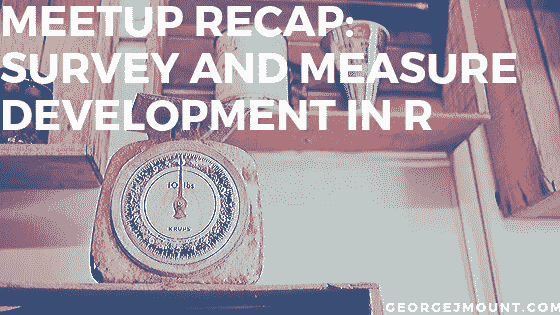

# Meetup 总结:R 中的调查和衡量发展

> 原文：<https://towardsdatascience.com/meetup-recap-survey-and-measure-development-in-r-2df3549e5af6?source=collection_archive---------28----------------------->

你有没有在医生那里做过调查或者参加过工作面试，并且想知道这些数据到底是用来做什么的*？关于如何从自我报告调查数据中可靠地测量“潜在”特质，如抑郁或忠诚，有一系列长期存在的方法，其中许多来自心理学。*

*虽然测量是从人体运动学到教育等领域的一种常见方法，但它通常是在 SPSS 或 MPlus 等专有工具中进行的。关于 R 中的调查开发，确实没有太多的在线培训，但是该程序无法通过像`[psych](https://cran.r-project.org/web/packages/psych/index.html)`和`[lavaan](http://lavaan.ugent.be/)`这样的包来进行。*

*整个夏天，我向大克利夫兰 R 用户会议小组介绍了以下长达一小时的 R 调查发展研讨会。视频和幻灯片在下面。您还可以在 [RStudio Cloud](https://rstudio.cloud/project/355799) 上访问演示中使用的所有代码、文件和资源。*

*幻灯片:*