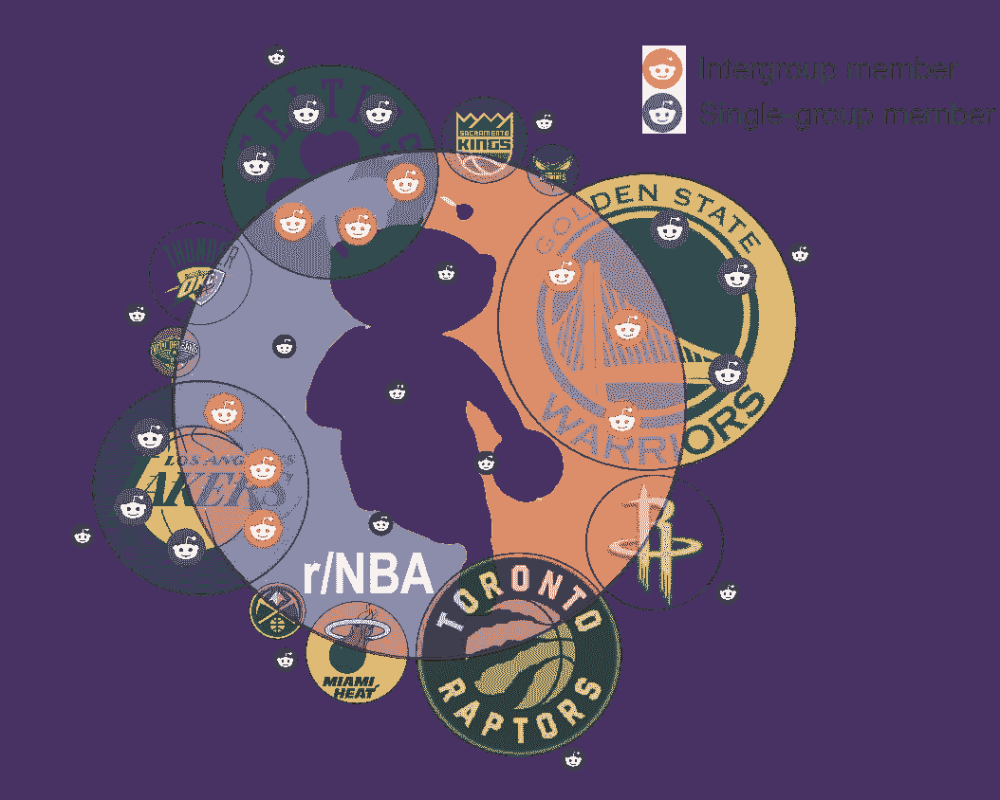
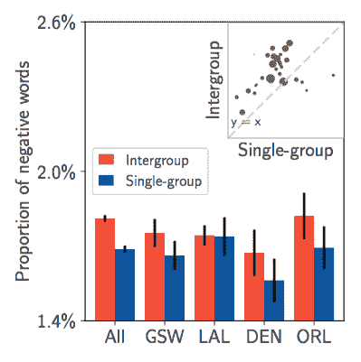
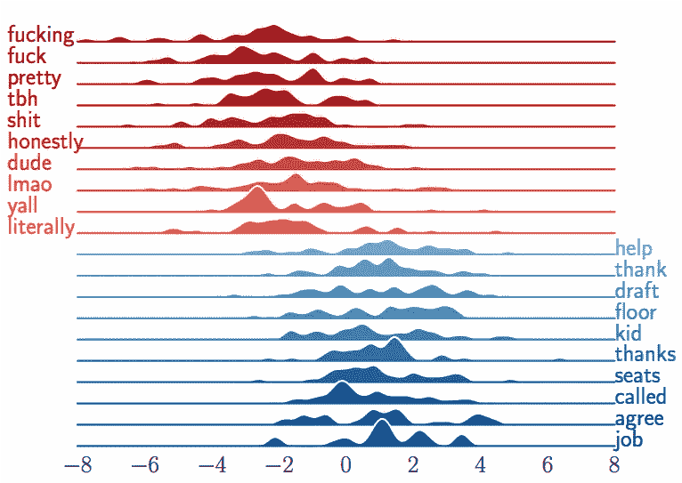
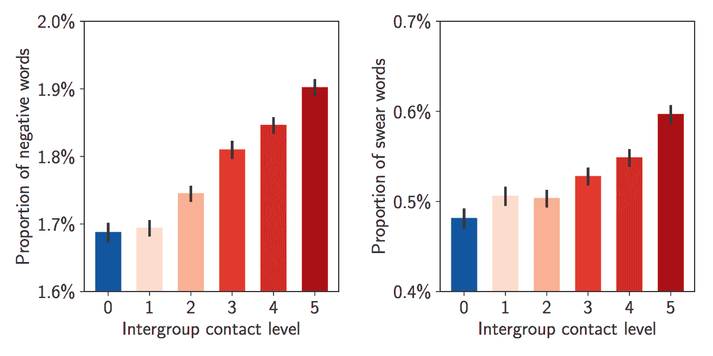
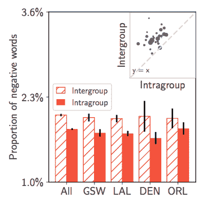

# 有群体间联系的成员更有可能在 NBA 在线论坛上使用负面语言

> 原文：<https://towardsdatascience.com/members-with-intergroup-contact-are-more-likely-to-use-negative-language-in-online-nba-discussion-9f937837f0b1?source=collection_archive---------36----------------------->

*本博客总结了我们的* [*CSCW 2019*](https://cscw.acm.org/2019/) *论文"* [*野外的群际接触:表征 NBA 相关讨论论坛中群际与单群成员的语言差异。*](http://jasondarkblue.com/papers/NBAIntergroup.pdf) *”由***[【】谭](https://chenhaot.com/)***。*****

**近年来，人们越来越关注世界政治中的两极分化和部落主义。人们会将自己视为社会“部落”的成员，并对其他群体产生敌意。在社交媒体时代，Twitter、Reddit 和脸书等平台可能导致美国共和党和民主党进一步分裂。**

**为了减少偏见，在具有不同意识形态的人之间建立桥梁，一个建议的策略是让人们走出他们的[“回音室】](https://en.wikipedia.org/wiki/Echo_chamber_%28media%29)，鼓励与对立群体的群体间接触。这一策略已被证明在许多离线环境中有效，因为人际互动可以挑战人们对彼此的刻板印象。硅谷的一些服务提供商正在他们的社交媒体平台上试验这一策略。在 2018 年接受《华盛顿邮报》采访时，Twitter 首席执行官杰克·多西表示，他的公司正在测试一些功能，这些功能将在 Twitter 的时间表中推广不同的观点，以解决错误信息，减少“回音室”**

**然而，所提出的战略可能不会取得理想的结果。事实上，最近几项实验研究已经在网上平台上对它进行了测试，我们看到了相互矛盾的结果:群际效应既可以有[正](https://www.sciencedirect.com/science/article/pii/S0747563215003830)效应，也可以有[负](https://www.pnas.org/content/115/37/9216)效应。在先前的研究中有这些矛盾的结果，我们相信观察研究允许研究人员在野外描述群体间接触*的特征*，并在不同的背景下提供有价值的补充证据。事实上，随着在线群体的出现，在相当长的时间内大规模观察群体间的联系和个人行为已经成为可能。**

## **Reddit 上 NBA 相关社区的群际设置**

**我们利用 Reddit 的 NBA 相关论坛的现有结构来识别用户的群体从属关系和职业体育背景下的群体间联系，这是一个不同于政治的新领域。我们选择职业运动队的在线粉丝群作为我们的测试平台，原因如下:**

1.  **职业体育在现代生活中起着重要的作用。美国民众 2015 年观看体育比赛的时间超过[310 亿小时](https://www.nielsen.com/us/en/insights/report/2016/the-year-in-sports-media-report-2015/)，2017–2018 年美国国家篮球协会(NBA)赛季的上座率达到[2200 万](https://www.nba.com/article/2018/04/12/nba-breaks-attendance-record-fourth-straight-year)。**
2.  **与政治环境类似，职业体育在本质上无疑是竞争性的。运动队的球迷可以把对方球队的球迷当成敌人，有时甚至会搞暴力。体育迷也倾向于认为媒体和来自对立球队的支持者很可能会对他们喜欢的球队有不公平的看法，就像意识形态不同的人一样。**
3.  **/r/NBA subreddit 致力于所有 NBA 球队的球迷之间就任何与 NBA 有关的讨论进行互动。它代表了一个开放和多样化的群体间接触的环境。更重要的是，/r/NBA 的一个独特机制，被称为 [flair](https://fivethirtyeight.com/features/what-reddit-can-tell-us-about-nba-fan-bases/) ，让我们可以轻松识别球迷的球队归属。**

****

**The illustration of NBA-related discussion forums (also known as subreddits) on Reddit.**

**上图说明了我们的框架。NBA 有 30 支球队，每支球队都在 reddit 上有自己的讨论论坛(以下简称 team subreddit)，相应球队的球迷可以在这里聚集并讨论新闻、比赛和任何其他与球队相关的话题。中央的/r/NBA 标志代表/r/NBA，不同球队的球迷在这里进行团体间的接触。鉴于 team subreddit 和/r/NBA 的不同性质，我们首先定义两个设置:**

1.  **团际设定:/r/NBA。**
2.  **组内设置:每支球队的子区(如[湖人的子区](http://reddit.com/r/lakers)和[凯尔特人的子区](https://www.reddit.com/r/bostonceltics/))。**

**基于这两个设定，我们根据他/她在/r/NBA 中的行为(缺失)来确定一个球队的球迷是否暴露在群际接触中，我们称之为群际状态。总而言之，我们将球队的球迷分为以下两类:**

1.  **Intergroup(红色图标):在赛季中同时在附属球队 subreddit 和/r/NBA 发帖的球队球迷。**
2.  **单组(蓝色图标):赛季中只在所属球队 subreddit 发帖而不在/r/NBA 发帖的球队球迷。**

**在比较之前，我们确保群际和单组成员在附属团队子群中的任何可观察特征上先验平衡，这表明对团队的忠诚度相似。为了实现这一点，我们采用匹配技术:对于每个单组成员，我们将他/她与来自同一附属团队的最相似的不匹配组间成员进行匹配，其中相似性是基于可观察的活动特征来测量的(查看[我们的论文](http://jasondarkblue.com/papers/NBAIntergroup.pdf)以了解详细信息)。**

## **组内语言差异**

**我们发现群际成员比单组成员在他们所属的小组中更情绪化。这反映在他们对负面词汇、脏话和仇恨言论的使用上。举例来说，下图比较了所有团队(all)中组间成员和单组成员使用负面词汇的情况。我们在两个最大的(GSW，LAL)和最小的(DEN，ORL)子团队中看到了相同的趋势，这两个子团队是由至少有 100 个单组成员的团队中的订户数量排名的。我们进一步在右上角显示了所有 30 个团队的散点图，以说明我们的发现在团队之间是稳健的。此外，我们还比较了这两组成员之间的积极语言使用，但我们没有发现他们之间的一致差异(更多细节见[我们的论文](http://jasondarkblue.com/papers/NBAIntergroup.pdf))。**

****

**The comparison of negative word usage between intergroup and single-group members in the 2018 season.**

****

**The top-10 over-represented words used by intergroup (red) and single-group (blue) members in the 2018 season.**

**为了进一步解释群际和单群成员在语言使用上的差异，我们确定了一个更有可能被群际和单群成员使用的区别词列表。上图显示，单组成员在附属团队 subreddit 中评论时更加友好和冷静，使用更多礼貌用语，如“同意”、“感谢”、“帮助”。此外，“座位”表明一些单组成员是当地球迷，因为他们经常讨论有关参加现场比赛的信息。相比之下，组间成员使用更多的脏话，谈论更多的裁判(可能是抱怨)。**

## ****不同层次的群际接触****

****我们的观察研究表明，高水平群际接触的成员倾向于使用更多的负面语言，但群际接触水平如何影响负面语言的使用存在不同的机制。**我们根据用户在组间设置(/r/NBA)中的评论分数，对所有 30 个团队子编辑中的用户进行分组，并为他们分配标签 1、2、3、4 或 5。较大的标签表明较高水平的群体间接触。我们还为单组成员分配标签 0。下图显示了不同群体间接触水平的成员之间的负面语言使用差异。群体间接触水平较高的成员通常在语言使用上更消极:他们倾向于使用更多的负面词汇和脏话，并在附属团队 subreddit 中产生更多的仇恨言论评论。然而，趋势不一定是线性的。例如，水平 1 的组间成员在左侧的消极词汇使用上与单组成员没有显著差异，而水平 5 的组间成员在两个图中都呈现出从先前水平的显著跳跃。**

****

**Negative and swear word usage of members with different intergroup contact levels in the 2018 season.**

## ****同一用户的组内行为与组间行为****

**到目前为止，我们已经证明了群际成员在他们所属的团队子群中使用更多的负面语言。但这是为什么呢？通过比较他们在组间环境和组内环境中的行为，我们发现**他们在组间环境中使用更多的负面语言**，因为他们比在组内环境中使用更多的负面词汇和脏话，并产生更多的仇恨言论。请注意，这种比较自然适用于受试者:我们在两种情况下比较同一个人。我们的结果表明，尽管在附属团队 subreddit 中，群际成员比单群成员更情绪化，但他们并不像在群际环境中那样“令人发指”。相比较而言，当去 intergroup setting 与其他队组的粉丝对抗时，他们往往会有更多的负面互动，并互相 troll。**

****

**Intergroup members use more negative words in the intergroup setting than in the intragroup setting in the 2018 season.**

## ****社交媒体会导致两极分化吗？****

**Twitter、Reddit 和脸书已经成为政治讨论和错误信息的重要平台。服务提供商正在设计新的功能，主动让人们接触到反对的观点。然而，所提出的解决方案可能会增加极化。与几十年的线下实验不同，这些实验大多表明对立团体成员之间长时间的亲密接触会产生积极影响，[贝尔等人](https://www.pnas.org/content/115/37/9216)和[我们的工作](http://jasondarkblue.com/papers/NBAIntergroup.pdf)的结果表明，在网上遇到来自对立团体的观点可能会使他们更加坚持自己的观点。通过研究群体间接触影响个体态度的可能机制，对这种对比有几种可能的解释。首先，在社交媒体上创建的评论通常很简短。这些没有足够上下文的短消息可能不会增强对对立群体的了解。第二，讨论结构可能会促进负面互动的传播。 [Cheng 等人](https://dl-acm-org.colorado.idm.oclc.org/citation.cfm?id=2998213)研究了上讨论的演变，表明讨论线索中现有的钓鱼评论显著增加了将来出现钓鱼评论的可能性。第三，社交媒体交流的匿名性和自发性可能不利于培养同理心。总之，根据环境和接触的性质，组间接触可能导致不同的结果。**

## **我们能为不同的群体设计更好的在线论坛吗？**

**我们工作中的发现表明，社交平台设计者应该考虑在线塑造群体间联系的策略。正如上面所暗示的，推荐用户关注对立团体或对立观点的成员是不够的。需要试验更好的设计策略来鼓励民间和更广泛的群体间接触。考虑不同水平的群体间接触如何以不同方式缓和个人意见也是有益的。在群体间接触的背景下，内容适度可能是未来研究的一个有前途的领域。类似地，传播在线信息的一种强有力的方式是通过社会共识线索和在线认可(例如，支持票、赞)。然而，简单地推广最受欢迎的内容有时会有问题。[早期研究](https://psycnet.apa.org/record/2018-63985-001)表明，带有更多情感负载词的推文可能会受到喜爱或转发，政治家可能会有意使用这种策略来最大化 Twitter 上的影响。这种类型的行为会引起对立群体的负面反应，并推动整个讨论向更情绪化和可能两极分化的内容发展。因此，重要的是开发评论排名系统，认识到群体间的联系，并优先考虑建设性的互动。**