# 钢铁之躯:用经验贝叶斯估计寻找最佳点球手

> 原文：<https://towardsdatascience.com/men-of-steel-finding-the-best-penalty-takers-with-empirical-bayes-estimation-aa0e126fb08b?source=collection_archive---------24----------------------->

## 当一切都归结为点球，你能相信谁？

Photo by [Jannes Glas](https://unsplash.com/@jannesglas?utm_source=unsplash&utm_medium=referral&utm_content=creditCopyText) on [Unsplash](https://unsplash.com/s/photos/soccer?utm_source=unsplash&utm_medium=referral&utm_content=creditCopyText)

可以说是足球比赛中最紧张的时刻，罚球是心理战:两个人，一个球和一个明显的进球机会。一个点球应该在职业水平上完成:句号。其他的都是失败。

这样的任务应该只要求拥有最冰冷血脉的玩家来完成。

有伟大的点球手，我们总是可以指望他们以惊人的节奏效率将球送到网后。还有一些人，他们令人沮丧的努力，注册商标的脚尖跑或近轨道打击，只是我们深感遗憾或无情嘲笑的来源。

你会认为罚点球很容易。或许花 5 分钟看这个视频。

# 那么谁是真正的超人：钢铁之躯呢？

你可以想象这将是一个简单的二级数学题。我们收集所有点球的记录，计算所有这些球员和 TADA 的相应转换率！

但是让我们看看真实的例子，看看这个简单的逻辑是如何失败的！！！

一方面，我们有克里斯蒂亚诺·罗纳尔多，他有五个金球奖，他的绰号“佩纳尔多”代表了他在球门前坚定不移的自我镇定，他有着令人印象深刻的 98 次点球中 85 次进球的记录(86.7%)。另一方面，我们有一个年轻的天才，阿森纳的尼古拉斯·佩佩，他最近对维拉的进球使他的进球总数达到 11 次成功 10 次(90.9%)。佩佩在点球上比罗纳尔多更好/更可靠吗？

> 当然，说那样的话会很可笑！！！

虽然年轻球员的得分比例略高，但这并不是很多证据:一个典型的球员几乎 80%的时间都可以得分，佩佩 90.9%的成功率可能是因为运气。另一方面，罗纳尔多有很多证据表明他高于普通球员。

> *我们如何系统地比较 85/98 和 10/11 这样的比率，并做出有意义的判断？*

## **贝氏统计来救援:**

我们发现这种困境的不仅仅是足球。由于低计数的不确定性，我们在处理成功/总数比率时肯定会出错。简单的解决办法就是设置一些门槛，过滤掉那些达不到最低要求的玩家。但这远非理想:我们丢弃了可能有用的信息。

让我后退一步，重新设计问题:我们想在某种程度上衡量一名球员天生的罚球能力。他的历史记录仅仅是对这种能力的估计。任务是根据他的历史记录更准确地评估他的能力。

我希望你能看到这是如何自然地把我们引向一个经典的贝叶斯设置:我们可以从对球员能力的一些*的预先期望开始，通过 ***用*新证据*更新它***——也就是说，用他的实际得分记录，我们得到对他真实能力的更实际的估计。*

*为了更好地回顾贝叶斯框架，你可以看看我的其他文章:*

* [## 贝叶斯统计如何说服我去健身房

### 一个有趣的旅程，进入线性回归理论与贝叶斯触摸(是的，我使用度量测量在这…

towardsdatascience.com](/how-bayesian-statistics-convinced-me-to-hit-the-gym-fa737b0a7ac)  [## 寻找上帝的贝叶斯探索

### 贝叶斯定理和最基本问题的概率答案:“上帝存在吗？”

towardsdatascience.com](/a-bayesian-quest-to-find-god-b30934972473) 

# 先验期望和经验贝叶斯；

我正踩在一颗地雷上。虽然贝叶斯设置有直观的意义，但要让人们在使用每个设置之前达成合理的一致几乎是不可能的。

一个人如何去具体说明他们先前的信念？尤其是如果你没有一个知情的猜测？一种方法可能是分配一个**“平坦先验”**——一个你指定你的参数的每一个值都是同等可能的先验。另一种方法是使用**经验贝叶斯**，其中你的数据用于估计先验。这里有一个问题:我没有事先对先验有一个固定的概念，而是在收集数据后查看数据*并相应地估计先验分布，这样就可以避免所有的麻烦。*

这种方法有很多优点。这很简单，而且它消除了(嗯，某种程度上)当我不得不选择自己的前科时可能产生的主观性。就我个人而言，我发现这种方法有助于我获得一定程度的稳定结果。平坦的先验或与数据不符的东西会导致奇怪的结果，例如负的后验概率。相信我，这并不少见。用经验贝叶斯我更有可能得到理智的答案。

听听著名统计学家布拉德利·埃夫隆对这种方法的看法:

> 自从我在 20 世纪 70 年代通过 Robbins 和 Stein 第一次接触以来，经验贝叶斯一直是我最感兴趣的话题。有时它仍然像魔法一样。[1]

DataCamp 的首席数据科学家大卫·罗宾逊也提供了一些很好的见解:

> 这基本上归结为我们有多少观察值:如果我们有很多，我们可以得到一个不太依赖于任何一个个体的好的估计。经验贝叶斯是对更精确的贝叶斯方法的一种近似(T0 )-----------------------就我们所拥有的数据量而言，这是一种非常好的近似。[2]

我知道，这感觉像是欺骗，而且确实如此。许多人认为先验信息是观测值的外生信息，因此批评使用实际数据来估计先验信息，因为这会低估建模误差。任何数据都会对使用相同数据来指定其某些特征的模型感到自满。

# 寻找先验—贝塔分布:

让我们看一下数据。

我收集了欧洲 6 个不同联赛 13 年的点球数据。看起来是这样的:

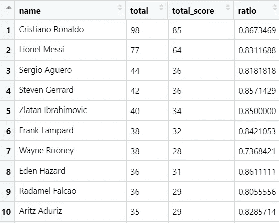

Records of penalty kicks — ranked by the total number of kicks taken. Our job is to ‘adjust’ the success ratio in order to compare these players.

如前所述，为了得到成功率先验的一个很好的近似值，我们将看看它的实际分布。

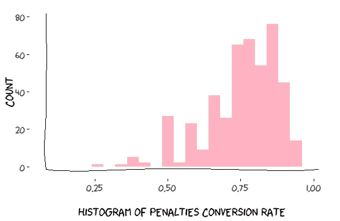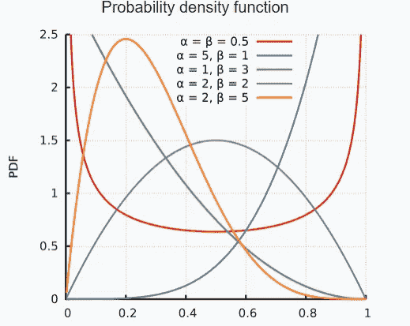

Left: the histogram of our actual penalty conversion rate . Right: The multiple shapes the Beta distribution can describe with its parameters. Source: Wikipedia

在这里，我们的任务是找到一个表征我们的经验惩罚转换率的分布:也就是说，(1)它在一个从 0 到 1 的范围内(没有负概率)，(2)它需要灵活，在某种意义上，它可以代表我们在直方图中看到的东西，以及(3)如果当我们结合二项式分布的可能性时，它使我们的贝叶斯计算更容易——二项式分布描述了在*试验中的成功次数(即:许多点球中的进球数)，那就更好了。*

> *瞧吧， ***贝塔分布*** 。*

*贝塔分布在域[0，1]上，所以我们知道它不会比平坦先验差。它在域内高度灵活，其特征在于两个正的形状参数，分别用 ***α*** 和 ***β*** 表示(见上图)。*

*关于贝塔分布最好的部分是，它是二项分布的*的共轭先验，这对我们的计算是个奇迹。我们可以从贝塔分布 ***B(α，β)*** 作为我们的先验开始，用来自二项分布的信息更新，其中*s***f***失败(未命中)，并且得到后验分布*，其也是精确形式的贝塔分布* ***B(α + s，β + f)*** 这种分布的平均值是***【α+s)/(α+β+s+f)******

> ***简直神奇！！！***

**我在这篇文章的结尾加入了一些数学知识，以防你不相信！**

# **让我们继续寻找我们最好的点球手:**

## **估计我们实际数据的先验:**

**现在我们已经有了一个清晰的分析框架，是时候将它应用到我们的真实数据集了。**

**首先，让我们对转化率数据集进行贝塔分布拟合。这可以很简单地用 r 来完成**

**用这个方法，我得到一个估计值 ***α = 9.29*** 和 ***β = 2.93。让我们看看这个估计与我们的数据有多吻合。*****

**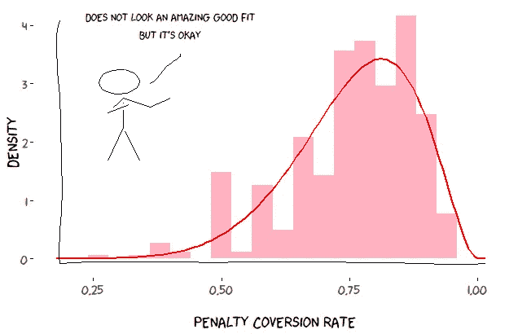**

**显然，它并不完美，但我们现在可以继续努力。**

## ****使用我们的经验先验更新每个玩家的统计数据:****

**我们现在可以继续，用我提到的公式找到每个玩家转换率的后验分布。即*aβ分布形式* ***B(α + s，β+f)***其中 ***s*** 和 **f** 分别是成功和失败的次数。后验均值将为 ***(α + s)/ (α + β +s+ f)。*****

**例如，c 罗和佩佩的点球转换率的*后验分布均值*将为:**

**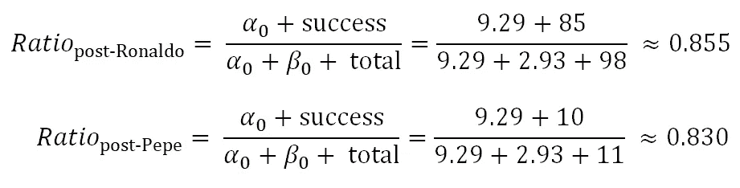**

**我们可以将他们的后验概率分布(与其他玩家一起)绘制如下:**

**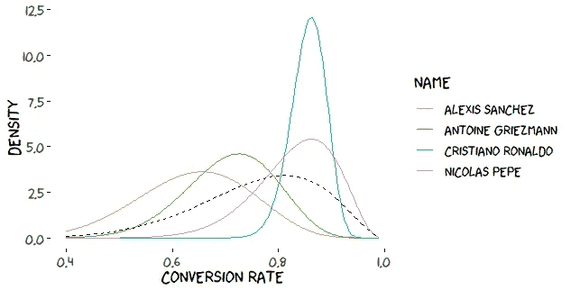**

**The posterior distribution of penalty conversion rate for a few players**

**我们可以看到，罗纳尔多的强劲记录导致非常高的后验均值和狭窄的可信区间，而佩佩的后验均值转换具有更大的可信区间，因为他的数据较少。与此同时，格里兹曼和桑切斯在点球方面并不出色。**

## **十佳点球手:**

**在应用了经验贝叶斯估计和贝塔二项式后验计算之后，让我来介绍一下过去 13 年里的前 10 名受罚者。**

**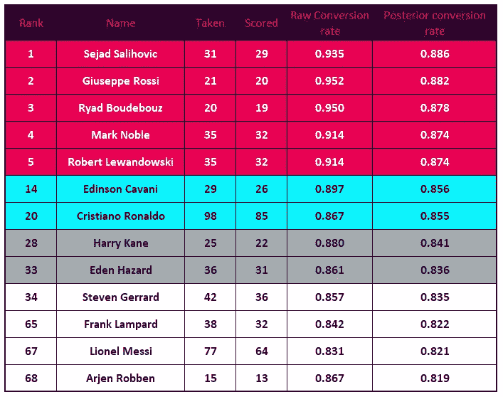**

**所以事实证明，最佳点球手是萨利霍维奇和罗西，紧随其后的是布代布、马克·诺布尔和莱万多夫斯基。著名的点球手:兰帕德，杰拉德，哈里·基恩并不像他们声称的那么好。有趣的是，我们可以看到，对于这些玩家来说，在我们应用这个程序后，他们的转化率缩小了。我们可以将原始比率和调整后的比率绘制在图上，以评估调整情况。这一部分的灵感来自大卫·罗宾逊的一篇了不起的文章[2]。**

**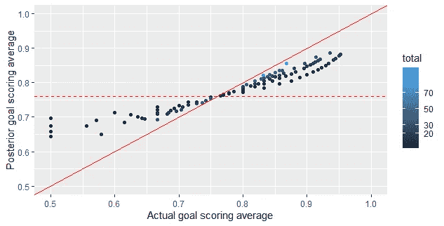**

**Plot of actual vs adjusted conversion ratios**

**水平虚线显示了先验分布的平均值——如果我们没有关于玩家的任何信息，我们应该猜测玩家的成功率。然后，我们有了对角线 ***y = x*** ，显示实际进球得分平均值等于后验调整的数据点。**

**有两个有趣的观察。首先，我们可以看到，高于先前均值的点往往会缩小，而低于均值的点会向上膨胀。第二，受收缩影响最小的点是与大量观测相关联的点。当你思考时，这是完全有意义的:如果我们通过观察有很多证据，我们可以依靠实际的估计；否则，相信我们的数据趋向于总体均值是很有价值的。**

# **结论:**

**好了，我刚刚介绍了经验贝叶斯估计的概念:*我们可以利用我们数据的总体分布作为先验，以获得每个平均值的更现实的估计*。然后，我们使用共轭先验的强大概念来绕过在我们的过程中计算后验分布的复杂性。贝塔-二项式组合如此受欢迎，以至于你可以把它应用到许多场景中:篮球、点击进入的 A/B 测试、学校食堂评级等等。**

**出于本文的目的，我方便地忽略了许多复杂性。首先，我们可以看出，我们先验的 beta 分布几乎不太适合。事实上，我们可以用两个 Beta 分布来拟合双峰分布，根据玩家属于每个分布的可能性，将他们分配到两个不同的组中。**

**你可以查看我解决这个问题的[代码](https://github.com/tuangauss/DataScienceProjects/blob/master/R/EPL/penalty/penalty.R)。**

**另一个复杂因素是，罚分转换率随着时间的推移而变化，并且在不同的联赛中有所不同。就我们考虑所有这些不同的因素而言，我们从简单的贝塔-二项式分布走了许多步，进入了 ***贝叶斯分层模型*** 的领域。这就是乐趣的开始！！！**

# **附录:**

**本文的代码和更多内容可以在[这里](https://github.com/tuangauss/DataScienceProjects/blob/master/R/EPL/penalty/penalty.R)找到。**

**这是β-二项式共轭配对的一个简短证明。**

**设置很简单:我们观察一些成功计数 ***s*** ，我们认为它们遵循样本大小为 n 的二项式分布，成功率为*我们的工作是找到给定 ***s*** 的 ***r*** 的后验分布。***

**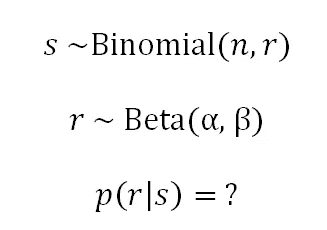**

**该是我们调用著名的贝叶斯公式的时候了——只针对连续变量:**

**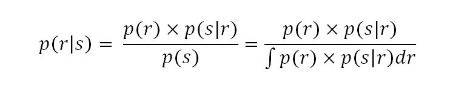**

**似然函数 ***p(s|r)*** 和先验 ***p(r)*** 遵循明确定义的二项式和贝塔分布。**

**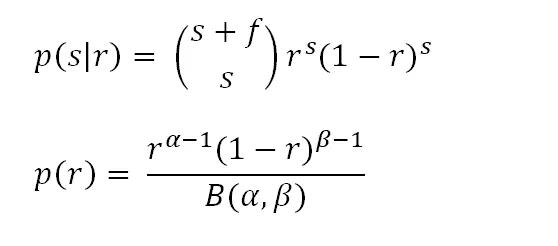**

**然后，我们的工作就是插入并找到后验分布。**

**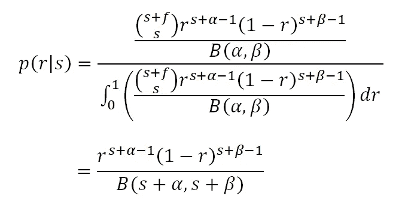**

**结果是一种β分布形式 ***B(α + s，β + f)*****

**[1]统计视图。(2015 年 6 月 1 日)。*经验贝叶斯对我来说是最吸引人的话题。有时它仍然像魔法一样:布拉德利·埃夫隆访谈。*”**

**[2]罗宾逊，D. (2015 年 10 月 1 日)。*理解经验贝叶斯估计(使用棒球统计)*。***