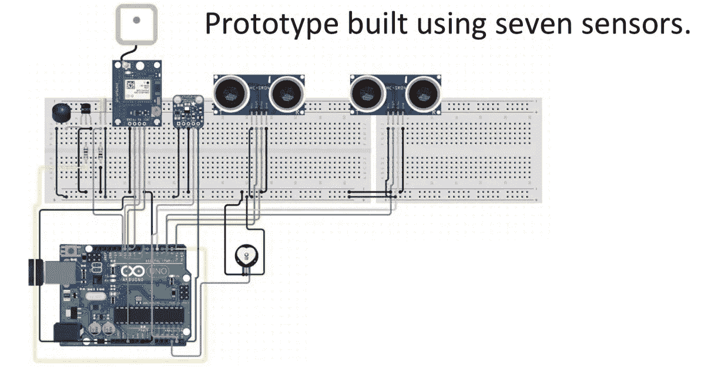

# 男人与男人:麻省理工学院深度技术训练营的经验

> 原文：<https://towardsdatascience.com/mens-et-manus-lessons-from-mit-deep-technology-bootcamp-9760733e2146?source=collection_archive---------18----------------------->

Bootcamp Developer Kit

> 从实践中学习，永远不要害怕失败。

这个短语可以概括我在[麻省理工学院深度技术训练营](https://bootcamp.mit.edu/deeptech/)的所有经历，此外，**紧张**也很好地描述了教室里的每一天。虽然这篇文章的目的不是描述经验，但我想在解释定义、主题和趋势时给出一些想法。最后，分享这一点的想法是为了给一些灵感，解释一个深入技术的大画面，在那里可能会走得更远，特别是如果你是从数据科学或人工智能世界开始的话。

# 第一课:深度技术

那到底是什么呢？嗯，我发现我自己在第一天也遇到了同样的情况，谢天谢地我们的第一堂课由约书亚·西格尔带来，他帮助我们澄清了 Quora 和风险投资的一些定义:

*   一套基于科学发现、工程、数学、物理和医学的尖端和颠覆性技术
*   “深度技术是工程与科学发现的结合点”
*   “具有改变世界影响潜力的有形发现或商业化”

对我来说，在度过了那些不眠之夜后，定义深层技术，如**“使用尖端和颠覆性技术解决重大问题的切实可行的解决方案”**，并且像所有由技术引发的解决方案一样，遵循“炒作周期”[1]有一天成为“高科技”，最终只是“技术”，以及解决方案需要跨越“鸿沟”才能获得成功的采用生命周期。

[1] The “Hype Cycle” (HC) and the “Technology Adoption Lifecycle” (TALC) models plotted together [[Hype Cycle, 2012](https://setandbma.wordpress.com/2012/05/28/technology-adoption-shift/)]

在训练营期间，我们发现并实践了一些深层技术促成因素，以构建具有社会或业务影响的最终项目:

*   物联网
*   人工智能
*   机器人自动化
*   虚拟和增强现实
*   大数据
*   区块链

# 第二课:物联网

我们生活在第五个互联网时代，机器对机器的交流已经成为现实，但这并不意味着高科技。另一方面，物联网是 m2m 的发展，是一项示范性的深度技术，因为它生成和传输要在本地或远程处理的数据，具有全球影响，最初也很难扩展，但经过努力，它将成为无缝的基本需求[麻省理工学院训练营]。

Evolution of Internet [[Nokia Insight](https://codeforbillion.blogspot.com/2017/10/evolution-of-internet-of-thingsiot.html)]

**示例:**

*   [信号动力学](https://www.media.mit.edu/posts/signal-kinetics-year-one/):我们有非常难得的机会去了解更多[法德尔·阿迪布](http://www.mit.edu/~fadel/)的工作，用几句话来概括就是物联网作为大影响推动者的最好例子。首先，我们深入了解了他在[的论文](https://people.csail.mit.edu/fadel/papers/wivi-paper.pdf)关于使用 wifi 看穿墙壁，以及关于数字医疗的研究，他们试图建立一个[无电池微型植入物](https://www.media.mit.edu/projects/ivn-in-vivo-networking/overview/)用于药物输送。我强烈推荐去访问和检查他们的[作品](https://www.media.mit.edu/groups/signal-kinetics/overview/)寻找灵感。

Wireless System for drug delivery

*   自动驾驶汽车:如今是一个热门话题，在那里我们可以与专家 [Sertac Karaman](http://karaman.mit.edu/) 交谈。他向我们展示了一个简短的时间表，在这个时间表中，我们了解了自动驾驶汽车的真实状态、背后的技术(传感器)、接下来的挑战(交通、 [trolly 问题](https://www.youtube.com/watch?v=yg16u_bzjPE))以及我们有时间与一个 [Turtlebot](https://www.turtlebot.com/) (一个低成本、带有开源软件的个人机器人套件)互动，编写一些代码/算法来让它移动。

We could make the Turttlebot move by itself!

# 第三课:虚拟和增强现实

因 Pokemon Go 等视频游戏或 Occulus 等设备而闻名，使人们开始谈论 AR 和 VR，因此在训练营期间，我们有机会知道背后的事情，这要感谢[圣乔治·帕帕斯](https://www.ece.ntua.gr/en/article/237)。

谈论现实——虚拟光谱可能会令人困惑，所以为了让它容易理解，我要感谢 [Hackernoon](https://hackernoon.com/the-difference-between-ar-vr-mr-xr-and-how-to-tell-them-apart-45d76e7fd50) 分享一个简短的想法。

> “如果体验需要特殊的硬件来观看(比如耳机)，那就是 VR。如果它使用计算机视觉来读取真实世界的信息，那它就是 AR。如果它既涉及扫描环境以获取数据，又涉及通过耳机进行显示以获得更深的沉浸感，那么它就是 AR 和 VR。”

Reality — Virtuality Spectrum [[Hacker Noon](https://hackernoon.com/the-difference-between-ar-vr-mr-xr-and-how-to-tell-them-apart-45d76e7fd50)]

在有了一个清晰的概念之后，认识到这些技术的用途是很重要的，感谢我们的讲师，我们发现了 ar 和 VR 作为与客户或用户交互的媒介，换句话说，**一种传达丰富信息/环境的使能技术**。例如，一些有趣的用途是:

*   [边缘型人格障碍虚拟现实](https://www.frontiersin.org/articles/10.3389/fpsyg.2016.01573/full)
*   [增强博物馆体验的 AR](https://www.museumnext.com/article/how-museums-are-using-augmented-reality/)
*   [用于培训人员的虚拟现实](https://virtualspeech.com/blog/how-is-vr-changing-corporate-training)
*   [AR 家具应用](https://medium.com/inborn-experience/top-8-ar-furniture-apps-review-in-2019-1699ff970495)
*   对我来说，最神奇的是使用虚拟现实模拟汽车驾驶，然后使用这些数据来训练自动驾驶模型！

考虑到应用程序的想法，现实情况是，如今要构建 VR 或 AR 的体验，存在一些平台或 SDK:[Unity](https://unity.com/)+[Vuforia](https://developer.vuforia.com/)、 [ARCore](https://developers.google.com/ar/) (Google)、 [ARKit](https://developer.apple.com/augmented-reality/) (Apple)和 [STEAM VR](https://store.steampowered.com/steamvr) 。我们有机会用 Unity+Vuforia 开发一些基本的 AR 示例，我不得不承认，它的工作给我留下了深刻的印象！

AR Example

# 第四课:区块链

在所有与比特币相关的炒作中，我对区块链背后的技术感兴趣它是如何工作的？有哪些挑战？所以作为客座讲师，我们被介绍给布莱恩·苏比纳拉。他友好地向我们解释了实际情况和未来。我对类似 [**智能契约**](https://blockchainhub.net/smart-contracts/) 以及如何将事物之间的‘交流’使用 [*令牌*](https://blockchainhub.net/tokens/) *这样的概念很着迷。*

例如，想象一个世界，我的自动驾驶汽车想要充电，所以首先我向汽车转账 50 美元，这是第一个合同，然后我的汽车向加油站付款是第二个合同，每个合同是一个由足够长的散列标识的**块**，以避免重复，所有交易块都加入到一个**链中，** 很明显，这看起来并不太复杂，尽管交易中还有其他一些因素需要考虑，比如支撑链条的基础设施、避免假货的交易完整性、监管等。

实际上，存在一些倡议和文件(在特定部门)以及与区块链发展事物的平台。

*   [脸书天秤座](https://libra.org/en-US/?noredirect=1)
*   [开放音乐倡议](https://medium.com/the-open-music-initiative)
*   [R3](https://www.r3.com/platform/)
*   [微软 Azure](https://azure.microsoft.com/en-us/solutions/blockchain/)
*   [英格兰银行](https://www.bankofengland.co.uk/-/media/boe/files/working-paper/2016/the-macroeconomics-of-central-bank-issued-digital-currencies.pdf?la=en&hash=341B602838707E5D6FC26884588C912A721B1DC1)

# 第五课:创新和设计

多亏了玛丽亚·杨和桑杰·萨尔马，这些话题对我来说是最有趣的话题之一。

首先，我们讨论创新的理论。我想到的第一个例子是自行车。试着记住这些年来所有的模型，它们看起来几乎一样，这意味着创新的主导模型。但是像所有的创新一样，它在产品的生命周期中有一些阶段，例如，想象 2006 年的手机世界,**主导设计**是一个小屏幕和按钮，每个时期都发生了**增量变化**，突然 iPhone 作为**破坏设备**推出，所有这一切又重新开始。

Evolution of mobile phone [[easytechnow](https://easytechnow.com/learn-technology/the-evolution-of-mobile-phones/)]

有时存在 [**有意的创造性破坏**](https://pocketnow.com/apples-creative-destruction) 为了推出一项创新，还记得 2012 年苹果把接头换成实际的 lightning 端口或者被指责让老款 iPhones 变慢的时候吗？

当我们思考创新时，有时我们称之为**颠覆**所以在这里给出一些概念是有好处的“颠覆性创新，顾名思义，指的是一个**概念，产品或服务，它通过颠覆现有市场或创造一个全新的市场来创造一个新的价值网络**
[ [维玛](https://www.viima.com/blog/innovation-management-models#disruptive-vs-sustaining-innovation) ]

因此，持续中断的一些示例如下:

*   MOOCs
*   支付(微信支付、支付宝)
*   实时视频

**概念测试**

在这堂课上，我们被要求思考不同的形式来测试产品，以获得用户反馈。这很有用，因为当我们开始开发一个产品或服务时，这对于**了解我们用户的体验很重要**例如，我们如何在没有开发无人驾驶汽车的情况下测试一个人的反应？还是来自某个服务的手机 app？或者超越我们如何测试人类去火星旅行？

 [## 汽车-在路上-四方视图

### 这是在 Vimeo 上由 Wendy Ju 制作的“汽车-在路上-四轴视图”,这是高质量视频和热爱…

vimeo.com](https://vimeo.com/140935829) 

如果你对这个话题感兴趣，我推荐你访问麻省理工学院设计实验室页面

# 第 6 课:构建我们的项目

每天课后，我们都努力构建功能原型和发布计划。我们的想法是在最后一天像初创公司一样向评委“推销”我们的产品/服务。在这里，我们面临许多挑战，第一个挑战是与我从未见过的全新的人一起工作(我们来自 4 个大洲！)，我们每个人都有不同的技能或背景，第二步是选择一个真正有重大影响的想法(这是最难的)，最后构建解决方案并进行推介。

Smart belt project

**我们的想法**

我们决定为老年人打造智能腰带，我们的重点是让他们有信心在不需要拐杖的情况下行走，因此原型有传感器来检测前方的物体，并在人摔倒时触发或检查温度和脉搏，为此我们使用了:

*   两个超声波传感器
*   一个蜂鸣器
*   一个陀螺仪
*   温度和心跳传感器
*   全球（卫星）定位系统
*   充电宝

我们的想法需要完整，所以它包括市场研究，财务预测，盈利能力分析，以及后端(NodeJS)和分析服务(Databricks)。

Backend and Analytics diagram

# 结论

这段经历完全值得，每天都在发现或深入一些东西，扩展我的知识，实践麻省理工学院的座右铭 **'** [**头脑和手**](https://mitadmissions.org/help/faq/motto-mens-et-manus/)**'****(Mens et Manus)**因为不仅仅是听或参加一个班，做出改变的最好方式是，我们需要用我们的头脑和手来构建实际的解决方案，以产生更大的影响，而一种方法就是使用深层技术。

PS 如果有任何问题可以在 [Twitter](https://twitter.com/thony_ac77) 和 [LinkedIn 上找我。](https://www.linkedin.com/in/antoniocachuan/)