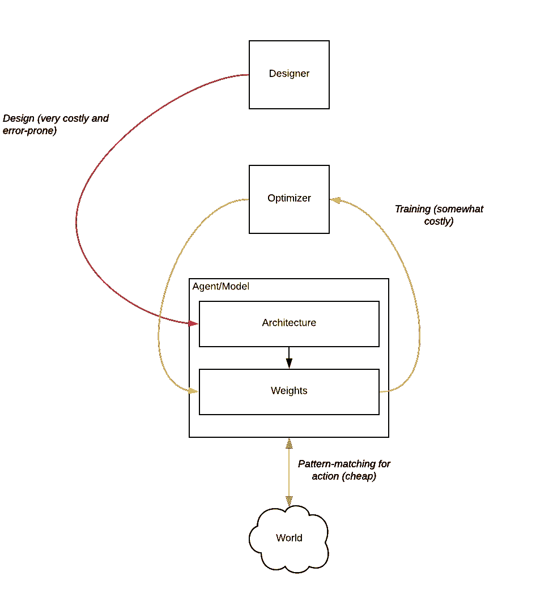
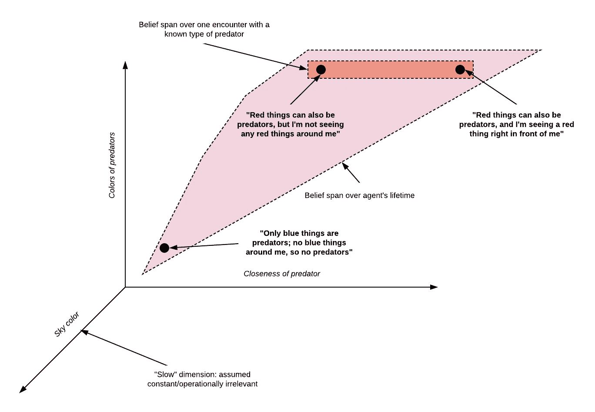
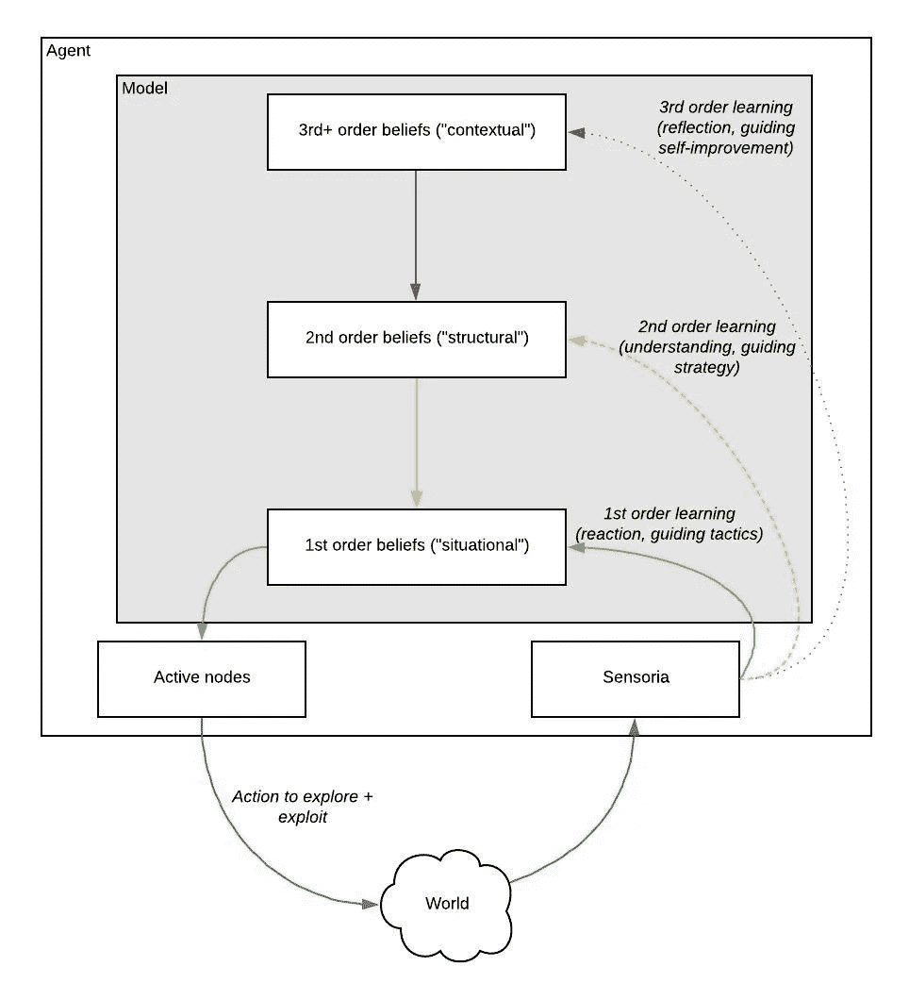

# 个人和集体的心智模型

> 原文：<https://towardsdatascience.com/mental-models-in-and-of-individuals-and-collectives-d28fa62f0a4a?source=collection_archive---------25----------------------->

在 [*迈向超级智慧理论*](https://medium.com/@rkauf/towards-a-theory-of-superminds-4af8a433f6fe) 中，我描述了一种基于卡尔·弗里斯顿首创的[主动推理框架](https://medium.com/@solopchuk/tutorial-on-active-inference-30edcf50f5dc)的集体智慧理论。正如主动推理所要求的那样，该理论意味着所有的集体(如团队和组织)都在一个隐含的*世界集体模型*的基础上运作——这为他们提供了理解观察结果和预测替代行动过程结果的能力(弗里斯兰语中的“政策”)。

如果我们接受[定理](https://royalsocietypublishing.org/doi/full/10.1098/rsif.2013.0475)的观点，即任何马尔科夫毯(因果原子子系统)总是可以被描述为执行某种形式的近似主动推理，这根本不是有争议的。然而，随着我逐渐理解，结论中有一些非常违反直觉的东西。需要解释的事实是，与人、动物、单细胞生物甚至人工智能体不同，集体由明显不同的自主成分组成— *但*能够作为集体行动。这种集体行动可以像一群鸟的一致行动一样简单，也可以像金融市场将关于未来预期的复杂信息纳入资产价格一样复杂(或者就此而言，一家公司采取复杂的商业战略和生产结构)；最突出的一点是，成员是自主的(至少在涉及人类的例子中，会告诉你他们遵循自己的自由意志)，*然而*集体可以非常准确地被描述为一个独立的主体。

事实证明，完全解决这个明显的矛盾需要彻底了解这些模型*是什么*，这是我在这篇文章中试图做的。在这样做的过程中，我将揭示一些深层的方式，在这些方式中，共性为我们作为个体*和作为成员*的所有能力提供了基础，而我们大肆吹嘘的差异扮演着关键但次要的角色。

# 这一员额的结构

在第一部分中，我提出了内部模型的统一理论(通常被称为个体代理的“心智模型”)。我总结了几个领域的发现，并在主动推理的背景下将它们形式化。我明确了 Friston 和其他在此框架内工作的人在许多论文中提出的各种代理实现之间的共性，以及与其他推理和通信理论的等价性。作为一个简短的题外话，我表明这个理论允许我们以一种一致且(理性地)令人满意的方式对认识论及其悖论进行推理。

在**第二部分**，我将这一理论应用于代理人的集体，这些代理人对他们自己、其他代理人以及集体本身进行推理，从而获得了一个社会系统和符号学的理论。它的要点包含在下面的引理中:

*   *集体智慧*是*集体认知*加上*集体行动。*
*   *集体认知*是*个体认知*加上个体之间的*沟通*。
*   *选择性*和*交流*(以及由此产生的集体认知)必然出现在一群*兼容的*智能体(即不同但共享功能相似性)中，每个智能体都具有一定水平的个体认知*。*

然后，我简要地讨论了这个理论是如何通过上面的相同的构件为决策理论、经济学和伦理学提供基础的。

最后，在**第三部分**中，我通过*代理结盟*的概念，将这一点与同样基于共享模型的集体行动理论联系起来。我表明，至少在高层次上，由此产生的对集体智慧的描述令人满意地解决了上述个人和集体代理之间的紧张关系。

我强调这是一个从头开始的理论，完全基于主动推理和自然选择的假设。因此，它适用于任意系统的代理人和他们的环境(某些附带条件涉及他们的维度和动态特性)。特别是，除了作为例子，我没有提到人类或其他自然发生的因素的特征。

# 第一部分:什么是模型？

为了解决我们理解集体中的模型的主要程序，我们首先需要理解对于自然的或人工的智能体的典型例子来说什么是模型。然后我们将把这种理解移植到集体中。

概括一下:在主动推理中，一个主体 *A* 根据感官证据不断更新它的信念(示意性地表示为 *s → b* ，然后使用这些更新的信念来判断要遵循的“最佳”行动方案( *b* *→* 𝜋).)“意义构建”的第一步被解释为(近似)贝叶斯推理: *A* 选择使“统计惊奇”最小化(下限)的信念-ln *p(s | b，m)。*这里假设 m 是世界的“固定”模型，捕捉 A 关于其环境的“知识”或“理解”。

所以我们想回答:代理的模型 *m* 实际上是从哪里来的？它看起来像什么？它是如何更新的？为什么具有不同信仰的代理人能够相互理解和理解？

以上是关于这个话题的一些想法。我并不声称对其中任何一个拥有所有权，因为我主要是从信息论、认识论、决策论、统计学、神经科学和计算机科学中重新包装其他人的想法。但是我以前从未见过它们以一种全面和可理解的形式组合在一起，所以这篇文章可能有助于推动这个领域的发展。

**什么是模型？**

就其核心而言，模型是一种工具，让代理人可以管理其内部状态，并使其感觉有用。这在过去是非常抽象的，但现在我们被内置模型的人工智能体所包围。它们存在于我们的手机、电脑和其他地方:神经网络。因此，让我们从“传统”机器学习的角度出发，这非常简单，也很容易推理，看看这会把我们带到哪里。

神经网络是一种软件系统，设计用于“行动”或解决问题(通常是模式匹配问题，如输入分类)，使用“神经启发”方法，其中输出基于输入的加权和: *out = F(w，in)* 。这种情况下的“模型”只是一组权重 *w，*它在逻辑上不同于“架构”(F 的函数形式，通常非常精细，在层的数量和形状上有无限的可能性，以及连接它们的不同方式)。使用优化算法“训练”该模型，以使最佳权重适合输入的样本集。

现在，任何非平凡(即，足够大以学习有用的推理)的神经网络的参数空间将具有大量的自由度。用未经过滤、未经标记的自然输入*来喂养无本金代理的*白板*方法*将导致过度拟合、虚假关联和其他故障模式，从而导致数据无法用于行动——除非在极少数情况下，当实际环境足够简单(例如，非常清晰的奖励函数、非常干净的动态)且数据足够丰富时。这不仅使得设置权重的成本非常高(需要加载数据，因此训练算法的运行成本非常高)，还意味着如果没有外部设计，这种形式的通用系统无法可靠地训练自身。

在“传统的”机器学习中，这个问题是通过在概念上将解决方案分成三个逻辑上独立的步骤来解决的:

1.  **设计:**设计者(通常是人，但见下文)定义神经网络架构，并设置一些架构参数，如大小和层数。这通常只在设计代理(或产品功能)时进行一次。
2.  **训练:**执行上面提到的权重优化，输入数据，直到代理可以在“测试集”中执行足够正确的推理(或者直到设计者用完训练数据)。这仅在数据“本质上”改变时才进行(例如，对于宏观经济模型，一年一次，或者当新用户使用预测键盘时)。
3.  **动作:**当模型被认为是“训练好的”时，针对它的模式匹配只是矩阵乘法，可以安全地安装到芯片中，根据需要经常运行。

相比之下，在主动推理中，智能体没有为给定的训练数据集预先优化的奢侈:他们必须同时行动和学习，在进行过程中不断引导他们的内部状态。这种代理可能不是非常“科学”(因为它的行为不能被已知精度的模型所证明)，但实际上非常有效，因为它可以校准其行为，以收集更多的数据，这种数据是它提高对世界的知识(认知价值)所需要的。但是这种代理如何克服上面提到的建模问题呢？

答案是代理人可以利用一个自然发生的事实:世界的不同方面以非常不同的速度变化。例如，“我附近是否有掠食者”的事实可能会因瞬间或地点而异，而“什么样的东西是掠食者”的事实很少改变(即，只有当代理发现新的掠食者，或移动到有不同种类掠食者的环境中时)。还有一些，如“天空是什么颜色”，变化更少，可能比代理本身的生命周期长得多。也就是说，存在动力学的*自然层级*:大部分相空间由“慢”(高度对称、缓慢变化、低复杂度)状态主导，但少数低维子区域“更快”，即呈现较低的对称性(随时间或位置的变化率更高)；反过来，这些社区也有自己更快的口袋，等等。

注意这里有一点骗术:回答“我附近有捕食者吗？”取决于回答“什么样的东西是捕食者？”。一般来说，子区域具有*形状:*一个国家是否处于“快速”子区域取决于不同维度的值的组合，反映了世界的*因果结构*，因为它与代理相关。这就引入了*相关性的概念。如你所料，这个概念是主观的，在某种意义上，与一个代理相关的东西可能与另一个代理不相关。*

(作为题外话，有人可能会问这种等级制度的来源是什么。尽管所有非平凡的动力学都会有某种程度的这种现象，但在我看来，生命系统会产生自我维持的低对称性动力学，一直到生态系统水平，再到其组成部分最基本的特征尺度。[实际上，弗里斯顿[建议](https://royalsocietypublishing.org/doi/full/10.1098/rsif.2013.0475)我们可以 T10 将生命现象定义为这种自我维持的快速系统。]因此，在这样一个生态系统中存在一个主体的事实*导致* *它*经历生命共同创造和维持的动态。)

因此，代理可以只考虑状态的*投影*到“相关”子区域的区域，而不必整体理解每个状态。余数被忽略，被认为是常数，或*其他条件不变*。

(注意,“慢”自由度的任何变化都被视为“噪声”,而“快”自由度的任何变化都被视为“信号”。这在我们后面讨论模型选择时会很重要。)

上述情况意味着代理学习两者:

*   给定全相位空间中的状态，应用哪个投影(“经验法则”)；
*   给定一个预测状态，如何解释它(“信念更新”)，这可能包括要应用的进一步预测。

这两个一起就是我们所认为的代理的*全局模型*:状态空间上的一组嵌套等价类，其中每个等价类定义一个*本地模型*或“上下文”，其中状态可以用少量上下文相关的*参数*来描述。然后，意义构建是将感官状态 *s* 转化为等价类 *m* 和参数 *b* 的“宁滨”行为；贝叶斯推理是挑选“最佳”箱+参数组合，近似贝叶斯推理只是评估箱+参数的一种计算成本低廉的方式。

因此，模型是“符号”和“非符号”世界之间的罗塞塔石碑:它们解释了神经元激活(或比特)及其相关性的“平面”数值状态空间如何映射到解释和信念的层次空间，这在某种程度上准确地反映了环境的因果结构。

在这一框架下，洞察力或“尤里卡时刻”的概念可以被描述为模型简化步骤，在这一步骤中，代理人找到了宁滨的改进，使他们能够以更简洁的方式理解一组观察结果。类似地，重新解释、范式转换或认知失调的概念被解释为在一种间断的平衡中，从模型树的一片叶子到另一片叶子进行观察。事实上,[“在头脑中容纳两种对立观点的能力”](https://www.brainyquote.com/quotes/f_scott_fitzgerald_100572)可以从字面上理解为具体化、参数化和控制这种重新解释过程的能力。请注意，在不同模型的光照下，“回放”和重新评估历史感观的能力极大地帮助了重新解释。

**一个例子:弗里斯顿规则学习者**

考虑一下 Friston 在[这篇论文](https://www.mitpressjournals.org/doi/full/10.1162/neco_a_00999)中描述的游戏(我推荐改为看[的对话](https://www.youtube.com/watch?v=Y1egnoCWgUg))。在这个(略显做作的)设置中，以“找到正确的颜色”的任务形式给代理一个谜题，其中决定答案的线索位置由一个抽象的“规则”给出，如*“如果中间圆圈的颜色是红色，那么答案由左边的圆圈给出”*。Friston 的文章没有探索可以解决的结构最简单的代理设计(这可能是 ML 从业者所假设的)。该代理将可能的观察配置(或序列)集合作为其状态空间，并且给定足够的数据，将缓慢但肯定地耗尽该(非常大的)空间，并且在其内部参数空间中将规则重新创建为列联表。这当然是可行的，但是不太节约或者在概念上不现实——它没有解释我们认为真正有思维的生物解决这个难题的方式。

相反，代理被“告知”有一个*规则*，并且该规则*由中心圆的颜色*决定。也就是说，给它一个具体化的分类参数，或“bin”，代表三个可能的规则(与可能的颜色数量相同)；它在重复试验中的学习任务是学习 3×3 关联矩阵，该矩阵给出正确颜色(根据反馈)和在每个位置看到的颜色之间的映射，并从那里回溯到每个试验中的活动规则。这些额外的假设允许代理可靠地学习规则，并且平均仅在 12 次尝试后就正确地解决任务。

然后，Friston 允许它的代理“睡眠”，他的意思是模型简化通过。代理“意识到”映射第一和第三规则的关联矩阵实际上是*单位矩阵，并且指定那些相关性的参数可以被设置为常数(相应地为 1 或 0)。扁平化模型同时更简单(即存储和计算更便宜)并且更有效。*

值得注意的是，所有这些都源于最小化自由能——首先相对于参数值，然后相对于模型空间本身。

**模型的结构**

如上图所示，模型是嵌套上下文的有向无环图。每个上下文(或框架，跟随 [Bacharach](https://www.amazon.com/Beyond-Individual-Choice-Frames-Theory/dp/0691120056) )是一个提供稳定的*对象、事实和关系*的背景结构(本体论/分类学)的空间，在此基础上发生*实例化*(一组表示在给定推理时刻实际被认为是真实/相关的事件的激活)。每个实例化提供了一个选项“菜单”,必须从中挑选下一级实例化；按照同样的标准，每个实例化只有在它上面的所有级别的上下文中才有意义。

我们可以列出模型上的一些自然操作:

*   *细化:*将一个叶节点展开成一个子图。之前被解释为离散事件的内容将被重新解释为上下文，以了解更多细节。
*   *折叠/识别:*将一个子图概括成单个节点。
*   *横向/对角线连接*:从先前不相关的子图中访问参数。

这些操作在模型的贝叶斯表示中是很自然的。在本文中，我们只能推测它们也以自然的方式映射到人脑中突触连接的变化。关于这方面的一些推测，见弗里斯顿的文章。

另外，这些嵌套模型形成了一个代数。进一步的工作应该允许我们使用代数拓扑和其他数学领域的工具来更深入地了解模型的结构。

**关于信念的信念:认识论的基础**

这种持续的、间断的平衡信念更新导致了记忆和信念的混乱结构，破坏了感官和事件输入流的简单性。理解“为什么 A 相信 P”需要凌乱的回溯，即使给出完整无损的历史数据；根据所有的证据重新评估这一信念甚至更加昂贵，而且在大多数现实环境中，可能是不可能的。

尽管如此，在许多情况下，对一个代理人来说，拥有关于其信念及其原因的信念似乎是有用的。“我相信我附近有一只食肉动物*，因为*我正在观察远处一个危险的形状，[在一个隐含的背景下，我知道某些形状是狮子]”。这种*具体化*简单地重复使用上面开发的机制来实现关于世界的信念，适应于关于代理人自己头脑的信念。

这可以被形式化为认识论的定量理论——为什么我们思考我们的信仰，并以我们的方式对证据做出反应。在这种叙事中，“知识”不同于“纯粹的真实信念”，是一种有用的虚构，代理人告诉自己，以便思考他们来之不易的信念。

有趣的是，这一理论正确地预测了这样的“二阶”信念或*元信念*通常被体验为*事实*(具有单位概率的断言)，与“一阶信念”相反:你可能不*确定*附近有捕食者，但如果你*认为*有一个，那么*你确定你是这样认为的*。事实上，如上所述，主体几乎总是在给定的环境/框架内运作:一阶信念只在相应的框架内才有意义。由于元信念是指上下文/框架的谓词，它们只需要在重构的罕见时刻被允许是不确定的。否则，代理人会将那些最简单的描述作为纯粹的绝对事实。(元信念似乎甚至对反事实推理免疫——如果*不*认为你正在读这篇文章，那会是什么样？—这引出了一些关于大脑如何实现它们的有趣问题。)

顺便提一下，哲学的“特质”是这种元信念的一种形式。你和我可能(相当肯定地)看到了某种波长的颜色，这种颜色被普遍认为是“红色”，但第二个事实是，你和我在精神上用“我看到红色”的形式描述我们自己的经历，这是一个独立的信念，我们每个人都独立地经历，与第一个不同，这是“私人的和直接可理解的”(用丹尼特的描述)。

The “redness of red” quale, a common example of meta-belief.

因此，这个理论允许我们用机械论的理由来化解关于感受性的长期争论和悖论，比如“你和我看到的颜色一样吗？”作为对世界的信念和对心灵的信念之间的简单分类混淆，它们确实具有不同的属性，因为它们指的是本质上不同的领域。

这并不是一个新的结论——相反，古代和当代的冥想练习，以及认知行为心理治疗，都将此作为一种戒律来教导，但现在我们确切地看到了*为什么*会出现这种情况。当然，你可能会怀疑那些倾向于此的人会继续要求非机械论的解释来解释感受性(关于经验的信念)和关于经验的信念之间的二元性。但是稍后，当我们讨论经验主义的道德含义时。

# 第二部分:集体如何才能有模式？

最后，让我们回到我最初的动机，这是关于集体智慧，或社会系统中超越其部分总和的智慧。我们如何在一个集体中做出有意义的事情？

(**初步注释 1:** 我不会花费太多精力试图说服你集体*在明确定义的意义上确实是*聪明的——参见[我以前的文章](https://medium.com/@rkauf/towards-a-theory-of-superminds-4af8a433f6fe)中一些令人信服的论点。或者，你可以暂停怀疑，把下面的论点看作是解释一个论点的操作理论，不管这个论点是否成立。)

(**初步注释 2:** 在缺乏说明相关现象的具体模拟的情况下，下面的一些可能看起来像是未经证实的挥舞。我正在努力。与此同时，Friston 在过去几年中实施的[模拟实例](https://github.com/spm/spm12/blob/master/toolbox/DEM)的广泛收集，其中一些非常复杂，应该表明这种操作描述也可以模拟，只要付出一些努力。)

**可变性和相互可理解性**

关键假设是:

1.  **(公共物理环境)**多个代理在*共享环境*下运行。
2.  **(共同的社会背景)**每个代理作为与其自身兼容的其他代理的*群体*的一部分而存在(在某种意义上，将在下面阐明)。

在上一篇文章中，我们讨论了假设#2 如何暗示当且仅当代理人能够“模拟他人”时，他们将有效地与他们的社会环境进行交互，这就是我们之前所说的*替代性*，也可以称为*心理理论*(一个相当混乱的术语，但显然是心理学文献中的标准)，或*人际推理*(技术上准确，但有点拗口)。我们也概述了一个理论，关于假设#1 加上自由能原理是如何一起实现成功的替代性，以及由此产生的广泛的社会现象。

(顺便说一句，自从写了那篇文章，我发现了弗里斯顿及其合作者以前的一些论文——从 [2008](https://www.fil.ion.ucl.ac.uk/~karl/Game%20Theory%20of%20Mind.pdf) 、 [2014](https://www.frontiersin.org/articles/10.3389/fnhum.2014.00160/full) 、[2015](https://www.sciencedirect.com/science/article/pii/S105381001400230X)——这些论文必须归功于以类似方式描述模拟另一个的代理的现有技术。我在这里描述的方法更深入一些，但我并不认为这是一种洞察力——它是主动推理框架的直接应用。)

该理论的要点是:

*   代理持有他人的模型，形式为“他人=自我+差异”。这种表示在代理彼此确实相似的程度上是极其有效和准确的。校准这个模型(估计“差异”参数)只需要一些反事实推理的能力(类似于[评估替代政策所需要的](https://www.mitpressjournals.org/doi/full/10.1162/neco_a_00999))。
*   这种模拟其他代理的能力导致代理喜欢与相似的代理交互，这加强了相似性的感知——这创造了自我加强的*键*。
*   代理不仅相互作用，而且与环境。在非常一般的情况下，一对结合的智能体在与环境交互时会比两个单独的智能体有更好的 T10 个体 T11 表现，因为每个智能体的行为都会向它们的同伴透露关于环境的信息。(这可以是关于世界当前状态的非常简单的信息，如在单细胞生物之间观察到的化学信号，或非常复杂的规则学习，如在鸟类和灵长类动物中发生的模仿学习。)在这种情况下，对代理之间的可变性的测量是有用的:代理将根据其位置、形状、内部参数等以稍微不同的方式运用环境。这导致了更丰富的结果。
*   这对结合的代理满足在主动推理框架下被操作性地认为是自身代理的所有条件；这对“一起工作”的人被称为是一个复合代理*。*
*   此外，具有足够能力的代理人可以将配对本身视为“他者”；在某些条件下，这一对也可以说是把它的组成代理人设想为“其他人”。这为代理对齐创造了条件(见下文)。
*   这种结构可以从成对扩展到多个代理和键的集合(网络)。这就是我们所定义的集体智慧(又名超级智慧):一个由单个智能主体通过纽带连接而成的复合物，它将自己的集体视为一个实体。根据弗里斯顿的[定理](https://royalsocietypublishing.org/doi/full/10.1098/rsif.2013.0475)，超神总是可以被说成是行动的，至少在某种程度上是如此(即，它有一点“意图”)；我们将在下面描述代理结盟的机制，它允许集体的意图与个人的一致。这种调和反过来允许超神成为一个拥有可靠意图的真正稳定的代理人。

**兼容性:这是个程度问题**

从上面可以清楚地看到，兼容性不是二元的。根据可计算性理论，如果一对智能体的差异没有压倒任何一方的认知能力，则可以认为它们是兼容的。也就是说，即使是同卵双胞胎的连线**也略有不同，即使是同一个人也会随着时间的推移改变连线，这并不是一个大问题——这种差异可以被表示为几个调整。但是当你考虑越来越多不同的代理时，你需要考虑到每个代理能够计算越来越复杂的反事实(“如果我是那样的话，我会怎么想？”).**

似乎有理由假设，一个群体的代理人具有反事实模拟的内置机制，这种机制对于群体内代理人之间的典型差异范围可能是足够的。只有当一个主体能够接触到一个更通用的系统时，它才能将自己调谐到一个远在那个范围之外的“他者”,无论这个系统是内部的(例如，从其大脑皮层的其他用途中劫持来的符号系统)还是外部的(例如，像语言或计算机这样的符号系统)。

> **旁白:“过去和未来的自己”作为“他者”**
> 
> 软件开发人员长期以来一直在谈论“善待未来的自己”，例如，通过编写带有文档、注释和高测试覆盖率的高质量代码。后来我了解到，Bacharach 和其他人，如 [Dyson](https://www.amazon.com/Darwin-among-Machines-Evolution-Intelligence/dp/0465031625) ，至少在不同时间点的自我和他人之间看到了部分形式上的等价。毫无疑问，我们一直在和未来的自己交流，例如，通过留下提醒，我们不断试图解释我们过去和未来的自己的状态——“我在想什么？”、“一个月后我会后悔吗？”这是反事实模拟的又一次扭曲。有些人甚至认为记忆和交流在字面上是等同的。我不会走那么远——如果仅仅是因为跨时间的交流是单向的。但是对称性绝对值得更详细地探索。

**世界中的知识:符号与交流**

关于主动推理框架的一个值得注意的事实是，它对生物学是不可知的:一个代理的操作定义可以很容易地被理解为包括生物学上不属于它的系统组件，只要那些组件满足马尔可夫毯的因果条件。事实上，经常会发现复杂的代理人将其操作范围扩展到其生物学范围之外，特别是使用生物学外部状态作为其内部状态的扩展:[“世界上的知识”与“头脑中的知识”](https://medium.com/@matthewraychiang/doet-knowledge-in-the-head-and-in-the-world-64f901627eb3)。

这对于复合代理特别有用，因为两个代理运行的共享物理空间为*符号提供了一个稳定的画布。*我们将这些定义为物理状态，在状态空间的一个区域中，该区域是相互可访问的，并且与“重要”的环境动态解耦，并且因此被复合代理内在化。通过使用一组共享的符号，代理(a)可靠地提高彼此的性能，以及(b)通过持续观察每个对等体在给定符号的情况下“如预期”地行为来加强他们的联系。事实上，这个定义满足了所有常见的给定的符号要求；例如，它们显然是任意的，它们的物理表现除了信息容量之外没有任何要求(即，你需要至少一位的物理状态，如由两个代理的感知所分析的，来存储一位的符号)。

因此，我们有了一个*从头开始*的交流理论的轮廓:通过被制成*媒介*(可以像声波一样短暂，也可以像标记一样持久)的物理空间的内在化部分，代理人生产和消费符号；这些符号的进化与获得合适的媒介和上述效果(a)和(b)的相对进化益处成比例。

注意与[奎因的语言理论](https://mitpress.mit.edu/books/word-and-object-new-edition)的等价性。沟通不是建立在绝对客观事实之上的逻辑认知结构，而是随着时间的推移，由效用和重用驱动的近似模型的分层。与客观世界的对应是不稳定的、统计的和偶然的。此外，由于众所周知的可计算性结果(参见 Yudkowsky 的[*Map and Territory*for a equivalent perspective ),即使对于任意强大的代理，这也是唯一可行的方法。](https://wiki.lesswrong.com/wiki/Map_and_Territory)

**传播的货币:认知经济学和伦理学**

我故意在上面用了“生产”和“消费”这两个词。综上所述，上述交流活动构成了*认知经济。*这种经济建立在共享模式的*公地*之上，被编码为知识(在头脑中和在世界中)，作为允许交换发生的制度基础设施。所有抽象层次的语言，从低级的身体语言到专门的、高上下文的行话，都是这个基础设施中的层。

在这个共享环境的媒介中，代理人的交换产生了相互价值，但它们也是有代价的:不仅是用完带宽的运营成本，还有通过保持(或者更好的是增加)相互可理解性来维护公共资源的资本成本。忽视对认知共有物的维护会导致快速的、灾难性的交流中断，或者更确切地说，是语义分裂。

这让我们想到了*认知伦理的概念。*代理人有一个私人动机，在认知公共领域搭便车，或者视情况而定，甚至破坏交流以达到利己的目标。然而，该系统的长期繁荣需要负责任地维护公共资源。自从[亚当·斯密](https://www.amazon.com/gp/product/B07JKFLLHS/ref=ppx_yo_dt_b_search_asin_title?ie=UTF8&psc=1)(但直到几十年前才被人们认识到)以来，人类通常能够通过使用我们内置的道德协议来保护他们的公地免受这种破坏，这种道德协议由长期的、不对称的承诺、礼仪和赢得信任的概念组成。

据此，我假设*认知承诺是将世界维系在一起的粘合剂*。随着每一次交流——问候、交易、辩论、艺术表达——我们加强了一种隐性的信任，即我们是相似的实体，以相似的方式思考相同的外部现实。这种信任往往没有任何合理的理由(考虑到我们有限的带宽，经常混乱的信号，以及前面提到的私人激励)——日常信仰的跳跃，由我们天生的假设共性的倾向驱动。我们用这个认知承诺的网络作为合作和交流的基础，也就是说，生产对我们任何人都有价值的东西。

# **第三部分，结束游戏:集体中的主动推理**

意义创造的全部意义在于对世界做出最佳反应——“没有体现就没有智慧”可能是主动推理运动的口头禅，如果它有的话。那么我们如何为集体拼凑这些呢？

关键的概念是我所谓的*代理对齐。*其核心是，每个代理人都认识到这个群体拥有共同的目标或共同的命运(参见 [Bacharach](https://www.amazon.com/Beyond-Individual-Choice-Frames-Theory/dp/0691120056) 对这一概念的良好回顾，这一概念通常隐含在群体的社会科学讨论中)。这种对共同利益的共同认识可以是*交易性的*(每个代理人的私人利益由群体目标推动)*目的性的*(代理人分享超越严格私人利益的共同目标)或者两者兼而有之。对于这个讨论来说，重要的是 agentic alignment 允许 agent“作为一个群体行动”，在严格意义上是指(a)拥有一个作为包括他们在内的“超级 agent”的群体心智模型，(b)理解群体的目标是什么，以及(c)根据他们的心智模型选择推进群体目标的个体策略。

这是一个有趣的问题，上面的(c)是指“自己决定什么对集体有利”，还是“默默地服从命令，因为我被告知那是对集体有利”。本着本文的精神，我们假设，在某种程度上，代理共享一个共同的群体和世界的心理模型，这两个定义应该是相同的给定理想的代理。尽管如此，也可能是决策和遵循规则的不同心理机制导致了实践中不同的结果。

拼凑起来，我们对集体代理有了一个吸引人的描述，并看到它如何与自由意志不冲突。理论上:有认知能力的主体(我们赋予个体主体或“自由意志”的主体)之间的集体主体在一定程度上发生:( a)主体共享包括彼此和集体在内的共同世界模型，以及(b)主体拥有共同利益的共同知识，允许它们自愿地联合行动。

最后，我再一次指出，这一领域有深度的思考者以前曾涉足过这里。特别是受东方哲学启发的关于组织和社会制度的书籍，比如[考夫曼的*意义革命*](https://www.amazon.com/Meaning-Revolution-Power-Transcendent-Leadership/dp/1524760730) *，*绝对有它的要旨。这篇文章的原创性贡献，如果有的话，在于提供了一个从信息论到考夫曼和其他人已经掌握的一些基本真理的明确的、可形式化的和先验的逻辑结构。这给了我希望，这种特殊的结构将对其他人有用，无论是在证明关于社会系统的定理方面，还是在帮助社会系统——由人、人工代理或混合组成——通过严格的、理论上知情的干预变得更加集体智能。

> 如前所述，我并不认为这些想法有什么特别的价值。尽管如此，我还是喜欢认为，这种构建、综合和形式化它们的特殊方式将对其他人有用。非常感谢 Ananya Sheth、Pranav Gupta、Hannu Rajaniemi 和 Gianni 贾科姆利在过去几个月的讨论、反馈和鼓励！