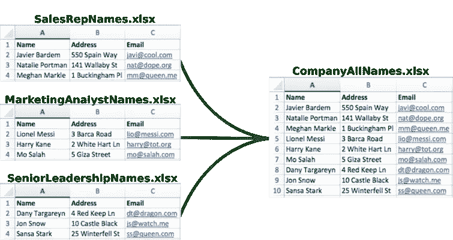
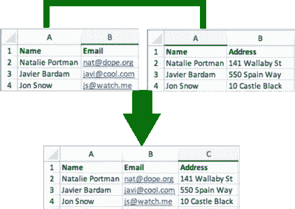

# 使用 Python 合并电子表格–追加

> 原文：<https://towardsdatascience.com/merging-spreadsheets-with-python-append-f6de2d02e3f3?source=collection_archive---------0----------------------->

将多个电子表格合并在一起是一项常见的任务。合并有两种方式:

1.  **追加** —电子表格层叠在一起



Three spreadsheets are appended into one based on column names

2.**联接** —基于所选列的相同值水平联接电子表格列



Two spreadsheets are joined into one based on the same Name values

***在本教程中，我们将侧重于追加。我将会写另一篇关于加入的教程。***

# 放弃

我建立了一个工具[mergespreadsheets.com](http://mergespreadsheets.com/)可以很容易地附加文件。如果您需要快速追加，请随意尝试

# 先决条件

*如果您不知道如何使用终端和 Python，或者如何使用 Python 和 Pandas 读写文件，那么请先阅读并浏览本教程:*[*https://medium . com/@ love spreadsheets/intro-to-handling-spreadsheets-with-Python-c 6 a 35 E0 D8 de 8*](https://medium.com/@lovespreadsheets/intro-to-handling-spreadsheets-with-python-c6a35e0d8de8)

# 文件

在本教程中，我们将使用三个文件。可以点击链接下载:[marketing analyst names . xlsx](https://lovespreadsheet-tutorials.s3.amazonaws.com/MarketingAnalystNames.xlsx)， [SalesRepNames.xlsx](https://lovespreadsheet-tutorials.s3.amazonaws.com/SalesRepNames.xlsx) ，[senior leadershipnames . xlsx](https://lovespreadsheet-tutorials.s3.amazonaws.com/SeniorLeadershipNames.xlsx)

# 完整代码

这是追加三个文件的完整代码

Full Code for this tutorial

# I .阅读所有三个电子表格

在与三个电子表格相同的文件夹中创建一个 python 文件，并将其命名为 *append.py*

首先我们要导入我们的 *pandas* 库，并给它一个缩写 *pd* 。 *pd* 缩写是约定俗成的，从技术上来说你可以使用 *import pandas* 照原样，将代码中的所有 *pd* 替换为 *pandas*

```
import pandas as pd
```

我们将在没有任何额外参数的情况下读取第一个表，因为我们只有文本数据，第一行是列名，所以我们可以使用 pandas *read_excel* 命令读取所有三个文件，而没有任何参数

```
marketing_analyst_names = pd.read_excel("MarketingAnalystNames.xlsx")sales_rep_names = pd.read_excel("SalesRepNames.xlsx")senior_leadership_names =   pd.read_excel("SeniorLeadershipNames.xlsx")
```

现在我们有了三个变量，它们包含了包含 excel 文件中所有行列格式的值的数据框

# 二。合并所有三个数据框

现在，我们将合并所有三个数据框

1.  我们将创建一个包含所有三个数据框的列表。列表中数据框的顺序将决定文件的追加方式

```
all_df_list = [marketing_analyst_names, sales_rep_names, senior_leadership_names]
```

2.追加所有三个数据帧的命令是一个单行函数。我们将使用我们的列表调用 *pd.concat* 函数，它将按照这个顺序追加我们的所有数据帧，并将追加的数据帧赋给变量 *appended_df*

```
appended_df = pd.concat(all_df_list)
```

追加是通过匹配相似的列名来完成的。如果列名不同，则追加不会将值堆叠在彼此之上。

*我鼓励你们用不同的列名创建虚拟电子表格，看看追加是如何被影响的*

# 三。写入 Excel 文件

既然我们已经有了追加的数据框，我们可以将其写入 Excel 文件。我们在附加的数据框上使用 *to_excel* 函数来实现这一点。我们还将添加参数 *index=False* ，它不会输出任何行号。*(摆弄参数，看看哪个对你有意义*)

```
appended_df.to_excel("AllCompanyNames.xlsx", index=False)
```

现在我们已经完成了代码，我们需要打开我们的**终端**并转到保存所有三个文件和我们的 *append.py* 文件的文件夹

*如果你跟终端走散了，请先过一遍本教程:*[*https://medium . com/@ love spreadsheets/intro-to-handling-spreadsheets-with-python-c 6 a 35 e 0d 8 de 8*](https://medium.com/@lovespreadsheets/intro-to-handling-spreadsheets-with-python-c6a35e0d8de8)

我们将从我们的终端运行这个脚本

```
$ python append.py
```

瞧啊。我们现在应该有一个名为 **AllCompanyNames.xlsx** 的文件，与我们的三个电子表格和包含所有三个附加文件的 Python 脚本在同一个文件夹中！