# 与人工智能融合:如何使用 Keras 和 OpenBCI 制作脑机接口与 Google 通信

> 原文：<https://towardsdatascience.com/merging-with-ai-how-to-make-a-brain-computer-interface-to-communicate-with-google-using-keras-and-f9414c540a92?source=collection_archive---------6----------------------->

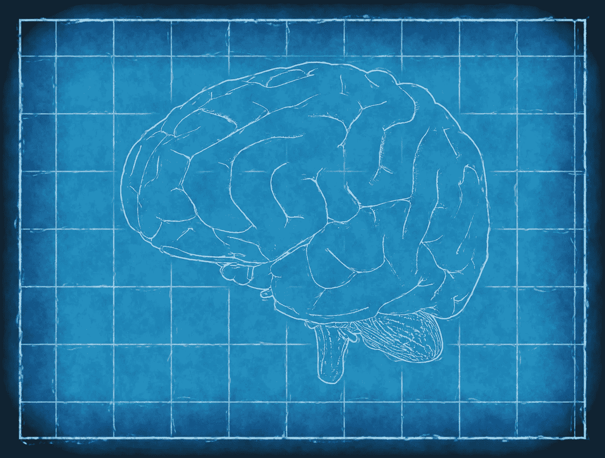

E lon Musk 和 Neuralink 希望建立一个可以充当大脑第三层的脑机接口，让人类与人工智能形成共生关系。

但是如果你已经可以做到了呢？

在(非常)有限的形式下，你确实可以。

# **背景**

脑机接口(Brain-Computer Interface，BCI)泛指在神经系统和电子设备之间建立直接连接的任何系统。这些装置可以通过手术植入大脑，也可以在体外。典型的范例包括允许用户控制[致动器](https://www.ncbi.nlm.nih.gov/pubmed/10404201)或[键盘](https://elifesciences.org/articles/18554)，允许设备向用户发送[传感数据](https://ieeexplore.ieee.org/document/7514940)，或[涉及传感数据和电机控制的双向通信](https://www.uchicagomedicine.org/forefront/neurosciences-articles/2016/october/researchers-help-paralyzed-man-regain-sense-of-touch-through-a-robotic-arm)(即接收电机控制输入并发送压力或温度传感数据的假肢)

历史上，神经假体一直是 BCI 研究的主要动机。这些技术包括为截肢者安装假肢、为聋人安装人工耳蜗，以及为癫痫患者提供深部脑刺激。这些设备已经改善了数百万人的生活，它们的广泛使用证明了大脑和电子设备之间实现直接双向通信的好处。然而，该技术的可能应用远远超出了医疗保健。即使在神经假体领域，我们也可以想象超越修复，考虑增强我们的能力，使之超过正常人的水平。总有一天，假肢会发展到以任何客观标准来衡量都比自然假肢优越的地步。这些肢体可能看起来和感觉起来就像正常的肢体，但会更加强壮和灵活。另一个例子是人造眼睛，其分辨率远高于人眼，能够放大或缩小，并能看到紫外线或红外线光谱。

当考虑认知和技能形成时，可能性变得更加有趣。最近的一项研究表明，刺激大脑的某些部分可以改善记忆的形成和回忆。其他的[实验](https://www.nature.com/articles/nn.3970)已经成功地将记忆人工植入动物体内。举个例子，也许可以应用这些研究的方法来提高你快速学习一种乐器的能力。或者，也许有可能将各种神经刺激器和传感器结合起来，开发一种“算术处理单元”，它可以检测大脑中与数学或逻辑推理相关的特定区域何时被激活，并与它们通信以增强能力。

埃隆·马斯克和 Neuralink 想要追求的正是这种认知增强的延伸。根据马斯克和许多领先的人工智能理论家的说法，人类相对于人工智能的智力进步的一个关键障碍是带宽问题:尽管计算机和人工智能变得越来越快，处理和生成知识的能力越来越强，但我们在做同样事情的能力方面面临着直接和根本的限制。我们主要通过我们的感官和解释语言的能力来获取信息。在你的眼睛和视觉皮层阅读和理解一个句子的时间里，计算机可以扫描成千上万页的文本。可以想象，在几十年的时间里，我们可能会有运行在专门的神经形态硬件上的高级人工智能，这些硬件具有世界如何工作的令人难以置信的精确模型，以及在几分钟内分析和理解数百万份文件的能力，做出远超人类理解的决策和推断。在一个越来越依赖人工智能驱动决策的世界，人类可能会发现自己在商业、科学和政治决策过程的所有部分都过时了。我们的大脑并没有进化到用数万亿颗棋子来下一盘棋，也没有进化到理解预先计划了数百万步棋的战略。正是对这个超级智能黑匣子的恐惧，激发了 [Neuralink](https://www.neuralink.com/) 、 [Kernel](https://kernel.co) 和其他几个相关组织目前的大部分工作。

BCI 技术的大多数前沿研究都试图最大限度地提高信息带宽，通常是通过将电极直接植入大脑或神经的侵入式方法。然而，非侵入性方法，特别是脑电图(EEG)和肌电图(EMG)被常规使用，并取得了相当大的成功。这些包括将电极放置在你的头部表面(EEG)或肌肉上方的皮肤上(EMG ),以测量下面累积的电活动。这些数据的粒度很低，与最终实现 BCI 研究更宏伟目标所需的精度和带宽水平相去甚远。尽管如此，EEG/EMG 支持的 BCI 已经取得了令人难以置信的成就，如用思想控制无人机、视频游戏和键盘，并且它们提供了进一步研究可能解开的可能性的一瞥。此外，像 [Cognixion](https://www.cognixion.com/) 和 [Neurable](http://www.neurable.com/) 这样的几家公司正在探索基于 EEG 的脑机接口的真实世界应用，并且已经获得了大量的资金和支持，许多令人兴奋的项目正在进行中。

# **概述**

在这个项目中，我们在你的神经系统和外部人工智能代理之间建立了一个直接的连接。这个代理可能是任何你能得到的 API:谷歌助手，Siri，Alexa，Watson 等。像 Dictionary 或 YouTube 这样的服务也符合条件，但这些服务会将应用程序局限于内容查询，而不是通用请求。

为了这个项目的目的，我们将直接查询谷歌搜索，因为它提供了最大的灵活性，也是最容易设置的。完成后，你应该能够简单地通过思考在谷歌上查询一些术语。

我们使用的技术利用了你的大脑在默念过程中产生的神经信号。这是当你慢慢地、有意识地阅读或思考时，发生在你大脑内部的“内心独白”。你可能已经注意到自己在默读的时候会这样做，有时你会在不知不觉中微妙地移动你的下巴和舌头。当你收到 SAT、MCAT、GRE 或其他标准化考试准备的提示时，你可能也遇到过这个概念。考生被建议避免默读，因为这是一个降低阅读速度的坏习惯。

我们能够利用默念，因为大脑向你的喉头发送与你想说的话相对应的信号，即使你并不打算大声说出来。通过将电极放置在你面部的喉部和下颌神经上，我们可以记录与特定单词对应的信号，并使用它们来训练深度学习模型，以辨别不同的单词。换句话说(没有双关语的意思)，我们可以从你思考某个单词的行为中辨别出你在思考这个单词。

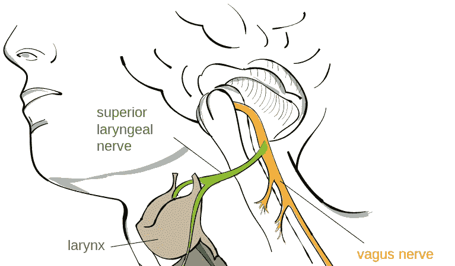

Brain and Laryngeal Nerves

这种技术有其局限性，它绝不是完美的，也不适合实际应用。然而，自从两年前由麻省理工学院媒体实验室首次在现实世界中演示以来，它已经被成功地用于允许用户做数学、打电话、订披萨，甚至在下棋时接受帮助的设备中。


MIT Media Lab AlterEgo Headset

# **设置&材料**

所需的主要硬件工具是 OpenBCI 神经节板。有各种各样的其他硬件可供选择，但是我发现 OpenBCI 有一个最大的开发人员社区来提供支持。它花了你大约 200 美元，但是考虑到你可以用它建造难以置信的东西，它是非常值得的。

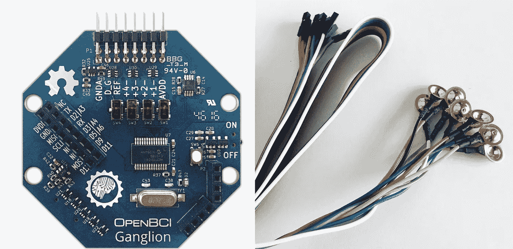

OpenBCI Board and Electrodes

除了电路板，你还需要电极和电线。一套金杯电极和电极凝胶应该花费 50 美元，应该工作正常。

[神经节板](https://shop.openbci.com/collections/frontpage/products/pre-order-ganglion-board)

[电极](https://shop.openbci.com/collections/frontpage/products/openbci-gold-cup-electrodes)

[电极凝胶](https://shop.openbci.com/collections/frontpage/products/ten20-conductive-paste-2oz-jars)

或者，你可以获得一个完整的 OpenBCI 入门套件，包括电路板和多种类型的干电极，以及一个电极头带，价格为 465 美元。有点贵，所以金杯设置完全没问题。不过，如果你打算尝试 BCI 的其他应用，比如虚拟现实(Unity VR 教程即将推出！)，头带和干电极带来更好的体验。

[生物传感入门套件](https://shop.openbci.com/collections/frontpage/products/bundle2?variant=13036379766856)

OpenBCI 还提供 8 和 16 通道板。这些将提供优越的数据质量，但 4 通道神经节将足以为这个项目。

# **配置**

在 Linux 机器上，检查是否有 Python 3.4 或更高版本。打开您的终端并键入以下命令:

```
python3 --version
```

如果您没有 Python，或者您有旧版本，请输入:

```
$ sudo apt-get update
$ sudo apt-get install python3.6
```

现在，下载或克隆 [pyOpenBCI](https://github.com/OpenBCI/pyOpenBCI) 目录。

将目录更改为存储库，并运行以下命令来安装必备软件包:

```
$ pip install numpy pyserial bitstring xmltodict requests bluepy
```

您现在可以安装 pyOpenBCI 了

```
$ pip install pyOpenBCI
```

要查看一些操作，请将目录更改为***pyOpenBCI/Examples**并找到 [print_raw_example.py](https://github.com/OpenBCI/pyOpenBCI/blob/master/Examples/print_raw_example.py) 。用您最喜欢的代码编辑器打开这个文件，并在第 7 行进行如下修改:***

```
*board = OpenBCICyton(daisy = False)*
```

***应改为:***

```
*board = OpenBCIGanglion(mac=’*’)*
```

***这使得 pyOpenBCI 能够为我们正在使用的特定电路板采用适当的模块。***

***现在，打开你的主板。***

***在您的计算机上，从*示例* 目录中键入以下命令:***

```
*$ sudo python print_raw_example*
```

***嘣！！你的终端现在应该充满了来自电路板的原始输入数据流。***

# *****记录信号*****

***既然我们可以获得原始信号，我们就可以开始设计和构建数据管道。首先，我们必须首先将原始数据转换成 LSL 流。LSL 指的是实验室流层，是由加州大学圣地亚哥分校[斯沃茨计算神经科学中心](http://sccn.ucsd.edu/people/)开发的一种协议，旨在促进实时数据流的记录和分析。LSL 将我们的脑电图数据传输到本地主机，从那里它可以被其他应用程序或脚本拾取。***

***修改***pyOpenBCI/Examples*中的 [lsl_example.py](https://github.com/OpenBCI/pyOpenBCI/blob/master/Examples/lsl_example.py) 文件，删除我们不需要的 AUX 流，增加一个标记流:*****

*****我们现在必须定义一个实验设置，以我们想要的形式记录数据，并将其存储以备将来使用。我们希望该实验生成一个时间序列 EEG 数据的数据集，这些数据被分成多个区间，每个区间对应于一个单词的无声化。为了实现这一点，我们可以执行一个实验，开始 N 个间隔的记录会话，每个间隔持续 T 秒。给定区间内的所有样本都用区间索引和指示用户默写的特定单词来标注。*****

*****来自[神经科技伯克利分校](https://github.com/neurotech-berkeley)的 [lsl-record.py](https://github.com/neurotech-berkeley/neurotech-course/blob/master/lab4/lsl-record.py) 文件是一个很好的起点。根据我们定义的设置修改文件:*****

*****您可以调整术语库(第 64 行),在不同的上下文中尝试不同的单词组合。您也可以在每次会话前调整默认持续时间(第 12 行)。*****

*****现在是有趣的部分了！将电极插入电路板:*****

*****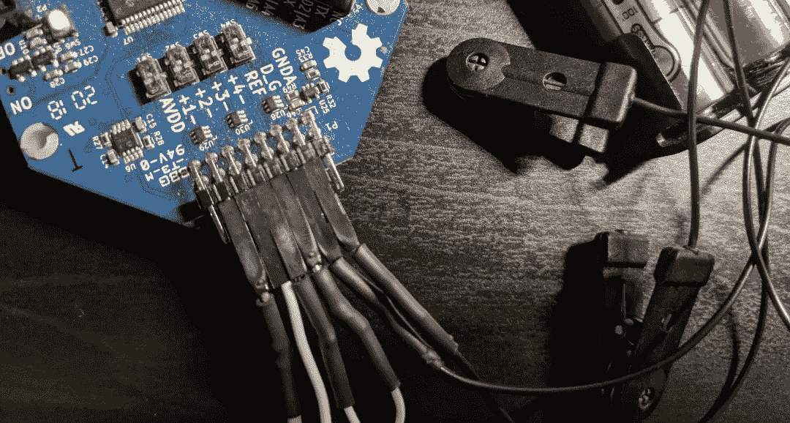*****

*****Left 4 channels are EEG in, right 2 channels are ground*****

*****按照以下配置将它们贴在脸上:*****

*****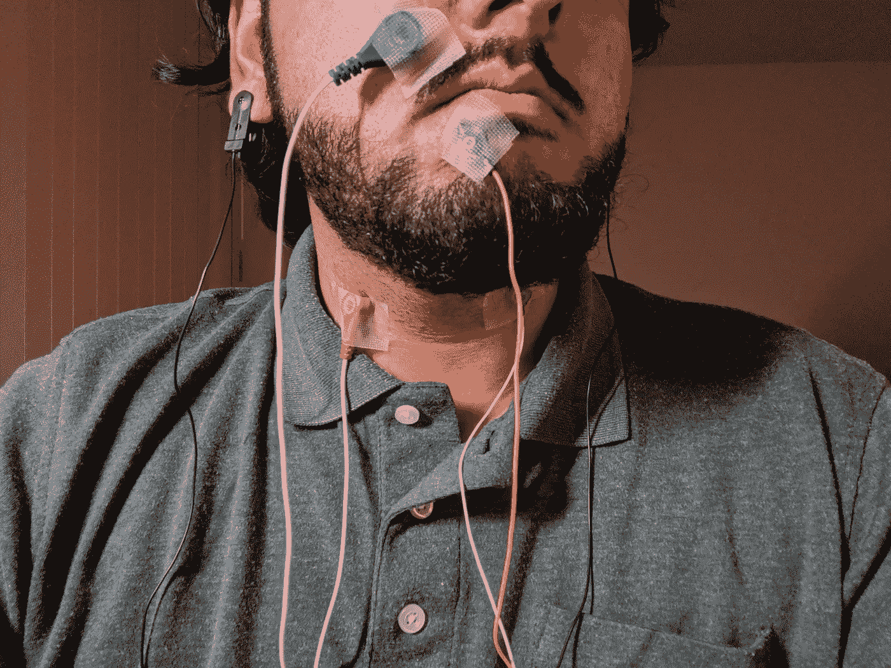*****

*****找一个安静的地方坐下，在不同的终端中输入以下行:*****

```
***// Terminal 1: converts raw data to LSL and streams it
$ sudo python lsl_example// Terminal 2: reads LSL data stream and executes experiment
$ sudo python lsl_record***
```

******注意:我们作为 sudo 运行，以允许脚本检测板的 MAC 地址******

*****这将启动指定持续时间的记录会话。你将被提示从你的词库中随机抽取一个单词，间隔 2 秒钟默读。录制过程可能会让人不舒服，容易入睡，所以最好在中间休息一下，进行多次小范围的录制。此外，如果频繁出现干扰(即突然移动或使不正确的单词不发音)，我们的实验设置可能会导致数据质量差。*****

*****您可以设计和实现一个更灵活的设置，可以选择在注意到干扰时击一个键来删除当前和以前的间隔。另一个解决方法是进行多个小的会话，并在最后合并数据，丢弃干扰过大的会话。一些噪声是不可避免的，你不必太挑剔，因为随着样本数量的增加，模型变得更有弹性。*****

*****为了获得最佳结果，你的词库中的每个词至少要有 1000 个高质量的样本。*****

# *******过程信号*******

*****一旦你有了足够的数据，就该为机器学习做准备了。*****

*****对数据进行适当的组合和预处理，使其具有以下格式:*****

*****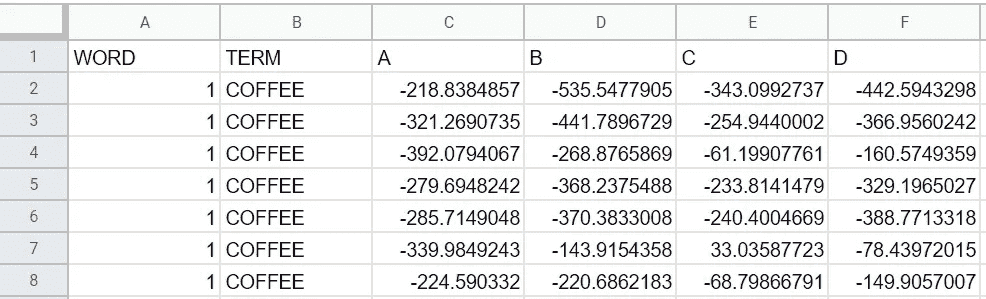*****

*****Example Data Table*****

*   *****单词是从 1 到 **NumIntervals，**的索引，T5 是总会话数中 **SessionDuration/2** 的总和*****
*   *****术语对应于每个时间间隔显示的单词*****
*   *****[A，B，C，D]是脑电图通道*****
*   *****每个单词、术语组合对应于大约 800 行数据*****

*****使用 numpy 将您的 CSV 文件导入 python。您应该将所有数据加载到脚本中的 NumLines x 6n array 中。*****

*****第一步是过滤数据，去除我们感兴趣的频率之外的噪声。信息 EEG 频率对应于以下频段:*****

*****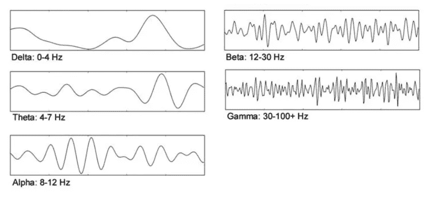*****

*****EEG Wave Frequencies*****

*****对 4 Hz 至 100 Hz 之间的频率进行滤波似乎是合理的，但会失败，因为 60 Hz 是电网的频率(可能因国家而异)，这必然是一个重要的噪声源。为了获得最佳结果，我们应该在 4 Hz 和 50 Hz 之间进行滤波。*****

*****我们可以使用 Scipy 的巴特沃兹滤波器来选择我们想要保持的频率范围。用下面的[代码](https://stackoverflow.com/questions/12093594/how-to-implement-band-pass-butterworth-filter-with-scipy-signal-butter)定义一个过滤器:*****

*****然后，生成一个时间戳列(因为我们合并了多个数据集，并使原始时间戳无效)，并将过滤器应用于每个通道:*****

*****过滤后，使用下面的代码将数据重组为一个三维的 ndarrray 数组，其维度为**IntervalLength x channel count x interval count**。*****

*****我们用上面的代码有效地将时间序列数据转换成图像数据。这听起来可能有点不可思议，但是你可以把每两秒钟的间隔想象成一幅图像，每一个像素对应于在一个特定的(**通道号**、**线路号**)坐标上获取的信号值。换句话说，我们有一堆**间隔计数**图像，每个图像的大小都是**间隔长度** x **通道计数**。*****

*****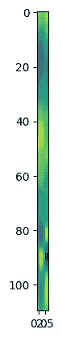*****

*****First 120 data points of an EEG interval*****

*****这项技术由 [Justin Alvey](https://medium.com/@justlv/using-ai-to-read-your-thoughts-with-keras-and-an-eeg-sensor-167ace32e84a) 在一个类似的项目中演示，非常强大，因为它允许我们将时间序列数据视为图像数据，允许我们利用计算机视觉和卷积神经网络(CNN)的力量。您甚至可以通过将特定的默写绘制成图像来将其可视化*****

*****此外，使用 CNN 允许我们跳过傅立叶变换，因为神经网络可以学习各种频率(在每个图像上以模式出现)，而无需明确指定它应该寻找什么频率。*****

*****现在我们准备开始建设 CNN。由于我们只有 1 个颜色维度，我们可以使用输入维度为 **IntervalLength** 和 **ChannelCount** 的 1D CNN。您可以尝试不同的超参数和架构。我选定了一个卷积层、两个完全连接层和两个合并层。*****

*****有关一维 CNN 以及它们如何应用于时间序列数据的更详细分析，请参考 Nils Ackermann 的这篇文章[。](https://blog.goodaudience.com/introduction-to-1d-convolutional-neural-networks-in-keras-for-time-sequences-3a7ff801a2cf)*****

*****我们现在有了一个模型，它应该能够将一段时间的脑电图数据与你的词库中的一个特定单词进行匹配。*****

*****让我们看看它做得有多好。将模型应用于测试数据，并将预测结果与实际结果进行比较。*****

```
***# Test Model
y_predicted = model.predict(X_test)***
```

*****用银行这两个词，我可以达到 90%的准确率。不出所料，随着单词的增加，准确率略有下降，三向准确率为 86%，四向准确率为 81%。*****

*****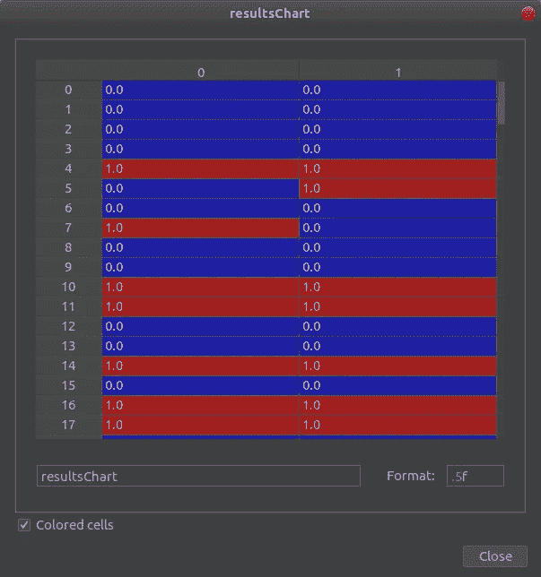*****

*****Sample truth chart from two word classification. Left is Actual, Right is Predicted*****

*****一种在不影响准确性的情况下增加术语库大小的可能方法是创建具有多词查询的分层“术语树”。然后，您可以在树上执行深度优先搜索——每一层的单词只与同一子树的同一层中的其他单词进行比较——以找到最佳匹配。*****

# *******谷歌搜索*******

*****我们现在已经有了使用 BCI 查询谷歌的所有必要信息。定义特定子可视化和查询之间的映射，并进行适当的调用:*****

*****还有…*****

*****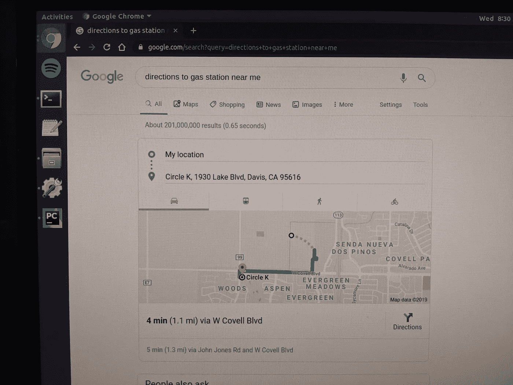*****

*****要想进行实时查询，请修改 lsl_record.py 脚本并将其作为一个模块导入。然后，您可以调用它来读取 LSL 流，以 2 秒的时间间隔响应用户输入。*****

*****就是这样！你现在不用说或输入一个字就可以搜索谷歌。*****

# *******结论*******

*****你不能用一个三四个单词的术语库做太多事情(除非实现前面提到的术语树)。经历所有这些步骤来搜索到你最近的加油站的方向比正常的谷歌搜索稍微复杂一些。然而，重要的是要考虑这项技术的进一步发展可能会导致什么。我们可以想象这种设备的改进版和不太显眼的版本，与麻省理工学院团队已经拥有的版本没有太大区别，用于导航、网络查询、短信、智能家居管理或任何数量的日常任务。当与不断改进的人工智能助手的能力相结合时，这种可能性会进一步扩大。*****

*****基于脑电图的脑机接口的应用是世界各地公司和大学实验室的尖端研究最终可能实现的一小部分。心灵感应交流、超人智能、附加感官、模拟体验、人类意识数字化、与人工智能融合等都值得考虑。如果这些可能性得以实现，它们将不仅仅重新定义我们与技术的关系:它们还将重新定义对人类意味着什么。*****

*******参考文献*******

*****以下是我发现有助于完成这个项目和了解 BCIs 的资源和组织列表。我要特别感谢麻省理工学院媒体实验室的 AlterEgo 团队，他们是这个项目的最初灵感来源，也感谢 Alvey 先生和 NeuroTech Berkeley，感谢他们之前对 BCI 社区的代码和教程贡献。此外，我要感谢加州大学戴维斯分校的教职员工，特别是[伊利亚斯·塔格科普洛斯](https://faculty.engineering.ucdavis.edu/tagkopoulos/biography/)、[卡伦·莫克森](https://bme.ucdavis.edu/people/karen-moxon)和[埃尔金·谢克尔](https://ece.ucdavis.edu/directory/erkin-seker)博士，感谢他们一直以来的帮助和支持。*****

*****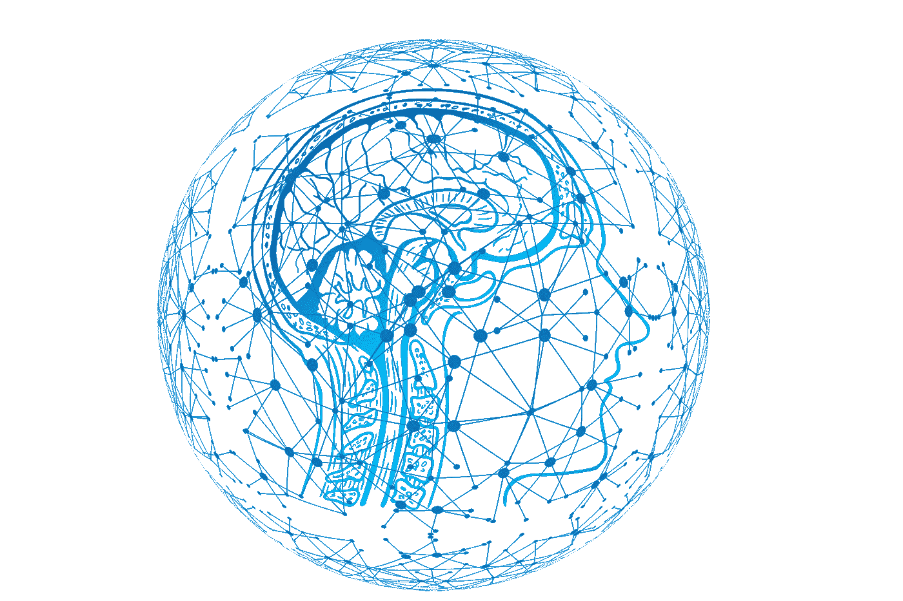*****

*   *****[AlterEgo:一款个性化的可穿戴式无声语音界面](https://www.media.mit.edu/publications/alterego-IUI/)*****
*   *****[利用深度学习“读取你的想法”——借助 Keras 和 EEG——贾斯汀·阿尔维](https://medium.com/@justlv/using-ai-to-read-your-thoughts-with-keras-and-an-eeg-sensor-167ace32e84a)*****
*   *****[神经科技伯克利 Github](https://github.com/neurotech-berkeley/neurotech-course)*****
*   *****[打开 BCI Gitub](https://github.com/OpenBCI)*****
*   *****脑机接口:介绍*****

*****最后，我想对不断成长的 BCI/神经技术社区大声疾呼，他们为未来提供了无尽的支持、资源和热情。*****

*   *****[NeuroTechX](https://neurotechx.com/)*****
*   *****BCI 红迪网*****
*   *****Reddit Neuralink*****
*   *****[OpenBCI](https://openbci.com/community/)*****

******如果您想进一步讨论或联系，请随时联系*[*LinkedIn*](https://www.linkedin.com/in/jagveersingh/)*****