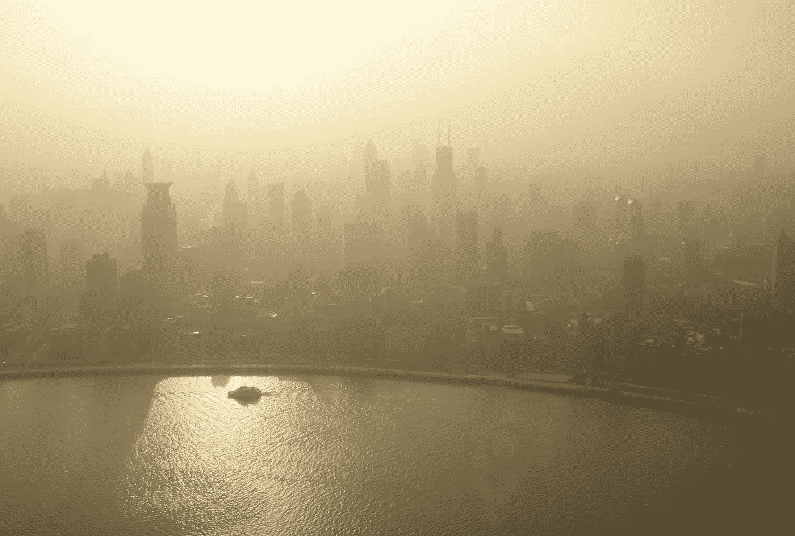

# 更迷人的颗粒物天气

> 原文：<https://towardsdatascience.com/mesmerizing-particulate-matter-weather-70ce6703da7f?source=collection_archive---------24----------------------->

两周前，我解释了看不见的颗粒物质——PM10 和 pm 2.5——是如何穿越欧洲的。([https://towards data science . com/invisible-clouds-of-particular-matter-move-cross-Europe-6b 39 e2d 57511](/invisible-clouds-of-particulate-matter-move-across-europe-6b39e2d57511))

在将近两周的时间里捕捉更多的数据，并稍微加快视频速度，你会对下午的天气有更好的了解。

大规模的运动显然比 PM 浓度的局部波动更重要。

仍然存在的问题是:项目经理从哪里来？是烧柴的炉子、交通、工业的结合，被天气收集并席卷了整个欧洲？

Photo by [Alex Gindin](https://unsplash.com/photos/ifpBOcQlhoY?utm_source=unsplash&utm_medium=referral&utm_content=creditCopyText) on [Unsplash](https://unsplash.com/search/photos/smog?utm_source=unsplash&utm_medium=referral&utm_content=creditCopyText)