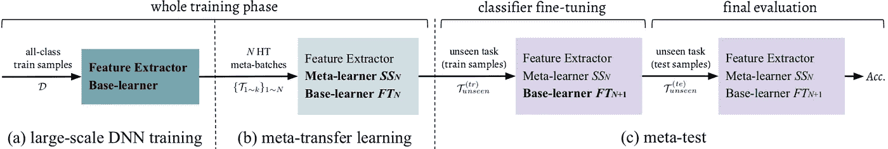
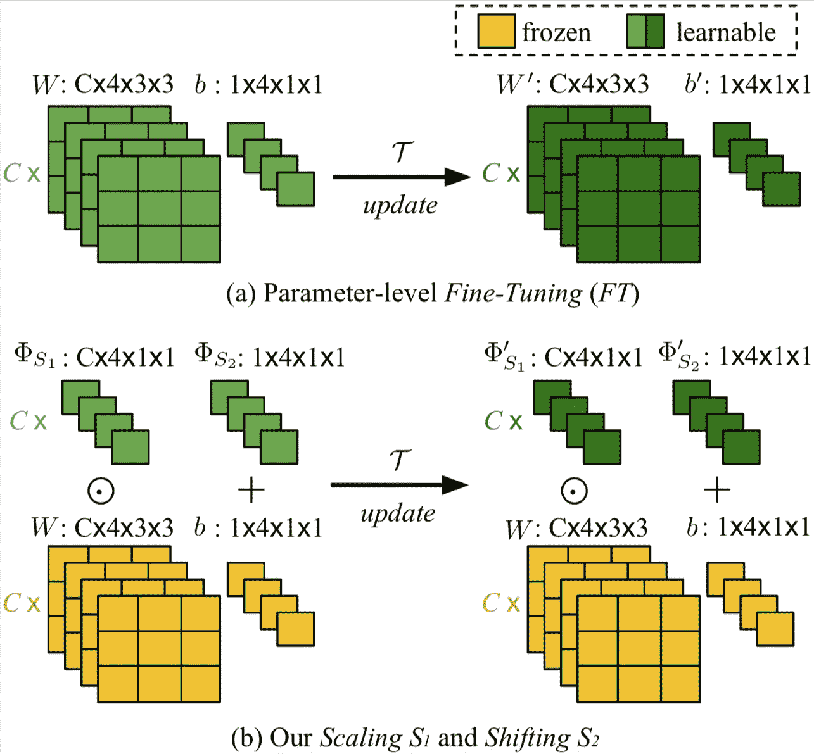
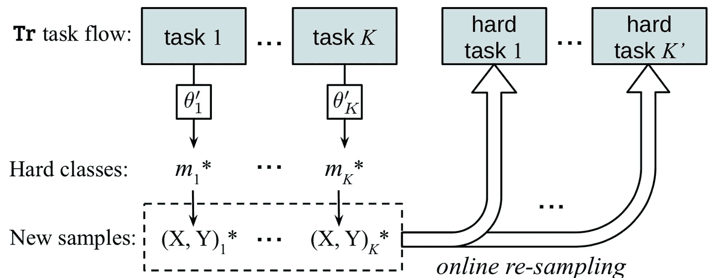
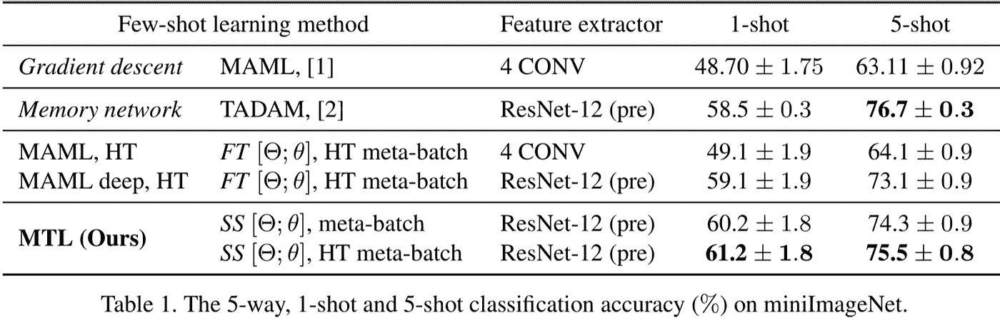

# 少镜头学习的元迁移学习

> 原文：<https://towardsdatascience.com/meta-transfer-learning-for-few-shot-learning-7c3c85e81687?source=collection_archive---------22----------------------->

# 摘要

元学习被提出作为一个框架来解决具有挑战性的少数镜头学习设置。关键的想法是利用大量类似的少量任务，以便学习如何使基础学习者适应只有少量标记样本可用的新任务。由于深度神经网络(DNNs)倾向于仅使用少数样本进行过度拟合，元学习通常使用浅层神经网络(SNNs)，从而限制了其有效性。在本文中，我们提出了一种新的少镜头学习方法，称为***【MTL】***，它学习将一个 ***深度 NN*** 用于 ***少镜头学习任务*** 。具体来说，元指的是训练多个任务，迁移是通过学习每个任务的 DNN 权重的缩放和移位函数来实现的。此外，我们引入了 ***硬任务(HT)元批量*** 方案作为 MTL 的有效学习课程。我们使用(5 类，1 次)和(5 类，5 次)识别任务在两个具有挑战性的少数镜头学习基准上进行实验:miniImageNet 和 Fewshot-CIFAR100。与相关工作的广泛比较验证了用提出的 ***HT 元批量*** 方案训练的我们的 ***元迁移学习*** 方法达到最佳性能。消融研究还表明，这两种成分都有助于快速收敛和高精度。

## 贡献

*   一种新的 MTL 方法，学习转移大规模预训练的 DNN 权重，以解决少数镜头学习任务。
*   一种新颖的 HT 元批量学习策略，强制元迁移“在艰难中更快更强地成长”。
*   在 *mini* ImageNet 和 Fewshot-CIFAR100 上进行了大量的实验，取得了最先进的性能。

# 管道

我们提出的少镜头学习方法的流水线包括三个阶段:(a)在大规模数据上的 DNN 训练，*即*使用所有训练数据点；(b)基于预训练的特征提取器，元转移学习(MTL)学习缩放和移位(SS)的参数。学习由提议的 HT 元批处理来调度；元测试是对一个看不见的任务进行的，它包括一个基础学习者微调阶段和一个最终评估阶段。输入数据沿箭头排列。名称以粗体显示的模块在相应的阶段得到更新。具体来说，SS 参数是通过元训练学习的，但在元测试期间是固定的。基础学习者参数针对每个任务进行了优化。

# 元迁移学习

(a)参数级微调(FT)是一种常规的元训练操作，例如在 MAML[【1】](https://meta-transfer-learning.yyliu.net/#references)。它的更新适用于所有神经元参数，𝑊和𝑏.(b)我们在元迁移学习中的神经元级缩放和移位(SS)操作。它们减少了学习参数的数量，避免了过拟合问题。此外，他们保持大规模训练参数(黄色)冻结，防止“灾难性遗忘”。

# 硬任务元批处理

在我们的元训练管道中，我们有意识地在每个任务中挑选失败案例，并将它们的数据重新组合成更难的任务，以便进行不利的重新训练。我们的目标是迫使我们的元学习者“在艰难中成长”。

该图显示了有和没有硬任务元批处理在准确性和收敛速度方面的性能差距。(a)(b)在 *mini* ImageNet 上 1 拍和 5 拍；(d)(e)few shot-cifar 100 上的 1 发、5 发和 10 发。

# 实验

## 迷你图像网

## Fewshot-CIFAR100

## 参考

[1] Chelsea 等人，“用于深度网络快速适应的模型不可知元学习”在*ICML 2017*；
[2] Oreshkin 等人，“TADAM:改进的少镜头学习的任务相关自适应度量”在 *NeurIPS 2018* 。

# 链接

项目页面:[https://mtl.yyliu.net/](https://meta-transfer-learning.yyliu.net/)

论文:[http://open access . the CVF . com/content _ CVPR _ 2019/papers/Sun _ Meta-Transfer _ Learning _ for _ little-Shot _ Learning _ CVPR _ 2019 _ paper . pdf](http://openaccess.thecvf.com/content_CVPR_2019/papers/Sun_Meta-Transfer_Learning_for_Few-Shot_Learning_CVPR_2019_paper.pdf)

代码:[https://github.com/y2l/meta-transfer-learning](https://github.com/y2l/meta-transfer-learning)

幻灯片:[https://yyliu.net/files/meta-transfer-learning-slides.pdf](https://yyliu.net/files/meta-transfer-learning-slides.pdf)