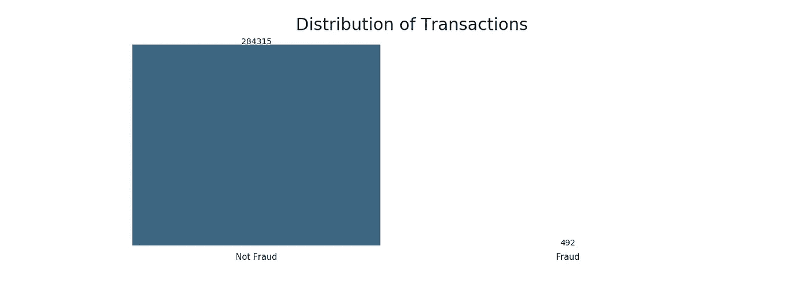

# 处理不平衡数据

> 原文：<https://towardsdatascience.com/methods-for-dealing-with-imbalanced-data-5b761be45a18?source=collection_archive---------0----------------------->

## Python 中有效处理不平衡数据集的指南

Photo by [Ales Nesetril](https://unsplash.com/photos/ex_p4AaBxbs?utm_source=unsplash&utm_medium=referral&utm_content=creditCopyText) on [Unsplash](https://unsplash.com/search/photos/credit-card?utm_source=unsplash&utm_medium=referral&utm_content=creditCopyText)

不平衡类是机器学习分类中的一个常见问题，其中每个类中的观察值比例不成比例。在包括医疗诊断、垃圾邮件过滤和欺诈检测在内的许多不同领域中都可以发现类别不平衡。

在本指南中，我们将看看处理不平衡的班级问题的五种可能的方法。

重要说明:本指南将只关注解决不平衡类，而不会解决其他重要的机器学习步骤，包括但不限于特征选择或超参数调整。

# 数据

我们将使用 Kaggle 上提供的[信用卡欺诈检测数据集](https://www.kaggle.com/mlg-ulb/creditcardfraud/home)。数据集高度不平衡，只有 0.17%的交易被归类为欺诈。完整的笔记本可以在[这里找到。](https://www.kaggle.com/tboyle10/methods-for-dealing-with-imbalanced-data)

我们的目标是正确分类欺诈交易的少数类别。

# 不平衡班级的问题

大多数机器学习算法在每个类别的样本数量大致相等时效果最佳。这是因为大多数算法都是为了最大限度地提高精度和减少误差而设计的。

# 准确性的问题

在这里，我们可以使用 DummyClassifier 来总是预测“不欺诈”,这只是为了说明准确性会有多么令人误解。

我们得到了 99.8%的准确率——甚至没有训练一个模型！让我们将其与逻辑回归进行比较，逻辑回归是一种经过实际训练的分类器。

也许并不奇怪，与上面的虚拟分类器相比，我们的准确度分数下降了。这告诉我们，要么我们在逻辑回归模型中做错了什么，要么准确性可能不是我们衡量绩效的最佳选择。

让我们来看看一些流行的处理阶级不平衡的方法。

# 1.更改绩效指标

正如我们在上面看到的，当评估不平衡的数据集时，准确性不是最好的衡量标准，因为它可能会产生误导。可以提供更好洞察力的指标包括:

*   **混淆矩阵:**显示正确预测和错误预测类型的表格。
*   **精度:**真阳性数除以所有阳性预测数。精度也叫阳性预测值。它是对分类器准确性的一种度量。低精度表示大量的误报。
*   **召回:**测试数据中真阳性数除以阳性值数。回忆也称为敏感度或真实阳性率。它是对分类器完整性的一种度量。低召回率表示大量的假阴性。
*   **F1:得分:**准确率和召回率的加权平均值。

让我们看看当我们将这些 F1 和回忆分数应用到上面的逻辑回归时会发生什么。

这些分数看起来并不令人印象深刻。让我们看看我们可以尝试哪些其他方法来改进我们的新指标。

# 2.改变算法

虽然在每个机器学习问题中，尝试各种算法是一个很好的经验法则，但它对不平衡的数据集尤其有益。决策树通常在不平衡数据上表现良好。他们通过学习 if/else 问题的层次结构来工作，这可以迫使这两类问题都得到解决。

虽然我们的准确度分数略低，但 F1 和召回率都比逻辑回归有所增加！看来对于这个特定的问题，随机森林可能是一个更好的选择模型。

# 3.重采样技术-过采样少数类

我们的下一个方法开始我们的重采样技术。

过采样可以定义为添加少数类的更多副本。当您没有大量数据要处理时，过采样可能是一个不错的选择。

我们将使用 Scikit-Learn 中的重采样模块从少数类中随机复制样本。

## *重要提示*

在尝试过采样技术之前，一定要分成测试集和训练集！在分割数据之前进行过采样可以允许在测试集和训练集中出现完全相同的观察结果。这可能会使我们的模型简单地记住特定的数据点，并导致对测试数据的过度拟合和不良概括。

重采样后，我们每个类的数据点比例相等！让我们用平衡的训练数据再次尝试我们的逻辑回归。

我们的回忆分数增加了，但 F1 比我们的基线逻辑回归或上面的随机森林低得多。让我们看看欠采样是否会有更好的表现。

# 4.重采样技术-欠采样多数类

欠采样可以定义为去除多数类的一些观察值。当你有大量数据时，欠采样可能是一个不错的选择——想想数百万行。但缺点是我们删除了可能有价值的信息。这可能导致对测试集的欠拟合和不良概括。

我们将再次使用 Scikit-Learn 中的重采样模块从多数类中随机移除样本。

同样，我们有相同比例的欺诈和非欺诈数据点，但在这种情况下，用于训练模型的数据量要小得多。让我们再次应用我们的逻辑回归。

在这种情况下，欠采样的表现不如过采样。让我们尝试另一种处理不平衡数据的方法。

# 5.生成合成样本

一种类似于上采样的技术是创建合成样本。这里我们将使用 [imblearn 的](https://imbalanced-learn.readthedocs.io/en/stable/index.html) SMOTE 或合成少数过采样技术。SMOTE 使用最近邻算法来生成新的合成数据，我们可以使用这些数据来训练我们的模型。

同样，只在训练集中生成新样本很重要，以确保我们的模型能够很好地推广到看不见的数据。

在生成我们的合成数据点之后，让我们看看我们的逻辑回归是如何执行的。

我们的 F1 分数提高了，召回率与上面的上采样模型相似，对于我们的数据，这里优于欠采样。

# 结论

我们探讨了处理不平衡数据集的 5 种不同方法:

1.  更改绩效指标
2.  改变算法
3.  过采样少数类
4.  欠采样多数类
5.  生成合成样本

对于这个特定的数据集，随机森林和 SMOTE 似乎是我们在这里尝试的最佳选项之一。

这些只是处理不平衡数据集时可以尝试的许多方法中的一部分，并不是一个详尽的列表。其他一些可以考虑的方法是收集更多的数据或选择不同的重采样比率——您不需要 1:1 的比率！

您应该总是尝试几种方法，然后决定哪种方法最适合您的问题。