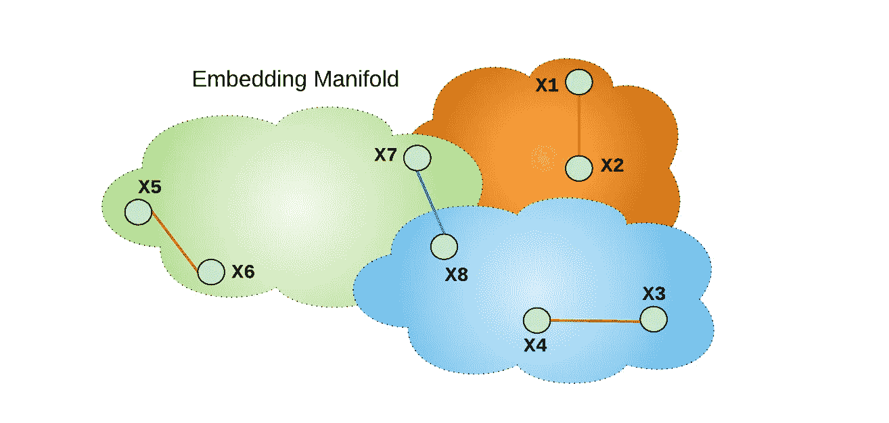
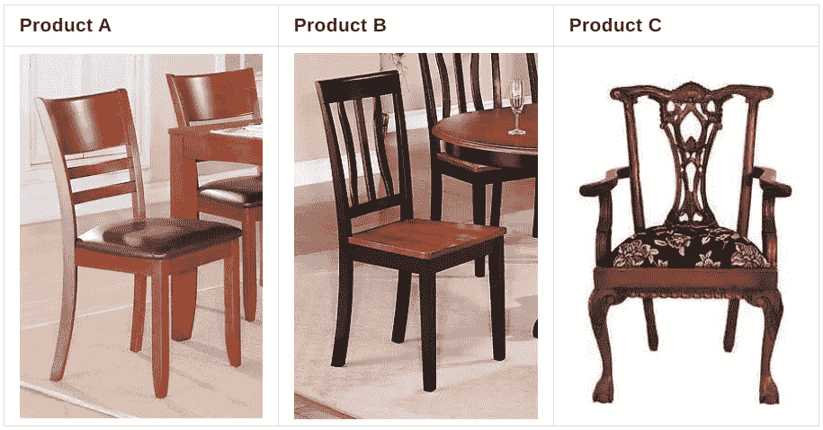
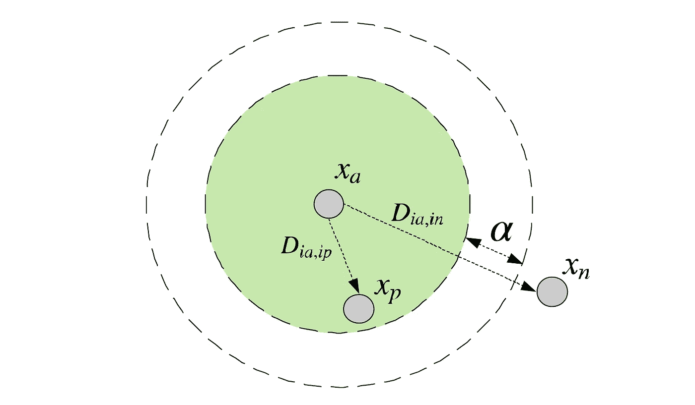
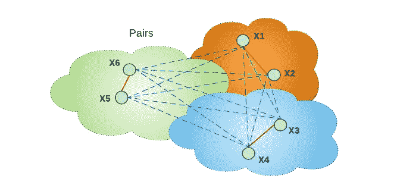
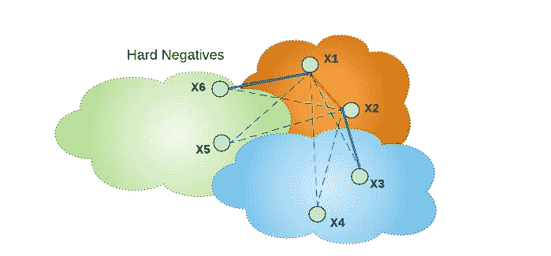
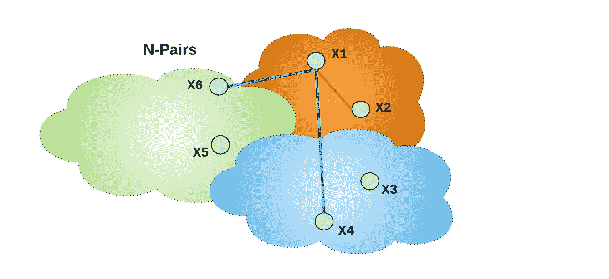
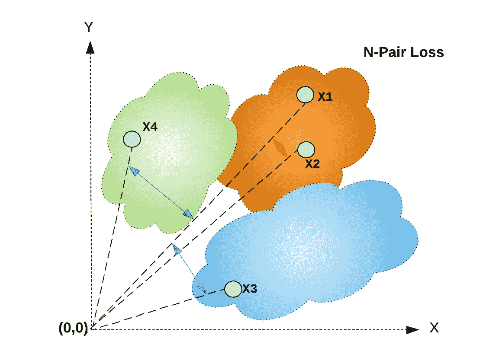
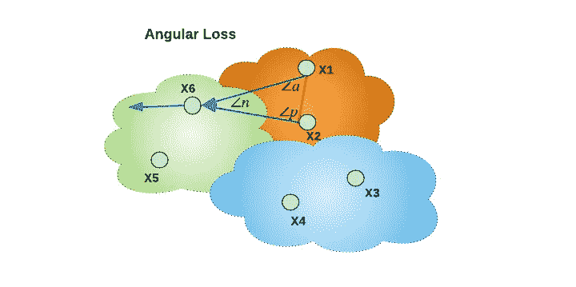
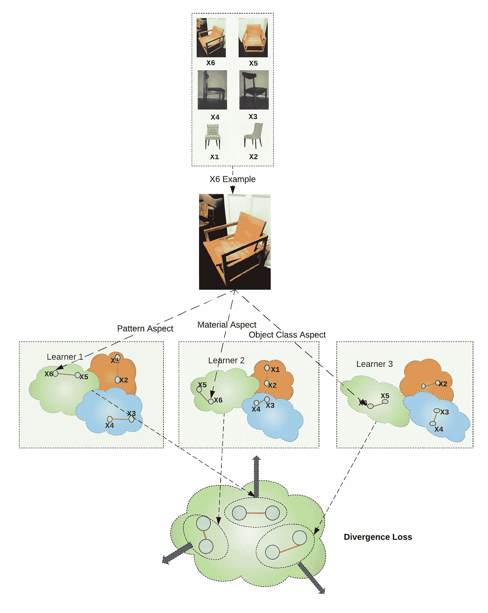

# 利用损失函数深入挖掘度量学习

> 原文：<https://towardsdatascience.com/metric-learning-loss-functions-5b67b3da99a5?source=collection_archive---------9----------------------->

> 撰稿人:[杰克·巴格利昂](https://medium.com/u/6522886054e2?source=post_page-----5b67b3da99a5--------------------------------)，[塞图·哈里什·科勒鲁](https://medium.com/u/f32704fb33e9?source=post_page-----5b67b3da99a5--------------------------------)

深度学习中的最新进展使得使用深度度量学习网络来学习一组图像的相似性度量成为可能，该网络将视觉上相似的图像映射到嵌入流形中的附近位置，并将视觉上不相似的图像彼此分开。使用这种方法学习的深度特征导致具有紧凑的产品内差异和良好分离的产品间差异的良好区分的特征，这是具有更好的视觉搜索引擎的关键。此外，学习这种区别性特征使得网络能够很好地对看不见的产品图像进行归纳，最终在嵌入空间中形成新的聚类。

(a) Separable Features (b) Discriminative Features

我们训练这些网络类似于其他深度学习网络，但具有不同的损失函数，在训练期间，这些网络在嵌入空间中明确地将相似的图像推到一起，并将不同的图像彼此拉开。在任何情况下， *t* 在训练期间，我们将训练数据集中的图像输入到网络，并将它们映射到嵌入空间。我们使用损失函数计算这些映射的惩罚，并使用适当的优化技术调整网络权重。在执行推理时，我们从嵌入层提取特征，并执行最近邻搜索来识别相似图像。

 [## 使用深度度量学习来学习区分

### 一种使用卷积神经网络训练用于物体识别的可扩展深度学习模型的方法。

towardsdatascience.com](/deep-metric-learning-76fa0a5a415f) 

在这篇文章中，我们将概述一些广泛使用的损失函数，用于学习度量学习嵌入。

Training and inference routine for Metric Learning Models. Note that, although there are various effective training routines available to achieve the same objective, here we are only concerned about the most basic and well-generalized training framework, shown in the picture.

## 对比损失

为了最小化两个相似图像的特征之间的距离并迫使不相似的图像特征彼此分开，对比损失函数在损失函数中独立地编码相似性和不相似性这两个度量。它直接处理两个相似图像的图像特征之间的距离，并且如果两个不同的图像特征没有被距离余量 *α* 分开，则它们之间的距离被包括在损失中。在这个意义上，损失函数定义如下。

这里， *m* 是在小批量中可用的锚阳性示例产品对的数量。Dᵢⱼ = ||f(xᵢ) — f(xⱼ)||是深层特征之间的距离 f(xᵢ)和 f(xⱼ)分别对应于图像 xᵢ和 xⱼ。yᵢⱼ= +/-1 是一对(xᵢ,xⱼ)是否共享相似标签的指示符。[.]⁺是铰链损失函数 max(0，.).每对特征向量独立生成一个损失项，如下图所示。

Edges colored red represent example pairs sharing similar labels and contributes to a loss term via Dᵢⱼ. This term addresses intra-class variance. On the other hand, blue represents example pairs with different product labels and uses α — Dᵢⱼ to generate a loss number. This term addresses inter-class separation among the feature clusters.

为了计算大小为 *N* 的数据集在每一步的损失，我们必须执行 O(N)成对距离计算。如果我们采用与随机梯度下降相似的方法，使用大小为 *B* 的小批量，则计算量为 O(B)量级。然而，如果我们从原始数据集中随机选择小批量，我们很可能会在小批量中没有任何正配对，因此我们不会在此设置中优化类内方差。因此，需要明确地为每个小批量选择相当数量的阳性对，优选接近小批量大小的约 50%,以获得紧凑的类内方差和大的类间分离。举个例子，比如说，我们设置小批量为 *B=32* ，那么，

> -我们将随机选择 *16* 产品。
> -接下来，我们将从每个 *16* 产品中挑选 *2* 张随机图片。
> -现在，在尺寸为 *32* 的小批量中，我们有 *16* 正对和 *15* * *16* 负对。

这个额外的手工挑选小批量的步骤将确保损失项也捕获类内方差，而没有任何额外的计算成本。

尽管对比损失函数很容易理解，但是当我们设置恒定的裕量 *α* 时，它并没有说明所有负面例子的视觉差异的程度。这将嵌入空间限制为仅具有所有可能失真的子集，同时将视觉上不同的产品训练和排列为视觉上相似的相似距离。例如，有三个图像，产品 A、产品 B 和产品 C 如下所示。直观上，产品 A 和产品 B 在视觉上比产品 A 和产品 C 更相似。然而，当我们设置＄\ alpha＄的恒定边距时，我们将产品 B 和产品 C 的特征向量从产品 A 的特征推开＄\ alpha＄的边距，假设它们具有相似的视觉相异度。

Product A and B are visually similar, with different product labels. Product C is visually different from the other two products. Despite having a different scale of visual similarity, margin α is constant for all three products.

## 三重损失

三重损失可能是度量学习中最流行的损失函数。三重损失接受三重深度特征(xᵢₐ、xᵢₚ、xᵢₙ)，其中(xᵢₐ、xᵢₚ)具有相似的产品标签，而(xᵢₐ、xᵢₙ)具有不同的产品标签，并且调整网络，使得锚(xᵢₐ)和正(x)、d 之间的距离小于锚(x)和负(x)、d 之间的距离

这里，Dᵢₐ,ᵢₚ = ||f(xᵢₐ) — f(xᵢₚ)||₂，Dᵢₐ,ᵢₙ = ||f(xᵢₐ) — f(xᵢₙ)||₂.每个损失项独立考虑与预定义锚例相关的三元组来计算损失，如下图所示。

In a triplet (X1, X2, X3) red-colored line connects an anchor example X1 and positive example X2\. Solid blue line connects anchor X1 and negative example X3, that shares different product labels. Unlike contrastive loss, each loss term addresses intra-class variance and inter-class separability together.

由于损失裕度不是直接基于两个嵌入之间的距离，而是基于三元组中的对之间相对于锚的相对距离，因此与对比损失相比，它考虑了任意嵌入空间失真。

虽然三重损失可以解决对比损失函数的这个问题，但是它在计算上是昂贵的。在用 *B* 三元组的小批量训练期间，我们将需要计算小批量中所有可能的三元组之间的距离，这导致超过 *O(N )* 个可能的(不一定有效的)三元组，当训练大型数据集时，这在计算上是不可行的。例如，在一个简单的场景中，一个数据集有 20 个不同的产品类，每个包含 *15 个*图像，可以有 *2 个*来自 *15 个*图像的 *20 个*组合= *2100 个*有效三元组( *2100 个*可能的锚正示例对，每个从数据集中选择一个负产品示例)。为了得到所有可能对的总损失，需要 *2100 / m* 次小批量(大小为 *m* )迭代。此外，随着训练收敛，大多数三元组满足正对和负对距离之间的余量约束。它导致大多数三元组的少量贡献。这导致学习缓慢，从而收敛缓慢。

为了解决这种较慢的训练收敛，在大多数训练例程中，基于负面挖掘的方法是常见的。

## 提升结构损失

当训练具有三重损失目标的 CNN 时，它在产生损失时未能利用完整的小批量信息，这主要是因为正和负产品示例仅针对给定的锚示例被预定义。提升结构损失的想法是使用批次中可用的所有 *O(B )* 对，而不是 O *(B)* 个单独的对，来改进小批次优化。下图显示了如何通过成对距离的距离矩阵扩展此功能以充分利用小批量。

An anchor and positive example pair, (X1, X2) and their interaction with remaining pairs in a mini-batch.

请注意，一对节点中的两个节点都独立地与微型批次中所有可用的负节点进行交互。在某种意义上，它不同于三重损失项，它不定义仅考虑预定义锚的负点，忽略小批量中可用的所有其他负点。它还将正面例子视为找到其负面例子并促成损失项的锚。有助于 CNN 训练有更快更好的收敛。

需要注意的是，如上图所示，对于给定的 X1 和 X2 对，*随机*从小批量的例子中选择否定乘积的例子，并不能像“*硬*否定那样促进更快的网络收敛。为了提高收敛速度，作者建议对给定对中的每个示例单独挖掘'*'硬*'否定，如下图所示。

Hard negatives with respect to X1 and X2 are shown in solid blue line. Although X1 considers X6 as a negative it interacts with all the available negatives in a mini-batch.

提升结构损失函数最小化稳定网络训练的平滑上限。具体而言，给定小批量图像的提升结构化损失函数可以写成如下。

其中，Dᵢⱼ = ||f(xᵢ) — f(xⱼ)||₂. *P* 和 *N* 分别是小批量生产的所有正负线对。

## n 对损耗

多类 N 对损耗类似于提升结构损耗，因为它在给定的小批量中生成损耗项的同时补充了多个负乘积样本，并且不会像三重损耗和对比损耗那样遭受较慢的收敛。

For each loss term *L*, an anchor example (*X1*) of a given pair (*X1, X2*)
utilizes *N-1* negative product examples available in a mini-batch (that is *X4* and *X6* here), when *N* is the number of pairs available in a mini-batch.

使用 *N* 对示例，按照下面的等式生成损失。

其中 *N* 是具有相似产品标签的图像对的总数。如果我们将 *f* 视为特征向量， *f+* 视为权重向量，右手边的分母视为似然函数 *P(y=y+)* ，则上述等式类似于多类逻辑损失(即 softmax 损失)。此外，当训练数据集包含大量产品类时，此损失函数的性能会更好。 *N* (不同对的数量)的值越大，近似越精确。

使用 N 对损失超过提升结构损失的一个好处是，它试图以概率方式优化正锚点和负乘积样本之间的余弦相似性。换句话说，它计算一对特征之间的余弦相似性，并尝试在小批量中使用成对比较来增加这些特征在同一产品类中的概率。由于余弦相似性度量(以及概率)是比例不变的(如下图所示)，N 对损失往往对训练期间的特征变化具有鲁棒性。

N-Pair loss directly addresses the cosine similarity between an anchor(x1) and positive example(x2), and compare it to the similarity between positive example and other negative examples in a probabilistic manner.

## 角度损失

与上面讨论的度量学习方法相反，其更集中于优化绝对距离(对比损失)或相对距离(三重损失、提升结构损失、N 对损失)，角度损失提出根据负边缘的角度对三重三角形内部的三阶关系进行编码。

与 N 对损耗类似，它通过定义考虑角距离(余弦)的损耗函数，受益于比例不变性。它促使负特征向量远离正聚类，并拖动正点彼此靠近，如下图所示。

使用下面陈述的损失函数有几个优点:

> -与欧几里德距离不同，角(余弦)距离是相似性变换不变的度量。当考虑角度几何时，它不仅受益于尺度不变性，而且还引入了旋转不变性。尽管图像特征在训练时经常被重新缩放，但对于固定的α裕量,∠n ≤ α总是成立。简而言之，损失项中的角度几何视图对特征图的局部变化更鲁棒。
> 
> ——余弦法则解释 *∠n* 的计算需要三角形的所有三条边。相比之下，原来的三联体只考虑到了两个方面。增加的约束鼓励优化的鲁棒性和有效性。
> 
> -当欧几里德被用作距离度量时，为损失项选择损失余量 *m* 不是一件简单的任务。这主要是因为随着数据集规模的增长，目标产品类之间的类内差异变化很大。在没有有意义的参考的情况下，调整这样的超参数是至关重要的。相比之下， *α* 设置起来更简单，因为它具有比例不变的特性。

此外，角度损失可以很容易地与传统的度量学习损失函数相结合，以提高整体性能。下面给出了它与 N 对损耗函数结合使用的一个例子。

*λ* 是 N 对和角度损耗之间的权衡权重。 *λ* 的默认值始终设置为 2。 *α* 可在 *35* 和 *60* 度之间设定。

## 发散损失

尽管上面解释的所有度量学习目标函数都将给定图像嵌入到嵌入流形中，但是它们不一定明确地查看同一图像的各个方面。发散损失通过不同的系综模块探索这一观点。发散损失是一个正则化的术语，我们可以将它添加到联合监管的度量学习损失函数中。它增加了由不同集成模块学习的图像特征之间的距离。换句话说，它鼓励每个学习者关注输入图像的不同属性，如下图所示。

这里， *(xᵢ，yᵢ)* 是所有训练样本和标签的集合。 *L₁* 是针对 *mᵗʰ* 学习者的度量学习损失函数 *L₂* 是用于使每个学习者的特征嵌入多样化的正则化项 *m* 。 *λ* 是控制正则化子强度的加权参数。

其中 *xᵢ* 是对应于图像 *x* 的特征向量。Dᵢₐ,ᵢₚ表示由两个不同的学习者 *a* 和 *p* 嵌入的图像的特征嵌入之间的距离度量。 *m* 是发散损失的余量，通常设置为 1。【]⁺表示铰链功能 *max(0，)*。

Divergence loss pulls apart the feature embeddings of different learners. In other words, it encourages feature instances, learned via different ensemble module, to attend different parts of an imaged object (X6 here). It results in diverse embedding space for all learners. Each learner individually satisfies the similarity constraint of projecting similar product labels nearby.

发散损失拉开了不同学习者的特征嵌入。换句话说，它鼓励通过不同集成模块学习的特征实例参与成像对象的不同部分(这里是 X6)。它为所有学习者带来了不同的嵌入空间。每个学习者单独满足附近投影相似产品标签的相似性约束。

## 结论

在本文中，我们讨论了一族度量学习损失函数，它在训练基于距离度量学习的卷积神经网络结构中起着至关重要的作用。这些损失函数使得网络能够解决传统对象识别例程的一些限制，因为它们可以用较少的可用图像实例来处理产品类别，并且使得灵活的系统可以容易地扩展到新产品类别。

尽管基于这些损失函数的度量学习网络在为我们的客户构建有效的视觉搜索解决方案方面已经显示出巨大的成功，但是这种系统的训练在计算上是昂贵且耗时的。在大小为 *N* 的数据集上计算损失并采取梯度步骤的顺序为 *O(N )* 或 *O(N )* ，这限制了我们在梯度下降方法中使用小批量(大小为 *B* )。这可能会将计算减少到 *O(B )* 或 *O(B )* ，但是我们如何构造迷你批处理变得极其重要。

在随机梯度下降中，我们通过随机抽样数据集和合理的批量大小来构建迷你批量。然而，例如，如果我们在三联体损失函数中使用随机抽样构建小批量，我们很可能不会得到任何违反裕度的正对甚至负对。在这种情况下，迷你批次的损耗贡献将非常小，因此是训练中的梯度步长。因此，通过采用小批量梯度方法，我们可能会减少小批量的计算量，但如果小批量没有足够的损失贡献，我们可能会进行更多的计算来达到最佳点。因此，对训练数据集进行采样并构建小批量的方法对于加快度量学习训练是至关重要的，以便它能够提供关于损失的足够信息，同时不会太大。

## 参考

[1]哈德塞尔，r .，乔普拉，s .，&勒昆，Y. (2006 年 6 月)。通过学习不变映射进行降维。2006 年 IEEE 计算机学会计算机视觉和模式识别会议(CVPR’06)(第 2 卷，第 1735-1742 页)。IEEE。

[2]文，杨，张，王，李，乔，(2016 年 10 月).一种用于深度人脸识别的鉴别特征学习方法。在欧洲计算机视觉会议上(第 499-515 页)。斯普林格，查姆。

[3]f .施罗夫、d .卡列尼琴科和 j .菲尔宾(2015 年)。Facenet:人脸识别和聚类的统一嵌入。IEEE 计算机视觉和模式识别会议论文集(第 815-823 页)。

[4] Oh Song，h .，Xiang，y .，Jegelka，s .，& Savarese，S. (2016 年)。基于提升结构特征嵌入的深度度量学习。IEEE 计算机视觉和模式识别会议论文集(第 4004-4012 页)。

[5]索恩·k .(2016 年)。具有多类 n 对损失目标的改进深度度量学习。神经信息处理系统的进展(第 1857-1865 页)。

[6]王军，周，方，文，刘，林，于(2017)。带有角度损失的深度度量学习。IEEE 计算机视觉国际会议论文集(第 2593–2601 页)。

[7] Kim，w .，Goyal，b .，Chawla，k .，Lee，j .，& Kwon，K. (2018 年)。用于深度度量学习的基于注意力的集成。《欧洲计算机视觉会议论文集》(ECCV)(第 736–751 页)。