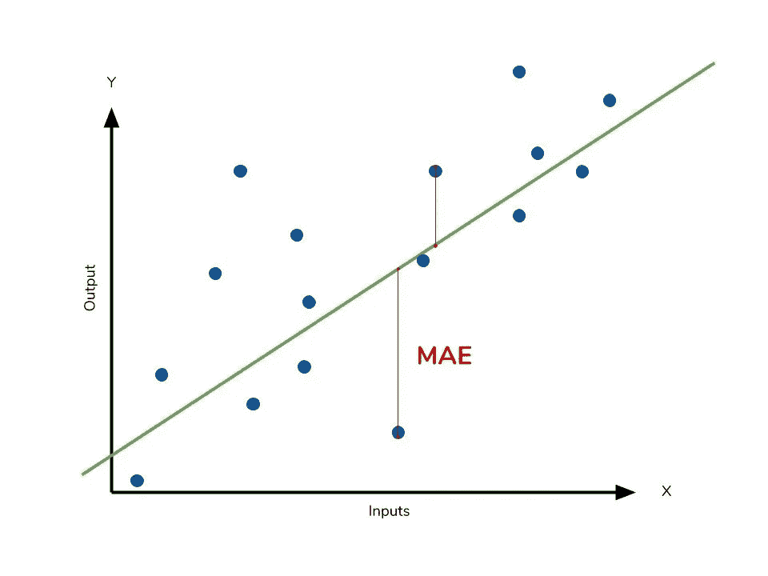

# 度量和 Python

> 原文：<https://towardsdatascience.com/metrics-and-python-850b60710e0c?source=collection_archive---------12----------------------->

## 在三篇系列文章中，我们将描述一组基本的统计概念和用于回归和分类的度量标准


Photo by [Isabella Christina](https://unsplash.com/@christina?utm_source=medium&utm_medium=referral) on [Unsplash](https://unsplash.com?utm_source=medium&utm_medium=referral)

作为一名程序员，我缺乏对数学和统计概念的研究。现在有了更多的经验，我决定汇编并分享一些我遇到的不同问题的度量标准和概念。

在这一系列文章中，我们将简要回顾它们的用法、公式、示例以及在 Python 中的实现，这样我们就可以一起看到它们，并且在必要时手头有这个图表。
这里是**第一部分**，指的是回归案例中最常用的指标。

# 数据集和模型

在本文中，我们使用了关于房价的 Kaggle 数据集，因为这是一个我们许多人都熟悉的回归的典型例子。
基本的工程特征已经完成，能够呈现一个最低限度的合理模型，作为度量标准开发的范例。

```
from scipy.stats import boxcox_normmax
from scipy.special import boxcox1p
from sklearn.linear_model import LinearRegressiontrain = pd.read_csv('../input/home-data-for-ml-course/train.csv')
y = train.SalePrice.reset_index(drop=True)features = train
end_features = ['OverallQual','GrLivArea','GarageCars','GarageArea','TotalBsmtSF','1stFlrSF','FullBath','TotRmsAbvGrd','MSSubClass','MSZoning']
features = features[end_features]features['MSSubClass'] = features['MSSubClass'].apply(str)
features['MSZoning'] = features.groupby('MSSubClass')['MSZoning'].transform(lambda x: x.fillna(x.mode()[0]))objects = [col for col in features.columns if features[col].dtype == "object"]
features.update(features[objects].fillna('None'))numeric_dtypes = ['int16', 'int32', 'int64', 'float16', 'float32', 'float64']
numerics = [col for col in features.columns if features[col].dtype in numeric_dtypes]
features.update(features[numerics].fillna(0))for i in numerics:
    features[i] = boxcox1p(features[i], boxcox_normmax(features[i] + 1))X = pd.get_dummies(features).reset_index(drop=True)#----------------- The model
reg = LinearRegression().fit(X, y)
y_pred = reg.predict(X)
```

# 回归度量摘要

这是一个简单的表格，包含了我们将要描述的指标，表格的最后一列是我们模型的结果。


# 平均绝对误差

> MAE 测量一组预测中误差的平均大小，不考虑它们的方向。它是预测和实际观察之间的绝对差异的测试样本的平均值，其中所有个体差异都具有相同的权重。



[https://www.dataquest.io/blog/understanding-regression-error-metrics/](https://www.dataquest.io/blog/understanding-regression-error-metrics/)

平均绝对误差使用与数据相同的标度。这被称为依赖于尺度的精度度量，因此不能用于使用不同尺度的系列之间的比较。


[https://www.dataquest.io/blog/understanding-regression-error-metrics/](https://www.dataquest.io/blog/understanding-regression-error-metrics/)

```
from sklearn.metrics import mean_absolute_error
print ('Sk MAE: ' + str(mean_absolute_error(y,y_pred)) )def MAE(predict,target):
    return (abs(predict-target)).mean()print ('My MAE: ' + str(MAE(y_pred,y)))
```


# MSE:均方差

> MSE 是一个[风险函数](https://en.wikipedia.org/wiki/Risk_function)，对应于平方误差损失的[期望值](https://en.wikipedia.org/wiki/Expected_value)。MSE 几乎总是严格为正(且不为零)的事实是因为[随机性](https://en.wikipedia.org/wiki/Randomness)或者因为估计器[没有考虑到能够产生更精确估计的信息](https://en.wikipedia.org/wiki/Omitted-variable_bias)。MSE 是对估计量质量的一种度量，它总是非负的，值越接近零越好。


[https://www.geeksforgeeks.org/ml-mathematical-explanation-of-rmse-and-r-squared-error/](https://www.geeksforgeeks.org/ml-mathematical-explanation-of-rmse-and-r-squared-error/)

“最小化 MSE 是选择估值器的关键标准:见[最小均方误差](https://en.wikipedia.org/wiki/Minimum_mean-square_error)。在无偏估计量中，最小化 MSE 等价于最小化方差，而做这件事的估计量就是[最小方差无偏估计量](https://en.wikipedia.org/wiki/Minimum_variance_unbiased_estimator)。然而，有偏估计量可能具有较低的 MSE 参见[估计器偏差](https://en.wikipedia.org/wiki/Estimator_bias)。

在[统计建模](https://en.wikipedia.org/wiki/Statistical_modelling)中，MSE 可以表示实际观测值和模型预测的观测值之间的差异。在这种情况下，它用于确定模型与数据的吻合程度，以及是否可以在不明显损害模型预测能力的情况下删除一些解释变量。"


[https://www.geeksforgeeks.org/ml-mathematical-explanation-of-rmse-and-r-squared-error/](https://www.geeksforgeeks.org/ml-mathematical-explanation-of-rmse-and-r-squared-error/)

```
from sklearn.metrics import mean_squared_error
print ('Sk MSE: ' + str(mean_squared_error(y,y_pred)) )def MSE(predict,target):
    return ((predict-target)**2).mean()
print ('My MSE: ' + str(MSE(y_pred,y)) )
```


# RMSE:均方根误差

> RMSE 是一个二次评分规则，也衡量误差的平均幅度。它是预测值和实际观测值之间的平均平方差的平方根。


[https://www.includehelp.com/ml-ai/root-mean-square%20error-rmse.aspx](https://www.includehelp.com/ml-ai/root-mean-square%20error-rmse.aspx)

RMSE 和梅的比较

**相似之处**:

*   用感兴趣变量的相同单位表示平均模型预测误差。
*   范围从 0 到∞并且与误差方向无关。
*   值越低越好。

**差异**:

*   在求平均值之前求平方根，RMSE 给大误差一个相对较高的权重，所以当不希望有大误差时，RMSE 应该有用。

```
def RMSE(predict, target):
    return np.sqrt(((predict - target) ** 2).mean())
print ('My RMSE: ' + str(RMSE(y_pred,y)) )
```


# MAPE:平均绝对百分比误差

> 在[统计](https://en.wikipedia.org/wiki/Statistics)中预测方法的预测精度的度量，例如在[趋势估计](https://en.wikipedia.org/wiki/Trend_estimation)中，也用作[机器学习](https://en.wikipedia.org/wiki/Loss_function)中回归问题的损失函数。它通常用百分比来表示准确度。


虽然 MAPE 的概念听起来非常简单和令人信服，但它在实际应用中有重大缺陷 [[*]](https://en.wikipedia.org/wiki/Mean_absolute_percentage_error#cite_note-tofallis2015-3) ，并且有许多来自 MAPE 的关于缺陷和误导性结果的研究


[https://www.dataquest.io/blog/understanding-regression-error-metrics/](https://www.dataquest.io/blog/understanding-regression-error-metrics/)

```
def MAPE(predict,target):
    return ( abs((target - predict) / target).mean()) * 100print ('My MAPE: ' + str(MAPE(y_pred,y)) )
```


# RMSLE:均方根对数误差

> 在 RMSLE 的情况下，你取预测值和实际值的对数。所以基本上，改变的是你测量的方差。我相信，当预测值和真实值都是巨大的数字时，如果不想惩罚预测值和实际值之间的巨大差异，通常会使用 RMSLE。

RMSLE 衡量实际和预测之间的比率。

对数(pi+1)对数(ai+1)对数(pi+1)对数(ai+1)

可以写成 log((pi+1)/(ai+1))log((pi+1)/(ai+1))

当值是巨大的数字时，如果不想惩罚巨大的差异，可以使用它。

此外，当您希望对低估的惩罚比对高估的惩罚更多时，也可以使用这种方法。


让我们看看下面的例子

情况 a) : Pi = 600，Ai = 1000 — RMSE = 400，RMSLE = 0.5108

情况 b) : Pi = 1400，Ai = 1000 — RMSE = 400，RMSLE = 0.3365

```
import mathdef RMSLE(predict, target):
    total = 0 
    for k in range(len(predict)):
        LPred= np.log1p(predict[k]+1)
        LTarg = np.log1p(target[k] + 1)
        if not (math.isnan(LPred)) and  not (math.isnan(LTarg)): 
            total = total + ((LPred-LTarg) **2)

    total = total / len(predict)        
    return np.sqrt(total)print ('My RMSLE: ' + str(RMSLE(y_pred,y)) )
```


# R and R 平方:决定系数

> R and R 平方帮助我们了解我们的回归模型与一个非常简单的模型相比有多好，该模型仅预测来自作为预测的训练集的目标的平均值。


[https://www.datasciencecentral.com/profiles/blogs/r-squared-in-one-picture](https://www.datasciencecentral.com/profiles/blogs/r-squared-in-one-picture)


```
def R2(predict, target):
    return 1 - (MAE(predict,target) / MAE(target.mean(),target))def R_SQR(predict, target):
    r2 = R2(predict,target)
    return np.sqrt(r2)print ('My R2         : ' + str(R2(y_pred,y)) )
print ('My R          : ' + str(R_SQR(y_pred,y)) )
```


# 调整后 R

> 表现等同于基线的模型会将 R 平方值设为 0。模型越好，r2 值越高。具有所有正确预测的最佳模型会给出 R 平方为 1。但是，在向模型中添加新要素时，R 平方值要么增加，要么保持不变。R-Squared 不会因添加对模型没有任何价值的要素而受到惩罚。因此，R 平方的改进版本是调整后的 R 平方


[http://www.haghish.com/statistics/stata-blog/stata-programming/adjusted_R_squared.php](http://www.haghish.com/statistics/stata-blog/stata-programming/adjusted_R_squared.php)

```
def R2_ADJ(predict, target, k):
    r2 = R2(predict,target)
    n = len(target)
    return (1 -  ( (1-r2) *  ( (n-1) / (n-(k+1)) ) ) )k= len(features.columns)
print ('My R2 adjusted: ' + str(R2_ADJ(y_pred,y,k)) )
```


# 摘要

将主要的回归度量放在一个表中，并为它们中的每一个编写函数，这是一种极好的个人体验。在同一个练习中使用它们，因为这让我能够比较它们的用途，理解它们的公式，并在撰写文章时有一个完整的画面。
希望这篇文章是有用的，欢迎任何评论或更正。

*下周我们将发表这个系列的第二部分，一篇关于分类度量的文章……*

# 来源

[](https://en.wikipedia.org/wiki/Mean_absolute_error) [## 绝对平均误差

### 在统计学中，平均绝对误差(MAE)是两个连续变量之间差异的度量。假设 X 和是…

en.wikipedia.org](https://en.wikipedia.org/wiki/Mean_absolute_error) [](https://medium.com/human-in-a-machine-world/mae-and-rmse-which-metric-is-better-e60ac3bde13d) [## 梅和 RMSE——哪个指标更好？

### 平均绝对误差与均方根误差

medium.com](https://medium.com/human-in-a-machine-world/mae-and-rmse-which-metric-is-better-e60ac3bde13d) [](https://www.dataquest.io/blog/understanding-regression-error-metrics/) [## 教程:了解线性回归和回归误差度量

### 人类大脑的构造是为了识别我们周围世界的模式。例如，我们观察到如果我们练习…

www.dataquest.io](https://www.dataquest.io/blog/understanding-regression-error-metrics/) [](https://www.geeksforgeeks.org/ml-mathematical-explanation-of-rmse-and-r-squared-error/) [## RMSE 和 R 平方误差的数学解释

### RMSE:均方根误差是回归线与数据点拟合程度的量度。RMSE 也可以是…

www.geeksforgeeks.org](https://www.geeksforgeeks.org/ml-mathematical-explanation-of-rmse-and-r-squared-error/)  [## 均方误差

### 在统计学中，估计量的均方误差(MSE)或均方偏差(MSD)

en.wikipedia.org](https://en.wikipedia.org/wiki/Mean_squared_error) [](https://www.includehelp.com/ml-ai/root-mean-square%20error-rmse.aspx) [## 均方根误差(RMSE) |机器学习

### 首页“机器学习/人工智能均方根误差(RMSE):在这篇文章中，我们将学习…

www.includehelp.com](https://www.includehelp.com/ml-ai/root-mean-square%20error-rmse.aspx)  [## 均方根偏差

### 均方根偏差(RMSD)或均方根误差(RMSE)(有时也称为均方根误差)是一个…

en.wikipedia.org](https://en.wikipedia.org/wiki/Root-mean-square_deviation) [](https://www.forecastpro.com/Trends/forecasting101August2011.html) [## 欢迎使用销售预测、库存计划、需求计划、销售和运营预测软件

### 预测 101:预测误差测量统计和如何使用它们的指南误差测量统计发挥…

www.forecastpro.com](https://www.forecastpro.com/Trends/forecasting101August2011.html)  [## 平均绝对百分比误差

### 平均绝对百分比误差(MAPE)，也称为平均绝对百分比偏差(MAPD)，是衡量…

en.wikipedia.org](https://en.wikipedia.org/wiki/Mean_absolute_percentage_error) [](https://www.quora.com/What-is-the-difference-between-an-RMSE-and-RMSLE-logarithmic-error-and-does-a-high-RMSE-imply-low-RMSLE) [## RMSE 和 RMSLE(对数误差)之间有什么区别，高 RMSE 是否意味着…

### 回答(第 1 题，共 2 题):均方根误差(RMSE)和均方根对数误差(RMSLE)都是技术…

www.quora.com](https://www.quora.com/What-is-the-difference-between-an-RMSE-and-RMSLE-logarithmic-error-and-does-a-high-RMSE-imply-low-RMSLE) 

[https://en.wikipedia.org/wiki/Coefficient_of_determination](https://en.wikipedia.org/wiki/Coefficient_of_determination)

[](https://www.analyticsvidhya.com/blog/2019/08/11-important-model-evaluation-error-metrics/?utm_source=twitter.com&utm_medium=social) [## 每个人都应该知道的机器学习的 11 个重要模型评估指标

### 概述评估模型是构建有效机器学习模型的核心部分，有几种评估方法…

www.analyticsvidhya.com](https://www.analyticsvidhya.com/blog/2019/08/11-important-model-evaluation-error-metrics/?utm_source=twitter.com&utm_medium=social)  [## 在 Stata 中计算调整后的 R 平方

### 2014 年 11 月 23 日更新|快速提示| |简介| |算法| | r2_a 程序| |分析| |练习|…

www.haghish.com](http://www.haghish.com/statistics/stata-blog/stata-programming/adjusted_R_squared.php) [](https://en.wikipedia.org/wiki/Coefficient_of_determination) [## 决定系数

### 在统计学中，决定系数，表示为 R 2 或 r 2，读作“R 的平方”，是…

en.wikipedia.org](https://en.wikipedia.org/wiki/Coefficient_of_determination)