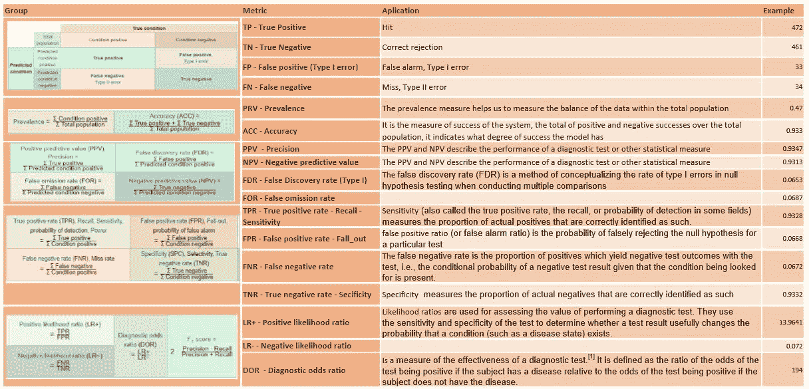

# 度量和 Python II

> 原文：<https://towardsdatascience.com/metrics-and-python-ii-2e49597964ff?source=collection_archive---------15----------------------->

## 在[之前的文章](/metrics-and-python-850b60710e0c)中，我们采用了回归问题的度量指南。现在我们来看看分类问题中最常用的指标


Photo by [Miguel A. Amutio](https://unsplash.com/@amutiomi?utm_source=medium&utm_medium=referral) on [Unsplash](https://unsplash.com?utm_source=medium&utm_medium=referral)

# 数据集

我们创建一个包含三个数组的数据集:真实值、预测值和似然值。
*real _ values*:0 到 1 之间有 1000 个元素的数据集。
*pred_values* :真实数据集的变体，模拟预测，只改变前 150 个值。
*【prob _ values】*:pred _ values 数组，但包含概率为 0 或 1 的百分比，而不是实际值 0 或 1。它将用于 ROC 图表和召回与精确对比。

```
real_values = []
prob_values = []
pred_values = []for k in range(0,1000):
   value = random.uniform(0, 1)
   real_values.append(int(round(value,0))) if k < 150:
      value2 = random.uniform(0, 1)
      prob_values.append(value2)
      pred_values.append(int(round(value2,0)))
   else:
      prob_values.append(value)
      pred_values.append(int(round(value,0)))
```

# 混淆矩阵

混淆矩阵本身不是一个指标，但它是对真实数据和预测进行分类的重要工具，因此它的组成部分是第一组指标的触发器。

```
from sklearn.metrics import confusion_matrix
import scikitplot as skplt
print(confusion_matrix(real_values, pred_values))
skplt.metrics.plot_confusion_matrix(real_values, pred_values,figsize=(8,8))
```


# 二元分类—表 2.1



[https://kreilabs.com/wp-content/uploads/2019/12/Metrics_table.pdf](https://kreilabs.com/wp-content/uploads/2019/12/Metrics_table.pdf)

您可以在[https://kreilabs . com/WP-content/uploads/2019/12/Metrics _ table . pdf](https://kreilabs.com/wp-content/uploads/2019/12/Metrics_table.pdf)中下载完整文件

在这里，我们可以看到 matrix_metrix 例程中表指标的 pyhton 实现:

```
import sklearn.metrics
import mathdef matrix_metrix(real_values,pred_values,beta):
   CM = confusion_matrix(real_values,pred_values)
   TN = CM[0][0]
   FN = CM[1][0] 
   TP = CM[1][1]
   FP = CM[0][1]
   Population = TN+FN+TP+FP
   Prevalence = round( (TP+FP) / Population,2)
   Accuracy   = round( (TP+TN) / Population,4)
   Precision  = round( TP / (TP+FP),4 )
   NPV        = round( TN / (TN+FN),4 )
   FDR        = round( FP / (TP+FP),4 )
   FOR        = round( FN / (TN+FN),4 ) 
   check_Pos  = Precision + FDR
   check_Neg  = NPV + FOR
   Recall     = round( TP / (TP+FN),4 )
   FPR        = round( FP / (TN+FP),4 )
   FNR        = round( FN / (TP+FN),4 )
   TNR        = round( TN / (TN+FP),4 ) 
   check_Pos2 = Recall + FNR
   check_Neg2 = FPR + TNR
   LRPos      = round( Recall/FPR,4 ) 
   LRNeg      = round( FNR / TNR ,4 )
   DOR        = round( LRPos/LRNeg)
   F1         = round ( 2 * ((Precision*Recall)/(Precision+Recall)),4)
   FBeta      = round ( (1+beta**2)*((Precision*Recall)/((beta**2 * Precision)+ Recall)) ,4)
   MCC        = round ( ((TP*TN)-(FP*FN))/math.sqrt((TP+FP)*(TP+FN)*(TN+FP)*(TN+FN))  ,4)
   BM         = Recall+TNR-1
   MK         = Precision+NPV-1 mat_met = pd.DataFrame({
'Metric':['TP','TN','FP','FN','Prevalence','Accuracy','Precision','NPV','FDR','FOR','check_Pos','check_Neg','Recall','FPR','FNR','TNR','check_Pos2','check_Neg2','LR+','LR-','DOR','F1','FBeta','MCC','BM','MK'],     'Value':[TP,TN,FP,FN,Prevalence,Accuracy,Precision,NPV,FDR,FOR,check_Pos,check_Neg,Recall,FPR,FNR,TNR,check_Pos2,check_Neg2,LRPos,LRNeg,DOR,F1,FBeta,MCC,BM,MK]}) return (mat_met)
```

当我们调用 matrix_metrix 函数时:

```
beta = 0.4
mat_met = matrix_metrix(real_values,pred_values,beta)
print (mat_met)
```


Note: Prevalence is 0.505, code has a mistake at first version

## 预测值和实际值


[https://en.wikipedia.org/wiki/Confusion_matrix](https://en.wikipedia.org/wiki/Confusion_matrix)

**TP =真阳性**

**TN =真阴性**

**FP =假阳性** —相当于假警报或 I 类错误

**FN =假阴性—** 相当于遗漏或[II 型错误](https://en.wikipedia.org/wiki/Type_II_error)

## 总费率*


[https://en.wikipedia.org/wiki/Confusion_matrix](https://en.wikipedia.org/wiki/Confusion_matrix)

**患病率:**用于衡量总人口中数据的平衡。
可以测量阳性或阴性的发生率，并且两个商数之和= 1，一个平衡的数据集将给出接近 0.5 的系数
如果相反，其中一个因素接近 1，另一个接近 0，我们将得到一个不平衡的数据集。

**精度:**它是系统成功的度量，正面和负面成果的总和超过总人口，表明模型的成功程度。根据案例研究的灵敏度的[成本，以及数据的平衡(患病率)。](https://slack-redir.net/link?url=https%3A%2F%2Fmedium.com%2Fmercadolibre-datablog%2Fcost-sensitive-classification-in-fraud-prevention-263170d8fcfe&v=3)

## 预测利率*


[https://en.wikipedia.org/wiki/Confusion_matrix](https://en.wikipedia.org/wiki/Confusion_matrix)

**PPV**——精确度的阳性预测值

**NPV** —负面预测值

> PPV 和 NPV 描述了诊断测试或其他统计测量的性能。高结果可以被解释为表明这种统计的准确性。PPV 和 NPV 不是测试固有的；它们还取决于[流行率](https://en.wikipedia.org/wiki/Prevalence)。⁴

**FDR** —错误发现率(第一类)【四】

**为**——漏报率

**check_Pos:** PPV + FDR = 1

**check_Neg:** FOR + NPV = 1

## 条件利率*


[https://en.wikipedia.org/wiki/Confusion_matrix](https://en.wikipedia.org/wiki/Confusion_matrix)

回忆、灵敏度、检测概率和功效是相同的度量，根据研究领域的不同，它们采用不同的名称和应用。
在涉及二元分类问题的文献中，召回一词的使用更为频繁。

> **“敏感性**和**特异性**是二元分类测试性能的统计测量，在统计学中也称为分类函数，广泛用于医学:
> 
> **灵敏度**测量被正确识别的实际阳性的比例。
> 
> **特异性**(也称为**真阴性率**)衡量被正确识别为真阴性的比例(例如，被正确识别为没有患病的健康人的百分比)。⁵

**FPR —** 假阳性率(或误报率)是某一特定检验错误拒绝零假设的概率。

**FNR** —假阴性率是指在测试中产生阴性测试结果的阳性比例，即，假设正在寻找的条件存在，阴性测试结果的条件概率。

在统计假设检验中，这个分数用字母β表示。测试的“[功率](https://en.wikipedia.org/wiki/Statistical_power)”(或“灵敏度”)等于 1β。

## 组合费率*


[https://en.wikipedia.org/wiki/Confusion_matrix](https://en.wikipedia.org/wiki/Confusion_matrix)

不要与似然比测试混淆。

**LR (+ -)** 似然比:用于评估执行诊断测试的价值。⁶

**or**—诊断优势比是对诊断测试⁷有效性的一种衡量

# 二元分类—表 2.2


[https://kreilabs.com/wp-content/uploads/2019/12/Metrics_table.pdf](https://kreilabs.com/wp-content/uploads/2019/12/Metrics_table.pdf)

从用于表 1 的 matrix_metrix 函数中，我们还获得了该表 2 的值:


## F1 分数

> 在二进制分类的统计分析中， **F1 得分**(也称为 **F 得分**或 **F 度量**)是测试准确度的度量。它同时考虑了测试的精度 *p* 和召回率 *r* 来计算分数: *p* 是正确阳性结果的数量除以分类器返回的所有阳性结果的数量， *r* 是正确阳性结果的数量除以所有相关样本(所有本应被识别为阳性的样本)的数量。F1 分数是精确度和召回率的调和平均值，其中 F1 分数在 1 时达到其最佳值(完美的精确度和召回率),在 0 时最差。⁸

## f-贝塔 Score⁹

β是用于分数分析的参数，如果我们使用β等于 1，我们就有调和平均值；然后我们有了 ***F1 的分数*** :

我们可以采取一些经验法则:

*   为了给**精度**更多的权重，我们必须在 0–1***0<Beta<1***之间选择一个 Beta 值
*   *为了给**回忆**更多的权重，我们在区间***1<Beta<+无穷大*** 中挑选一个 Beta 值*

## *ROC 对比精确召回和 AUC ⁰*

*我们可以在[中找到一篇关于这些工具的概念和实现的优秀且非常完整的文章](https://machinelearningmastery.com/roc-curves-and-precision-recall-curves-for-classification-in-python/)。*

***ROC** —接收操作特性*

> *它是针对 0.0 和 1.0 之间的多个不同候选阈值的假阳性率(x 轴)与真阳性率(y 轴)的关系图。换句话说，它绘制了虚警率与命中率的关系图。*

***精确召回曲线***

> *精确度-召回率曲线是不同阈值的精确度(y 轴)和召回率(x 轴)的曲线图，很像 ROC 曲线。无技能分类器是一种不能区分类别的分类器，它在所有情况下都会预测随机类别或恒定类别。无技能线的变化是基于积极类和消极类的分布。它是一条水平线，带有数据集中阳性案例的比率值。对于平衡数据集，这是 0.5。*

***AUC —曲线下面积***

*曲线下面积(AUC)可用作模型技巧的总结。*

*我们基于上述文章编写了以下代码*

```
*#ROC Implementation
from sklearn.metrics import roc_curve
from sklearn.metrics import roc_auc_score
from matplotlib import pyplotfpr, tpr, thresholds = roc_curve(real_values, prob_values)
auc = roc_auc_score(real_values, prob_values)
print('AUC: %.3f' % auc)pyplot.plot(fpr, tpr, linestyle='--', label='Roc curve')
pyplot.xlabel('False Positive Rate')
pyplot.ylabel('True Positive Rate')
pyplot.legend()pyplot.show()*
```

**

```
*#Precision-recall implementationprecision, recall, thresholds = sklearn.metrics.precision_recall_curve(real_values,prob_values)pyplot.plot(recall, precision, linestyle='--', label='Precision versus Recall')
pyplot.xlabel('Recall')
pyplot.ylabel('Precision')
pyplot.legend()pyplot.show()*
```

**

## *Sklearn 的其他实现和指标*

*这里有一个简单快速的关于二元分类值的报告*

**

*这里有一个直接从 sklearn 获取许多指标函数:*

```
*def sk_metrix(real_values,pred_values,beta):
   Accuracy = round( sklearn.metrics.accuracy_score(real_values,pred_values) ,4)

   Precision  = round( sklearn.metrics.precision_score(real_values,pred_values),4 )

   Recall     = round( sklearn.metrics.recall_score(real_values,pred_values),4 ) F1         = round ( sklearn.metrics.f1_score(real_values,pred_values),4)

   FBeta      = round ( sklearn.metrics.fbeta_score(real_values,pred_values,beta) ,4) MCC        = round ( sklearn.metrics.matthews_corrcoef(real_values,pred_values)  ,4) Hamming    = round ( sklearn.metrics.hamming_loss(real_values,pred_values) ,4) Jaccard    = round ( sklearn.metrics.jaccard_score(real_values,pred_values) ,4) Prec_Avg   = round ( sklearn.metrics.average_precision_score(real_values,pred_values) ,4) Accu_Avg   = round ( sklearn.metrics.balanced_accuracy_score(real_values,pred_values) ,4) mat_met = pd.DataFrame({
'Metric': ['Accuracy','Precision','Recall','F1','FBeta','MCC','Hamming','Jaccard','Precision_Avg','Accuracy_Avg'],
'Value': [Accuracy,Precision,Recall,F1,FBeta,MCC,Hamming,Jaccard,Prec_Avg,Accu_Avg]}) return (mat_met)*
```

*调用 sk_metrix 函数*

```
*sk_met = sk_metrix(real_values,pred_values,beta)*
```

**

# *摘要*

*混淆矩阵中产生的指标数量非常大，根据用例来细化每个指标的使用可能很难涵盖。最常见的指标可能是 F1 评分、ROC、精确回忆 AUC、患病率和敏感性。*

*这一系列文章旨在创建一个表格，在该表格中可以快速找到每个案例研究中使用的大多数指标的指南；掌握它们的应用超出了我们的范围，似乎也相当困难。
记住表格可以[下载成 pdf 格式](https://kreilabs.com/wp-content/uploads/2019/12/Metrics_table.pdf)。*

*在下一篇文章中，我们将在表 2.3 中看到更多的分类指标和推荐系统的具体指标*

# *参考*

*https://en.wikipedia.org/wiki/Confusion_matrix*

*[1]第一类错误*

*[2]第二类错误*

*[3][https://medium . com/Mercado libre-datablog/cost-sensitive-class-in-fraud-prevention-263170 D8 fcfe](https://medium.com/mercadolibre-datablog/cost-sensitive-classification-in-fraud-prevention-263170d8fcfe)*

*【4】**阳性和阴性预测值**(分别为 **PPV** 和 **NPV** )分别为[统计](https://en.wikipedia.org/wiki/Statistics)和[诊断测试](https://en.wikipedia.org/wiki/Diagnostic_test)中阳性和阴性结果的比例，分别为[真阳性](https://en.wikipedia.org/wiki/True_positive)和[真阴性](https://en.wikipedia.org/wiki/True_negative)结果。[【1】](https://en.wikipedia.org/wiki/Positive_and_negative_predictive_values#cite_note-1)“PPV 和 NPV 描述了诊断测试或其他统计测量的性能。高结果可以被解释为表明这种统计的准确性。PPV 和 NPV 不是测试固有的；它们也取决于[流行程度](https://en.wikipedia.org/wiki/Prevalence)。[【2】](https://en.wikipedia.org/wiki/Positive_and_negative_predictive_values#cite_note-AltmanBland1994-2)使用[贝叶斯定理](https://en.wikipedia.org/wiki/Bayes%27_theorem)可以推导出 PPV。虽然有时用作同义词，但是*阳性预测值*通常是指由对照组建立的，而[测试后概率](https://en.wikipedia.org/wiki/Pre-_and_post-test_probability)是指个体的概率。然而，如果个体的目标状况的[预测试概率](https://en.wikipedia.org/wiki/Pre-test_probability)与用于建立阳性预测值的对照组中的患病率相同，则两者在数值上相等。*

*([https://en . Wikipedia . org/wiki/Positive _ and _ negative _ predictive _ values](https://en.wikipedia.org/wiki/Positive_and_negative_predictive_values))*

*[https://en.wikipedia.org/wiki/Sensitivity_and_specificity](https://en.wikipedia.org/wiki/Sensitivity_and_specificity)*

*[6][https://en . Wikipedia . org/wiki/Likelihood _ ratios _ in _ diagnostic _ testing # positive _ Likelihood _ ratio](https://en.wikipedia.org/wiki/Likelihood_ratios_in_diagnostic_testing#positive_likelihood_ratio)*

*[7][https://en.wikipedia.org/wiki/Diagnostic_odds_ratio](https://en.wikipedia.org/wiki/Diagnostic_odds_ratio)*

*[8]https://en.wikipedia.org/wiki/F1_score*

*[9][http://www . marcelonet . com/snippets/machine-learning/evaluation-metrix/f-beta-score](http://www.marcelonet.com/snippets/machine-learning/evaluation-metrix/f-beta-score)*

*[10][https://machine learning mastery . com/roc-curves-and-precision-recall-curves-for-class ification-in-python/](https://machinelearningmastery.com/roc-curves-and-precision-recall-curves-for-classification-in-python/)*