# 用于评估机器学习分类模型的度量

> 原文：<https://towardsdatascience.com/metrics-for-evaluating-machine-learning-classification-models-python-example-59b905e079a5?source=collection_archive---------7----------------------->


Photo by [Chris Liverani](https://unsplash.com/@chrisliverani?utm_source=medium&utm_medium=referral) on [Unsplash](https://unsplash.com?utm_source=medium&utm_medium=referral)

在机器学习领域，有三种主要的问题:回归、分类和聚类。根据您正在处理的问题的类型，您将希望使用一组特定的指标来衡量您的模型的性能。这可以用一个例子来很好地说明。假设一家公司声称已经开发出面部检测算法，可以以 99.9%的准确率识别恐怖分子。抛开道德影响不谈，这应该会立即引发一个危险信号。恐怖分子只占人口的很小一部分(我找不到实际的统计数据，但我们假设是 0.001%)。因此，通过假设没有人是恐怖分子(即编写一个始终返回 false 的程序)，我们可以达到 99.9%以上的准确率。因此，准确性不是评估模型性能的好指标，因为它错误地将每个恐怖分子分类，但仍然获得了很高的分数。

## 混淆矩阵

另一方面，混淆矩阵将区分被正确分类为非恐怖分子的样本数量和被正确分类为恐怖分子的样本数量。混淆矩阵被分成 4 个象限。

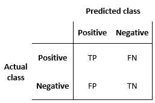

[https://commons.wikimedia.org/wiki/File:Binary_confusion_matrix.jpg](https://commons.wikimedia.org/wiki/File:Binary_confusion_matrix.jpg)

**真阳性:**

解读:你预测的是正的，这是真的。

你预测那个人是恐怖分子，他们确实是。

**真阴性:**

解读:你预测的是负数，这是真的。

你预测那个人不是恐怖分子，而他们实际上不是。

**假阳性:(1 型错误)**

解读:你预测的是正的，是假的。

你预测那个人是恐怖分子，但他们实际上不是。

**假阴性:(2 型错误)**

解读:你预测的是负数，这是假的。

你预测那个人不是恐怖分子，但他们确实是。

## 精确度/召回率

有时，使用数字来评估模型的性能比依赖库来可视化混乱矩阵更容易。

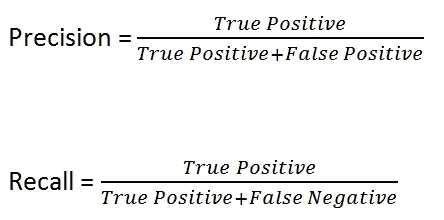

在现实世界中，你会遇到分类问题，分界线迫使你在高精度和高召回率之间做出选择。在某些情况下，精度越高越好。例如，诊断中出现一些假阳性可能会更好，而不是让任何真正患有疾病的人从裂缝中溜走，逃避治疗。其他时候，最好有更高的召回率，就像垃圾邮件过滤器一样。在用户的收件箱里放几封垃圾邮件比把重要的邮件归类为垃圾邮件更容易被接受。为了形成更好的判断，我们可以用图形来表示精确度和召回率之间的权衡。

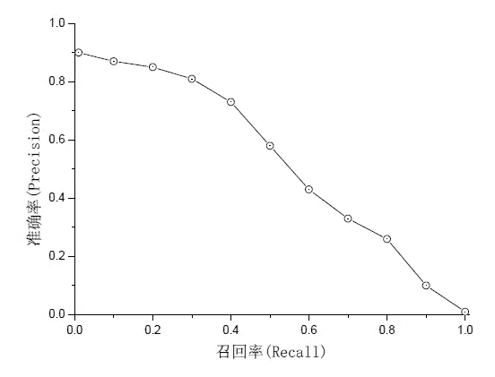

[https://commons.wikimedia.org/wiki/File:ROCCurve.png](https://commons.wikimedia.org/wiki/File:ROCCurve.png)

如果我们可以使用一个单一的分数，而不是每次都测量召回率和精确度，这将会更容易。首先，我们可以试着取两个结果的平均值。例如，假设一个垃圾邮件检测器的准确率为 80%，召回率为 37%，那么平均准确率为 58.5%。现在，假设我们构建了垃圾邮件检测器，它不会将任何电子邮件视为垃圾邮件(类似于恐怖分子的例子)。如果非垃圾邮件明显多于垃圾邮件，我们的模型将被解释为性能良好。具体来说，如果 300，000 封电子邮件是垃圾邮件(不是垃圾邮件), 500 封是垃圾邮件，那么将所有电子邮件分类为垃圾邮件的模型将获得 100%的精确度，因为它正确地分类了所有垃圾邮件，并且召回率为 0%,因为它错误地分类了所有垃圾邮件。如果我们取平均值，我们仍然会得到 50%,这有点误导，因为垃圾邮件检测器的整个目的是检测垃圾邮件。

正是由于上述原因，我们使用调和平均值而不是算术平均值来计算平均值。调和平均值总是更接近较小的数，而不是较大的数。

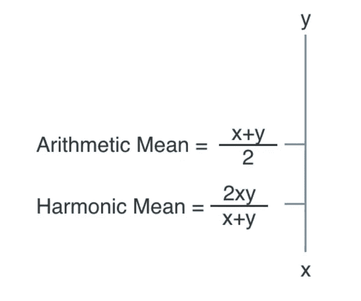

回到我们的垃圾邮件检测器的例子。如果精度等于 100%，召回率等于 0%，则调和平均值等于 0%。我们把这个值叫做 **F1 分数**。


## ROC / AUC

类似于精确度/召回率曲线，接收器操作者特征(ROC)图提供了一种优雅的方式来呈现在不同阈值下产生的多个混淆矩阵。ROC 绘制了真阳性率和假阳性率之间的关系。

*   真阳性率=召回率=灵敏度=真阳性/(真阳性+假阴性)
*   假阳性率= 1–特异性=假阳性/(假阳性+真阴性)

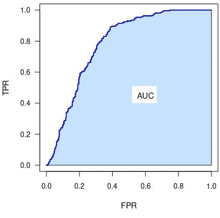

[https://en.wikipedia.org/wiki/File:Basic_AUC_annotated.png](https://en.wikipedia.org/wiki/File:Basic_AUC_annotated.png)

值得注意的是，假阳性率是 1 减去特异性，这意味着假阳性率越接近 0，特异性就越高(回忆)。因此，为了获得特异性和敏感性的最佳值，我们需要选择左上角的一个点。

另一方面，曲线下面积(AUC)使得将一条 ROC 曲线与另一条进行比较变得容易。例如，红色 ROC 曲线的 AUC 大于蓝色 ROC 曲线的 AUC。因此，对于相同量的特异性，与红色曲线相关的模型实现了更高的灵敏度。

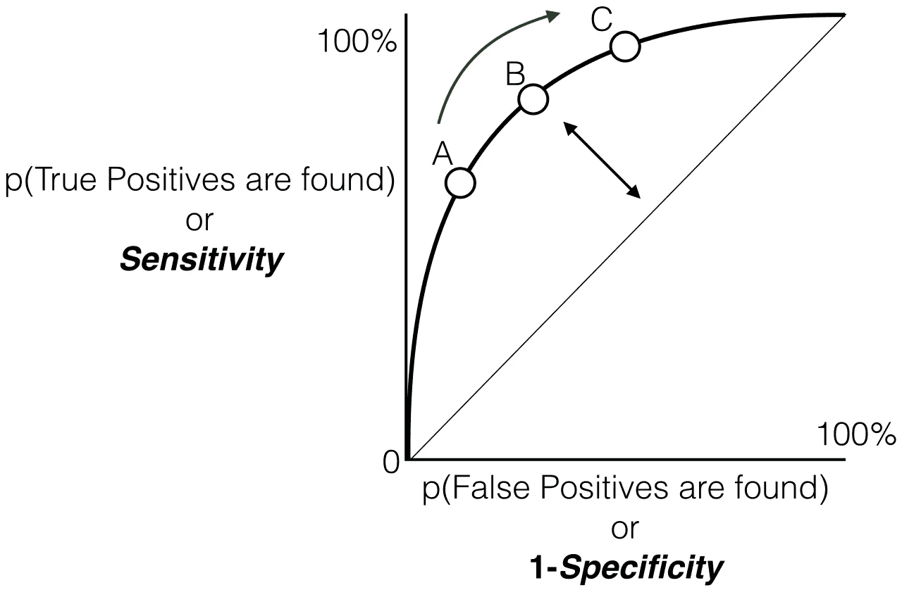

[https://commons.wikimedia.org/wiki/File:ROC_curve.svg](https://commons.wikimedia.org/wiki/File:ROC_curve.svg)

# 密码

在前面的例子中，我们将看一下前面所有正在运行的指标。

```
import pandas as pd
from matplotlib import pyplot as plt
plt.style.use('dark_background')
from sklearn.datasets import load_breast_cancer
from sklearn.ensemble import RandomForestClassifier
from sklearn.model_selection import train_test_split
from sklearn.preprocessing import LabelEncoder
from sklearn.metrics import roc_curve
from sklearn.metrics import auc
from sklearn.metrics import precision_recall_curve
from sklearn.metrics import precision_score
from sklearn.metrics import recall_score
from sklearn.metrics import f1_score
from sklearn.metrics import average_precision_score
from inspect import signature
```

为简单起见，我们将使用 sklearn 提供的一个数据集。

```
breast_cancer = load_breast_cancer()X = pd.DataFrame(breast_cancer.data, columns=breast_cancer.feature_names)y = pd.Categorical.from_codes(breast_cancer.target, breast_cancer.target_names)encoder = LabelEncoder()y = pd.Series(encoder.fit_transform(y))
```

这些指标将用于衡量我们的模型做出的预测与测试集中包含的样本之间的差异。

```
X_train, X_test, y_train, y_test = train_test_split(X, y, random_state=1)
```

我们将使用随机森林分类器，但任何分类算法都可以。

```
rf = RandomForestClassifier()rf.fit(X_train, y_train)
```

我们称 *predict_proba 方法 r* 而不是 *predict* 以获得一个概率列表，该列表表示样本属于给定类别的可能性。这类似于深度学习中常用的 softmax 激活函数。

```
probs = rf.predict_proba(X_test)
```

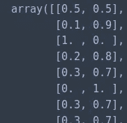

`roc_curve`方法需要一个单一的特征。因此，我们采用肿瘤是恶性的预测概率。

```
malignant_probs = probs[:,1]fpr, tpr, thresholds = roc_curve(y_test, malignant_probs)roc_auc = auc(fpr, tpr)
```

在这个例子中很难看到，但我们通常会选择左上角的一个点，它将产生最佳的灵敏度和特异性。AUC 为 0.98 意味着在特异性和敏感性之间几乎没有权衡。

```
plt.title('Receiver Operating Characteristic')
plt.plot(fpr, tpr, 'y', label = 'AUC = %0.2f' % roc_auc)
plt.legend(loc = 'lower right')
plt.plot([0, 1], [0, 1],'r--')
plt.xlim([0, 1])
plt.ylim([0, 1])
plt.ylabel('True Positive Rate')
plt.xlabel('False Positive Rate')
plt.show()
```

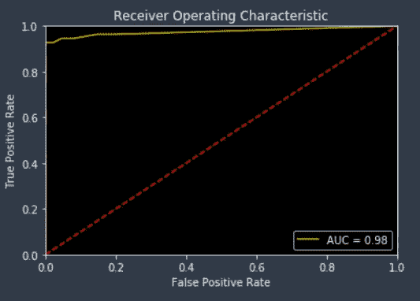

接下来，让我们看看其他一些指标来评估我们模型的性能。首先，我们使用我们的模型根据上一步的概率对数据进行分类。

```
y_pred = rf.predict(X_test)
```

快速提醒一下，precision 测量的是真阳性，而不是真阳性加上假阳性。

```
precision_score(y_test, y_pred)
```

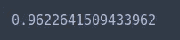

召回衡量的是真阳性与真阳性和假阴性之比。

```
recall_score(y_test, y_pred)
```

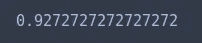

F1 分数使用调和平均值结合了精确度和召回率。

```
f1_score(y_test, y_pred)
```

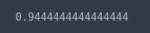

选择对应于右上角的阈值数量将导致精确度和召回率的最佳组合。

```
precision, recall, threshold = precision_recall_curve(y_test, y_pred)
average_precision = average_precision_score(y_test, y_pred)step_kwargs = ({'step': 'post'} if 'step' in signature(plt.fill_between).parameters else {})
plt.step(recall, precision, color='r', alpha=0.2, where='post')
plt.fill_between(recall, precision, alpha=0.2, color='r', **step_kwargs)
plt.xlabel('Recall')
plt.ylabel('Precision')
plt.ylim([0.0, 1.0])
plt.xlim([0.0, 1.0])
plt.title('2-class Precision-Recall curve: AP={0:0.2f}'.format(average_precision))
```

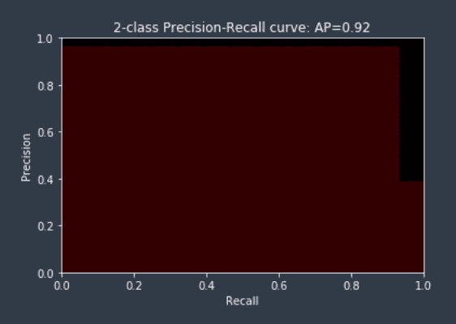

# 最后的想法

我们用来评估模型性能的度量标准的选择取决于问题的性质。对于分类模型，我们可以使用精度、召回率、f1 得分或 ROC 曲线来衡量性能。