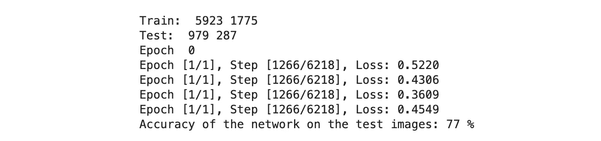
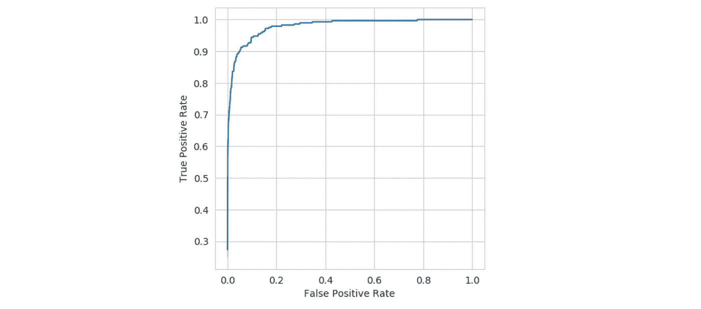

# 不平衡分类的度量

> 原文：<https://towardsdatascience.com/metrics-for-imbalanced-classification-41c71549bbb5?source=collection_archive---------3----------------------->

数据科学中的指标概念极其重要。如果你不知道如何正确评估当前的结果，你也无法提高它们。对度量的错误理解也会导致对模型容量的错误估计和对问题状态的错误理解。当前的故事将揭示分类问题的流行度量的本质。所有讨论的指标都将在 NumPy 中实现，以满足他们的需求。讨论的指标列表包括:精确度、召回率、F1、MCC 和 ROC-AUC

## 问题定式化

分类问题将是两个 MNIST 数字 0 和 6 之间的二进制分类，因为它们非常相似，很难区分它们本身。考虑到 metrics 的目的是深入了解不平衡分类问题，让阳性类别(6 位数)占少数，更具体地说，阳性样本总数将是阴性样本的 30%左右。我们正在使用的模型是基本的逻辑回归。以下代码片段的完整源代码可以在 [github](https://github.com/schatty/misc/blob/master/metrics_imbalanced.ipynb) 找到。

## 流行指标

衡量分类的一个非常简单的标准是基本准确性，即正确预测与数据集中样本总数的比率。然而，在不平衡类的情况下，这种度量可能是误导性的，因为高度量不能显示少数类的预测能力。您可能有 99%的准确率，但对您真正感兴趣的类的预测能力仍然很差(即异常检测，其中异常是数据集中罕见的类)。为了更好地理解当前模型的预测能力，让我们从待分类样本的四种可能情况开始

*   真阳性(TP)—样本的标签为阳性，且被归类为阳性
*   真阴性(TN) —样本的标签为阴性，且被归类为阴性
*   假阳性(FP)—样本标签为阴性。，但它被归类为阳性
*   假阴性(FN)—样本标签已贴上。，但它被归类为否定的

基于这四个量，我们可以导出不平衡类的以下度量

**真阳性率**(也有**灵敏度**或**召回**)

召回指标显示了选择了多少相关样本，这意味着我们的模型可以预测我们数据集中所有感兴趣的样本。

**假阳性率**(也称**脱落**)

**精度**

精度指标告诉我们有多少预测样本是相关的，即如果样本不正确，我们将样本分类为正确样本的错误。

**真阴性率**(也称**特异性**)

**F1-得分**

F1 指标是精度和召回率的调和平均值，计算如下

对于不平衡的分类场景，这个度量是一个很好的选择。F1 的取值范围在[0，1]内，其中 1 为完美分类，0 为完全失败。

**MCC** (马修斯相关系数)

对于不平衡分类，mcc 是非常好的度量，即使类的大小相差很大，也可以安全地使用

其范围在 1 和 1 之间，其中 1 分表示完美预测，0 分表示随机预测，1 分表示预测分数和真实标签值之间完全不一致。

**ROC-AUC** 为二元分类

ROC 指标的性质和上面列出的简化形式将在下一节详细介绍。

尽管很难一下子快速理解上述公式。让我们先在 NumPy 中实现它们。 *y_true* 会是一个带有二进制真标签的 numpy 数组， *y_score 也是带有二进制标签的 numpy 数组，*但是预测的*。*

现在让我们实现一些基本的模型，例如逻辑回归(我将使用 PyTorch 中实现的一个)并在不平衡数据集上训练它(正类占少数)。将对来自 MNIST 数据集的 0 和 6 位数字进行训练(0 是负类，6 是正类，即“1”，与负类相比，仅由 30%的正类样本组成)。

我故意选择了导致不完美训练结果的参数，得到了 77%的准确率

77%的单一值是一个相当模糊的结果，所以让我们对计算的分数运行 *show_metrics* 函数

现在，我们有了更多关于获得的性能的信息。**真正**例子的数量相当少，因为它们是少数，模型很难识别它们。**假阳性的数量**等于 0，这意味着如果单个负类不是正类，则该模型不将其分类为正类，因此我们可以说，如果该模型预测属于正类，则它是完全确定的。**真阴性**的数量很大，因此**假阴性**的数量也很大，这意味着大多数看到的样本被预测为阴性样本。原因是我们的数据集主要由阴性样本组成，评估阶段相应的阳性/阴性标签比例也是如此。**召回**我们的预测是 0.02，这意味着模型选择阳性类别非常糟糕(大多数真正的阳性类别没有被正确预测)。另一方面,**精度**等于 1.0，这意味着被分类为阳性的所有样本确实是阳性的。 **F1** 指标很低，这意味着模型对阳性和阴性样本的区分很差， **mcc 也是如此。**

## ROC-AUC

ROC 代表接收器工作特性，最初被设计为区分噪声和非噪声的度量。ROC 是通过绘制真阳性率(在 y 轴上)对假阳性率(在 x 轴上)的分数来创建的。ROC-AUC 度量显示由 ROC 曲线获得的曲线下面积。我们如何准确地获得 ROC 曲线？让我们假设二进制分类模型输出范围为[0，1]的真实值，其可以被解释为样本为正的概率。我们可以说，如果模型的输出大于 0.5，那么样本就是正的，但是 0.5 并不是类阈值的唯一选择。例如，如果大部分样本是负的，那么模型将倾向于预测比正样本更多的负样本，并且输出将偏向左侧。因此，我们可以将阈值向左移动，并获得少数类预测的正确估计值(假设如果模型输出得分≥ 0.4，则已经令人印象深刻，并且样本可以被视为阳性)。ROC 曲线是通过将阈值从 0 移动到 1 来获得的，并且用于获取 TPR 和 FPR，考虑到所有预测≥阈值被视为阳性样本。阈值通常等于预测中的唯一值。让我们用 numpy 手工实现这个简单的算法

结果曲线为

来自上述实施例的 ROC-AUC 度量是 0.979。ROC-AUC 度量可以在[0，1]的范围内变化，其中 1 分表示分类器具有完美的预测能力并且从不出错，0.5 分完全是随机猜测，低于 0.5 分意味着如果我们颠倒结果(将 0 的预测变为 1，反之亦然)，我们实际上得到比现在更好的模型。在输出 0 和 1 标签而不是连续分数的二元分类器的情况下，我们不能移动我们的阈值，因此在图上只有一个点(单对获得的值 TFR 和 FPR)。在这种情况下，ROC-AUC 可以直接计算为两个三角形的面积，这样的公式我们在上一节已经看到过。

## 结论

作为结论，我建议只有在职业完全平衡的情况下才使用准确度，否则使用 F1 和 MCC。通过精确度和召回率来查看正面和负面评估比率也是有用的。