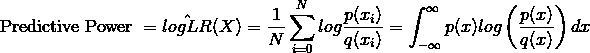

# 机器学习中的性能度量

> 原文：<https://towardsdatascience.com/metrics-ml-2563f9e47faa?source=collection_archive---------9----------------------->

在本文中，我提供了几个用于评估模拟某些行为的模型性能的指标的简要概述。这些指标将模拟输出与一些实际情况进行比较。

# 分布比较

## 詹森-香农散度

詹森-香农散度(JSD)测量两个分布(即地面真实和模拟)之间的相似性。描述这一指标的另一种方式是两个分布之间的差异量。
JSD 是库勒贝克-利布勒散度的对称化和平滑版本，或 *D(p，q)* ，它描述了概率分布 *p* 和 *q* 之间的散度。需要注意的一点是 *D* 并不是对称的，因为 *D(p，q)* 不等于 *D(q，p)* 。

假设我们有一个样本 *x* ，我们想要测量 *x* 出现在真实分布 *p* 而不是模拟分布 *q* 中的可能性。似然比(LR)将对此进行测量:

LR>1 表示 *p(x)* 更有可能，LR < 1 表示 *q(x)* 更有可能。现在，为了获得数据集 *x，*的总体比率，我们取每个样本的乘积:

我们采用对数比来改进计算:

其中 *log(LR)* 值> 0 表示 *p(x)* 更好地拟合，而值> 0 表示 *q(x)* 更好地拟合数据。使用该值，我们可以更好地量化一个模型优于另一个模型的程度，方法是回答如果从 *p(x)进行采样，每个样本平均会在多大程度上表明 *p(x)* 比 *q(x)* 更好地描述数据。*这也叫它的预测能力。

如果假设 *N* 接近无穷大，那么我们得到期望值:

JSD 通过以下方式对此进行对称和平滑处理:

## 科尔莫戈罗夫-斯米尔诺夫试验

Kolmogorov-Smirnov 检验(KS 检验)是两个连续的一维概率分布相等的非参数检验，其检验统计量量化了两个分布之间的距离。如果 KS 统计值高或 p 值低，则支持两个分布相同的假设。

第一步是对样本中的测量值进行排序，然后计算累积概率 *S(x)* ，即所有测量值小于 *x* 的分数。在这种情况下，S(x1 )= 0，S(xn ) = 1。给定累积分布函数 *S(x)* 的 Kolmogorov–Smirnov 统计量是两个累积概率之间的最大绝对差值:

如果样本来自 *S(x)* ，那么当 *n* 趋于无穷大时 *Dn* 收敛到 0。计算出统计数据后，您可以参考适当的 Kolmogorov-Smirnov 表，并根据您的样本大小找到临界值，其中如果 *D* 大于临界值，则零假设被拒绝。

## 非参数检验与参数检验

非参数测试不假设数据集遵循特定的分布，而参数测试需要某些假设。然而，非参数检验要求数据集中的不同组具有相同的可变性/分散性。参数测试在以下方面表现良好:

*   当分布是偏斜的和非正态的。
*   当每个组的传播不同时。
*   当您需要更强大的统计能力时。

当您想要评估中位数超过平均值时，非参数检验表现良好。参数检验可以检测出由于尾部变化而引起的偏态分布均值的变化。非参数分析关注的是相对不受尾部变化影响的中位数。

# 一对一的比较

## 均方根误差

均方根误差(RMSE)是模拟预测值与地面真实值之间差异的测量值。主要用于回归，标量值。计算 RMSE 的第一步是通过实际值减去预测值来计算残差。
下一步是对这些残差的平方求平均值，然后对该平均值求平方根。平方然后平方根的目的是去除负值。

## 决定系数(R 平方)

决定系数(R 平方)量化了与没有独立变量的基线模型相比，模拟的好坏程度，基线模型总是预测 y 的期望值。主要用于回归，即预测值与实际值之间的一对一比较。

R-squared 是介于 0 和 1 之间的任何值，其中越接近 1 的值表示模型所占的方差比例越大。对于不包含常数项的方程，有可能得到负的$R $表示拟合实际上比仅拟合一条水平线更差。如果该值低于 0，则不能解释为相关的平方，这很好地表明应该将常数项添加到模型中。

应用中的一个例子是，让我们假设 R 平方=93%,那么地面真实数据中 93%的变化可以通过我们的模拟来解释。

# 序列比较

## 动态时间扭曲

动态时间弯曲(DTW) [2]是时间序列分析中两个时间序列相似程度的度量。DTW 寻找两个序列之间的最佳对齐，而不是查看每个时间序列上两点之间的欧几里德距离。
我们首先计算时间序列 1 (A)和时间序列 2 (B)之间的距离矩阵。该矩阵在纵轴上为一个时间序列绘制了点，在横轴上为另一个时间序列绘制了点。然后，我们基于这些值和选定的距离度量 D(通常为欧几里德距离)来计算距离:

Distance matrrix( from Regina J. Meszlnyi, Petra Hermann, Krisztian Buza, Viktor G and Zoltn Vidnynszky 2017) [1]

在计算出距离矩阵之后，你通过回溯和贪婪搜索来构造弯曲路径，或者弯曲路径 W=(w_1，w_2，…，w_n)以最小化距离。使用扭曲路径，您可以通过对路径内的距离求和来获得距离值:

距离越小，时间序列越相似。

## 秩偏重叠

分级偏置重叠(RBO) [3]通过计算不同深度的重叠来测量可能包含或不包含相同项目的无限分级列表之间的相似性，通过使用几何级数(一种收敛级数)来界定这些深度的平均重叠。RBO 在 0 到 1 的范围内，其中 0 表示最大不相交，1 表示相同。
可以证明几何级数的不定和是有限的，由下式给出:

几何级数是一组项，其中连续项之间有一个恒定的比率。一个例子是:

几何级数的使用允许我们明确地模拟用户的行为，因为几何级数中的值随着深度的增加而减少，允许你模拟从给定的排名位置 *i* 到 *i* +1 的可能性。

# 参考

[1]里贾纳·梅兹莱尼、佩特拉·赫尔曼、克里斯提安·布扎、维克托·加尔和 Zoltan·维德尼扬斯基。使用动态时间弯曲的静息态 fMRI 功能连接性分析。神经科学前沿，11(2 月):1{17，2017。

[2]斯坦萨尔瓦多和陈欣健。FastDTW:在线性时间和空间中实现精确的动态时间扭曲。智能数据分析，11:561{580，2007。

[3]威廉·韦伯、阿利斯泰尔·莫阿特和贾斯汀·佐贝尔。不确定排序的相似性度量。美国计算机学会信息系统汇刊，28(4):1{38，2010。