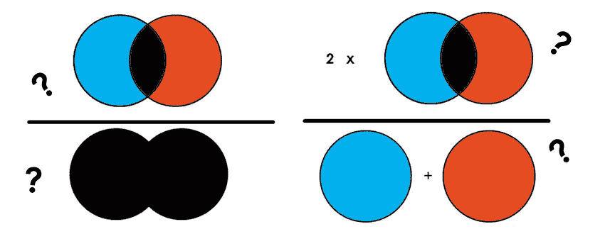
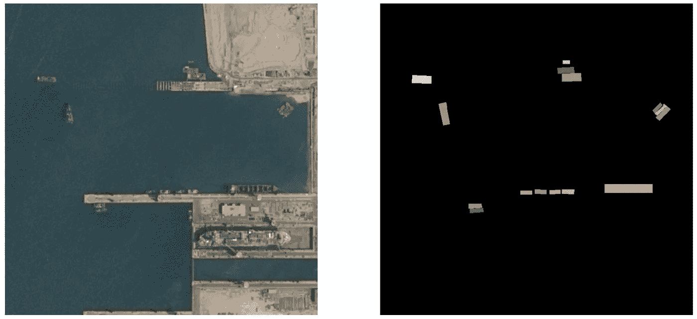
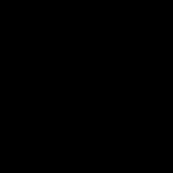
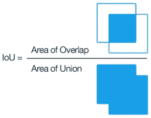
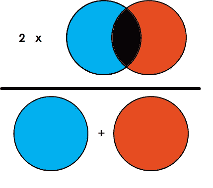

# 评估您的语义细分模型的指标

> 原文：<https://towardsdatascience.com/metrics-to-evaluate-your-semantic-segmentation-model-6bcb99639aa2?source=collection_archive---------0----------------------->

## 您如何知道您的细分模型表现良好？在这里找到答案。



Illustration of IoU and Dice Coefficient.

放射分割。我最喜欢的任务。我会做一个深度学习模型，让它变得更好，更训练有素…但是等等。我如何知道我的模型表现良好？换句话说，语义分割最常见的度量标准是什么？这里有一个关于**基本指标**的简明指南，你需要知道这些指标以确保你的模型表现良好。我还在下面包含了 Keras 实现。

如果你想了解更多关于深度学习的语义分割，请查看 George Seif 的这篇中型文章。

[](/semantic-segmentation-with-deep-learning-a-guide-and-code-e52fc8958823) [## 基于深度学习的语义分割

### 指南和代码

towardsdatascience.com](/semantic-segmentation-with-deep-learning-a-guide-and-code-e52fc8958823) 

**内容:**

1.  像素精度
2.  并集上的交集(雅克卡指数)
3.  骰子系数(F1 分数)
4.  结论、注释、总结

# 1.像素精度

像素精度也许是概念上最容易理解的。*它是图像中被正确分类的像素的百分比。*

**虽然很容易理解，但这绝不是最好的指标。**

乍一看，可能很难看出这个指标的问题。为了揭示这个指标的真实情况，这里有一个场景:假设您通过您的分割模型运行了下面的图像(*左*)。右边的图像是基础事实，或注释(模型应该分割的内容)。在这种情况下，我们的模型试图在卫星图像中分割船只。



Image from [Vlad Shmyhlo](https://towardsdatascience.com/@aion.stu?source=post_page-----9a41cb8924f0----------------------) in article: Image Segmentation: Kaggle experience (Part 1 of 2) in TDS

你看你的分割准确率 **95%** 。太棒了。让我们看看你的分段是什么样子的！



不完全是你所希望的，嗯。我们的计算有问题吗？没有。完全正确。只是有一节课是原图的 95%。因此，如果模型将所有像素分类为该类别，则 95%的像素被准确分类，而另外 5%的像素没有被准确分类。因此，尽管你的准确率高达 95%，但你的模型返回的是一个完全无用的预测。这是为了说明高像素精度并不总是意味着优越的分割能力。

这个问题叫做**阶层失衡**。当我们的类极度不平衡时，意味着一个类或一些类在图像中占主导地位，而其他一些类只占图像的一小部分。不幸的是，类不平衡在许多真实世界的数据集中普遍存在，因此它不能被忽略。因此，我向您展示了两个更好地处理这个问题的替代指标:

# 2.并集交(IoU，Jaccard 索引)

交集-并集(IoU)，也称为 Jaccard 指数，是语义分割中最常用的指标之一，这是有充分理由的。欠条是一个非常简单的指标，非常有效。



IoU calculation visualized. Source: Wikipedia

在阅读下面的陈述之前，先看看左边的图片。简单地说， **IoU 是预测分割和实际情况之间的重叠面积除以预测分割和实际情况之间的联合面积**，如左图所示。该指标的范围为 0–1(0–100%)，0 表示没有重叠，1 表示完全重叠的分段。

对于**二值化**(两类)或**多类分割**，图像的平均 IoU 是通过**取每一类的 IoU 并对它们进行平均**来计算的。(在代码中实现略有不同)。

现在，让我们通过使用与第 1 节相同的场景来尝试理解为什么这个度量比像素精度更好。为了简单起见，让我们假设所有的船(彩色盒子)都属于同一个类。

但是等等，*在我们的语境中重叠和联合到底是什么？上图展示了一幅非常清晰的画面，但我发现在预测与事实的背景下有点难以理解，因为它们不一定像上图描绘的那样重叠。让我们一起来看看预测的分割和地面的真相。*


Predicted segmentation (Left) Ground truth annotation (Right)

先算船欠条吧。我们假设图像的总面积是 100 (100 像素)。首先，让我们考虑一下船只的重叠部分。我们可以假设我们将预测的分割(左)直接移动到地面真实(右)的上方，并查看是否有任何船像素重叠。因为没有像素被模型分类为船只，所以有 0 个重叠的船只像素。

Union 包括从**两幅**图像中被分类为船只的所有像素，减去重叠/交叉。在这种情况下，有 5 个像素(这是一个任意的数字选择)被分类为船只总数。减去为 0 的重叠/相交，得到 5 作为并集的面积。经过计算，我们得知欠条仅仅是 47.5%！参见下面的计算。

详细计算如下:

船只:重叠面积= 0，联合面积= (5+0)-0 =5

*重叠面积/联合面积= 0%*

现在对于黑色背景，我们做同样的事情。

背景:重叠面积= 95，联合面积=(95+100)-95 = 100

*重叠面积/联合面积=95%*

*均值 IoU =(船只+背景)/2 =(0%+95%)/2 =***47.5%**

哇哦。这比我们计算的 95%的像素精度低了很多。很明显，47.5 是我们细分成功的更好的指标，或者更恰当地说，是缺乏成功的指标。

下面是我在自己的项目中使用的一个很好的 Keras 实现:

```
from keras import backend as Kdef iou_coef(y_true, y_pred, smooth=1):
  intersection = K.sum(K.abs(y_true * y_pred), axis=[1,2,3])
  union = K.sum(y_true,[1,2,3])+K.sum(y_pred,[1,2,3])-intersection
  iou = K.mean((intersection + smooth) / (union + smooth), axis=0)
  return iou
```

y_true 和 y_pred 都是**m**x**r**x**c**x**n**其中 m 是图像的数量，r 是行数，c 是列数，n 是类数。

# 3.骰子系数(F1 分数)

简单地说，**骰子系数是 2 *重叠面积除以两幅图像中的总像素数。**(参见第 2 节中对联合区域的解释)。



Illustration of Dice Coefficient. 2xOverlap/Total number of pixels

因此，对于 1 和 2 中使用的相同场景，我们将执行以下计算:

两幅图像的总像素数合计= 200

船舶:重叠面积= 0

*(2 *重叠面积)/(总像素组合)= 0/200 = 0*

背景:重叠面积= 95

*(2 *重叠面积)/(总像素组合)= 95*2/200 = 0.95*

*骰子=(船只+背景)/2 =(0%+95%)/2 =***47.5%**

在这种情况下，我们得到了与借据相同的值，但情况不会总是这样。

骰子系数与借据非常相似。它们是正相关的，这意味着如果一个人说模型 A 在分割图像方面比模型 B 好，那么另一个人也会这么说。像欠条一样，它们的范围都是从 0 到 1，1 表示预测和真实之间的最大相似度。

为了更好的理解它们之间的区别，我推荐阅读下面的栈交换答案:

 [## f1/骰子得分与借据

### begingroup $你的思路是正确的。有几件事很快就发生了。根据这两个指标的定义，我们…

stats.stackexchange.com](https://stats.stackexchange.com/a/276144) 

下面是 Dice 系数的一个实现，输入条件与第 2 节中指定的相同:

```
def dice_coef(y_true, y_pred, smooth=1):
  intersection = K.sum(y_true * y_pred, axis=[1,2,3])
  union = K.sum(y_true, axis=[1,2,3]) + K.sum(y_pred, axis=[1,2,3])
  dice = K.mean((2\. * intersection + smooth)/(union + smooth), axis=0)
  return dice
```

# 4.结论、注释、总结

总之，语义分割最常用的指标是 IoU 和 Dice 系数。我已经在 Keras 中包含了代码实现，并将在下一篇文章中更深入地解释它们。

正如你们中的一些人可能已经注意到的，我故意排除了关于真阳性、真阴性、假阳性和假阴性的讨论和解释。虽然很重要，但我认为它们混淆了我在本文中试图强调的对这些指标的清晰概念理解。

我希望这篇文章能让你对每个指标有更深入的了解，这样你就可以在实现过程中或阅读文献时有更深的理解。