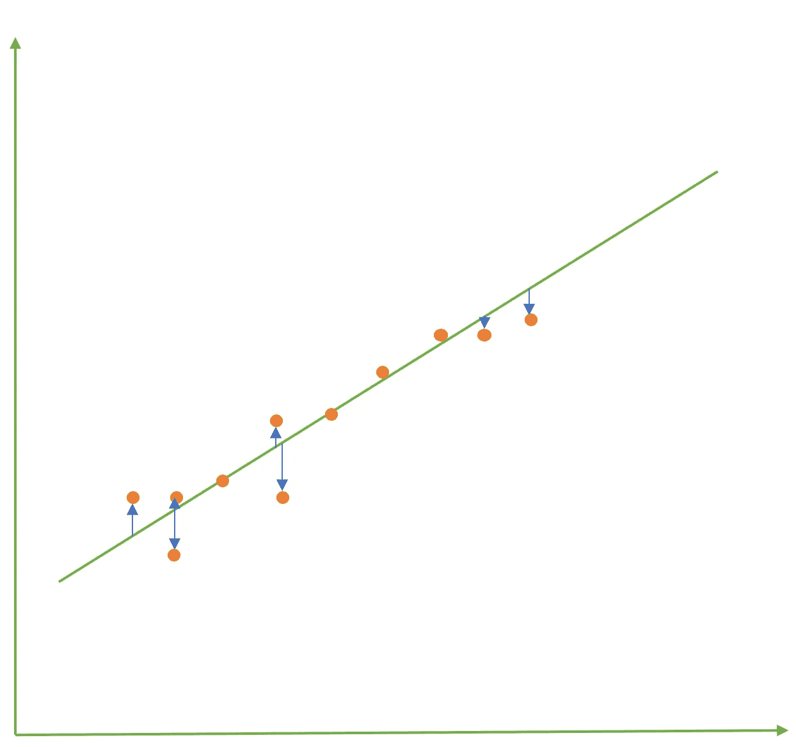

# 用简单的英语理解回归模型的基本度量

> 原文：<https://towardsdatascience.com/metrics-to-understand-regression-models-in-plain-english-part-1-c902b2f4156f?source=collection_archive---------7----------------------->

## ML 概念解释

## 数据科学访谈期望对这些指标有直观的理解

Photo by [Volkan Olmez](https://unsplash.com/@volkanolmez?utm_source=medium&utm_medium=referral) on [Unsplash](https://unsplash.com?utm_source=medium&utm_medium=referral)

很容易记住这样的规则，比如 RMSE 和梅的值应该低，R 的平方和其他味道的 R 的平方值应该高。但是，数据科学面试对候选人的期望并不高。他们不会问你 R 平方值是 0.6 还是 0.7 更好。人们可能会问这样的问题，比如您将使用哪些指标来评估回归模型，以及为什么要使用那个指标？此外，如果你的角色就像公司里的分析翻译，你可能需要用简单的方式向企业解释复杂的概念。所以，这篇文章是关于直观地解释它们，而不是提供代码。很容易从 sci-kit 学习文档或 Stackoverflow 中找到关于如何计算这些分数的代码块。

让我们考虑一个由 11 个观测值(n)创建的简单线性回归模型，这是一个非常少的例子，但应该足以证明这一点。这些观察值用橙色点表示，线性回归方程或最佳拟合线用绿色表示。

Fig 1\. Simple Linear Regression Example

从图 1 我们可以说，线性回归模型并不完美。直线上有四个点，其他点在任一方向上远离直线。橙色点是 y 的实际值，而蓝色箭头在回归线上的起点是预测ŷ.

# 平均绝对误差

如果我们考虑所有的橙色点，并计算预测与实际相差多少，我们会得到该点的误差值。这就是 y 和ŷ.的区别为了计算 MAE，

1.  取 11 个可用观测值中每一个的 y 和ŷ的绝对差值:**⎮yᵢ-ŷᵢ⎮**其中 i ϵ [1，数据集中的总点数]。
2.  对每个绝对差值求和，得到总误差:**σ⎮yᵢ-ŷᵢ⎮**
3.  将总和除以观察总数，得到平均误差值:**σ⎮yᵢ-ŷᵢ⎮/n**

> 梅=σ⎮yᵢ-ŷᵢ⎮/n

每次观察都会产生误差值，误差值可以是任意整数。它可以是零、负数或正数。如果我们简单地将这些误差值相加，得出总误差，我们可能会得到一个不能给出真实性能的数字。

> 很少的正值会导致误差增大，而很少的负值会导致误差减小，最终导致统计数据不能指示模型性能。所以，我们只考虑实际值和预测值的差异。

*注:还有* ***平均偏差误差*** *是将所有误差值相加，不取绝对值。我个人没用过，所以我在跳绳。*

# 均方误差

如何计算 MSE？

1.  取 11 个可用观测值中 y 和ŷ的差值:**yᵢ-ŷᵢ**
2.  平方每个差值:(**yᵢ-ŷᵢ**)
3.  平方和值:**σ**(**yᵢ-ŷᵢ**)其中 i ϵ [1，数据集中的总点数]
4.  除以观察总数:**σ**(**yᵢ-ŷᵢ**)**/n**

> MSE =σ(yᵢ-ŷᵢ)/n

这四个步骤应该会给出该模型的 MSE。但是，我们为什么要消除差异呢？

假设你有两个基于 1000 个例子创建的模型。对于这两个模型，您计算了 MAE，发现完全相同。但是模型之间有一个很明显的差异。一个模型的每个观测值都有一个微小的误差值，而另一个模型有一个极端的误差情况，误差值要么非常高，要么非常低。现在哪款比较好？

如果你是房地产经纪人，想提供房子的估价，你可能希望你的估价有一点偏差，而不是非常准确或不准确。在这种情况下，惩罚较大幅度误差的模型将有助于我们选择合适的模型。我们可以通过计算 MSE 来实现。

通过对实际值和预测值之间的差值求平方，我们能够只考虑负的误差值并惩罚更高的误差值。假设有两个回归模型，误差值分别为-1，- 2，3，2(模型 A)和 1，-5，1.5，0.5(模型 B)。这两种模型的 MAE 都是 2。但是，MSE 将是 3.5 和 7.125。因为模型 B 有一个很大的误差(-5)，它受到 MSE 的严重影响。

另一种解释 MSE 的方法是，误差值的方差(误差分布有多广)！

# 均方根误差

这基本上是 MSE 的平方根。继续使用上面的相同例子，3.5 和 7.125 MSE 将是 1.87 和 2.67 RMSE。唯一的区别是，RMSE 将与目标变量有相同的单位，而 MSE 有平方单位。因为 MSE 是误差值的方差，所以 RMSE 是误差的标准差。

# 均方根对数误差

在参加 Kaggle 比赛之前，我没有用过这个。当实际值和预测值的观测值都很大时，与其他较小的观测值相比，这对观测值的误差会很大。例如，你可能会遇到一个房地产数据集，其中有很好的组合，包括昂贵的豪宅、普通的房子和超便宜的快要散架的房子，比如这些房子。如果一个模型预测价值 100，000 美元的小公寓为 50，000 美元，那么它就差了很多，但如果同一模型预测豪宅的价格为 900，000 美元，而不是 850，000 美元，我们可以认为它很接近。相同的错误值$50k 在相同的数据集中既巨大又微不足道。因此，在这种情况下，为了避免造成误差的实际值和预测值之间相对较大的差异，我们使用 RMSLE

对数通常是用小得多的数量表示大数的一种方便方法。检查这个，10000 的对数值是 4，而 5000 的对数值是 3.6989。当回归模型的 y 和ŷ值变化很大时，较高的数量级会显著增加 RMSE、MSE 和 MAE 的误差。

**计算 RMSLE :**

1.  获取预测+ 1 和实际+ 1 的对数值，并取二者之差，或者获取预测+ 1 和实际+ 1 之比的对数值:(**log**(**yᵢ+ 1)—log(ŷᵢ+1))或 log(**(**yᵢ+1)/(ŷᵢ+1))***(****注:*** *对于预测和实际，如果预测或实际为零，则加+1 以避免未定义的错误)*
2.  将每个值平方并求和:**σ**(**log**(**yᵢ+1)-log(ŷᵢ+1))**
3.  取和的平方根得到 rmsle:√**σ**(**log**(**yᵢ+1)-log(ŷᵢ+1))**

它也可以被认为是考虑预测和实际之间的比例而不是差异的指标。如果 pred₁= 5 万美元，actual₁= 8 万美元，pred₂= 50 万美元，actual₂= 80 万美元。那么在这两种情况下，log ((P+1)/ (A+1))将是相同的。

这里我不打算用房地产的例子来简化计算。假设我们在同一个数据集上有两个不同回归模型的 y(实际值)和 Y^(Predicted 值，如下所示:

**型号 A:**

10，14，18，120，140，1，2

**Y^:** 十，十三，十八，一百，一百三十，一，二

**型号 B:**

Y : 10，14，18，120，140，1，2

**Y^:** 6，9，7，119，130，1.1，1

对于 y 和 Y^的这些值，模型 a 的 RMSE 是 10.217，而 RMSLE 是 0.0938，而模型 b 的 RMSE 是 7.25，而 RMSLE 是 0.4737。如果我们只拿 RMSE 来说，B 型可能看起来更好。但是，如果你只是浏览一下结果，很明显模型 A 表现得更好，RMSE 得分更高只是因为一个预测偏离了很多，这也是更高的量级。

考虑 RMSLE 的另一种方式是，当人们想要惩罚低估多于高估时，RMSLE 工作得很好。例如，模型 A 预测价值 80 万美元的房子为 60 万美元，而模型 B 预测同样的房价为 100 万美元。尽管这两个预测相差 20 万美元，但模型 A 的 RMSLE 值(0.2876)高于模型 B(0.2231)，而 RMSE 值保持不变。

# 决定系数或 R 的平方

我们有 RMSE、MSE、MAE 等指标。通过比较几个模型或同一模型的几个不同版本的这些值，我们可以选择最佳模型。但是，在我们完成一个模型之后呢？所选择的模型适合数据吗？有改进的余地吗？我们可以用 R 平方值来回答这个问题。

回到房地产的例子，假设你有 1，000 行数据，这些数据具有不同的特征来决定一个地区的房价。你只有 10 秒钟来评估该地区一栋新房子的价值。最好的选择是什么？就拿那 1000 套房子的均价报出来，作为新房的估价。尽管这不是一个很好的预测，但很有可能它肯定比随机猜测的错误要少。这被称为基线模型或均值模型或与 x 轴平行的无关系线。因此，我们可以将其与我们更好的线性回归模型进行比较，看看这个模型有多好。这是 R 平方值给我们的。

因此，如果我们取**用平均线计算的误差平方和(SSEM)** 和**用回归线计算的误差平方和(SSER)**之间的差，我们就可以得到由于使用回归线而不是平均线而减少的误差量。该差值除以**平均线的误差平方和**给出了与平均线相比回归线减少的误差比例，基本上是 R 平方值！

**R****=(SSEM—SSER)/(SSEM)= 1—(SSER/SSEM)**

该值始终在[0，1]之间。它也被解释为由模型解释的方差，因为 SSE 基本上是误差的方差，并且通过使用回归模型而不是均值模型，方差减少了一定的量，并且这种误差的减少是由模型“解释”或由模型解释的。

[在下一篇文章中，我将谈论 ***调整的 R 平方，预测的 R 平方，残差图，变量的 P 值，回归系数。*** 敬请期待！](https://medium.com/@manoj.dobbali/metrics-to-understand-regression-models-in-plain-english-part-2-12d362dd39d9)

**注:**

您可能会看到一些等式的分母是 n-p，而不是 n，其中 p 是用于创建模型的独立变量的数量。根据我在在线零售行业的工作经验，这并不重要，因为通常 n >>> p，因此 n-p 倾向于 n。但是在遇到小样本的经典统计中，n 与 n-p 会产生显著的差异。但是为什么在经典统计中要用 n-p 或者自由度呢？这可能是一个潜在的博客帖子！

我喜欢用简单的方式解释复杂的概念。如果你有任何问题或者只是想联系，你可以在 Linkedin 上找到我或者发电子邮件到 manojraj.dobbali@gmail.com 找我。

另外，我推荐阅读 neptune.ai 的另一篇博文:[https://Neptune . ai/blog/performance-metrics-in-machine-learning-complete-guide](https://neptune.ai/blog/performance-metrics-in-machine-learning-complete-guide)