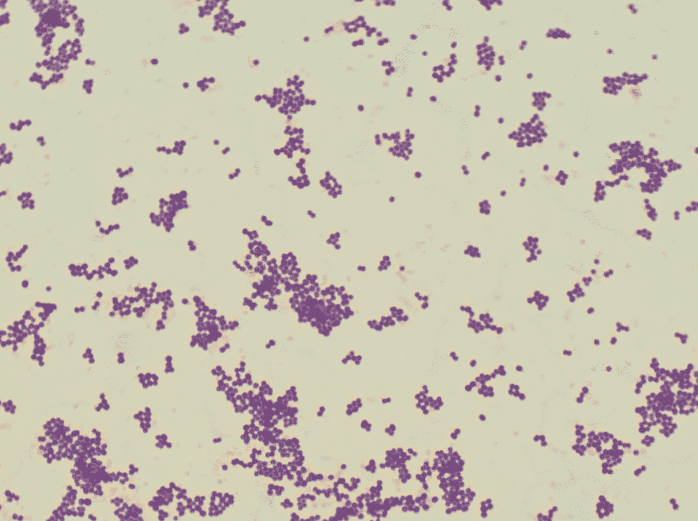
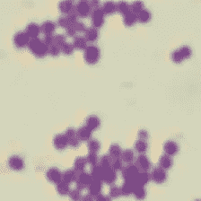
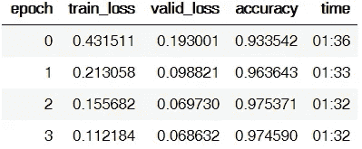
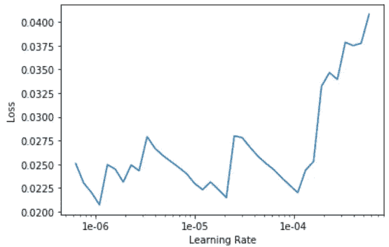
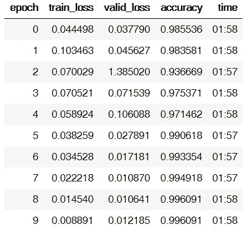
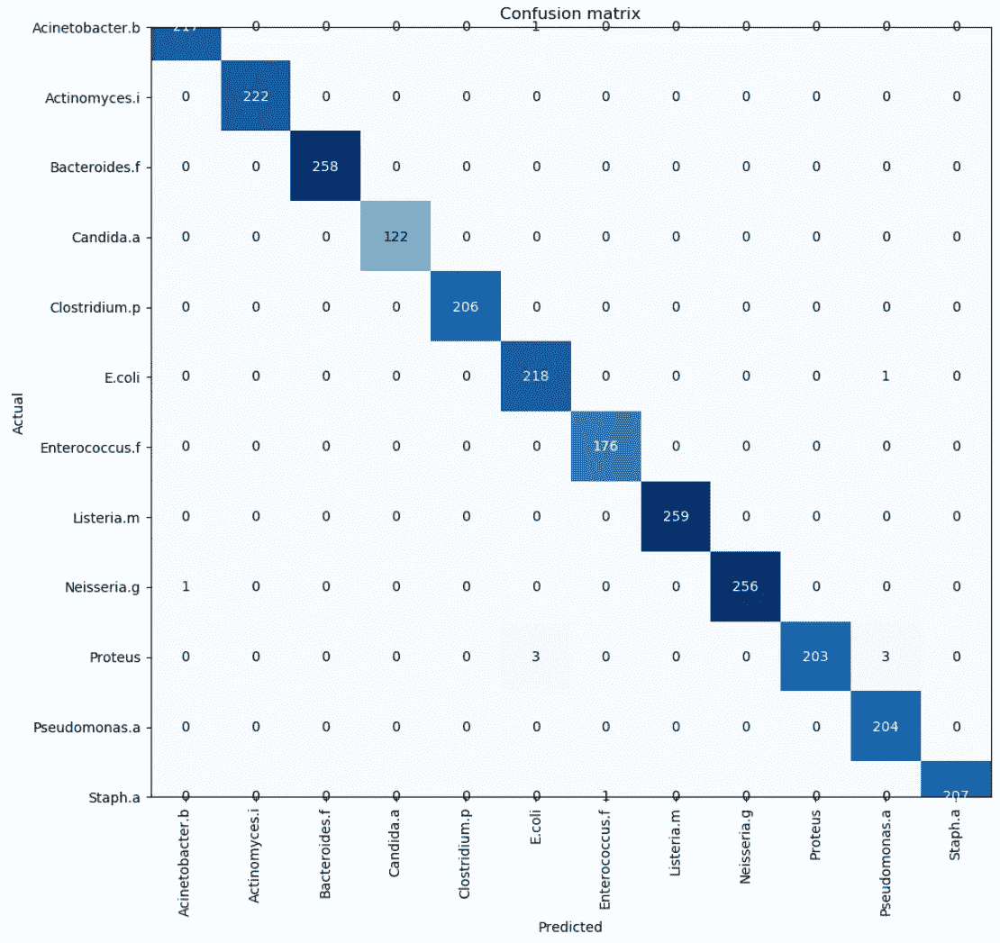
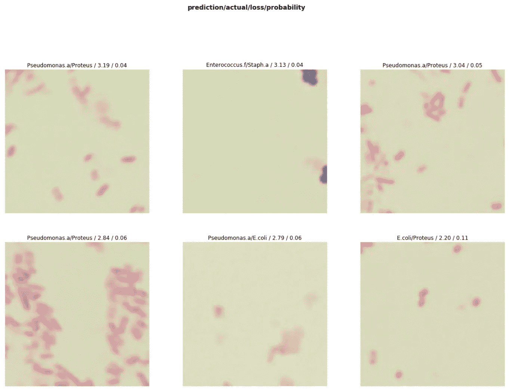

# 使用深度学习的微生物分类

> 原文：<https://towardsdatascience.com/microbe-classification-using-deep-learning-e84312046334?source=collection_archive---------16----------------------->

## 利用 fast.ai 文库对 12 种微生物进行分类


Photo by [Pietro De Grandi](https://unsplash.com/@peter_mc_greats?utm_source=medium&utm_medium=referral) on [Unsplash](https://unsplash.com?utm_source=medium&utm_medium=referral)

**问题**:使用光学显微镜进行微生物鉴定非常耗时，并且需要训练有素的微生物学家。深度学习算法能否成功区分 12 种不同类别的微生物？

**数据**:迪巴斯([http://misztal.edu.pl/software/databases/dibas/](http://misztal.edu.pl/software/databases/dibas/))

整个数据集包含 33 个不同属和物种的 660 幅图像。作为一个概念验证项目，我今天将只研究 12 个不同的类别:*鲍曼不动杆菌、以色列放线菌、脆弱拟杆菌、白色念珠菌、产气荚膜梭菌、粪肠球菌、大肠杆菌、单核细胞增生李斯特菌、淋病奈瑟菌、变形杆菌。、铜绿假单胞菌、金黄色葡萄球菌*

我选择了这 12 种微生物，因为它们是数据集中更具医学相关性的微生物。

每个类别包括大约 20 幅图像，分辨率为 2048 x 1532 像素。样品进行革兰氏染色，并在油浸下使用 100 倍物镜进行评价。图像是用装有 SC30 照相机的 Olympus CX31 显微镜拍摄的。

**设置**:

*   Jupyter 笔记本带 fasti.ai v1 库
*   ResNet-50 型号
*   英伟达 RTX 2060 6GB

**结果**:准确率 99.6%


Photo by [Ian Matyssik](https://unsplash.com/@matyssik?utm_source=medium&utm_medium=referral) on [Unsplash](https://unsplash.com?utm_source=medium&utm_medium=referral)

**第一部分:图像处理**

我决定把图片分成更小的块，因为 2048 x 1532 的原始尺寸相当大。例如，看看下面的原始图像。微生物在物理上很小，如果我们将其大小调整为 224 x 224，边缘和集群等重要特征可能会丢失。



Original 2048 x 1532 image

我编写了一个自定义函数来将图像分解成 224 x 224 的块。

```
def process_image(im):
    imarray = np.array(im)
    im_h, im_w = imarray.shape[:2]
    block_h, block_w = 224, 224

    for row in np.arange(im_h - block_h +1, step = block_h):
        for col in np.arange(im_w - block_w +1, step = block_w):
            im1 = imarray[row:row+block_h, col:col+block_w, :]
            im1 = Image.fromarray(im1)
            global i
            global path
            im1.save(path + "\img" + f"{i}" + ".png")
            i+=1
    print("completed")
```

我运行了每个类的代码，根据需要更改了文件夹名称。

```
from PIL import Image
import numpy as np
import os
i=0
path = r"C:\bacteria\**Staphylococcus.aureus**\edited"
for file in os.listdir(r"C:\bacteria\**Staphylococcus.aureus**\raw"):
    filename = r"C:\bacteria\**Staphylococcus.aureus**\raw" + f"\{file}"
    im = Image.open(filename)
    process_image(im)
```

最终产品看起来像这样:



224 x 224 image blocks

对于大多数原始图像，微生物均匀地分布在载玻片上。但是，某些类别(如念珠菌)的载玻片不太均匀，包含空白区域。为了解决这个问题，我仔细查看了最终产品，并手动删除了空白幻灯片。

我们现在已经为模型构建和培训做好了准备。


Photo by [Robert Katzki](https://unsplash.com/@ro_ka?utm_source=medium&utm_medium=referral) on [Unsplash](https://unsplash.com?utm_source=medium&utm_medium=referral)

**第二部分:培训**

首先，我们导入必要的模块。

```
from fastai.tabular import *
from fastai.vision import *
path = r"C:\bacteria\data"
```

我的文件夹结构:父文件夹(C:\细菌\数据)→带有类名的子文件夹(C:\细菌\数据\念珠菌)→图片

```
np.random.seed(42)
data = ImageDataBunch.from_folder(path, valid_pct=0.2,
        ds_tfms=get_transforms(), size=224, num_workers=4, bs=32).normalize(imagenet_stats)data.classes, data.c, len(data.train_ds), len(data.valid_ds)
```

我们有 12 个不同的类，有 10，234 个训练图像和 2，558 个验证图像。

```
learn = cnn_learner(data, models.resnet50, metrics=accuracy).to_fp16()
```

Fasti.ai 支持混合精度训练，添加**一样简单。to_fp16()** 构建学习器时。对于那些使用英伟达 RTX 显卡的人来说，混合精度大大加快了训练速度，并将内存需求减半。Eric 有一篇关于这方面的优秀文章，你可以在这里阅读:[https://towardsdatascience . com/RTX-2060-vs-gtx-1080 ti-in-deep-learning-GPU-benchmarks-priest-RTX-vs-most-贵-gtx-card-cd47cd9931d2](/rtx-2060-vs-gtx-1080ti-in-deep-learning-gpu-benchmarks-cheapest-rtx-vs-most-expensive-gtx-card-cd47cd9931d2)

```
learn.fit_one_cycle(4)
```



即使没有训练最高层，结果看起来也相当不错。我们现在将解冻顶层，并找到一个合适的学习率。

```
learn.unfreeze()
learn.lr_find()
learn.recorder.plot()
```



我以降低的学习率进一步训练了整个模型。

```
learn.fit_one_cycle(10, max_lr=slice(7e-5, 9e-4))
```



在 10 个周期结束时，我们达到了 99.6%的准确率**。没有明显的过度拟合，因为训练和验证损失是相似的。让我们来看看混淆矩阵。**

```
interp = ClassificationInterpretation.from_learner(learn)
interp.plot_confusion_matrix(figsize=(10,10), dpi=100)
```

****

**主要错误似乎来自变形杆菌对假单胞菌和大肠杆菌对变形杆菌。这是可以理解的，因为所有 3 个物种都是革兰氏阴性杆菌，它们染色并且在光学显微镜下看起来相似。让我们来看看损失最大的图片。**

```
interp.plot_top_losses(6, figsize=(15,15))
```

****

**总之，在这个相当困难的任务上，我们达到了令人钦佩的 99.6%的准确率。事实上，我对这种表现感到相当惊讶，因为很难在视觉上区分某些类。比如你能分辨出葡萄球菌吗？金黄色葡萄球菌和肠球菌。fecalis 分开？**

****

**也许这个模型正在学习我还没有认识到的特征，需要进一步的工作来提高这个模型的“可解释性”。**

**感谢阅读！**

****

**Photo by [Ethan Dow](https://unsplash.com/@ethandow?utm_source=medium&utm_medium=referral) on [Unsplash](https://unsplash.com?utm_source=medium&utm_medium=referral)**