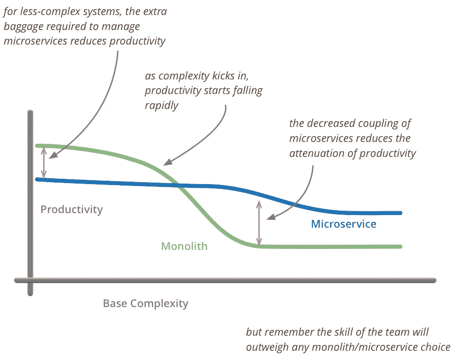

# 微服务架构:简要概述以及为什么您应该在下一个项目中使用它

> 原文：<https://towardsdatascience.com/microservice-architecture-a-brief-overview-and-why-you-should-use-it-in-your-next-project-a17b6e19adfd?source=collection_archive---------3----------------------->

## 微服务架构的背景以及微服务架构相对于整体架构的优势

# 背景

在软件开发的早期，编程语言的门槛很高，只有拥有科学和数学博士学位的人才能使用这些编程语言。1964 年，通用编程语言 [**BASIC**](https://en.wikipedia.org/wiki/BASIC_Programming) 被开发出来。它降低了门槛，使得所有系的非博士学生也可以编写程序。随着 20 世纪 60 年代计算应用的快速增长，软件变得庞大而复杂。计算机科学家试图用古老而成熟的技术来解决软件系统的复杂性:**分而治之**。

[***大卫·帕纳斯***](https://en.wikipedia.org/wiki/David_Parnas) 于 1972 年发表了他的开创性论文“ [**关于将系统分解成模块**](https://www.win.tue.nl/~wstomv/edu/2ip30/references/criteria_for_modularization.pdf) ”的标准，其中引入了 M **余度**和 I **信息隐藏**的概念。同样， [***埃德格·w·迪杰斯特拉***](https://en.wikipedia.org/wiki/Edsger_W._Dijkstra) 在他 1974 年发表的论文**【论科学思想的作用】中引入了**分离的概念。Parnas、Dijkstra 和其他人的工作导致了 20 世纪 70 年代**模块化软件开发**的兴起，其原则是将一个大型复杂的软件系统分解成通过内部接口通信的**松散耦合、高度内聚的**模块。简单来说，“**松散耦合**意味着模块之间的依赖性应该非常低，而“**高度内聚**”意味着一个模块应该专注于单个或相似的功能。随着 20 世纪 90 年代互联网和 Web 的兴起，软件系统在商业应用中变得广泛，变得更加复杂和庞大。尽管模块化被用来降低软件应用程序的复杂性，但由于软件子系统的软模块边界容易被跨越和误用，它通常没有帮助。另一种软件架构模式在 20 世纪 90 年代非常流行，用于开发商业应用程序:**分层架构**。通常，业务 Web 应用程序分为几个层:表示层、业务层和数据库层。****

**在 1997 年， ***Brian Foote*** 和[***Joseph Yoder***](https://en.wikipedia.org/wiki/Joseph_Yoder_(computer_scientist))已经分析了许多商业应用并发表了“ [**大泥球**](https://en.wikipedia.org/wiki/Big_ball_of_mud) ”的论文。该文件指出**

****

**Big Ball of Mud**

**大多数商业应用程序都存在以下问题:**

*   **无节制的增长**
*   **太多的责任**
*   **缺乏适当的架构**
*   **意大利面条代码**
*   **让它工作。掩盖在地毯下的问题**

**在 21 世纪后期，由于移动互联网(Wifi、智能手机)和更快网络的兴起，软件行业发生了寒武纪大爆发。此外，软件开始吞噬世界，除了传统的软件/技术公司，几乎所有类型的公司都开始开发或使用软件，如银行、保险、餐馆、酒店、音乐、驾驶等。许多新公司，如**脸书**、**推特**、**优步**、**网飞**、 **Spotify** 带来了创新的想法、积极的战略、快速的方法，这导致了他们的应用程序呈指数级增长。突然，组织和软件工程师发现单一架构不能处理现代、快节奏或网络规模软件开发的挑战。**

# **单片架构的局限性**

*   ****应用程序扩展:**随着成功的 Web 规模公司享受指数级增长，他们的软件也需要支持高水平的可扩展性。有时，只有软件的一部分(例如 CPU 密集型或 I/O 密集型)需要单独扩展和处理(用多语言编程实现)。单片软件作为一个单元工作，使用单一的编程语言开发，使用单一的技术堆栈。要实现水平扩展，整个应用程序都需要进行扩展。相应地，由于单片软件只支持一种编程语言，所以不可能用其他编程语言或其他技术栈来实现其中的一个模块。**
*   ****开发速度:**为了缩短上市时间，现在每个公司都希望有快速的特性开发。在一个大型的、复杂的、通常有几百万行的单片应用程序中，添加新功能是非常缓慢的，因为这样一个单片应用程序给开发人员带来了巨大的认知负担。巨型单片应用程序的模块是紧密耦合的，这给添加新功能带来了额外的挑战。因此，在一个单一的应用程序中添加新功能通常很慢，而且非常昂贵。**
*   ****开发扩展:**公司通常希望通过雇佣更多的开发人员来并行开发，以获得竞争优势或抓住唾手可得的果实。开发人员不能在一个巨大的、整体的、紧密耦合的代码基础上自主工作，并且经常需要额外的同步，以防止彼此的工作发生冲突。增加更多的开发人员并不会产生更多的功能，有时甚至会产生更少的功能。同样，由于理解整个整体代码库的认知负荷很高，新员工或应届毕业生通常需要很长时间来编写第一行高效的代码。2008 年，我在柏林的一家电信公司面试，那里的技术经理带着自豪的微笑告诉我，他们有数百万行 C++代码库，新开发人员只能在 3-6 个月后才能编写出高效的代码。**
*   ****发布周期:**大型整体式应用程序的发布周期通常太长，通常需要 6 个月到 2/3 年，再加上因其规模而导致的几个月到几年的延迟。在现代，大的发布周期通常使公司处于竞争劣势，因为在这个大的发布间隙内，新公司可以来抢走它的市场。**
*   ****模块化**:在单片架构中，模块之间的边界往往是内部接口。一旦应用程序变大，模块之间的界限就开始瓦解。因此，通常在整体架构中的模块是紧密耦合的，而不是“松散耦合，高度内聚”的双重格言。如果我们将软件开发与社会相比较，那么整体模块化就像道德的、宗教的规则，我们知道这些规则不能确保社会的法律和秩序。**
*   ****现代化:**由于许多因素(例如，利用现代硬件、浏览器、网络带宽、技术堆栈或吸引优秀的开发人员)，现有的成功应用程序需要现代化。整体应用程序的现代化通常既昂贵又耗时，因为它需要在不中断服务的情况下对整个应用程序进行大规模现代化。**

# **微服务架构**

****在 2010 年代**，其他颠覆性技术的出现对软件开发格局产生了重大影响: [**云计算**](https://en.wikipedia.org/wiki/Cloud_computing) **，容器化(**[**Docker**](https://www.docker.com/)**，**[**Kubernetes**](https://kubernetes.io/)**)，** [**DevOps**](https://en.wikipedia.org/wiki/DevOps) 。同样，一些高效、轻量级的新编程语言如 [**Golang**](https://golang.org/) ， [**Rust**](https://www.rust-lang.org/) ， [**Swift**](https://swift.org/) 出现，而一些高效、易用、轻量级的编程语言如 [**、JavaScript**](https://en.wikipedia.org/wiki/JavaScript) ， [**Python**](https://www.python.org/) 成为主流。软件开发模式也发生了变化。 [**瀑布**](https://en.wikipedia.org/wiki/Waterfall_model) 软件开发模式几乎被抛弃，取而代之的是快速、迭代、增量的软件开发方法论: [**敏捷软件开发**](https://en.wikipedia.org/wiki/Agile_software_development) 。计算机硬件也发生了巨大的变化，更便宜、更快的主内存和多核 CPU 的崛起。数据存储领域也发生了变化。新的数据库技术如[**【NoSQL】**](https://en.wikipedia.org/wiki/NoSQL)[**NewSQL**](https://en.wikipedia.org/wiki/NewSQL)涌现并成为主流**

**为了应对现代软件应用的复杂性，利用云计算、容器化、DevOps、现代编程语言的优势，满足现代软件开发(快速开发、横向扩展)的需要，2012 年出现了一种新的软件架构风格: [**微服务架构**](https://en.wikipedia.org/wiki/Microservices) 。那么，到底什么是微服务架构呢？微服务架构有许多定义，以下是我的定义:**

> ****微服务架构是关于将软件系统分解成可独立部署的自治单元，这些自治单元通过轻量级、语言不可知的方式进行通信，它们一起实现业务目标。****

****微服务架构**也使用与**分而治之**相同的技术来处理软件系统的复杂性，如模块化单片架构，其中复杂的软件系统被分成许多微服务，这些微服务通过外部接口进行通信。模块化整体架构和微服务架构的主要区别在于，每个微服务都可以独立部署，而所有模块通常作为一个整体部署(部署整体)。如中所示**

****

**Monolith vs Modular Monolith vs Microservices**

**上图，单片应用程序是一个单元(紧密耦合),就像一个立方体。模块化应用程序就像一个立方体，可以包含小模块，但是模块不能分开，只能一起部署。微服务就像一个由乐高积木制成的乐高立方体，积木松散耦合，易于分离，所有的乐高积木一起构成了这个立方体。**

## **优势**

*   ****应用扩展:**首先，微服务通常是无状态的，如果使用 **Docker** 、 **Kubernetes** 或其他基础设施仔细部署，微服务可以在几秒钟内提供水平扩展。事实上，正是这种高度的横向扩展使得像网飞、Spotify、优步、谷歌这样的公司从整体架构转向微服务架构。其次，如果一个微服务是 CPU 密集型的，那么它可以用 CPU 优化编程语言(C/C++，Rust)来实现，而其他微服务可以用解释语言(Java，PHP)来实现。**
*   ****开发速度:**微服务的规模往往相当小(几百到几千)。由于规模的原因，在微服务中添加新功能通常会更快。**
*   ****开发扩展:**微服务是自治的，可以独立开发。因此，开发人员的可扩展性更好，因为不同的开发人员/团队可以自主地在不同的微服务上工作，而不会碰到彼此的代码。因此，公司可以很容易地雇佣更多的开发人员，并扩大开发规模。类似地，由于其规模，微服务给新雇佣的开发人员或应届毕业生带来的认知负荷很小，新开发人员通常可以在几天内编写出高效的代码，而不是几周或几个月。**
*   ****发布周期:**在我看来，微服务架构最酷的特点就是每个微服务都是可独立部署的。因此，微服务应用中的软件发布周期要短得多，而且有了 **CI/CD** ，每天都可以发布几个版本。**
*   ****模块化**:在微服务架构中，微服务之间的边界是很难跨越的外部接口，即物理(网络)。因此，正确设计的微服务通常提供“松散耦合、高度内聚”的模块化。如果把软件开发比作社会，那么微服务调制就像严格的国家、国际法律，带有警察/惩罚。众所周知，通常严格的国家和国际法律可以确保社会的法律和秩序。**
*   ****现代化**:由于微服务是松散耦合的，并且只能通过语言无关的方式相互通信，因此单个微服务可以很容易地被新的微服务所取代，新的微服务可以使用新的编程语言和技术堆栈来开发，而不会影响整个系统。微服务架构的现代化是渐进的，而不是大爆炸。**

## **不足之处**

**像生活中的任何事情一样，微服务架构也有它的价格和相当多的缺点。它绝不是一把能够解决软件应用程序或组织中所有问题的金锤。毫不奇怪，同为微服务专家的 [***萨姆·纽曼***](https://twitter.com/origsmartassam?lang=en) 在他广受好评的书《 [**构建微服务**](https://samnewman.io/books/building_microservices/) 》中，提出了一个场景，即在没有适当的架构/考虑的情况下从整体架构转向微服务架构，从而导致噩梦般的状况。还有一些类似“ [**再见微服务:从 100 个问题儿童到 1 个超级巨星**](https://segment.com/blog/goodbye-microservices/) ”或“[**2018 年微服务疯狂之死**](https://dwmkerr.com/the-death-of-microservice-madness-in-2018/) ”的博文，作者们在其中讨论了他们从 Monolith 转向微服务架构所遭受的大量磨难和痛苦。以下是微服务架构的一些缺点:**

*   **设计复杂性:整体架构通常为业务应用提供“一刀切”的解决方案。例如，如果一个 Web 应用程序有几千行代码或几百万行代码，那么 Monolithic Architecture 会给出相同的解决方案(Enterprise Java 或 Ruby on Rails 或 PHP)。但在微服务架构中，根据应用和用例，可能有许多解决方案。因此，如果针对错误的应用规模/类型采用了错误的解决方案(例如，给成年人穿上小孩的衣服，反之亦然)，那么微服务架构注定会失败。此外，设计微服务具有挑战性，因为与单片相比，移动部件要多得多。通常情况下，设计糟糕的微服务比整体服务更糟糕。**
*   ****分布式系统复杂性:**微服务通常是分布式系统，我们知道，与单机系统相比，分布式系统非常复杂，面临着一系列独特的挑战。对分布式系统的详细讨论超出了本文的范围，但是感兴趣的读者可以阅读“ [**分布式系统的谬误**](https://en.wikipedia.org/wiki/Fallacies_of_distributed_computing) ”。简而言之，分布式微服务会出现以下问题: ***整体系统延迟更高，网络故障或单个节点故障会使整个系统宕机，操作复杂性更高*** 。**
*   ****运营复杂度**:复杂的单片应用一旦分解成许多微服务，复杂度往往会从源代码转移到运营上。日志记录、监控等简单操作变得更加复杂，因为需要处理的不是一个系统，而是更多的系统。通常，现有的测井/监测工具不适合微服务，需要新的测井、监测工具。跟踪在微服务中也非常重要，它可以衡量单个微服务对服务请求的性能/延迟。与单片应用相比，微服务中的完整系统测试同样非常复杂。同样，服务发现和弹性也需要新的基础设施。正如著名的计算机科学家和微服务大师 Martin Fowler 指出的那样，由于操作的复杂性，微服务架构的初始开发速度比整体架构慢。**

****

**Source: [https://martinfowler.com/bliki/MicroservicePremium.html](https://martinfowler.com/bliki/MicroservicePremium.html)**

*   **安全:软件系统中的安全通常是房间里的大象，每个人都可以看到，但没有人愿意谈论。保护一个软件应用程序是困难的，保护数百个通常是分布式系统的微服务是一个相当大的挑战。**
*   ****数据共享和数据一致性:**理想情况下，每个微服务都应该有自己的数据存储。缺点是微服务需要在它们之间共享数据来实现业务目标。数据一致性是另一个挑战，因为不推荐使用传统的**两阶段锁定来支持分布式数据库中的一致性，原因有二:它不可伸缩，并且许多现代数据存储不支持它。大多数现代的 [**NoSQL 数据库**](https://en.wikipedia.org/wiki/NoSQL) 只提供 [**最终一致性**](https://en.wikipedia.org/wiki/Eventual_consistency) 需要仔细设计。****
*   ******通信复杂性:**正如已经讨论过的，微服务通过流程/网络边界实现了严格的模块化和开发自主性。缺点是服务只能通过物理网络进行通信，这最终会导致更高的网络延迟。微服务之间的通信方式有很多种:**同步通信**使用 [**REST**](https://en.wikipedia.org/wiki/Representational_state_transfer) ， [**gRPC**](https://en.wikipedia.org/wiki/GRPC) 或**异步通信**使用 [**消息队列**](https://en.wikipedia.org/wiki/Message_queue) ， [**消息代理**](https://en.wikipedia.org/wiki/Message_broker) 其中各有利弊。同步通信更容易实现，但会导致所谓的分布式整体。通过消息传递的异步通信提供了更多的灵活性，但代价是更高的实现复杂度。在微服务架构中，根据应用选择正确的通信机制也具有挑战性。****

# ****结论****

****的确，设计和实现微服务架构具有挑战性，与单片软件架构相比，需要范式转变。同样，微服务架构也绝不是能够解决各种应用复杂性问题的灵丹妙药。另一方面，也绝不是**炒作带动发展**或者 [**货邪教**](https://en.wikipedia.org/wiki/Cargo_cult_programming) 。考虑到一切，我相信微服务架构对于现代软件开发来说是一个非常有用和方便的工具。 ***对于通常开发复杂软件的大型企业来说，微服务架构是解决复杂性并在市场中具有竞争力的唯一途径*** 。对于中小型企业来说，微服务架构也应该用于可持续的软件开发，这可以带来长期的好处。值得注意的是，微服务架构的早期采用者( **Spotify、网飞、Linkedin、亚马逊、谷歌**)凭借其微服务架构取得了超越竞争对手的显著竞争优势。****

****如果你觉得这很有帮助，请分享到你最喜欢的论坛上( **Twitter，脸书，LinkedIn** )。高度赞赏评论和建设性的批评。感谢阅读！****

****如果你对微服务架构感兴趣，也可以看看我下面的文章:****

**** [## 有效的微服务:10 个最佳实践

### 正确实施微服务架构的 10 个技巧

towardsdatascience.com](/effective-microservices-10-best-practices-c6e4ba0c6ee2)  [## 微服务架构及其 10 个最重要的设计模式

### 微服务架构、每个微服务的数据库、事件源、CQRS、Saga、BFF、API 网关、扼杀者、电路…

towardsdatascience.com](/microservice-architecture-and-its-10-most-important-design-patterns-824952d7fa41)  [## 透过宣传看:模块化整体软件架构真的死了吗？

### 现代软件开发中模块化整体软件体系结构的真实性检验

medium.com](https://medium.com/@md.kamaruzzaman/looking-beyond-the-hype-is-modular-monolithic-software-architecture-really-dead-e386191610f8)****