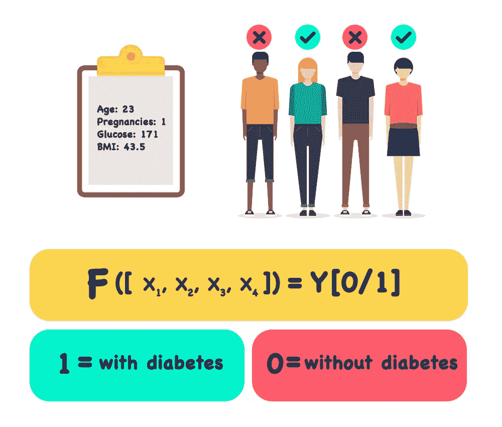
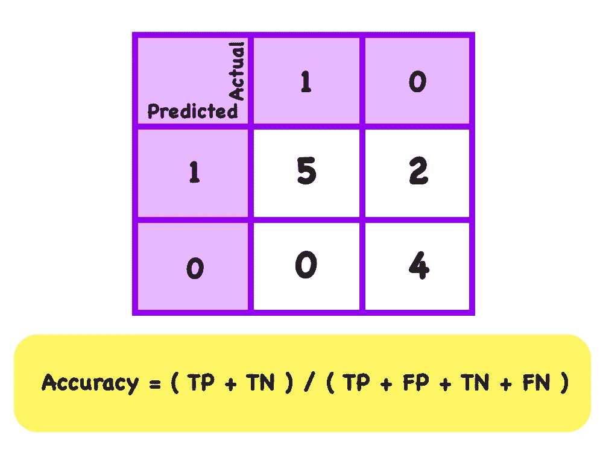
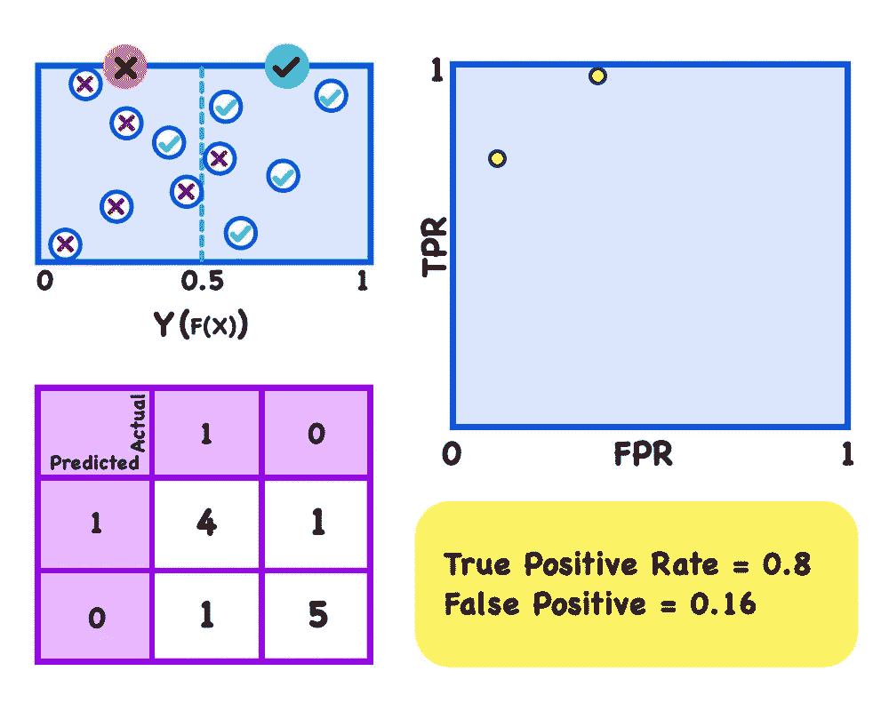

# 微软人工智能简介—第 1 部分

> 原文：<https://towardsdatascience.com/microsoft-introduction-to-ai-part-1-879e31d6492a?source=collection_archive---------10----------------------->

Image used under licence from Getty Images.

## 机器学习

你是不是有点像我，想要学习人工智能，尽管对其中涉及的数学感到有点害怕？也许你认为这些概念太难理解，你会力不从心。我最近完成了[微软人工智能入门课程](https://www.classcentral.com/course/edx-introduction-to-artificial-intelligence-ai-9164)，并写了课程笔记来帮助我记住我所学的知识。我试着用一种简单的方式来写这些笔记，让它们更容易阅读。我最近成为一名阿姨，买了几本与技术和空间相关的儿童书籍，我真的很喜欢作者和插画师如何设法简化复杂的主题。因此，我受到启发，以类似的方式处理这些话题，简化它们，使它们更容易理解。

* [如果你想了解课程笔记和其他与技术和产品设计相关的笔记背后的一些背景信息，你可以在这里找到更多。](https://medium.com/@christinecalo/a-little-about-christines-notes-8ea2205594a2) *

# 摘要

[微软人工智能入门课程](https://www.classcentral.com/course/edx-introduction-to-artificial-intelligence-ai-9164)提供了人工智能的概述，并探索了为人工智能提供基础的机器学习原则。从这门课程中，你可以发现将人工智能功能集成到应用程序中的基本技术。学习如何使用软件来处理、分析和提取自然语言的含义。了解软件如何处理图像和视频，以人类的方式理解世界。了解如何构建智能机器人，实现人类和人工智能系统之间的对话。

Image created by the author. [Microsoft Introduction to Artificial Intelligence Course](https://www.classcentral.com/course/edx-introduction-to-artificial-intelligence-ai-9164)

这个课程需要大约 1 个月的时间来完成，所以我写的 1 篇中型文章包含了一周的内容。这意味着你只需要大约 18 分钟就可以读完一周的内容，这是一种快速的学习方式。没有证书的课程是免费的，但是，如果你想要一个证书作为完成的证明，是要收费的。有一些与本课程相关的实验，我不会包括在笔记中，因为我认为最好的学习方法是实际做实验。然而，如果你想了解人工智能背后的基本理论，并想以一种可能比其他资源简单得多的方式来学习它，这些笔记是有用的。我试着用通俗易懂的语言来写它，并加入了视觉效果来帮助说明这些想法。如果你没有时间学习这门课程，这些笔记会很有用，这是快速浏览核心概念的一种方法。或者，如果你像我一样学过这门课，你可以用这些笔记来记住你学到的东西。

> **指导老师:**
> 
> graeme Malcolm——微软学习体验的高级内容开发人员。

# 摘要

本课程分为四个部分，包括:

## **1。机器学习(*这篇中型文章将只关注这一部分)**

了解关于人工智能和机器学习的基础知识。

## 2.[语言与交流](/microsoft-introduction-to-ai-part-2-f7cfb6a5f1e3)

学习如何使用软件来处理、分析和提取自然语言的含义。

## 3.[计算机视觉](/microsoft-introduction-to-ai-part-3-cb21d7a5e119)

了解如何使用软件处理图像和视频，以我们的方式理解世界。

## 4.[以对话为平台](/microsoft-introduction-to-ai-part-4-d310033bdb07)

了解如何构建智能机器人，实现人类和人工智能系统之间的对话交流。

Image created by the author.

# **机器学习**

本课程的“机器学习”部分将涉及以下主题:

> 什么是人工智能？
> 
> 什么是机器学习？
> 
> 监督
> 
> 无人监督的
> 
> 回归
> 
> 分类
> 
> 使聚集

Illustration by Michael Korfhage for HR Magazine [SHRM](https://www.shrm.org/hr-today/news/hr-magazine/0417/pages/recruiting-gets-smart-thanks-to-artificial-intelligence.aspx).

# 什么是人工智能？

人工智能(AI)是一种让人们通过与智能软件合作来完成更多工作的方式。你可以把它想象成让科技更人性化。人工智能是一种可以从现代世界中可用的大量数据中学习的技术。从这些数据中学习，它可以理解我们人类的语言，并以类似的方式做出反应。是技术可以像我们人类一样看待和解释这个世界。

Illustration by [Justin Middendorp](https://dribbble.com/shots/3653859-Machine-Learning).

# 什么是机器学习？

机器学习(ML)为人工智能提供了基础。

那是什么呢？

机器学习使计算机能够学习并根据数据做出预测或决策，而无需显式编程。顾名思义，这是一种利用数据训练软件模型的技术。模型是现实世界过程的数学表示。模型从训练案例(训练情况或示例)中学习，然后我们可以使用训练好的模型来预测新的数据案例。这一点的关键是要理解，从根本上说，计算机非常擅长一件事，那就是执行计算。为了让计算机根据数据做出智能预测，我们只需要一种方法来训练它进行正确的计算。

我们从包含历史记录的数据集开始，我们通常称之为“案例”或“观察”。每个观察值包括数字特征。数字特征基本上是我们正在处理的项目的特征，每个特征都有一个数字值。

Illustration by [Vecteezy](https://www.vecteezy.com/).

我们称数字特征为 x。

总的来说，我们也有一些我们试图预测的值，我们称之为 Y。我们使用我们的训练案例来训练机器学习模型，以便它可以根据 X 中的特征计算 Y 的值。因此，用非常简单的术语来说，我们正在创建一个对一组特征“X”进行操作的函数，以产生预测“Y”。如果这令人困惑，请不要担心，在下一节我们开始应用真实世界的例子时，这将更有意义。

现在一般来说，有两大类机器学习，它们被称为**监督的**和**非监督的**。

# 监督

在监督学习场景中，我们从包括我们想要预测的变量的已知值的观察开始。我们称这些为“标签”。由于我们从包含我们试图预测的标签的数据开始，我们可以仅使用一些数据来训练模型，并保留其余的数据，这些数据可用于评估模型的性能。然后，我们使用机器学习算法来训练一个模型，使特征符合已知标签。

因为我们从已知的标签值开始，所以我们可以通过将函数预测的值与我们已知的实际标签值进行比较来验证模型。然后，当我们对模型运行良好感到高兴时，我们可以将它用于标签未知的新观察，并生成新的预测值。

In this example we know the value of both X (numeric feature) and Y (variable we want to predict). Since we know X and Y we can use this algorithm to train our model. Once the model has been trained and we are happy that it works well we can use this model to calculate Y for when X is unknown. Illustration by [Vecteezy](https://www.vecteezy.com/).

# 无人监督的

无监督学习不同于监督学习，因为这一次我们在训练数据集中没有已知的标签值。我们通过寻找观察值之间的相似性来训练模型。在模型被训练之后，每个新的观察值被分配到具有最相似特征的观察值的聚类中。

In this example the value Y is unknown and so the way we train the model is through finding similarities between the observations. The observations are categorised in clusters that have similar characteristics. Once we train the model based on these clusters we can use it to predict the value of Y by assigning a new observation to a cluster. Illustration by [Vecteezy](https://www.vecteezy.com/).

# 回归

好吧，让我们从一种叫做“回归”的监督学习技术开始。假设我们有一些健康试验参与者的历史数据。我们有一些信息，比如他们做了什么运动，消耗了多少卡路里，还有很多关于他们的数据和信息。在这种情况下，我们可以使用机器学习来预测任何新参与者在进行一些练习时可能会燃烧多少卡路里。当我们需要预测一个数值时，比如一笔钱或一个温度或卡路里数，我们使用的是一种叫做回归的**监督学习技术。**

例如，让我们假设 Rosy 是我们健康研究的参与者。这里她正在做一些举重练习。当 Rosy 第一次报名参加这项研究时，我们收集了一些关于她的数据。我们还在她锻炼时收集数据，并使用健身监视器智能手表捕捉数据。

现在我们要做的是使用 Rosy 运动中的特征来模拟燃烧的卡路里。这些数字特征(X)是她的年龄、体重、心率、持续时间等等。在这种情况下，我们知道所有的功能，我们知道 231 卡路里的标签值(Y)。因此，我们需要一个算法来学习操作 Rosy 所有锻炼功能的函数，以给我们一个 231 的结果。

Illustration by [Vecteezy](https://www.vecteezy.com/).

当然，只有一个人的样本不可能给我们一个通用的函数。因此，我们需要做的是从许多不同的参与者那里收集相同类型的数据，并根据这个更大的数据集来训练我们的模型。

Illustration by [Vecteezy](https://www.vecteezy.com/).

在我们对模型进行了训练，并且我们有了一个可以用来计算我们的标签 Y 的通用函数之后，我们就可以在这样的图表上绘制针对 X 值的特定特征计算的 Y 值。

Image created by the author.

然后我们可以插入 X 的任何新值来预测未知的 y。

Image created by the author.

现在，因为我们从包含我们试图预测的标签的数据开始，所以我们可以仅使用一些数据来训练模型，并保留其余的数据来评估模型性能。

然后，我们可以使用模型来预测评估数据的 **(F(X))** ，并将预测或评分标签与我们知道为真的实际标签进行比较。**预测水平和实际水平之间的差异就是我们所说的“残差”。**残差可以告诉我们模型中的误差水平。

Image created by the author.

现在有几种方法可以测量模型中的误差，其中包括**均方根误差(RMSE)** 和**平均绝对误差(MAE)** 。这两个都是模型中误差的绝对度量。

Image created by the author.

例如，RMSE 值为 5 意味着测试误差的标准偏差为 5 卡路里。当然，根据你的预测，绝对值会有很大的不同。5 卡路里的误差似乎表明这是一个相当好的模型。但是，如果我们预测一次锻炼需要多长时间，误差为 5 个小时，这将是一个非常糟糕的模型。

因此，您可能希望使用相对度量来评估模型，以 0 到 1 之间的相对值来表示更一般的错误级别。**相对绝对误差(RAE)** 和**相对平方误差(RSE)** 产生一个度量，其中误差越接近 0，模型越好。

Image created by the author.

**决定系数(CoD(R2))** 我们有时称之为 **R 的平方**是另一个相对度量，但这一次更接近 1 的值表示非常适合该模型。

Image created by the author.

# 分类

我们已经了解了如何训练回归模型来预测数值。现在是时候看看**另一种叫做分类**的监督学习了。分类是一种技术，我们可以用它来预测某样东西属于哪个类或类别。最简单的变体是二进制分类(1 和 0)，我们预测一个实体是否属于两个类别中的一个。它通常用于确定实体的真假。

例如，假设我们在我们的健康诊所里有很多病人，我们收集了一些个人信息。我们运行一些测试，我们可以确定哪些病人是糖尿病患者，哪些不是。我们可以学习一个可以应用于这些患者特征的函数，对于糖尿病患者给出结果 1，对于非糖尿病患者给出结果 0。

Illustration by [Vecteezy](https://www.vecteezy.com/).

更一般地说，二元分类器是一个可以应用于特征 X 以产生 Y 值 1 或 0 的函数。

Illustration by [Vecteezy](https://www.vecteezy.com/).

这个函数实际上不会计算 1 或 0 的绝对值，它会计算 1 和 0 之间的值。我们将使用一个阈值(图中的虚线)来决定结果应该计为 1 还是 0。

The threshold is represented as the dotted line. Image created by the author.

当您使用模型来预测值时，根据结果值落在阈值线的哪一侧，结果值被分类为 1 或 0。

Image created by the author.

因为分类是一种监督学习技术，所以我们保留了一些测试数据，以使用已知标签来验证模型。

Image created by the author.

如果模型预测的测试观察值为 1，而实际的标签值为 1，则被视为真阳性(TP)。

Image created by the author.

类似地，在模型预测为 0 而实际标签为 0 的情况下，这些是真阴性(TN)。

Image created by the author.

现在，阈值的选择决定了如何将预测分配给类别。在某些情况下，预测值可能非常接近阈值，但仍然分类错误。您可以移动阈值来控制预测值的分类方式。在糖尿病模型的情况下，可能有更多的假阳性(FP)更好，但减少假阴性(FN)的数量，以便更多处于糖尿病风险中的人被识别。

Image created by the author.

模型产生的真阳性(TP)、假阳性(FP)、真阴性(TN)和假阴性(FN)的数量对于评估其有效性至关重要。

Image created by the author.

这些的分组通常显示在下面显示的所谓的**混淆矩阵**中。这为计算分类器的性能度量提供了基础。最简单的衡量标准是准确性，即正确分类的案例数除以案例总数。

Image created by the author.

在这种情况下，有 5 个真阳性(TP)和 4 个真阴性(TN)。还有 2 个假阳性(FP)，没有假阴性(FN)。这给了我们总共 11 个预测中的 9 个正确预测，准确率为 0.82%或 82%。

Image created by the author.

这可能看起来是一个非常好的结果，但也许令人惊讶的是，作为一个模型性能的衡量标准，准确性实际上并不那么有用。假设只有 3%的人口患有糖尿病。我可以创建一个模型，简单地总是预测零，它会有 97%的准确性，但它对识别潜在的糖尿病患者完全无用。

一个更有用的度量可能是被分类为阳性的病例中实际上是阳性的比例。这种度量被称为精度。换句话说，在所有被分类为阳性的情况中，哪些是真的而不是假的警报。

Image created by the author.

在这种情况下，有 5 个真阳性，2 个假阳性。因此，我们的精度是 5 / (7)，即 0.71，即 71%的阳性病例实际上是糖尿病，29%是假警报。

Image created by the author.

在某些情况下，我们可能需要一个对我们正确识别的阳性案例的比例敏感的指标。我们将这一指标称为**召回**。召回率的计算方法是将真阳性的数量除以真阳性和假阴性的总和。换句话说，有多少比例的阳性病例被正确识别？

Image created by the author.

在这种情况下，有 5 个真阳性，没有假阴性。所以我们的召回率是 5/5，当然是 1%或 100%。因此，在这种情况下，我们正确地识别了所有糖尿病患者。现在回忆实际上有另一个名字，有时它被称为**真阳性率。**

Image created by the author.

与实际的阴性数量相比，假阳性的比率是相等的。在这种情况下，我们有 2 个假阳性和 4 个真阴性。所以我们的假阳性率是 2/(6)也就是 0.33。

Image created by the author.

您可能还记得，我们得到的指标是基于 0.3 左右的阈值(蓝色虚线)，我们可以像这样绘制该阈值的真阳性率和假阳性率。

Image created by the author.

如果我们将阈值移回 0.5，我们的真实阳性率将变为 4/5 或 0.8。我们的假阳性率是 1/6 或 0.16，我们可以在这里画出来。

Image created by the author.

将阈值进一步移动到 0.7，我们得到的真阳性率为 2/5 或 0.4，假阳性率为 0/6 或 0。

Image created by the author.

如果我们为每一个可能的阈值速率绘制曲线，我们将得到一条曲线，如下图所示。这就是所谓的**受试者操作者特征，ROC 图**。现在曲线下的**面积(AUC)** 是该模型预测效果的一个指标。通常，您希望看到一个大的 AUC，曲线尽可能靠近图表的左上角。一个完美的分类器应该从左边一直向上，然后沿着顶部给出 AUC 为 1。现在，你总是可以用一条对角线来比较，这条对角线代表了如果你简单地做一个 50-50 的猜测，这个模型的表现有多好。AUC 是 0.5。所以你只是简单地随机猜测，50%的时间是对的，50%的时间是错的。在这种情况下，我们的模型的 AUC 为 0.9，这意味着我们的模型肯定优于猜测。

The **area under the curve (AUC)** is an indication of how well the model predicts. Generally, you want to see a large AUC with a curve staying as close as possible to the top left corner of the chart. What is shown in the blue graph is a good example of a model that is outperforming a 50–50 guess. Image created by the author.

# 使聚集

嗯，我们已经看到了一些监督学习的例子，特别是回归和分类，但是**无监督学习**怎么样呢？现在，使用无监督学习技术，你没有一个已知的标签来训练模型。但是，您仍然可以使用一种算法来查找数据观察中的相似之处，以便将它们分组到聚类中。

例如，假设我们的健康诊所有一个网站，其中包含文章、医学和健康生活方式出版物的链接。现在我可能想自动将相似的文章分组在一起。

Illustration by [Vecteezy](https://www.vecteezy.com/).

或者，我想对我们的研究参与者进行细分，我们可以根据相似的特征对他们进行分类。

Illustration by [Vecteezy](https://www.vecteezy.com/).

有许多方法可以创建聚类模型，我们将研究一种最流行的聚类技术，称为 **k 均值聚类**。

Image created by the author.

现在，理解 k-means 的关键是记住我们的数据由多行数据组成，每一行都有多个特征。现在，如果我们假设每个特征都是一个数值，那么我们可以将它们绘制成坐标。现在我们在二维网格上绘制两个特征。但实际上，多个特征将在 n 维空间中绘制。

然后，我们决定要创建多少个称为 k 的聚类。我们在随机位置绘制 k 个点，这些点代表我们的聚类的中心点。

k points are represented as the stars in the diagram. Image created by the author.

在本例中，k 为 3，因此我们创建了 3 个集群。接下来，我们确定每个点最接近三个质心中的哪一个，并相应地将这些点分配给聚类。

Image created by the author.

然后，我们将每个质心移动到点及其簇的真实中心。

Image created by the author.

然后，我们根据最近的质心重新分配聚类中的点。

Image created by the author.

我们只是重复这个过程，直到我们有很好的分离集群。

Image created by the author.

那么，我所说的完美分离是什么意思呢？嗯，我们需要一组尽可能将数据分开的集群。为了测量这一点，我们可以比较聚类中心之间的平均距离。

Image created by the author.

此外，聚类中的点与其中心之间的平均距离。

Image created by the author.

最大化该比率的集群具有最大的分离。我们还可以使用聚类之间的平均距离与点和聚类质心之间的最大距离的比值。

Image created by the author.

现在，我们可以评估聚类算法结果的另一种方法是使用一种叫做**主成分分析(PCA)** 的方法。在这种方法中，我们将簇中的点分解成方向。我们将 PCA 分解的前两个部分表示为一个椭圆。

Image created by the author.

第一主成分沿着椭圆的最大方差或长轴的方向，第二主成分沿着椭圆的短轴。与第一个群集完全分离的群集显示为椭圆，椭圆的长轴垂直于第一个群集的椭圆。

Image created by the author.

每第二个集群被合理地很好地分开，但不是完全分开。

Image created by the author.

那么它将具有不完全垂直于第一个椭圆的主轴。如果第二组与第一组分离得很差，那么两个椭圆的长轴将几乎是共线的。

Image created by the author.

所以椭圆可能更像一个圆，因为第二个聚类不太明确。

# 一锤定音

感谢您阅读这篇文章，这是微软人工智能入门课程的第 1 部分。如果你觉得这很有帮助，请查看[我的媒体账户](https://medium.com/@christinecalo)或[数据科学](https://towardsdatascience.com/)的所有 4 个部分。如果你对本文中的一些概念有困难(不要担心，我花了一些时间来理解这些信息)，并且你需要更多的信息，那么就免费注册参加[微软人工智能入门课程](https://www.classcentral.com/course/edx-introduction-to-artificial-intelligence-ai-9164)。与这些笔记一起观看课程视频很有帮助。

* [如果您想了解课程笔记和其他与技术和产品设计相关的笔记背后的一些背景信息，您可以通过这里找到更多信息。](https://medium.com/@christinecalo/a-little-about-christines-notes-8ea2205594a2) *

***有点背景***

*大家好，我是 Christine:)我是一名产品设计师，已经在数字领域工作了相当一段时间，在许多不同的公司工作过；从大型公司(多达 84，000 名员工)，到中型企业，再到仍在扬名立万的小型初创企业。尽管我有很多经验，但我是一名产品设计师，害怕受到邓宁-克鲁格效应的影响，所以我不断尝试教育自己，我总是在寻找更多的光明。我相信，要成为一名伟大的设计师，你需要不断磨练自己的技能，尤其是如果你在不断变化的数字空间中工作。*