# 微软人工智能简介—第 2 部分

> 原文：<https://towardsdatascience.com/microsoft-introduction-to-ai-part-2-f7cfb6a5f1e3?source=collection_archive---------16----------------------->


Image used under licence from Getty Images.

## 语言和交流

你有没有好奇过，科技究竟是如何阅读、破译、理解我们人类的自然语言的？像 Cortana、Siri、Alexa、Google 这样的 AI 助手是如何帮助我们完成简单的问题和任务的？像谷歌这样的搜索引擎如何检索与我们的查询相关的信息，尤其是当它们是用自然语言表达的时候？这是“微软人工智能导论”课程笔记的第二部分。深入自然语言处理(NLP)的激动人心的世界，了解如何使用软件来处理、分析和提取我们语言的含义。

# 背景

**(如果看过** [**第一部**](/microsoft-introduction-to-ai-part-1-879e31d6492a) **)跳过背景信息**

对于那些没有看过本系列第 1 部分的人，这里有一些背景信息。我一直想学习人工智能(AI ),尽管对其中涉及的数学感到有点害怕，并认为一些概念可能超出了我的深度。幸运的是，我的好奇心战胜了我的恐惧，所以我开始学习一些与人工智能相关的课程。我最近完成了[微软人工智能入门课程](https://www.classcentral.com/course/edx-introduction-to-artificial-intelligence-ai-9164)，并写了课程笔记来帮助我记住我所学的知识。我试着用一种简单的方式来写这些笔记，让它们更容易阅读。我最近成为一名阿姨，买了几本与技术和空间相关的儿童书籍，非常喜欢作者和插图画家如何设法简化复杂的主题。因此，我受到启发，以类似的方式处理这些主题，简化它们，使它们更容易理解，特别是对那些和我一样最初对人工智能感到恐惧的人。

* [如果您想了解课程笔记以及其他与技术和产品设计相关的笔记背后的更多信息，您可以在此找到更多信息。](https://medium.com/@christinecalo/a-little-about-christines-notes-8ea2205594a2) *

# 摘要

**(看过** [**的跳过摘要第一部**](/microsoft-introduction-to-ai-part-1-879e31d6492a) **)**

[微软人工智能入门课程](https://www.classcentral.com/course/edx-introduction-to-artificial-intelligence-ai-9164)提供了人工智能的概述，并探索了为人工智能提供基础的机器学习原则。从本课程中，你可以发现将人工智能功能集成到应用程序中的基本技术。学习如何使用软件来处理、分析和提取自然语言的含义。了解软件如何处理图像和视频，以人类的方式理解世界。了解如何构建智能机器人，实现人类和人工智能系统之间的对话。


Image created by the author. [Microsoft Introduction to Artificial Intelligence Course](https://www.classcentral.com/course/edx-introduction-to-artificial-intelligence-ai-9164)

这个课程需要大约 1 个月的时间来完成，所以我写的 1 篇中型文章包含了一周的内容。这意味着你只需要大约 29 分钟就可以读完这篇文章，这是一周的内容。那是一种快速的学习方法。没有证书的课程是免费的，但是，如果你想要一个证书作为完成的证明，是要收费的。本课程有相关的实验，我不会在笔记中列出，因为我认为最好的学习方法是实际做实验。然而，如果你想了解人工智能背后的基本理论，并想以一种可能比其他资源简单得多的方式来学习它，这些笔记是有用的。我试着用通俗易懂的语言来写它，并加入了视觉效果来帮助说明这些想法。如果你没有时间学习这门课程，这些笔记会很有用，这是快速浏览核心概念的一种方法。或者，如果你像我一样学过这门课，你可以用这些笔记来记住你学到的东西。

> **教官:**
> 
> graeme Malcolm——微软学习体验的高级内容开发人员。

# 摘要

**(看过** [**的跳过大纲第一部分**](/microsoft-introduction-to-ai-part-1-879e31d6492a) **)**

本课程分为四个部分，包括:

## 1.[机器学习](/microsoft-introduction-to-ai-part-1-879e31d6492a)

了解关于人工智能和机器学习的基础知识。

## 2.语言和交流(*这篇中型文章将只关注这一部分)

学习如何使用软件来处理、分析和提取自然语言的含义。

## 3.[计算机视觉](/microsoft-introduction-to-ai-part-3-cb21d7a5e119)

了解如何使用软件处理图像和视频，以我们的方式理解世界。

## 4.[以对话为平台](/microsoft-introduction-to-ai-part-4-d310033bdb07)

了解如何构建智能机器人，实现人类和人工智能系统之间的对话交流。

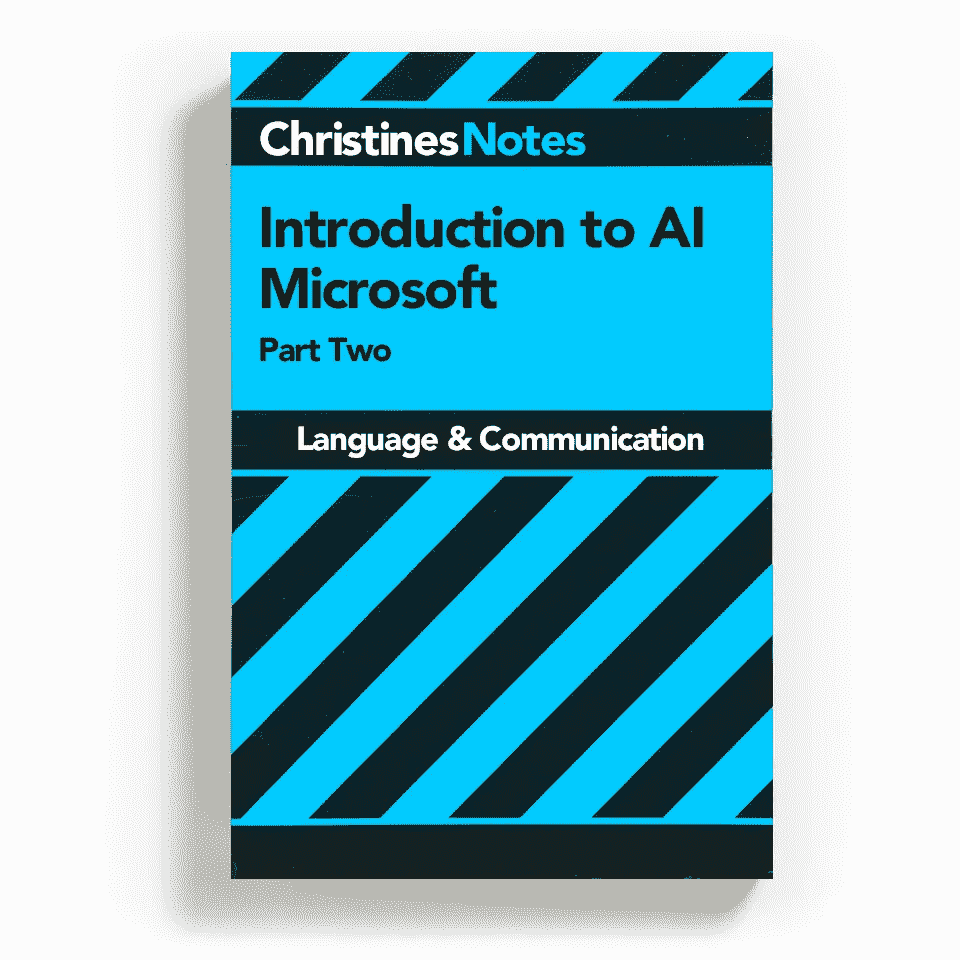

Image created by the author.

# 语言和交流

课程的“语言和交流”部分将涉及以下主题:

> **文本处理入门**
> 
> 文本分析简介
> 
> 字频率
> 
> 术语频率—逆文档频率
> 
> 堵塞物
> 
> 情感分析
> 
> **自然语言处理入门**
> 
> 文本分析
> 
> 演讲
> 
> 翻译
> 
> **语言理解智能服务**
> 
> 路易斯是什么？
> 
> 创建 LUIS 应用程序
> 
> 使用 LUIS 应用程序
> 
> 改进 LUIS 应用程序


Illustration by [Vecteezy](https://www.vecteezy.com/).

# 文本处理入门

# 文本分析简介

作为人类，我们通过书面和口头语言交流，进化成了聪明的问题解决者。沟通是成功合作的关键。所以人工智能需要包括与数字实体自然交流的能力。软件需要能够理解文本，从我们人类使用的语言中提取语义甚至情感。我们还需要能够与人工智能代理交谈，并让他们做出适当的回应，即使在我们参与对话时也是如此。因此，在接下来的章节中，我们将看看如何处理文本和语音，以使人工智能能够进行语言和交流。


Illustration by [Vecteezy](https://www.vecteezy.com/).

# 字频率

好吧，让我们来试验一下这个想法:一个单词或术语在正文中出现得越频繁，这个单词在语义上就越重要。换句话说，一个单词的出现频率可能会告诉我们一些关于文章意思的信息。所以在下面的例子中，我们友好的机器人最近一直在温习他的莎士比亚，他想理解《罗密欧与朱丽叶》中的这句话。现在，我们可以开始做一些频率分析，只需简单地统计文本中每个单词的出现次数。注意下图中我忽略了标点和大小写。如果有任何非字母字符，比如数字，我也会忽略它们。

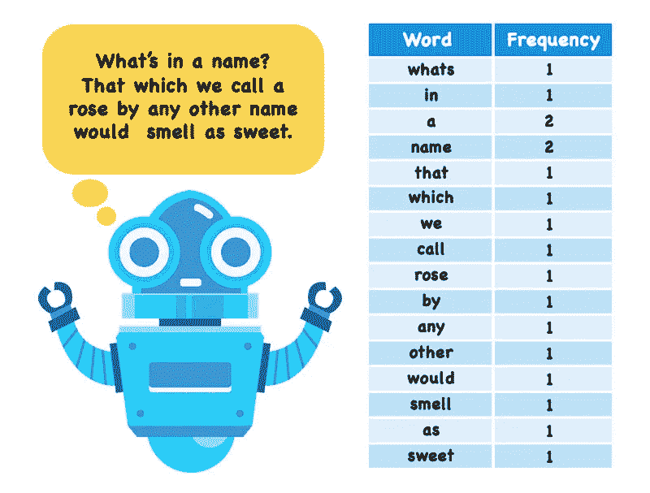

Illustration by [Vecteezy](https://www.vecteezy.com/).

我们可以在下面的柱状图中看到这些词频。实际上，我们可能可以做的是将更频繁出现的单词移到图表的开头，并按照频率降序显示它们，作为一个**帕累托图**。

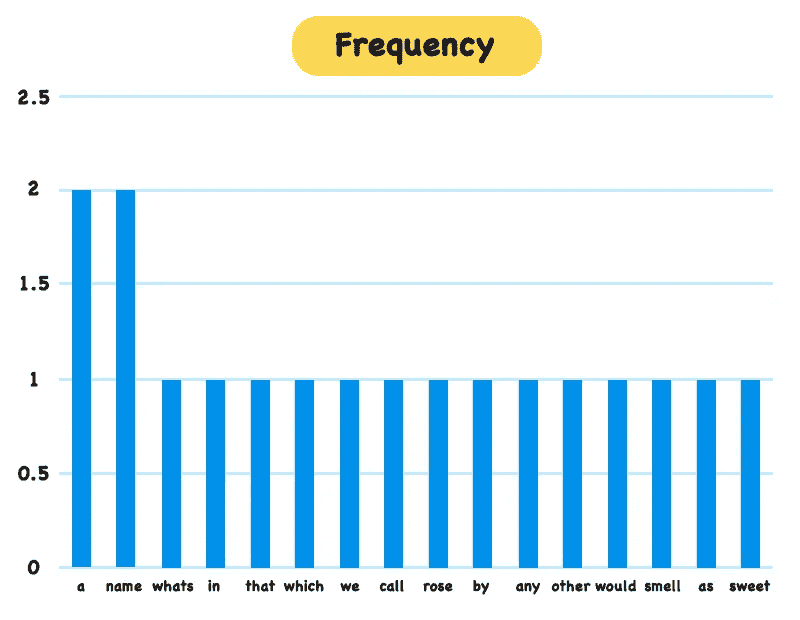

Image created by the author.

现在请注意，最常用的词之一是“a ”,我们也有像“that”、“as”和其他常用词，这些词对于从文本中提取语义并不十分有用。现在我们把这些叫做**停用词。如果我们去掉了停用词，我们就能更清楚地了解文章的内容，如下图所示。**


Image created by the author.

出现频率最高的词是‘名字’，这确实是朱丽叶在剧中这一部分所说的。

让我们用 Python 中的一些代码来尝试一下。首先，让我们加载一些文本，例如“Moon.txt”。

不要担心，你不需要知道如何用 Python 为这个特定的课程编码。所示的例子只是为了了解我们如何利用技术进行基本的词频分析。虽然对它有一个基本的了解是很有用的。我发现这个 [*链接是学习一点 Python*](https://www.programiz.com/python-programming) *的好地方。我相信还有更多更好的资源。*

然后，我们可以通过删除数字和标点符号来规范文本，并将文本转换为小写。

然后我们得到单词的频率分布。

你会得到这样的频率分布。

```
a        4
accept   1
again    1
against  2
ago      1
all      4
and     12
any      1
are      5
around   1
as       2
ask      1
```

然后我们可以将分布绘制成一个帕累托图，你会得到一个如下图所示的图表。

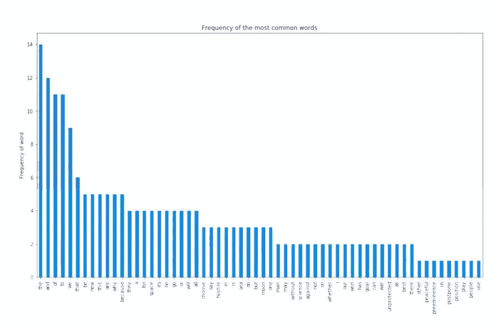

Image created by the author.

然后我们可以删除停用词，这将基本上从帕累托图中删除所有停用词。

# 术语频率—逆文档频率

简单的词频可能是查看单个文档的一种相当有效的方式，但是当您有大量文档时，常见的词可能会在多个文档中频繁出现。简单地统计一个单词总共出现的次数可能无法反映它在单个文档中的重要性。因此，为了解决这个问题，我们使用了一种更复杂的衡量单词重要性的方法，这种方法结合了两个指标，即术语频率**和逆文档频率**。

**词频**

先说词频。这只是一个术语在文档中的相对频率。在下图所示的例子中，我们的机器人一直在继续研究莎士比亚。在这段引文中,“sweet”这个词在总共 14 个单词中出现了一次。

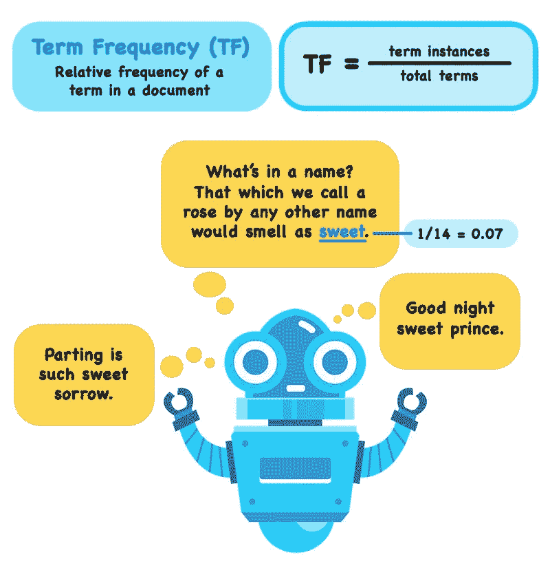

Illustration by [Vecteezy](https://www.vecteezy.com/).

现在，单词“rose”在本文档中以相同的频率出现。所以它看起来同样重要。

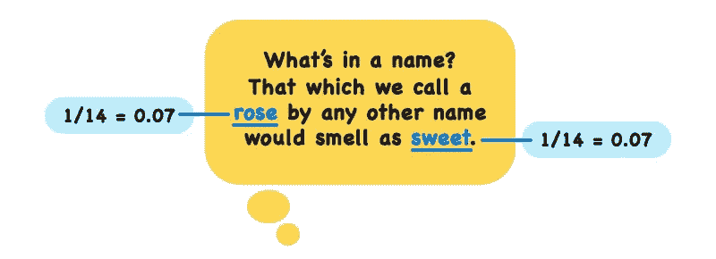

Image created by the author.

在另外两个引语中也有类似的故事。单词“sweet”和单词“prince”在第二个引号中出现了一次。“甜蜜”一词再次出现在第三段引文中，同样的还有“悲伤”。

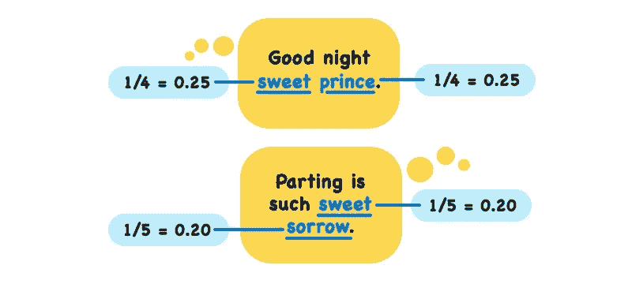

Image created by the author.

**逆文档频率**

现在我们来看看**逆文档频率**。这是术语出现在其中的文档的相对数量的度量。其计算方法为**总文档数除以包含该术语的文档数。**

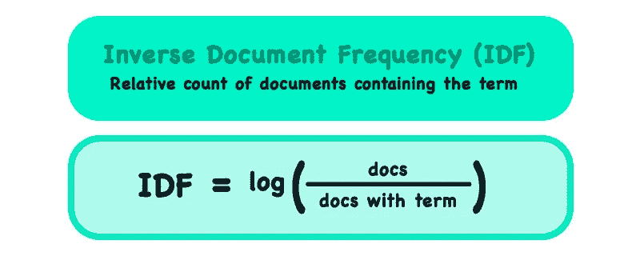

Image created by the author.

现在术语“rose”只出现在第一个引用中，所以我们可以计算它在该文档中的相对重要性，如下所示。然而,“sweet”出现在所有三个引号中，将其在单个文档中的相对重要性降低到零。

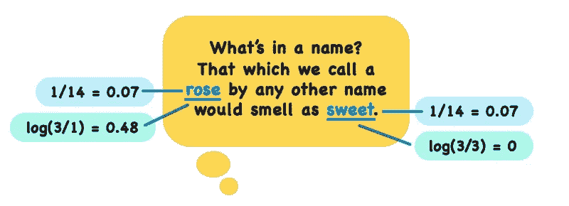

Image created by the author.

其他引文也是类似的情况。“Prince”和“sorrow”得分较高，因为它们没有在其他文档中出现，因此在它们出现的文档中相对更重要。

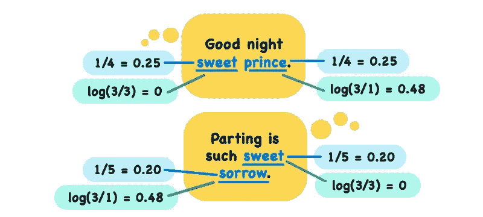

Image created by the author.

最后，我们只需将 TF 乘以 IDF，就可以计算出每个术语对它们出现的文档的整体重要性。正如您在下面看到的，单词“sweet”在文档集合中的流行有效地淡化了它在单个文档中的重要性。

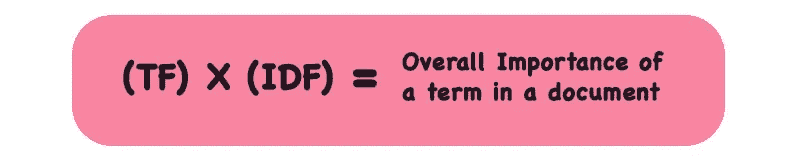

Image created by the author.

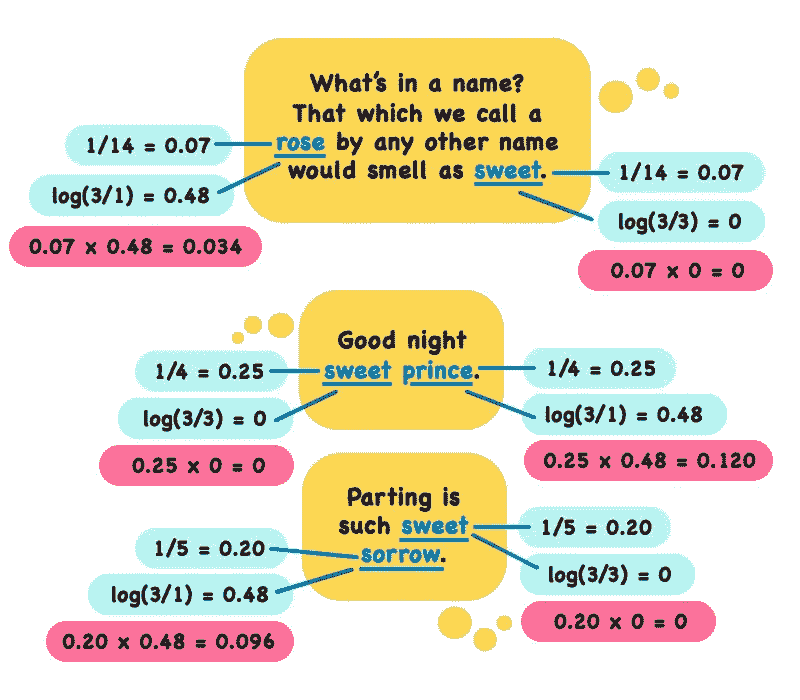

Image created by the author.

让我们通过代码来尝试一下。首先，我们从标准化 3 个文本块开始，例如第一个示例中的“Moon.txt”、“Gettysburg.txt”和“Cognitive.txt ”,然后查看文档。

然后让我们获得每个文档中前三个单词的 TF-IDF 值。

您应该得到这样的结果:

```
Top words in document 1
        Word: space, TF-IDF:  0.01193
        Word: go, TF-IDF:  0.01193
        Word: sea, TF-IDF:  0.00894
Top words in document 2
        Word: nation, TF-IDF:  0.01662
        Word: dedicated, TF-IDF:  0.01329
        Word: great, TF-IDF:  0.00997
Top words in document 3
        Word: services, TF-IDF:  0.02134
        Word: microsoft, TF-IDF:  0.01423
        Word: cognitive, TF-IDF:  0.01423
```

# 堵塞物

现在，有时候有些词非常相似。这些单词来自同一个词根，我们在文档中使用它们。我们希望确保这些词得到同等对待。现在，我们的文学机器人继续从莎士比亚的戏剧中找到有趣的引文。在下面的例子中，有三个引号包含了词根相同的单词，分别是“sweet”、“sweeting”和稍不常用的“sweeting”。

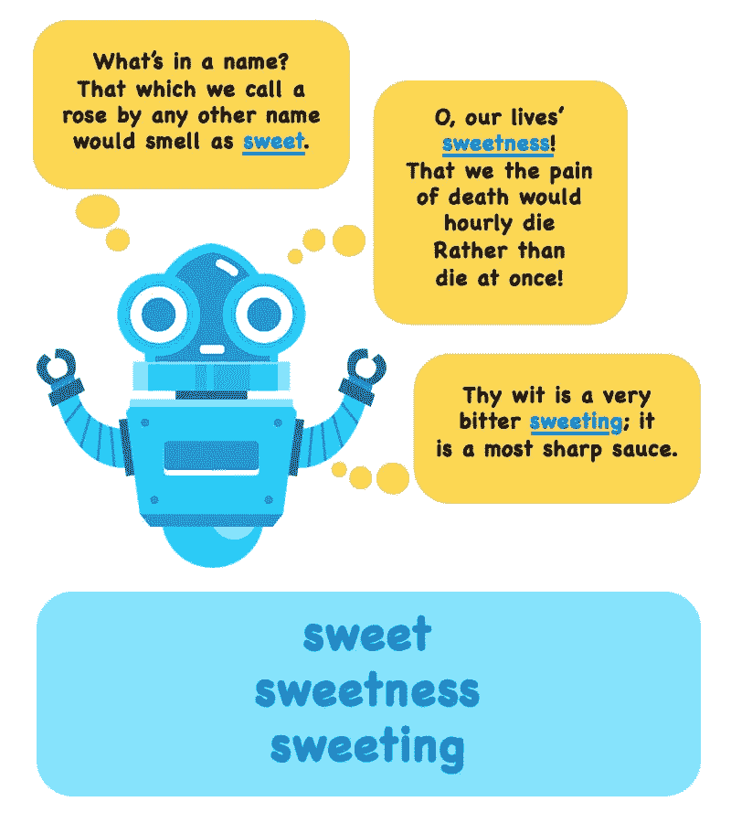

Illustration by [Vecteezy](https://www.vecteezy.com/).

**词干提取**是一种用于识别具有共同词根的单词并将其视为相同单词的技术。


Image created by the author.

一种常见的技术是使用一种叫做**波特算法的东西。**波特算法根据辅音、元音、常见字母组合和词尾以及其他语法元素的模式，定义了将单词分解为常见词干的规则序列。

现在让我们用代码试一试。首先，我们查看一些文本中未切分单词的频率。本例中的文本是“KennedyInaugural.txt”。

然后，我们使用波特斯特梅尔算法对单词进行词干分析。你应该得到一个帕累托图，显示词干及其频率。

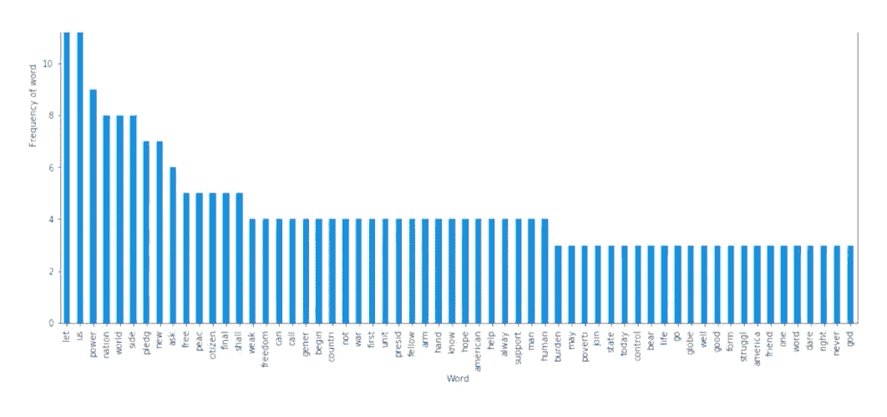

Image created by the author.

# 情感分析

情感分析是一种技术，我们可以用来分析文本，并试图辨别文本是否表明作者是高兴还是不高兴，或者对某些事情持中立态度。它经常被用来分析推文、网站上的客户评论、电子邮件，基本上是任何我们知道写文本的人当时的感受很重要的信息。情感分析使用机器学习分类算法来生成 0 到 1 之间的情感得分。接近 1 的分数表示积极情绪，而接近 0 的分数表示消极情绪。该模型用带有情感关联的大量文本进行预训练。

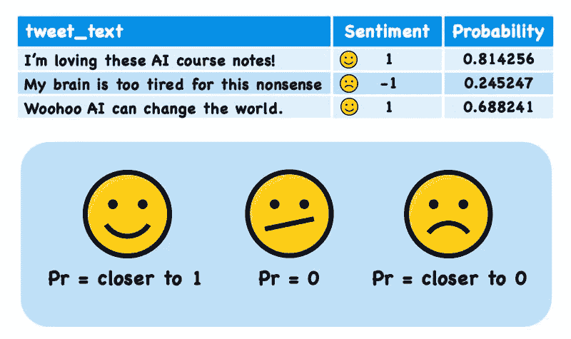

Illustration by [Vecteezy](https://www.vecteezy.com/).

# 自然语言处理导论

# 文本分析

自然语言处理(NLP)使人工智能系统能够做的不仅仅是使用词频的统计分析。使用 NLP，我们可以构建能够提取关键短语以确定要点和主题的应用程序。我们可以通过超越文本中积极词汇的存在并检查所说内容的语义来提高情感分析的准确性。


Illustration by [Vecteezy](https://www.vecteezy.com/).

让我们来看看[微软文本分析 API](https://docs.microsoft.com/en-us/azure/cognitive-services/text-analytics/overview) ，看看它是如何从文本中提取语义和情感的。所以文本分析 API 是一个认知服务，你可以在这里了解[。](https://docs.microsoft.com/en-us/azure/cognitive-services/text-analytics/overview)为什么不[试一试](https://azure.microsoft.com/en-au/services/cognitive-services/text-analytics/)。

我们要做的是使用这个 API 来说明如何比较几个不同的文档，并从中获取一些信息。下面显示了一些 Python 代码，这些代码查看了两个文档中的短语“葛底斯堡地址”(doc2Txt)和“微软认知服务网站”(doc3Txt)。

不要担心，你不需要知道如何用 Python 为这个特定的课程编码。所示的例子只是为了了解我们如何利用技术从文本中提取语义和情感。

所以我们有一些文本和变量，我们会跳过。然后我们将调用这个 API 的 keyPhrases 方法。我们传递包含我们想要分析的文本的主体，然后我们得到一个响应，这个响应是一个文档集合的相邻文档。我们将浏览每个文档，只显示文档 ID，然后显示在该文档中找到的所有关键短语。

所以当我们继续运行时，我们会得到，对于文档 1，这些关键词:新的国家，伟大的内战，人民，自由的新生，伟大的战场..等等。所以我们从那份文件中获得了相当有用的关键词。

```
Document 1 key phrases:
  new nation
  great civil war
  people
  new birth of freedom
  great battlefield
  great task remaining
  fathers
  final resting place
  measure of devotion
  brave men
  dead
  poor power
  note
  larger sense
  world
  unfinished work
  proposition
```

然后从文档 2 我们得到:语音开发人员，微软认知服务，视觉识别，一组 API。因此，我们对这些文件的内容有了更全面的了解，而不是仅仅分析单个单词。

```
Document 2 key phrases:
  speech
  developers
  Microsoft Cognitive Services
  vision recognition
  set of APIs
  application
  services available
  personal computing experiences
  evolving portfolio of machine learning APIs
  enhanced productivity
  emotion
  intelligent features
  video detection
  language understanding
  SDKs
  systems
```

现在，我们可以用文本分析 API 做的另一件事是我们可以做情感分析。所以我这里有几个简单的例子，比如“哇！“认知服务棒极了”和“我讨厌计算机不理解我”。

这一次我们将调用相同的 API，但是我们调用的是情感方法。同样，我们得到一个文档列表。我们要做的是假设情绪是负面的，除非我们看我们得到的分数，这个分数大于 0.5。这是一个介于零和一之间的分数。因此，如果得分大于 0.5，我们将认为该文档是正面的。否则我们会认为它是负面的。

因此，当我们继续运行时，文档 1 肯定会返回正值，而文档 2 返回负值。

```
Document: 1 = positive
Document: 2 = negative
```

# 演讲

到目前为止，我们专注于解析文本，但是自然语言当然也包括语音。现在，为了处理语音，我们必须认识到有两种模式需要协同工作。首先，有一个声学模型将音频与声音单元或音素相匹配，这些单元或音素定义了特定的单词片段在给定的语言中如何发音。


Illustration by [Vecteezy](https://www.vecteezy.com/).

然后有一个语言模型提供了一个单词序列的概率分布。因此，在下面这个例子中，听起来好像我们在试图传达一些关于水果、船和家具的信息…


Illustration by [Vecteezy](https://www.vecteezy.com/).

…信息更有可能是关于对座位的满意度。


Illustration by [Vecteezy](https://www.vecteezy.com/).

让我们来看一些在人工智能应用中使用语音的真实例子。

同样，不要担心不太了解如何用 Python 编码。下面的例子只是为了让我们了解如何将技术用于语音。

为了使用语音，我们将使用 Bing 语音 API，这也是微软的认知服务之一。我们将使用语音 API 将一些语音转换成文本。请随意试用[微软语音转文本 API](https://azure.microsoft.com/en-au/services/cognitive-services/speech-to-text/) 。接下来要发生的是，我们要对着电脑的麦克风说话，我们要把语音转换成文本。所以我们下面要做的是使用语音识别库。它有一个叫做**识别器**的东西，我们将启动它。然后我们用麦克风作为声源，他们只听对着麦克风说的话。

然后我们要把它发送给这个 recognize_bing 方法。因此，我们将去识别 _bing，这将转到 bing 语音 API。我们会传入捕捉到的音频。我们将为语音服务传递密钥，以便它对我们进行身份验证，然后我们应该会得到听到的内容的副本。

如果它因为环境噪音而听不清楚，我们会收到一条消息说声音不清楚。如果出现其他问题，我们会看到其他错误消息。

所以我们会运行这段代码。然后我们对着麦克风说“西班牙的雨主要落在平原上”。回来的是所说内容的抄本。

```
Say something!
Here's what I heard:
"The rain in Spain stays mainly in the plain."
```

因此，我们能够发送音频，既可以直接从麦克风发送，也可以作为音频文件发送。所以，如果你有已经录制好的文件，你想把它们转录成文本，你可以这样做。上传音频文件，然后返回的是音频中的文本。

那么反过来呢？如果我真的想把一些现有的文本转换成语音呢？

现在，我们通常对人工智能应用程序做的事情之一是通过对它们说话来与它们互动，然后让它们用语音来回应。那么我们该怎么做呢？同样，我们可以使用相同的 API，但使用不同的方法。首先，我们只是简单地得到我们想要转换成语音的文本。所以我们会输入一些文本，然后把它发送出去。

我们使用一些 XML 来设置。所以我们在这里使用 ElementTree 元素来构建一个 XML 结构。我们将创建一个 XML 文档，其中包含我们想要使用的声音的所有信息。有不同的声音可用，所以我们将指定这个 JessaRUS 作为声音，并在头中指定关于我们想要返回的内容的各种其他信息。我们已经得到了输出格式，我们得到的将是一个 16 位的单声道音频流。现在重要的一点是，我们在轴令牌中解析它，所以我们在轴令牌上得到载体。

然后我们将得到的是包含已合成文本的音频流。我们调用这个合成的方法，我们将得到这个音频流，然后我们可以做一些事情。

因此，我们将取回这些数据，并在播放器中简单地播放，这样当它回来时，您就可以听到它了。

然后我们继续运行它。然后我们需要输入一个短语。

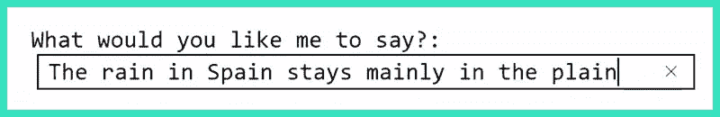

我们取回音频，然后回放。


所以你可以看到这个 API 是如何向 AI 服务提交输入的。您可以与 API 服务对话，并让它理解所说的内容。然后，您可以以文本的形式表达响应，然后以语音的形式回放该响应。你可以试试[语音转文本 API](https://azure.microsoft.com/en-au/services/cognitive-services/speech-to-text/) 和[文本转语音 API](https://azure.microsoft.com/en-au/services/cognitive-services/speech-to-text/) ，点击超链接亲自体验一下。

# 翻译

到目前为止，所有使用文本和语音的例子都假设我们是在用英语工作。但是如果我们需要与说另一种语言的人合作呢？


Illustration by [Vecteezy](https://www.vecteezy.com/).

让我们来看看[微软翻译器 API](https://azure.microsoft.com/en-au/services/cognitive-services/translator-text-api/) 。现在对于翻译，实际上有两个认知服务 API，一个用于文本，一个用于语音。我们将把重点放在文本上，但是你可以使用它们中的任何一个来自动翻译许多不同的语言。

让我们来看看，我们首先要找一些我们想要翻译的文本。我们将输入一些文本。然后是 fromLangCode，输入是我们要翻译的语言。对于 languageCode，输入是我们想把代码翻译成什么语言？

我们定义了一些参数，所以这次我们不会传递关于身体的信息。我们实际上是在传递这些参数。参数基本上是我们要翻译的文本，我们要翻译成的语言和我们要翻译的语言。

所以我们跳过这些，然后我们把这个叫做 api.microsofttranslator.com。这是一个 GET 请求，我们将把它传递给这个 URL。我们放弃了这一切。

然后我们会得到翻译，因为这是文本翻译器，它会以文本形式返回。我们继续运行并输入一些文本。

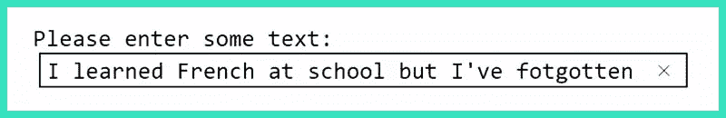

这就是我们想要翻译的文本。那是什么语言？那是英语，所以 EN 是语言的代码。

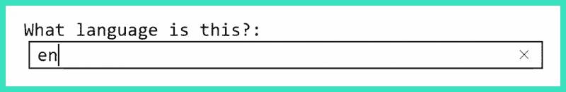

我们想把它翻译成什么语言？法语很好。

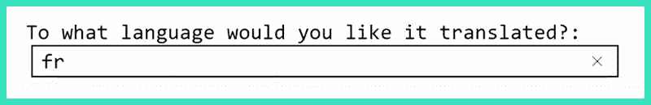

我们得到了法语翻译。

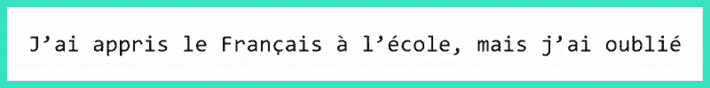

所以我们有了这个翻译 API。我们可以很快提交一些文本，并让它立即翻译成我们选择的另一种语言。这对于把来自不同语言、不同国家的人们聚集在一起并使他们能够交流非常有用。

# 语言理解智能服务

# 路易斯是什么？

语言理解智能服务(LUIS)是一种认知服务，您可以使用它来为需要响应人类交流的应用程序实现自然语言处理。现在我们通过**话语**与路易斯互动，这些话语是需要解释的语言片段。


Illustration by [Vecteezy](https://www.vecteezy.com/).

从这些话语中，LUIS 识别出最可能的**意图**，这是输入的预定义目标或动作。在这种情况下，话语被映射到图书飞行意图。


Illustration by [Vecteezy](https://www.vecteezy.com/).

现在，意图被应用于在话语中识别的**实体**。在这种情况下，话语包括一个位置实体‘纽约’和一个日期时间实体‘本周末’。


Illustration by [Vecteezy](https://www.vecteezy.com/).

要开始使用 LUIS，你需要将其配置为 Azure 服务。现在，微软提供了语言理解智能服务，就像 Azure 中的任何其他认知服务一样，所以我们将使用 Azure 门户来完成这项工作。你可以通过这里了解更多关于 LUIS 的信息。

# 创建 LUIS 应用程序

在这里，我们将展示使用 [LUIS portal](https://www.luis.ai/home) 创建一个应用程序的快照，该应用程序具有意图和实体以及我们需要的所有东西，以便理解该语言。首先，我们在 Azure 订阅中创建一个 LUIS 资源。在那里，您可以访问 LUIS 应用程序门户，在那里您可以创建 LUIS 应用程序。

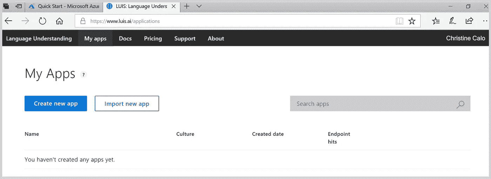

Image created by the author.

因此，首先要做的是创建一个新的应用程序，这将要求为此应用程序命名。我们称之为“家庭自动化”,我们将用英语来表达，因为这是这个应用程序将要使用的语言。你可以添加一些描述。然后点击“完成”并创建新应用程序。

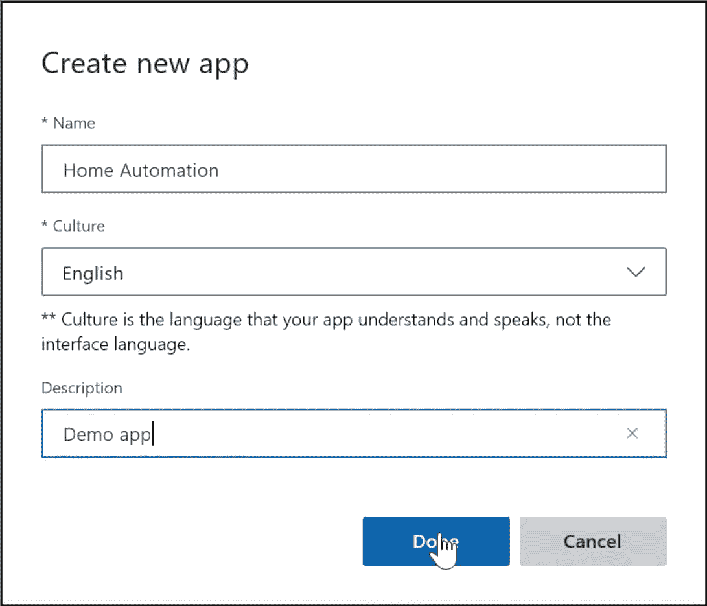

Image created by the author.

这是我们的应用，叫做家庭自动化。


Image created by the author.

我们可以直接打开它。你可以看到，我们可以在这个界面中工作、创建和测试我们的应用程序。现在，我们要做的第一件事是考虑应用程序的意图。

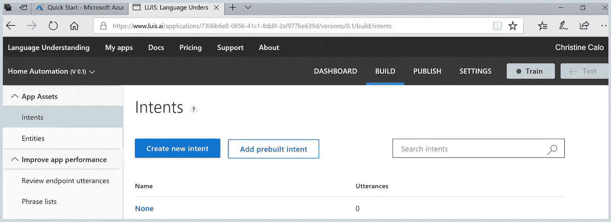

Image created by the author.

所以我们要创造一个意图。因此，在用户界面的“意向”选项卡上，我们将单击“创建新意向”。应该会出现一个弹出窗口。我们会给这个意图一个名字。我们正在构建的应用程序的目的是有效地打开和关闭灯，所以我们的意图之一是打开灯。所以我们就叫它‘开灯’吧。


Image created by the author.

然后这就去创造了一个叫做“点亮”的意图。我们已经准备好开始添加话语，这将成为人们尝试和启动这一意图的方式。我们可以放入多个样本，但为了简单起见，我们将在这里放入一个简单的例子，即“开灯”。所以我们在这里有一个“开灯”的表达，这将表示有意开灯。

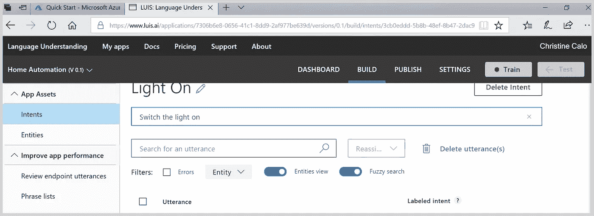

Image created by the author.

我们要做的是突出“光”这个词。你可以在下图中看到，它把这些小方括号放在它周围，我们可以用它来表示这个东西是一个实体。你也可以去浏览一些预先构建的实体，或者你可以创建一个新的实体。在这里，我们将创建一个名为“光”的新实体。

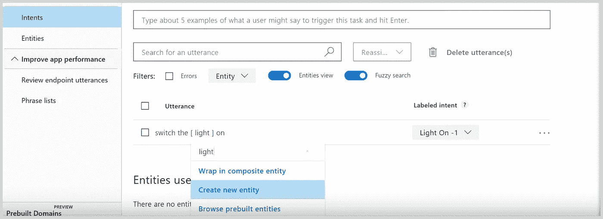

Image created by the author.

这创造了一个新的实体叫做光。这是一个简单的实体。我们可以创建更复杂的实体，随着你更深入地探索 LUIS，你会发现这些更复杂的实体的用途，但在这种情况下，我们有一个简单的实体，称为“光”。

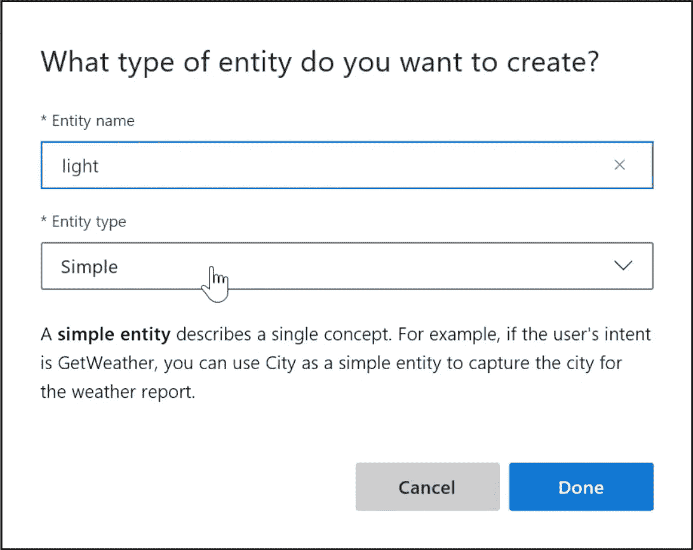

Image created by the author.

我们可以看到，它现在被强调为我们话语中的一个实体。所以我们创造了这种光的意图，也创造了一种表达方式。我们可以创建多个话语，但在这种情况下，我只创建了一个，并指定这个光是一个实体。

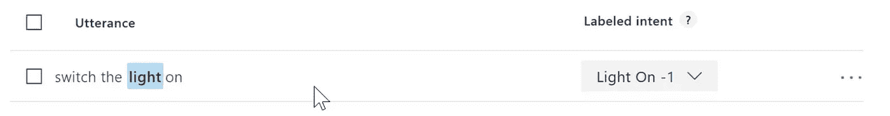

Image created by the author.

我们将回到意图，在这里创建第二个意图。因为如果我们想打开灯，我们很可能也想关掉它。

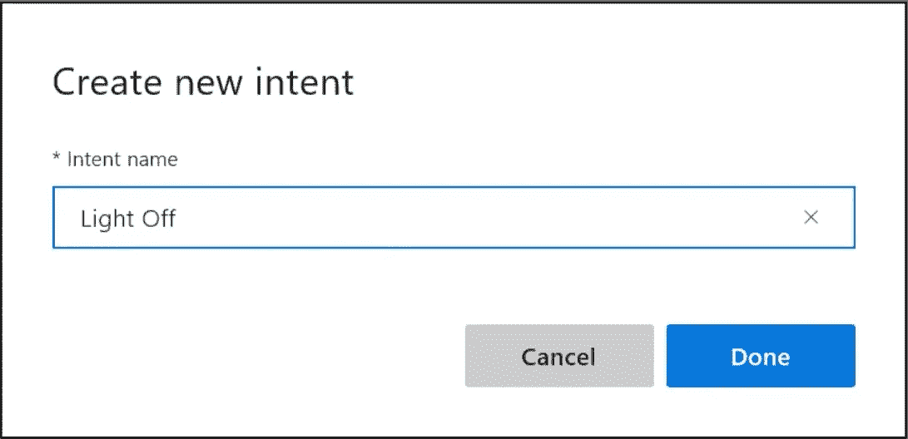

Image created by the author.


Image created by the author.

我们再一次插入一句话，说明光在这种情况下是一个实体。它已经知道了那个叫做光的实体，所以它被列出来了。我们只需选择它，这就是该实体的另一个实例。

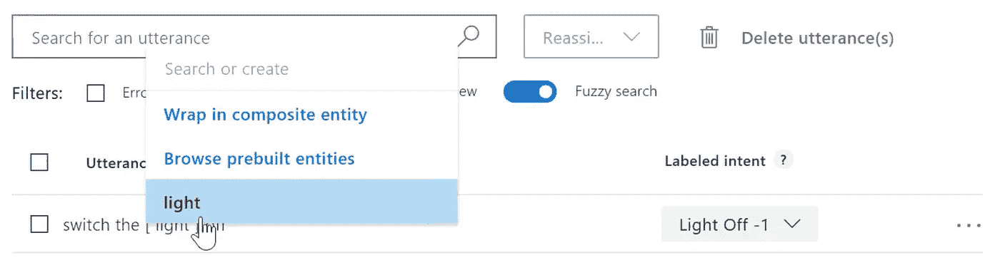

Image created by the author.

所以现在我们有几个非常简单的意图。每个意图都有一个话语告诉我们这个意图就是我们想要做的。我们在那些话语中指定了“光”这个词是这个意图所涉及的实体。所以我们要做的是继续训练这个应用程序，让它知道如何将这些话语应用到这些意图中。


Image created by the author.

一旦它被训练好，我们就可以测试它了。


Image created by the author.

它会在边上弹出一个小测试窗口，我们在这里输入一句话“开灯”。

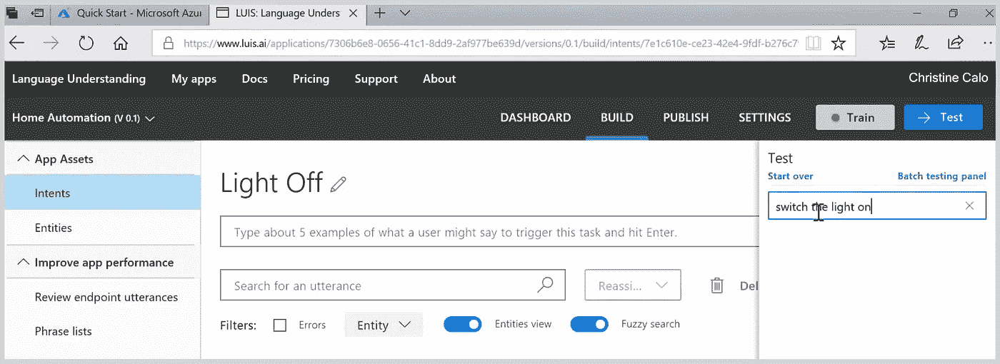

Image created by the author.

它从那回来，暗示这是为了光的意图。这就是它认为的意图。

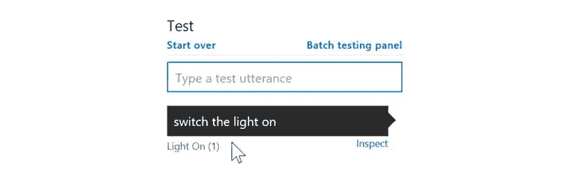

Image created by the author.

实际上，我们甚至可以尝试我们没有为话语输入的文本。我们可以试试“开灯”这样的方式。它再次亮着灯，表明它 100%确信这就是我们想要的。尽管这不是我们最初指定的确切表达，但它足够聪明地意识到，它足够接近我们可能的意思。

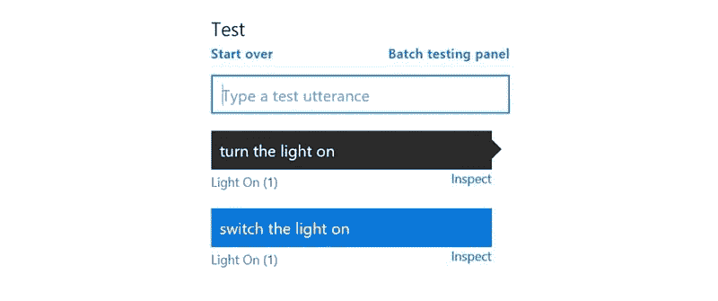

Image created by the author.

因此，我们现在已经创建了我们的应用程序，并添加了两个意图。我们已经为这些意图创造了话语，识别了实体，并对其进行了测试。我们现在准备出版这本书。


Image created by the author.

因此，如果我们单击此处的“publish”选项卡，我们可以选择将其发布到生产插槽或转移。在这种情况下，我们将把它发布到生产环境中，然后看看我们在资源和密钥方面想做些什么。

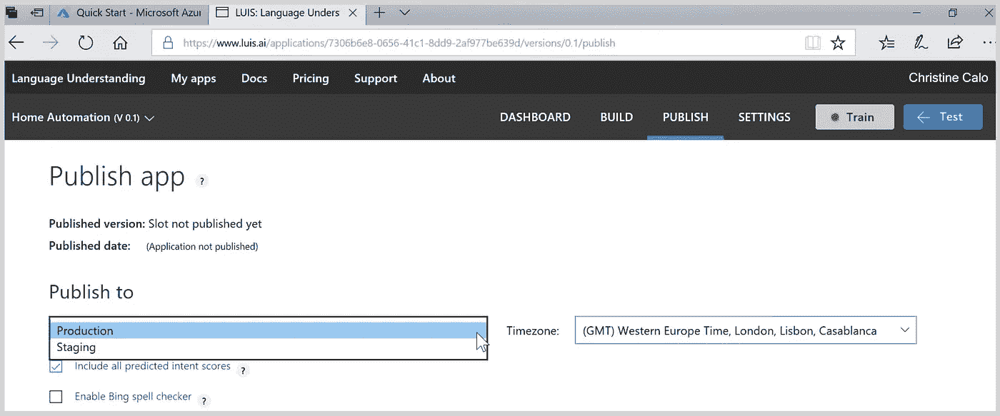

Image created by the author.

现在已经有一把钥匙了。当我们创建应用程序时，生成了这个密钥来测试它，所以有一个测试密钥可以使用。现在，如果我们真的要发布到产品中，那么我们可能要做的是使用我们为 LUIS 创建的 Azure 资源中的一个密钥。

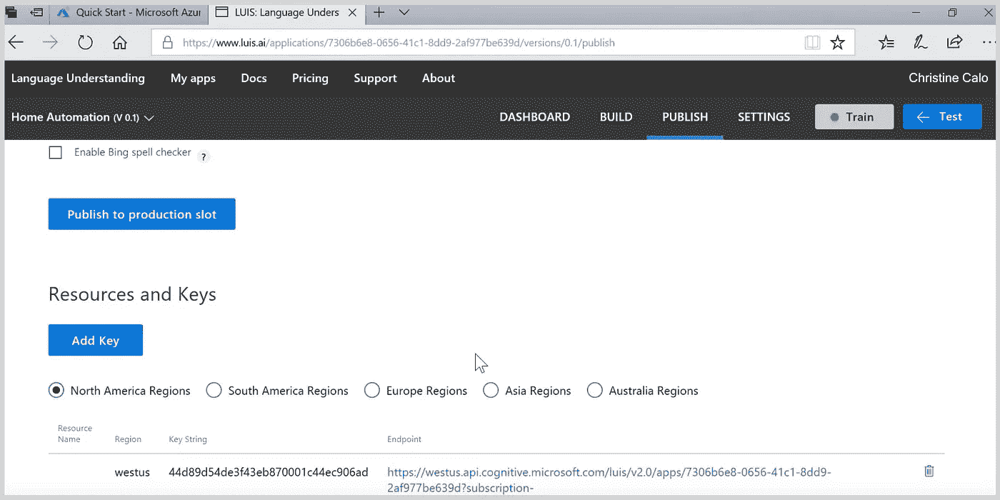

Image created by the author.

因此，我们可以添加一个密钥，并为我们的应用程序分配一个密钥。

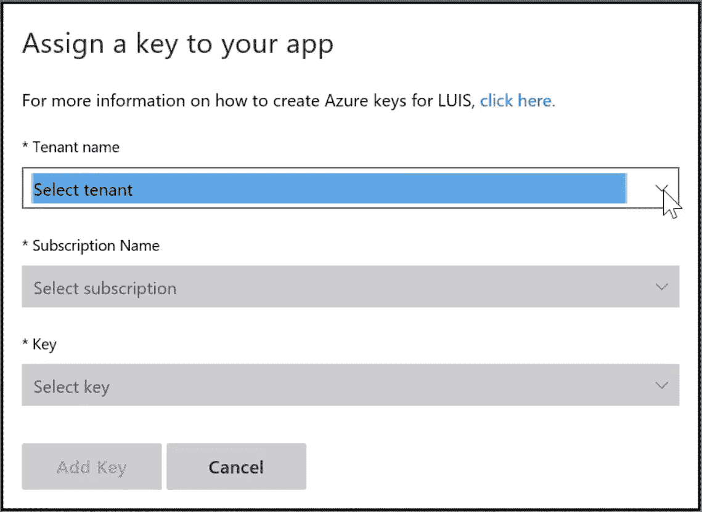

Image created by the author.

我们现在已经将这个应用程序与一个密钥相关联，这样我们就可以将它投入生产，并为我们希望对服务计费的密钥使用适当的端点。这将允许我们使用生产级别密钥将其投入生产。因此，您可以在这里看到，我得到的是这个端点，客户端应用程序将使用这个端点连接到我们的 LUIS 应用程序，以启动这些意图。

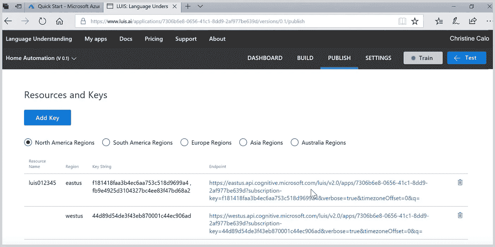

Image created by the author.

# 使用 LUIS 应用程序

在之前的演示中，我们创建了一个 LUIS 应用程序，并将其作为服务发布。现在让我们看看如何从客户端使用该应用程序。因此，之前我们创建了 LUIS 应用程序，并使用如下所示的选项将其发布到生产插槽。这是我们的客户端应用程序连接到 LUIS 应用程序的端点。


Image created by the author.


Image created by the author.

我们所做的是在客户端代码中复制这个端点。我们已经得到了一些 Python 代码，并刚刚将该端点粘贴到这里。这就是我们的客户端应用程序用来建立 HTTP 连接的端点 URL。在这种情况下，只有这个 Python 脚本，它将连接到我们的 LUIS 应用程序。

那我们要做什么？好了，我们要连接，然后我们将输入一个命令。因此，我们将得到一个输入命令的提示，我们必须键入该命令，然后将该命令发送到 LUIS 应用程序。

这里有一点代码，如果命令中有空格，就会弄乱 URL，所以我们只需用一个小加号替换它们，这样它们就可以正确地编码到 URL 中。那我们就把这些放在一起。这将是我们的请求，然后我们将把它提交给我们的端点并得到响应。响应将以字符串的形式返回，我们只需对其进行解码。它实际上是一个二进制数组，我们将对它进行解码，它将把它作为一个 JSON 文档加载。

然后，在 JSON 文档中，我们将寻找得分最高的意图，并获得该意图。如果灯亮着，我们将显示一个合适的图像。如果灯熄灭，我们将显示另一个合适的图像。如果完全是别的东西，我们将显示另一个图像。这就是基本的逻辑，我们发送命令，我们得到 LUIS 应用程序所说的命令意图，然后我们将做出适当的响应。

所以我们继续运行这段代码。它会要求我们输入一个命令。所以我们将输入我们的一个话语来打开灯。

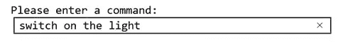

我们得到的回应是一张灯亮着的照片。

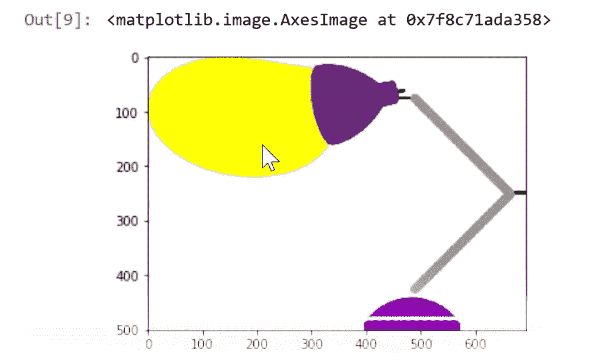

Image created by the author.

我们输入“开灯”,但我们的原话是“开灯”,但词序没有影响。它仍然设法找出这是正确的命令。

让我们再运行一次，并尝试其他方法。让我们命令它关灯。


Image created by the author.

正如您所看到的，它已经显示了适当的响应，显示了灯不亮时的图像。

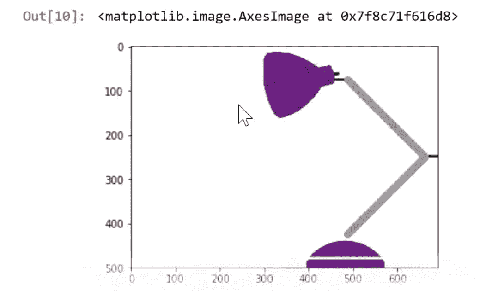

Image created by the author.

通过这个非常简单的例子，你已经看到了我们可以在哪里构建一个 LUIS 应用程序，指定意图，为这些意图提供一些示例话语，然后训练该应用程序。然后，该应用程序能够响应来自客户端的请求，并发回关于我们认为用户想要的意图的适当信息。应用程序可以基于此做出适当的响应。

# 改进 LUIS 应用程序

因此，我们已经看到了如何构建 LUIS 应用程序，以及如何使用与实体相关的意图来训练它，并解释话语，以决定哪个意图是想要的。但我们真正想了解的是，这是如何随着时间的推移而发展的。我们如何提高 LUIS 应用程序的性能，以便它能够理解不同的话语并正确地解释它们。让我们来看看所谓的主动学习，这是一种随着时间的推移改善我们服务的方式。因此，我们将使用在之前的演示中创建的相同客户端应用程序。我们试着关灯，关灯后我们得到了适当的回应。让我们去尝试一些不同的东西，比如说“关灯”。

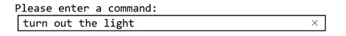

Image created by the author.

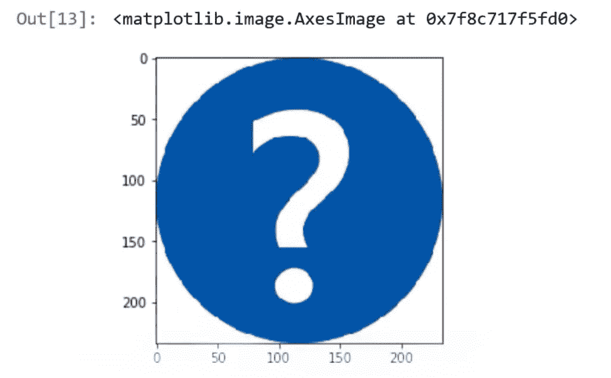

Image created by the author.

在这种情况下，LUIS 应用程序无法识别正确的意图。它基本上发回了一个“无”的响应，我们在这里显示了一个大问号，因为“关灯”不是我们训练 LUIS 应用程序时使用的任何话语。这在逻辑上将被解释为开灯或关灯的意图，因此该意图是未知的。实际上没有，我们得到了这样的回答。

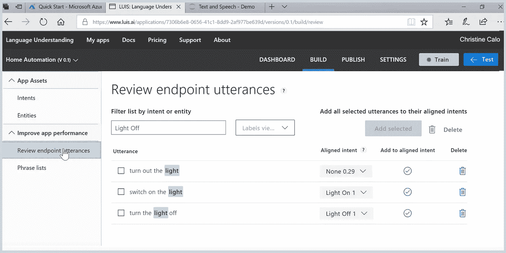

Image created by the author.

如果我们回头看看我们的 LUIS 应用程序。在这个 Build 选项卡上，我们可以查看一些端点话语。我们可以在这些话语中看到“关灯”。这是我们刚刚尝试过的，它与零对齐。当它试图识别时，它的得分是 0.29。它只是不能弄清楚它与哪个意图相关，但我们能做的是现在去将它与如下所示的关灯意图对齐。

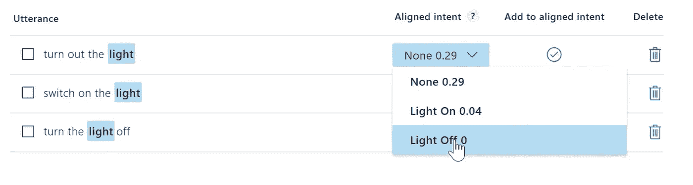

Image created by the author.

所以它现在与这个意图一致。因此，我们将进入并重新培训该应用程序，现在如果我们进行测试，我们将尝试我们刚刚改变的意图。因此，我们有我们的“熄灭灯”,这返回为关灯。所以它现在把它和关闭它的意图联系起来。因此，我们能够根据从我们的客户端应用程序获得的一些输入来重新训练我们的模型。


Image created by the author.

如果我们只是再次发布它，我们只是将它重新发布到我们的生产插槽中。既然已经重新发布了，我们可以回去再次尝试我们的应用程序。所以我们只要运行我们的代码。这一次，当我们运行“关灯”命令时，我们得到了适当的响应。它现在实际上能够识别出意图是熄灯意图，如下所示。

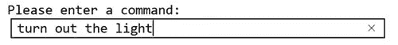

Image created by the author.


Image created by the author.

# 一锤定音

感谢您阅读这篇文章，这是微软人工智能入门课程的第 2 部分。如果你觉得这很有帮助，那么请查看我的媒体账户或数据科学 T2 的所有 4 个部分。如果你对本文中的一些概念有困难(不要担心，我花了一些时间来理解这些信息)，并且你需要更多的信息，那么就免费报名参加[微软人工智能入门课程](https://www.classcentral.com/course/edx-introduction-to-artificial-intelligence-ai-9164)。与这些笔记一起观看课程视频很有帮助。

* [如果您想了解课程笔记和其他与技术和产品设计相关的笔记背后的一些背景信息，您可以在这里找到更多信息。](https://medium.com/@christinecalo/a-little-about-christines-notes-8ea2205594a2) *

***有点背景***

*大家好，我是 Christine:)我是一名产品设计师，已经在数字领域工作了相当长一段时间，并在许多不同的公司工作过；从大型公司(多达 84，000 名员工)，到中型企业，再到仍在扬名立万的小型初创企业。尽管我有很多经验，但我是一名产品设计师，害怕受到邓宁-克鲁格效应的影响，所以我不断尝试教育自己，我总是在寻找更多的光明。我相信，要成为一名伟大的设计师，你需要不断磨练自己的技能，尤其是如果你在不断变化的数字空间中工作。*