# 微软人工智能简介—第 3 部分

> 原文：<https://towardsdatascience.com/microsoft-introduction-to-ai-part-3-cb21d7a5e119?source=collection_archive---------17----------------------->


Image used under licence from Getty Images.

## 计算机视觉

为了让机器像我们一样看待世界，它依赖于计算机视觉。计算机视觉是人工智能的一种形式，计算机可以“看到”世界，分析视觉数据，然后了解环境和情况。你可能没有意识到，但你很可能每天都在使用计算机视觉。我们用它来解锁面部和指纹识别应用程序。我们的家都安装了使用计算机视觉的安全监控系统。自动驾驶汽车和无人机用它来避开障碍物。计算机视觉是人工智能的一个非常有趣的领域，它的未来充满了许多惊人的机会。这是“微软人工智能导论”课程笔记的第三部分。让我们来看看计算机视觉的奇妙世界。让我们学习如何使用软件来处理图像和视频，以我们的方式理解世界。

# 背景

**(如果看过** [**第一部**](/microsoft-introduction-to-ai-part-1-879e31d6492a) **或** [**第二部**](/microsoft-introduction-to-ai-part-2-f7cfb6a5f1e3) **)跳过背景信息**

对于那些没有看过这个系列的[第 1 部分](/microsoft-introduction-to-ai-part-1-879e31d6492a)或[第 2 部分](/microsoft-introduction-to-ai-part-2-f7cfb6a5f1e3)的人来说，这里有一些背景信息。我一直想学习人工智能(AI ),尽管对其中涉及的数学感到有点害怕，并认为一些概念可能超出了我的深度。幸运的是，我的好奇心战胜了我的恐惧，所以我开始学习一些与人工智能相关的课程。我最近完成了[微软人工智能入门课程](https://www.classcentral.com/course/edx-introduction-to-artificial-intelligence-ai-9164)，并写了课程笔记来帮助我记住我所学的知识。我试着用一种简单的方式来写这些笔记，让它们更容易阅读。我最近成为一名阿姨，买了几本与技术和空间相关的儿童书籍，非常喜欢作者和插图画家如何设法简化复杂的主题。因此，我受到启发，以类似的方式处理这些主题，简化它们，使它们更容易理解，特别是对那些和我一样最初对人工智能感到恐惧的人。

* [如果您想了解课程笔记以及其他与技术和产品设计相关的笔记背后的更多信息，您可以在此找到更多信息。](https://medium.com/@christinecalo/a-little-about-christines-notes-8ea2205594a2) *

# 摘要

**(如果看过** [**第一部**](/microsoft-introduction-to-ai-part-1-879e31d6492a) **或** [**第二部**](/microsoft-introduction-to-ai-part-2-f7cfb6a5f1e3) **)**

[微软人工智能入门课程](https://www.classcentral.com/course/edx-introduction-to-artificial-intelligence-ai-9164)提供了人工智能的概述，并探索了为人工智能提供基础的机器学习原则。从这门课程中，你可以发现将人工智能功能集成到应用程序中的基本技术。学习如何使用软件来处理、分析和提取自然语言的含义。了解软件如何处理图像和视频，以人类的方式理解世界。了解如何构建智能机器人，实现人类和人工智能系统之间的对话。


Image created by the author. [Microsoft Introduction to Artificial Intelligence Course](https://www.classcentral.com/course/edx-introduction-to-artificial-intelligence-ai-9164)

这个课程需要大约 1 个月的时间来完成，所以我写的 1 篇中型文章包含了一周的内容。这意味着你只需要花大约半个小时来阅读这篇文章，它是一周的内容。那是一种快速的学习方法。没有证书的课程是免费的，但是，如果你想要一个证书作为完成的证明，是要收费的。本课程有相关的实验，我不会在笔记中列出，因为我认为最好的学习方法是实际做实验。然而，如果你想了解人工智能背后的基本理论，并想以一种可能比其他资源简单得多的方式来学习它，这些笔记是有用的。我试着用通俗易懂的语言来写它，并加入了视觉效果来帮助说明这些想法。如果你没有时间学习这门课程，这些笔记会很有用，这是快速浏览核心概念的一种方法。或者，如果你像我一样学过这门课，你可以用这些笔记来记住你学到的东西。

> **讲师:**
> 
> graeme Malcolm——微软学习体验的高级内容开发人员。

# 摘要

**(跳过教学大纲如果你看过** [**第一部分**](/microsoft-introduction-to-ai-part-1-879e31d6492a) **或** [**第二部分**](/microsoft-introduction-to-ai-part-2-f7cfb6a5f1e3) **)**

本课程分为四个部分，包括:

## 1.[机器学习](/microsoft-introduction-to-ai-part-1-879e31d6492a)

了解关于人工智能和机器学习的基础知识。

## 2.[语言和交流](/microsoft-introduction-to-ai-part-2-f7cfb6a5f1e3)

学习如何使用软件来处理、分析和提取自然语言的含义。

## 3.计算机视觉(*这篇中型文章将只关注这一部分)

了解如何使用软件处理图像和视频，以我们的方式理解世界。

## 4.[作为平台的对话](/microsoft-introduction-to-ai-part-4-d310033bdb07)

了解如何构建智能机器人，实现人类和人工智能系统之间的对话交流。

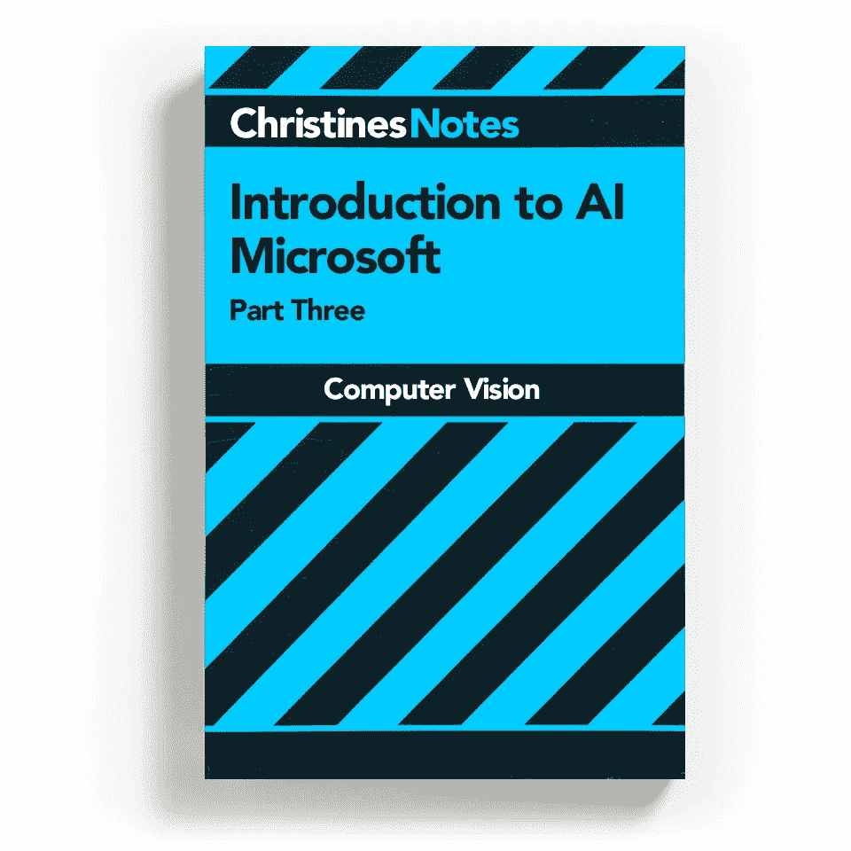

Image created by the author.

# 计算机视觉

本课程的“计算机视觉”部分将涉及以下主题:

> **图像处理入门**
> 
> 图像处理基础
> 
> 均等
> 
> 过滤
> 
> 边缘检测
> 
> 角点检测
> 
> **处理图像和视频**
> 
> 图像分类
> 
> 映象分析
> 
> 人脸检测和识别
> 
> 视频基础
> 
> 视频索引器
> 
> 视频索引器 API


Illustration by [Vecteezy](https://www.vecteezy.com/).

# 图像处理入门

# 图像处理基础

在我们探索如何处理和分析图像之前，我们需要了解计算机是如何看待图像的。例如，这里我们友好的机器人有一张全家福。

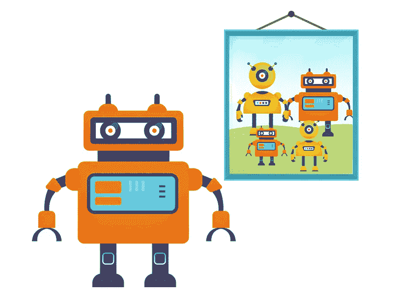

Illustration by [Vecteezy](https://www.vecteezy.com/).

作为一幅数字图像，这实际上被表示为一组数字，表示 0 到 255 之间的像素强度。因为这是一幅彩色图像，所以它可以表示为一个三维阵列，每个维度对应于图像中的红色、绿色和蓝色色调。


3 rectangles of Red, Green and Blue (RGB). Image created by the author.

具体取决于图像的格式以及您希望如何处理它。例如，我们可以将这个图像转换成灰度。当它转换为灰度时，现在可以用二维数组表示。

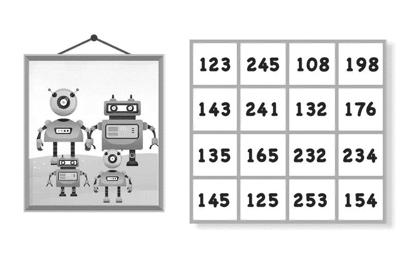

Illustration by [Vecteezy](https://www.vecteezy.com/).

现在有各种各样的库可以在 Python 中处理图像。因此，让我们来看看一些简单的代码来加载，显示和转换图像。

*别担心，你不需要知道如何用 Python 为这个特定的课程编码。所示的例子只是为了了解如何使用代码来加载、显示和转换图像。虽然对它有一个基本的了解是很有用的。我发现这个* [*链接是学习一点 Python*](https://www.programiz.com/python-programming) *的好地方。我相信还有更多更好的资源。*

下面是这段代码执行的描述。因此，我们在这里添加这个 matplotlib 内联小命令，因为我们希望能够在笔记本中显示图像。这就是我们能够与笔记本中的单元格内联的方式。然后我们导入了一些我们想要使用的库。对我们来说真正重要的是 matplotlib.pyplot 库和 PIL 库，它们允许我们处理图像。我们要做的就是使用 curl 从这个 GitHub 库中抓取一张图片并下载下来。然后我们就打开它展示一下。注意，我们把它作为一个 np 数组打开，一个 Numpy 数组。所以让我们继续运行它。

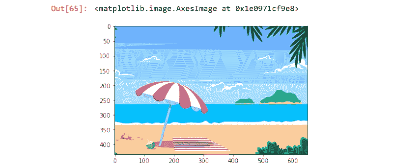

Image created by the author.

所以我们下载了这张图片，这是一张海滩的图片。让我们来看看它的一些数字特性。

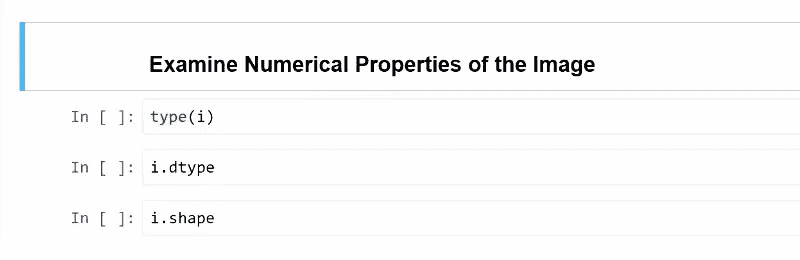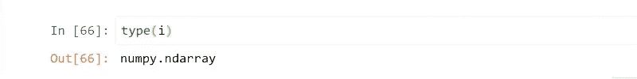

首先，那个图像是什么类型的东西？这是一个多维数组。因此，虽然我们把它看作一个图像，但它显然只是用一组值来表示。

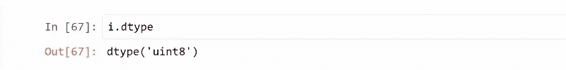

数组中的值是什么类型的呢？它们实际上是无符号整数，8 位整数。换句话说就是 0 到 255 之间的值。数组中的数字实际上标识了每个点的像素强度。

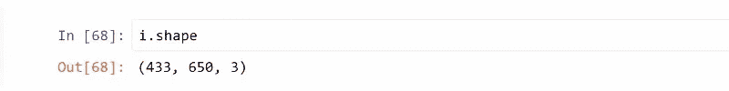

让我们来看看图像的形状。我们有一个 433 乘 650 的矩形，实际上我们有它的 3 个维度。433 乘 650 是图像的尺寸。3 代表不同的矩形，因为它是彩色图像。我们有一个红色的，一个绿色的和一个蓝色的。

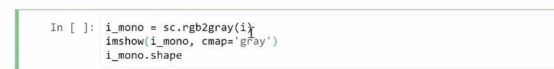

现在我们能做的是把这个图像转换成灰度，我们可以用上面的代码来完成。一旦我们把它转换成灰色，我们就把它显示成灰度图像，我们来看看它的形状。让我们继续运行它。

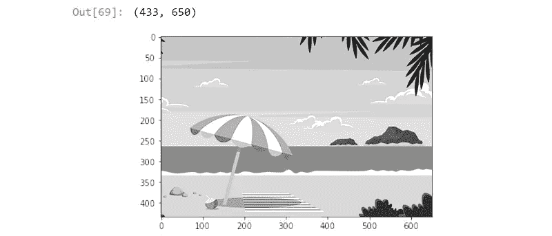

Image created by the author.

这次仍然是 433 乘 650，但是，现在只有一个矩形。这是因为我们现在用灰度显示图像。我们不需要红绿蓝(RGB)图层。因此，我们能够通过将它转换成灰度级来使它成为单通道图像。通常，当您进行某种图像分析时，这是一种简化过程的好方法，方法是去掉多个通道，专注于一个灰度通道。

# 均等

因为一幅图像实际上是一个数值数组，这些数值的分布可以告诉你一些关于图像包含的颜色或阴影范围或其中的物体的信息。您可以将这些绘制成直方图，以查看值的分布。您还可以使用累积分布函数(CDF)来查看像素值是如何累积的。y 轴上的每个点显示 x 轴上的所有值的频率，包括 x 轴上的值。

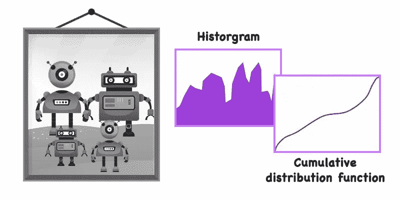

Illustration by [Vecteezy](https://www.vecteezy.com/).

对于图像处理来说，像素值相对均匀的分布通常是好的。不均匀的分布可能表示图像中存在需要均衡的极端对比度。因此，您可以标准化图像，以均衡像素分布。完美均衡图像的 CDF 将显示一条直的对角线。

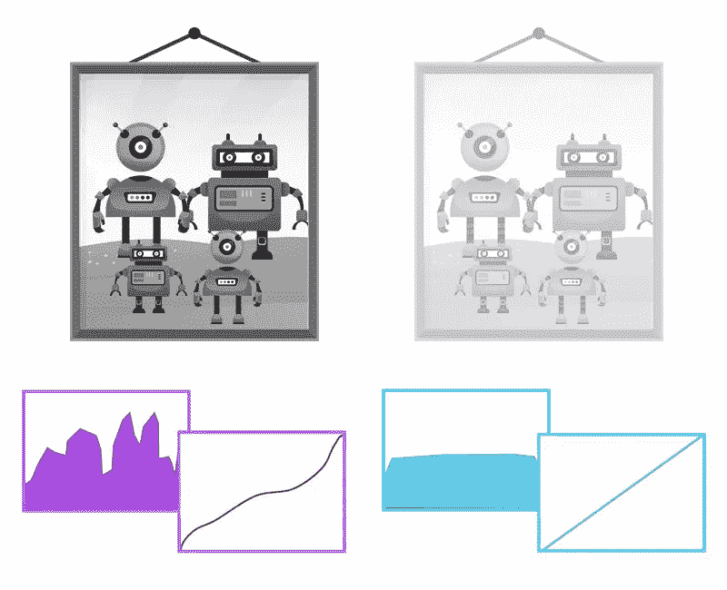

Illustration by [Vecteezy](https://www.vecteezy.com/).

让我们看看使用 Python 规范化图像的例子。在 [Jupyter notebook](https://jupyter.org/) 中，我们要做的第一件事是为像素强度中所有不同的可能值创建一个包含 256 个面元的直方图。我们将创建一个直方图，这样我们就可以看到这些值的分布情况，我们可以用下面的代码来实现。

当我们运行这段代码时，我们会看到直方图形式的这些值的分布。直方图显示了图像中不同灰度的分布。


Image created by the author.

我们可以做的另一件事是，我们可以使用这个累积分布函数(CDF)。这基本上显示了到目前为止所有值的分布。

我们只要继续运行它。我们会得到下图。

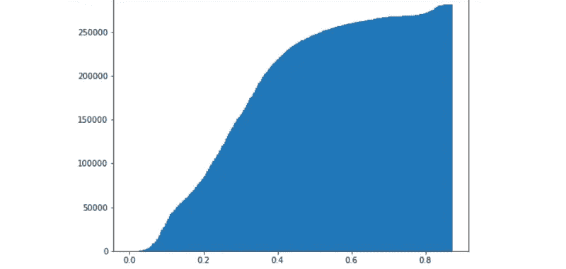

Image created by the author.

在完美的标准化图像中，CDF 将是完美的直对角线。如你所见，它的末端有一些曲线，我们有一个相当不均匀的值分布。为了简化处理过程，我们可能要做的是对其进行均衡。此刻的不均匀可能表明图像中的对比度存在一些问题，因此我们希望平衡对比度。为此我们有下面这个函数。

所以让我们继续运行它。

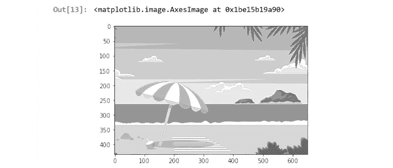

Image created by the author.

正如我们所见，均衡后的图像色调更加均匀。我们还可以使用下面的代码查看直方图和 CDF 图。

让我们继续运行它。

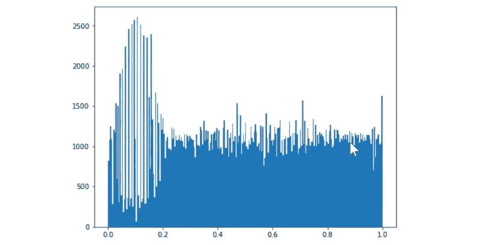

Histogram. Image created by the author.

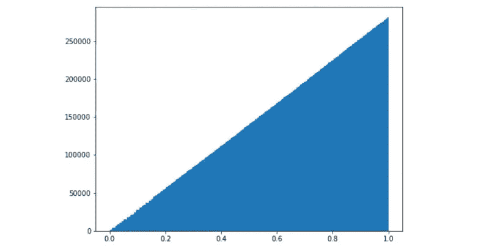

Cumulative Distribution Function (CDF). Image created by the author.

对于直方图，我们仍然可以看到一些峰值，但我们可以看到中间的峰值更加平稳，因此值的分布更加均匀。我们的 CDF 或多或少有一条对角线。因此，我们当然已经平衡了直方图中的值，这可能会使我们更容易使用这些值来尝试和提取一些特征。

# 过滤

有时，您需要处理的图像可能包含噪声。这通常被称为盐和胡椒或分散。这使得难以检测图像中的特征，因为噪声模糊了细节。您可以通过应用滤镜来消除图像中的噪声。例如，高斯滤波器的工作原理是定义图像的一部分，并根据周围像素的加权平均值确定中心像素的亮度值。较粗的像素比较远的像素具有更大的权重。因此平均值被分配给中心像素，然后移动补片。重复该过程，直到处理完整个图像。

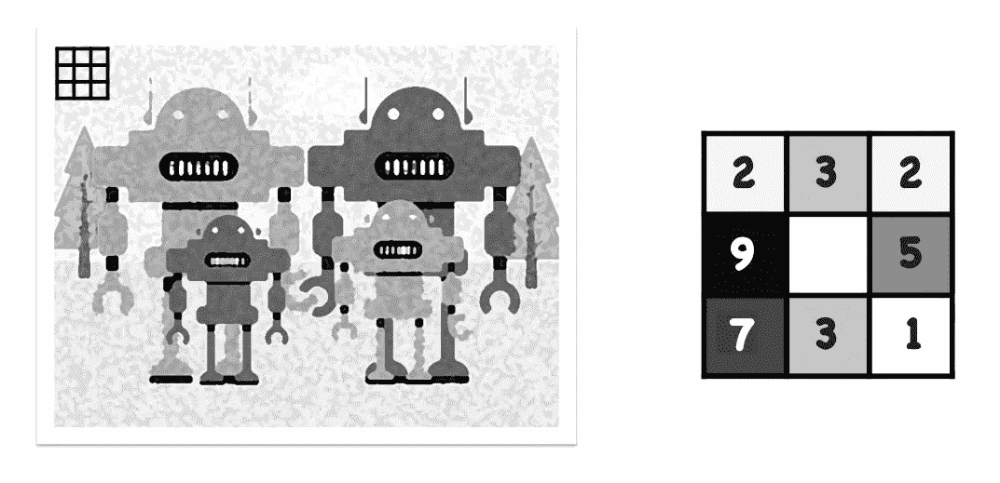

Image created by the author.

高斯滤波器通常会产生模糊效果。这是因为它平均了像素强度，即使在图像的边缘或角落有对比阴影的区域也是如此。

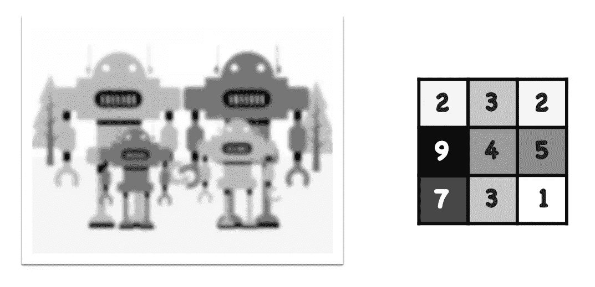

Image created by the author.

因此，作为替代方案，中值滤波器的工作方式与高斯滤波器相同，只是它将中值应用于中心像素。这种方法可以更好地去除细节图像中的小区域噪声，因为它倾向于保持图像相同区域中的像素值相似。这与它们离对比区域有多近无关。

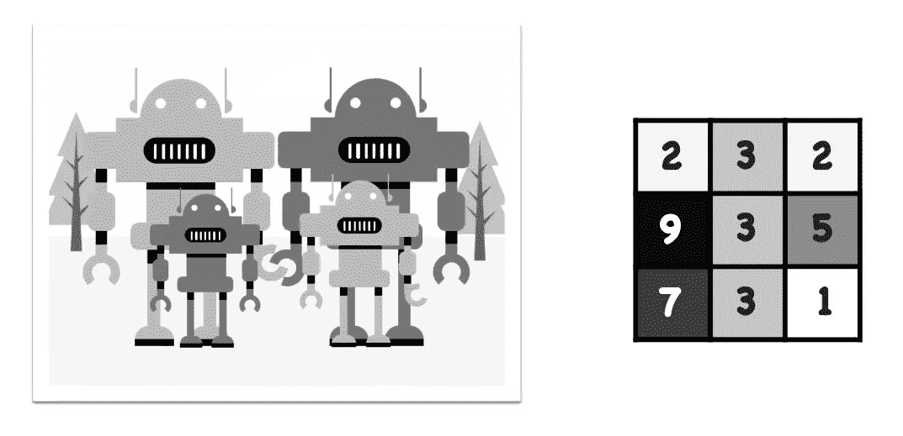

Image created by the author.

所以让我们用代码来尝试一下。我们可以给图像添加一些噪声。所以这段代码基本上会使用一种高斯模糊产生一些随机噪声。

我们可能要应用一个过滤器，以便连接，澄清和清除一些噪音。我们可能采用的一种方法是应用高斯滤波器。当我们在图像上移动蒙版时，这基本上是对像素进行平均。因此，在这种情况下，我们将创建一个大小为 10 个像素的遮罩，我们将运行该遮罩，这就是下面的代码所执行的操作。

我们可能希望采用比高斯滤波器不那么引人注目的东西，并应用类似中值滤波器的东西，我们不是取平均值，而是取中值。这可能有助于清理图像和消除所有斑点。我们可以通过下面的代码来实现。

# 边缘检测

准备好图像后，您可以使用各种技术从中提取特征。例如，您可以使用边缘检测算法来寻找颜色或强度的对比边缘。边缘检测算法对于指示图像中的形状或对象的边界非常有用。例如， **Sobel 边缘检测算法**的工作原理是将图像上的一种操作与之前看到的高斯和中值滤波器相结合。但是，这一次我们应用的矩阵是一个两阶段蒙版函数，它应用于图像中的像素强度值，以根据强度的变化计算梯度值。应用此遮罩来查找每个像素的水平渐变。姑且称之为 Gx 吧。

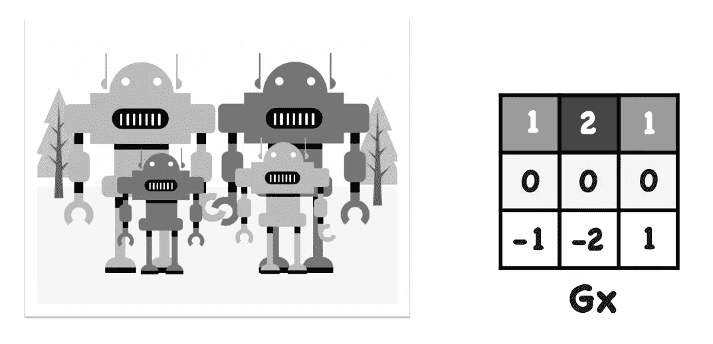

Image created by the author.

然后应用这个掩模来检测垂直梯度，我们称之为 Gy。

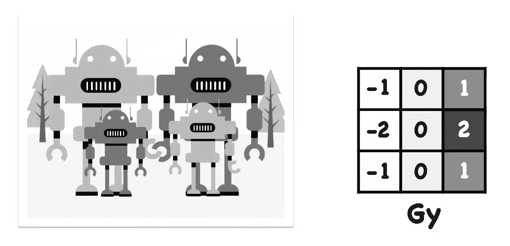

Image created by the author.

然后，我们将为每个像素计算的 x 和 y 梯度值的平方相加。我们用平方根来确定每个像素的梯度值，然后计算这些值的反正切来确定已经检测到的边缘的角度。

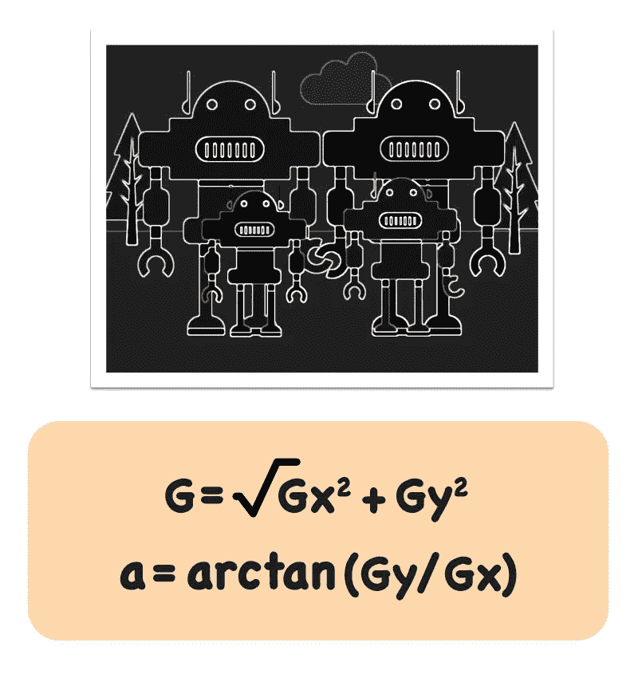

Image created by the author.

这是一些 Python 代码。这里我们创建了一个名为 edge_sobel 的函数，它穿过图像。我们所做的是，首先我们将图像转换成灰度。Sobel 边缘检测仅适用于灰度图像和一维图像，因此我们将它转换为灰度图像以防万一。然后，我们将采取我们的水平通过，并获得水平边缘。然后我们将垂直通过。所以记住有两个通道，边的 X 和 Y。然后，我们在这里应用斜边函数，基本上是将它们的平方相加，然后求平方根，得到不同边缘的实际幅度。然后我们将在这里应用这个函数来归一化它。然后我们返回，并在我们的图像中显示这些边缘。当你运行该代码时，它会遍历图像，并通过应用特定的 Sobel 算法来检测相当复杂的边缘。

所以我们能够接受图像实际上只是数字的事实。从这些数字中，我们能够获取这些特征，并提取它们，以便我们可以在图像中使用它们。

# 角点检测

当掩模水平或垂直移动时，边缘检测器使用梯度来寻找对比度和像素强度。然而，要检测图像中的角点，您需要检测任何方向上的强度对比度。**哈里斯角点检测器算法**通过测试图像的补丁来工作。在多个方向上移动补片，并比较每个位置的像素强度。现在，在图像的无特征区域，没有明显的差异，所以没有检测到角，如下图所示。

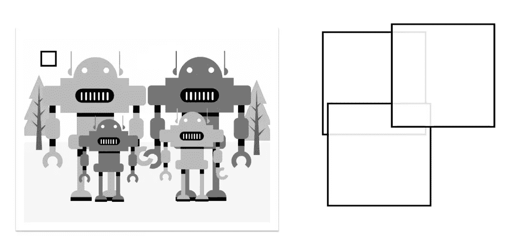

Image created by the author.

现在让我们在一个包含边的区域中尝试补丁。在这种情况下，当补片在一个方向上移动时，强度存在差异，但当补片沿着边缘移动时，强度不存在差异。所以这里也没有角。

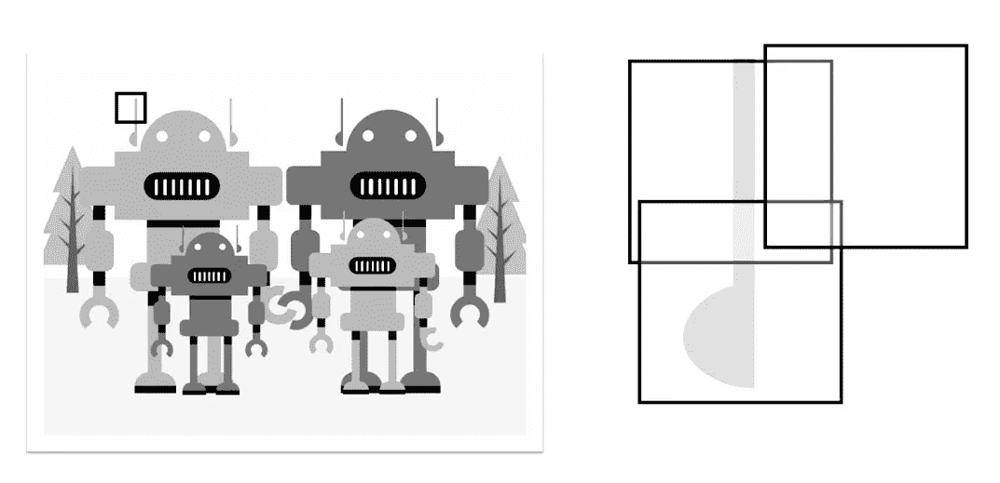

Image created by the author.

现在让我们把补丁放在包含一个角的区域。任何方向的运动都会导致强度的变化。所以这看起来像是一个角落。哈里斯算法的公式有点复杂，它使用了一些微积分和矩阵数学。然而，这个算法在很多语言中都有实现，包括 Python。

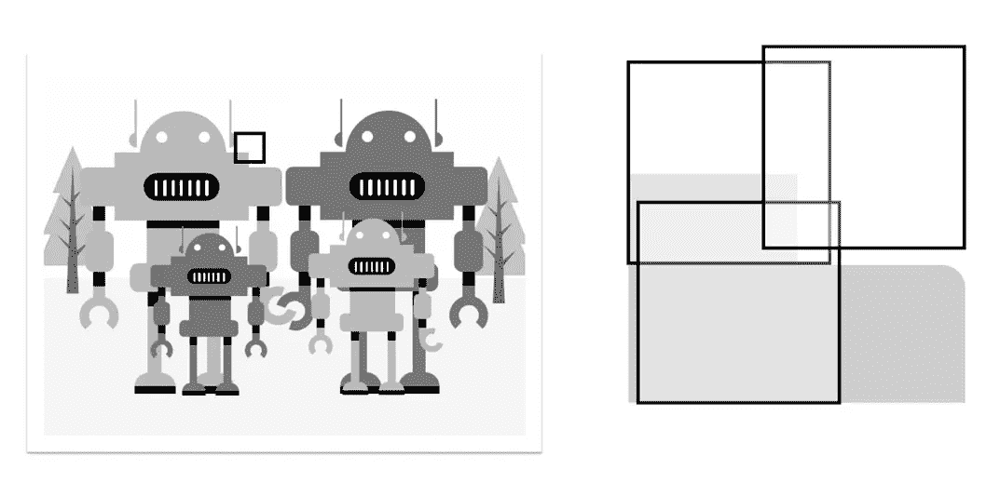

Image created by the author.

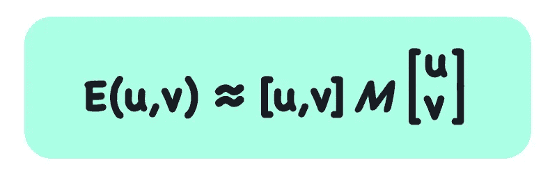

Image created by the author.

让我们用一些 Python 代码来尝试一下。

下面是对上面代码执行情况的描述。我们得到的是一个我们定义的名为 corner_harr 的函数，我们将指定一个图像和一个最小距离。这里真正重要的东西来自 skimage 图书馆。从这个库中，我们导入了 corner_harris，它应用了寻找角点的算法，还有一个叫做 corner_peaks 的东西。我们将使用它来过滤掉所有较低幅度的角点，这样我们就只剩下图像中比较突出的角点了。因此，我们将继续工作，我们的方式通过图像，然后过滤它的基础上的距离，我们已经指定的角落的大小。现在我们要做的只是简单地传递我们的均衡图像。记得我们之前学过如何均衡图像。因此，我们将传递我们的均衡图像，然后我们将绘制结果。我们得到了哈里斯结果。我们基本上要绘制图像，我们要绘制哈里斯算法检测到的角点。所以我们把它们标成红色的小标记，这样我们就能看到角的位置了。当您运行该代码时，您会看到它返回了最突出的角。

从这里我们看到，因为我们的图像实际上只是一组数字，我们能够应用这些数学公式和算法来提取特征，并从图像中辨别某种意义。这确实是人工智能技术在处理图像时正在做的事情。


Illustration by [Vecteezy](https://www.vecteezy.com/).

# **处理图像和视频**

# 图像分类

我们已经研究了各种处理图像并从中提取特征的方法。希望你已经看到，对于计算机来说，图像只是数字数组，可以在上面进行数学和统计运算。这意味着我们可以将类似的机器学习技术应用于图像，就像我们对任何其他数据所做的那样。例如，我们可以通过给图像添加标签来训练分类模型，如下图所示的汽车图像和火箭图像。然后，我们可以使用分类模型来预测新图像的适当标签。

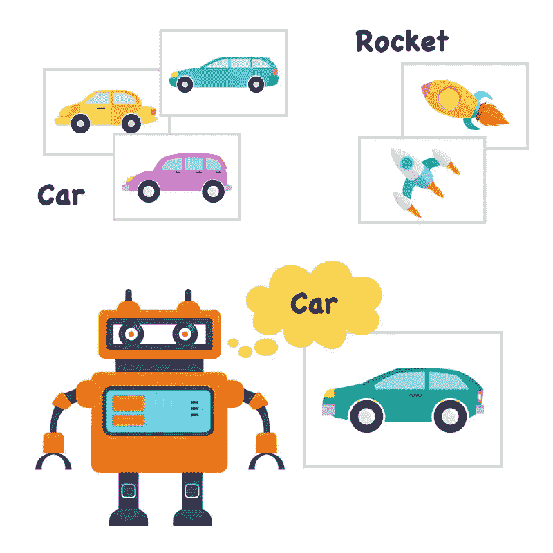

Illustration by [Vecteezy](https://www.vecteezy.com/).

定制[微软计算机视觉认知服务](https://azure.microsoft.com/en-us/services/cognitive-services/custom-vision-service/)提供了一个构建定制图像分类器的框架，这样你就可以构建人工智能解决方案，识别对你来说重要的物体图像。因此，为了了解自定义图像分类，我们将使用[自定义视觉 API](https://azure.microsoft.com/en-au/services/cognitive-services/custom-vision-service/) 。

让我们想象一下，我们正在为一家非常专业的杂货商公司工作，我们所做的只是销售胡萝卜和苹果。我们真正希望能够做到的是自动检测一个物体是胡萝卜还是苹果。因此，让我们来看看我们可以如何做到这一点。当我们从人工智能程序的角度来看这些时，我们可以使用一种分类方法。

所以我们要做的第一件事就是去这个[自定义视觉 ai](https://azure.microsoft.com/en-us/services/cognitive-services/custom-vision-service/) 。这是一项我们可以注册的服务，可以通过微软认知服务获得。我们可以根据自己定制的图像分类集专门创建项目。

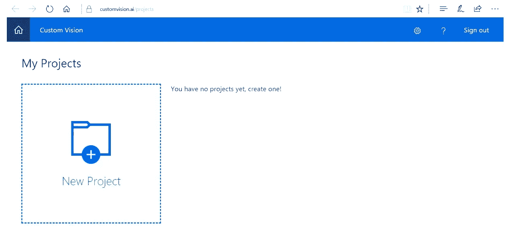

Image created by the author.

因此，我们将在这里创建一个新项目，我们就称它为水果和蔬菜。如果你喜欢，有各种现有的领域或主题领域，这显然属于食物的范畴，所以我们将选择食物。我们将创建一个项目。

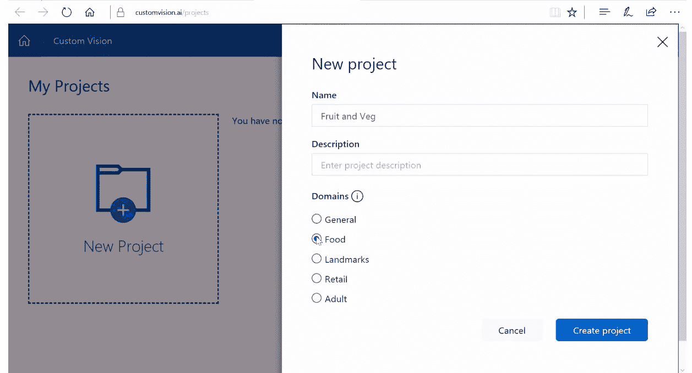

Image created by the author.

一旦我们创建了项目，首先需要的是一些图像。我们需要使用一些现有的图像来训练我们的分类模型，对于这些图像，我们已经知道合适的标签是什么。所以我们要去添加一些图像。

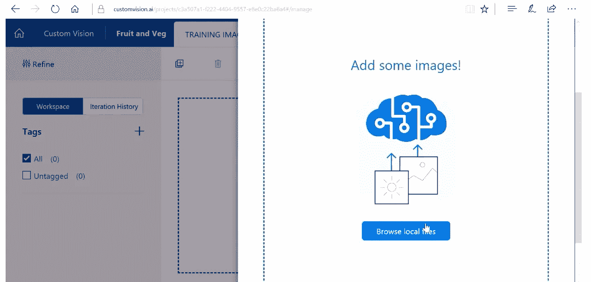

Image created by the author.

这里我们有一些胡萝卜的图片，所以我们将继续抓取这些胡萝卜并上传它们。我们将添加一个标签“胡萝卜”并上传这些文件。这将把它们添加到项目中，并给它们分配标签胡萝卜，这样我们就知道这些是我们的胡萝卜图片。好的，这是我们得到的一组图像。

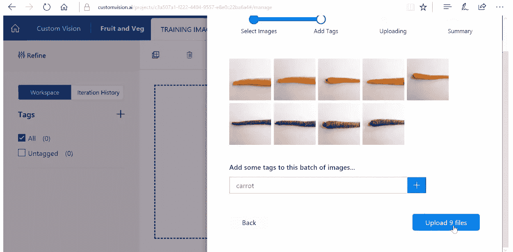

Image created by the author.

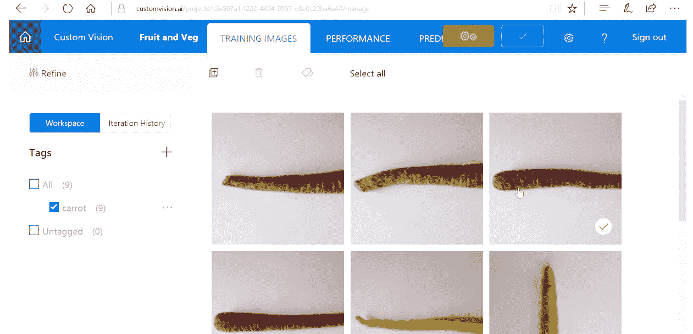

Image created by the author.

现在我们将添加一些苹果的其他图像。我们也将对它们进行标记。

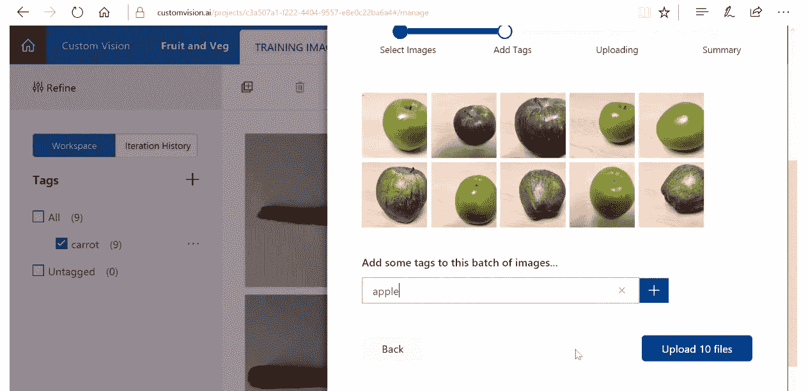

Image created by the author.

我们想要做的是使用这些图像来训练我们的分类模型。这里没有太多的图片。显然，你添加的图片越多，你的模型就越有辨识度，但这应该足够了。所以开始吧，开始我们的训练。它将训练这些，我们将保留一些图像来做一些测试。

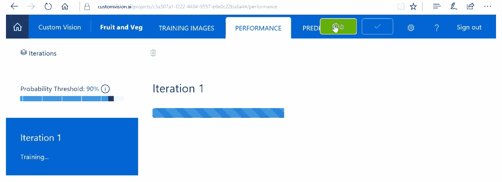

Image created by the author.

我们最终获得了令人印象深刻的 100%的性能，这是因为图像非常小，它们之间几乎没有什么可说的，但你会获得更真实的精度和召回率，这取决于你上传的图像数量。太好了，我们已经训练好了我们的模型。

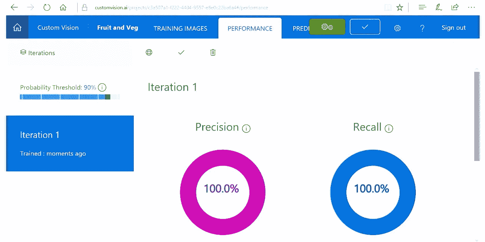

Image created by the author.

我们将把它设置为这个特定项目的默认模型。

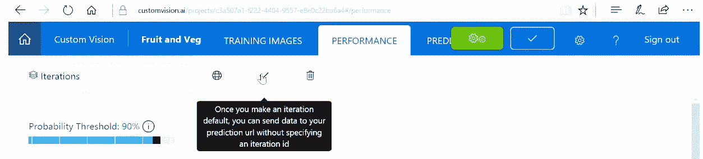

Image created by the author.

我们将从客户端应用程序中获取我们需要的信息，以便实际调用这个分类模型并使用它。有几种方法可以做到这一点，你可以上传一张图片或者你可以指定一个图片的 URL 来测试它。我们将使用一个 URL，所以我们需要预测键，这是我们项目中的键。这就是我们的身份。我们需要从我们的项目的网址。如下所示，它给了我们完整的网址。

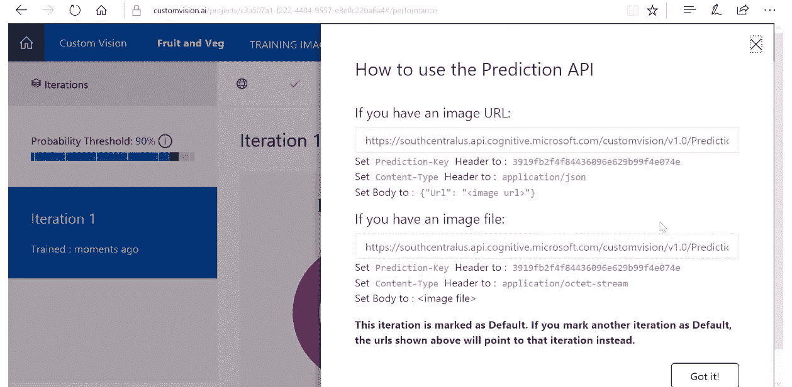

Image created by the author.

现在让我们看一些 Python 代码。

下面是对上面代码所执行的内容的描述。基本上，我们正在导入药丸库和地图断层实验室管道或库，这样我们就可以显示图像等等。我们在这里导入了一些 HTTP 库，这样我们就可以发出 HTTP 请求。我们将在该请求中传递一些 JSON，这样我们就有了 JSON 库，所以我们只需发出请求就可以调用该 API。这是我们想要分类的图像的 URL，所以它基本上被称为 test.jpg。我们要测试一下，看看这是苹果还是胡萝卜。我们已经在这里得到了我们的预测密钥，这是来自我们帐户的密钥。我们不需要更改它，我们需要更改的是这里的项目 ID，我们将更改它，这就是我们刚刚创建的项目。基本上，我们在这里要做的(conn.request)是将 HTTP 请求的头设置为内容类型 is application/json。我们传递一个 JSON 请求，这是预测键，所以这是我们预测服务的键。没有任何参数，但有一个主体，我们的主体只是由一些 JSON 组成，它表示 URL，然后是图像的 URL。这就是我们测试图像的 URL。然后我们要做的是创建到认知服务的 HTTP 连接。我们将在这里把它发布到自定义 vision 版本 1 预测 URL 上。我们将传入我们的项目 ID，在它的末尾有一个 URL。那么基本上只有主体和头中的参数作为一个 HTTP 请求被传递。我们得到了回应。这个响应将会是一个 JSON 响应，我们将会把它加载到一个解析过的 JSON 文档中。现在实际将要发生的是，它将返回所有可能应用于图像的标签。它会搜索每个标签，并指出它认为自己是正确标签的概率。所以我们会得到一个标签列表。请记住，图像可以有多个相关联的标签。我们要做的是找到最可能的标签。最有可能正确的标签，我们将按照标签的正确顺序对这些预测进行排序。然后，我们将显示该图像及其上方的标签。

所以让我们继续运行它。

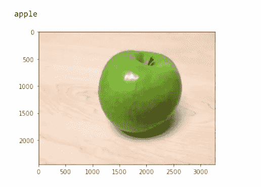

Image created by the author.

它所做的是，它已经预测到正确的标签是一个“苹果”,这肯定是我们的图像，看起来非常像一个苹果。因此，我们为图像建立了一个定制的分类器，专门处理我们需要处理的图像。我们能够使用它来自动检测和识别我们的人工智能应用程序看到的不同图像。

# 映象分析

有时你可能需要一个更通用的解决方案，不仅可以区分特定类别的对象，还可以开始理解图像中的内容。你可能需要能够识别各种类型的日常物品，并可能描述更复杂的场景，甚至可能阅读图像中的文本。

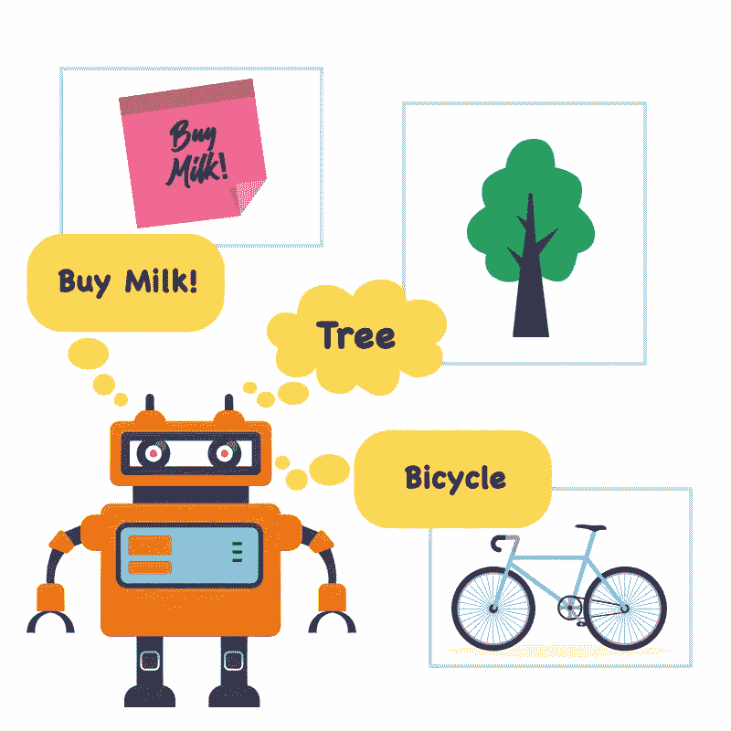

Illustration by [Vecteezy](https://www.vecteezy.com/).

[计算机视觉 API](https://azure.microsoft.com/en-au/services/cognitive-services/computer-vision/) 是一种认知服务，已经使用数百万张图像进行了训练，并建立了光学字符识别能力。让我们来看看吧。现在要使用 [vision API](https://azure.microsoft.com/en-au/services/cognitive-services/computer-vision/) ，你必须在你的 Azure 订阅中添加一个服务。完成后，您应该有一些访问键，可以用来从客户端应用程序连接到它。现在我们可以去写一些代码了。我们已经设置了网址。这是一个位置特定的，因此根据您提供它的位置，URL 可能会有所不同，然后是您的特定服务的密钥。

所以我们继续运行它。我们已经填充了这些变量，随时可以使用。现在我们要做的第一件事是抓取一个图像文件并显示它。下面的代码使我们能够做到这一点。

当我们运行这段代码时，它应该会打开一个图像。

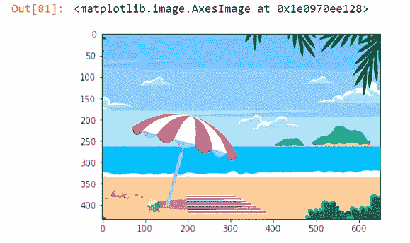

Image created by the author.

我们要做的是，我们将使用计算机视觉 API 来获取该图像的一些特征。就像我们对自定义分类或我们构建的自定义分类器所做的那样，我们可以获取一些标签，我们现在只需从中获取一些标签。我们将使用下面的代码来实现这一点。我们没有训练过这个。这是由微软训练出来的，它是由成千上万的图片训练出来的，所以这里有大量的信息。

使用上面的代码，我们要做的是设置我们的头，但是把它放在一个 application/json 内容类型中，这样它会传递一些 json。我们将传递密钥，以便通过身份验证。然后我们这里有一些参数，基本上我们要说的是，这些是我们想要你返回的东西。我们希望您返回类别、描述和一些关于颜色的信息。我们可以指定一大堆其他的东西，但我们真正想要做的是对图像进行分类，给出一些关于图像的描述，如颜色。我们会把这些用英语描述的细节带回来。那么主体就是指向我们想要分析的图像的 URL。因此，我们将向 vision v1 analysed 方法发出 HTTP POST 请求，传递这些信息，然后我们将得到响应。返回的响应是 JSON，因此我们将直接读取该 JSON。一旦我们得到了它，我们就可以为我们的图像 URL 获取图像特征。这就是这个函数的作用。然后，我们将显示推荐的描述。让我们继续运行它，返回的结果如下:

```
tags: umbrella, tree, palm.
captions: A close up of an umbrella.
```

我们实际上可以看到返回的完整响应，并通过下面的代码查看进一步的细节。

这是它返回的内容:

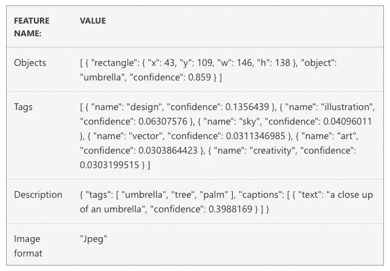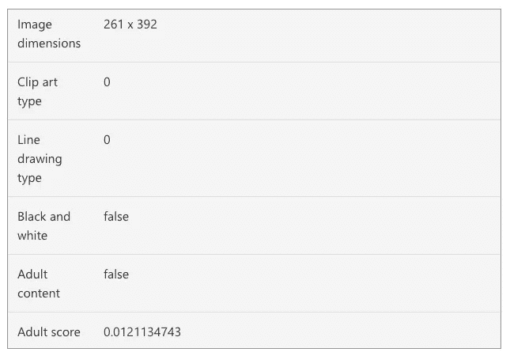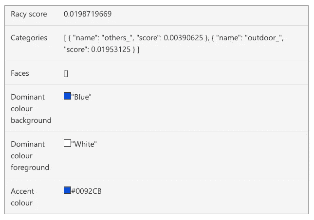

因此，我们训练了这些图像，或者说微软已经使用数百万张图像训练了这些图像，通过简单地对照 API 分析图像，实际上给你一些相当准确和有用的信息。

# 人脸检测和识别

作为人类，我们天生就有识别面孔的能力。这就是为什么我们经常可以想象我们在随机的事物中看到脸，比如云和月亮。当我们与人工智能软件合作时，我们可以使用实时摄像机和图像来使计算机看到他们周围的世界。人脸检测，即确定图像中是否存在人脸的能力，是人工智能的一项重要能力。特别是如果这可以与人脸识别相结合，以匹配多个图像中的同一个人或识别特定的个人。


Illustration by [Vecteezy](https://www.vecteezy.com/).

[face api](https://azure.microsoft.com/en-au/services/cognitive-services/face/) 是一种认知服务，旨在处理面部和图像。我们需要做的第一件事是提供[界面 API](https://azure.microsoft.com/en-au/services/cognitive-services/face/) 。一旦你设置好了，你应该有一些我们的客户端应用程序需要的键。face api 是一种认知服务，旨在处理人脸和图像。我们现在要写一些代码。我们需要做的第一件事是指定连接到服务所需的 URI 和密钥。我们只需要初始化这些变量。

现在是 face API，有一个认知 face SDK，它是作为一个 Python 包提供的，所以它可以作为一个包装器。我们还将安装 pillow API，它同样用于处理图像。

所以我们将运行这些。所以现在我们想做的是拍摄一张照片，看看我们能否在照片中发现一张脸。我们可以用下面的代码来实现。

使用上面的代码，我们将要做的是获得一堆导入。我们在这里导入了 cognitive face API 作为 CF。我们可以在 CF 库上使用许多函数来简化工作。因此，我们将从我们的特定服务设置 URI 的基本 URL，并将密钥设置为我们的密钥。这意味着我们准备好进入并调用我们自己的服务实例。现在，我们将从一个 URL 中抓取一张人脸图像，并附带一个文件。我们将获取它，然后调用 face detect 方法，在那个 URL 中传递它，看看我们是否得到了关于人脸的任何信息。现在，如果在该图像中检测到一个或多个人脸，我们将获得这些人脸 id 的集合。这当然可以检测图像中的多张脸，我们实际上可以处理所有的脸，但在这个例子中，我们只关心第一张脸。因此，我们将获取 ID，它将为该面部分配一个 ID。然后我们就去看看那个 ID 是什么样子的。然后我们将抓取图像本身，打开并显示它。对于找到的每一张脸，在这种情况下，我们只关心找到的每一张脸的第一张，我们要去找到这张脸在图像中的位置。然后我们要在脸部周围画一个蓝色的矩形。我们得到的是面部的左上角坐标以及宽度和高度，因此我们可以用它来绘制一个矩形。然后我们只展示那张脸。

所以让我们继续运行代码。这是它传回的图像，毫无疑问，我们在它检测到的脸部周围有一个蓝色的矩形。

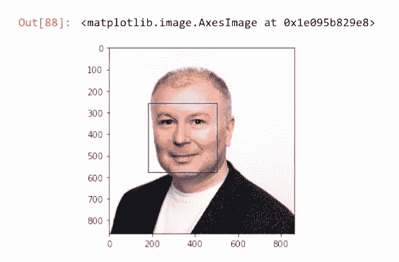

Image created by the author. Photo of Graeme Malcolm — Senior Content Developer at Microsoft Learning Experiences.

好的，如果我们已经得到了这个图像，我们想把它和另一个图像进行比较。也许我们正在实现某种自动人脸检测系统，我们可以用它来确保进入大楼的安全。我们希望我们建筑中的人工智能解决方案能够识别这个人，并将其与另一幅已被识别的图像进行比较，看看是否是同一个人。下面的代码就是这么做的。

使用上面的代码，我们要做的是抓取另一个图像并打开它。我们将在该图像上进行面部检测，并拍摄该图像，完全按照我们之前所做的那样进行操作。我们会说这里有一个图像，告诉我有没有一张脸，如果有，告诉我它在哪里。更重要的是，我们会得到一个 ID，所以我们得到的是第二张脸的 ID。我们已经知道了第一张脸的身份。所以我们会得到第二张脸的身份。我们有这个功能来验证面部。我们将传入两个 face IDs，并从我的 face API 中使用这个 verify 方法来查看第一个 ID 是否与第二个 ID 相同。它可以检查是否是同一个人，如果是，我们将画一个矩形包围的脸。如果不是同一个人，我们将使用红色矩形，如果是同一个人，我们将使用绿色矩形。有一个与此相关的置信度，它告诉我们在这场比赛中它有多自信。所以我们可以继续运行代码。

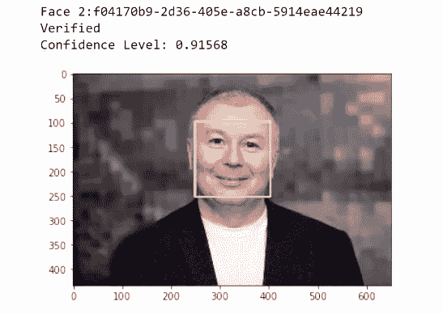

Image created by the author. Photo of Graeme Malcolm — Senior Content Developer at Microsoft Learning Experiences.

我们可以看到，这张图片周围有一个绿色的矩形，表明它与另一张图片是同一个人。它也有 91%的置信度。如果该图像与先前的图像不匹配，则置信水平会低很多，并且矩形会是红色的。这对 AI 来说真的是很有用的东西。如果你想一想这样一个事实，当我们与人打交道时，我们经常会认出他们。我们知道我们是谁，我们可以分辨出我们以前是否见过那个人。这只是一种将它扩展到人工智能的方式，让人工智能能够首先识别人脸，然后将它们与其他图像或这些人脸的其他记忆进行匹配。

# 视频基础

所以到目前为止，我们已经考虑了如何处理静态图像，我们可以做很多事情。然而，世界在不断变化，视频正成为网络上更普遍的媒体格式。

这是一个人走路的短片。事实上，这个视频实际上只是一系列被称为帧的静态图像。它们以特定于格式的编解码器进行编码，并封装在一个容器中，该容器还包括一个标头，其中包含有关格式持续时间等的元数据。

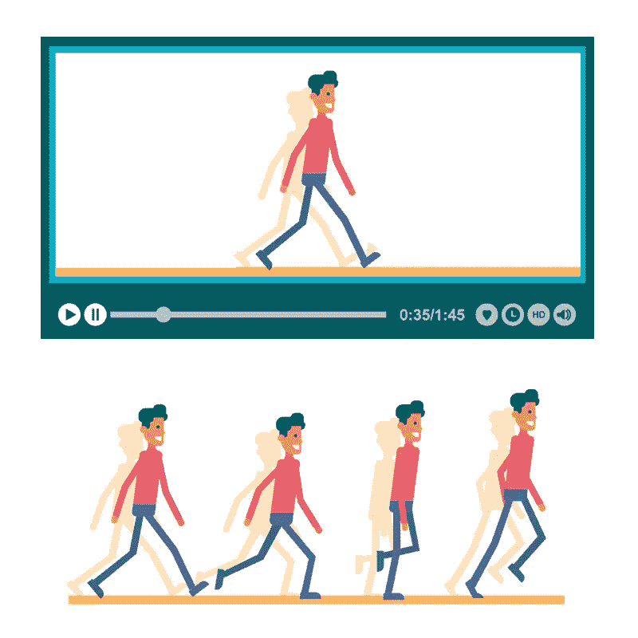

Illustration by [Vecteezy](https://www.vecteezy.com/).

现在来看看如何处理一些视频，我们将运行一些非常简单的 Python 代码，它将抓取一个视频并播放它，同时查看其中的帧。首先让我们安装这个名为 AV 的库。所以我们安装了它，安装了这个包，我们现在可以开始做一些视频的事情了。

```
!conda install av -c conda-forge -y
```

现在，我们将抓取一个小视频文件，并在笔记本上播放。


Image by [tenor.](https://tenor.com/view/bad-ass-cat-deal-with-it-gif-13331314)

我们来看看视频中的画面。我们将计算帧数，并使用下面的代码显示第 25 帧。

使用上面的代码，我们将打开该视频，然后进入容器并获取将为我们提供帧的视频编解码器。我们将遍历每一帧，检查索引是否是 25 号。换句话说，我们找到第 25 帧，并将其转换为图像，以查看该帧的外观。它将继续对帧进行计数，一旦我们到达帧列表的末尾，我们将取出当前所在的帧，并减去 1，因为帧索引从零开始。我们将减去 1，这将告诉我们现在视频中有多少帧。这是一个小视频，因此这不是计算较大视频帧数的最有效方法。

当我运行它时，它能够运行它，它在视频中找到 111 帧，这是第 25 帧的样子。


Image by [tenor.](https://tenor.com/view/bad-ass-cat-deal-with-it-gif-13331314)

这个过程将是我们对视频所做的许多工作的基础。

# 视频索引器

视频索引器是一种认知服务，它汇集了我们在本课程中迄今为止看到的许多人工智能功能。这是人工智能如何帮助自动化耗时任务的一个很好的例子，如编译和编辑视频文件的元数据。这是视频索引器用户界面的样子。我们已登录该服务并上传了一段视频。


Image created by the author.

这是一段视频，摘自微软的另一门课程。视频没有被修改，只是被上传了。如果我们从这里开始播放，我们实际上可以看到一些见解出现。在右手边，你可以看到有人在这里。它识别了两张不同的脸。


Image created by the author.

所以我们要去告诉它正确的名字。


Image created by the author.


Image created by the author.

它也收集了一些关键词。这是从一门关于统计学的课程中找到的，它找到了关键词“统计学基础方法论”。它获得了一些情绪，大约 53%的时间是正面的，大约 47%的时间是中性的。所以这是一个相当积极的视频。


Image created by the author.

我们也可以使用这些关键词“统计学基础方法”跳转到视频的一部分，或者“统计学课程”的一部分。我们还可以看到，它自动为该视频生成了一份抄本。


Image created by the author.

它生成了英文文本，但我们可以将其更改为法文。


Image created by the author.


Image created by the author.

我们也可以搜索一个词，例如“数据”。它将尝试并找到数据出现在抄本中的位置，并自动跳转到视频的该位置。

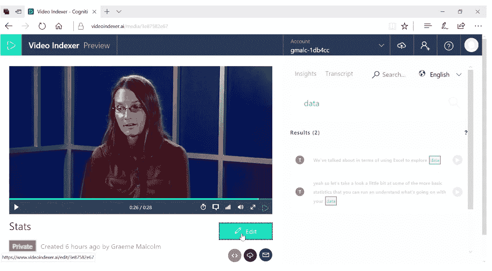

Image created by the author.

我们可以去编辑这些见解。例如，我们可以将成绩单从“这不是一个统计课程傻瓜”编辑为“这不是一个完整的统计课程”。


Image created by the author.

我们可以即时进行修改和编辑，并发布视频，让所有这些见解都可用。这将帮助人们在视频中导航和查找内容。所有这些都可以在这个用户界面和 API 中获得。所以我们可以写一段代码，上传一段视频，自动生成这些见解，然后下载生成的见解。它能够分析这些内容，因此这是一个非常令人印象深刻的人工智能应用，可以分析视频、音频，进行一些文本分析，并做各种有趣的事情，让需要管理大量视频文件的人的生活变得更加轻松。

# 视频索引器 API

视频不是特别有意思，除非显示一些运动。例如，想象一个用于监控濒危物种或安全地点的摄像机。人工智能可以帮助你找到运动发生的帧，而不是观看整个视频。也许您想更具体一些，只突出显示视频中人脸可见的点，或者甚至识别视频中人的特征。


Illustration by [Vecteezy](https://www.vecteezy.com/).


Illustration by [Vecteezy](https://www.vecteezy.com/).

为了分析我们的视频，我们将使用视频索引器 API。因此，在我们的代码中，我们引用帐户和帐户 ID。

```
viLocation = 'trial'
viAccountID = 'YOUR_ACCOUNT_ID'
```

所以我们将运行代码来设置这些变量。接下来我们要做的是创建一个视频索引器 API 订阅。

```
viKey = 'YOUR_PRIMARY_KEY'
```

好了，现在让我们来看看连接和使用 API 的过程。我们要做的第一件事是得到一个访问令牌。现在有各种不同级别的访问令牌，我们首先需要的是一个帐户级别的访问令牌，以便我们可以连接到我们的视频索引器帐户。所以我们这里有一些代码可以做到这一点。

使用上面的代码，我们将发出一个 HTTP 请求，基本上我们将连接到我们的视频索引器 API。我们将传入我们的 a 密钥，并传入我们需要访问令牌的位置和帐户 ID。我们应该以 JSON 文档形式取回访问令牌。如果我们运行那个代码，它会返回 JSON。这是我们从中提取的值。它只是一个访问令牌，一个很大很长的令牌，我们用它来建立到 API 的认证连接。

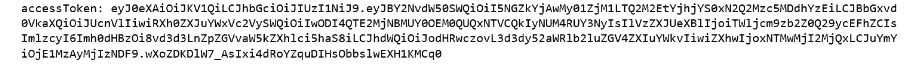

好了，现在我们已经可以开始使用视频索引器 API 了。我们要做的是上传一个视频，用下面的代码进行处理:

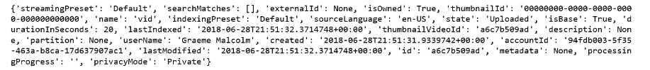

因此，我们运行代码，并得到一个带有为该视频设置的一些元数据的响应。其中一个是视频 ID。你可以获得视频 ID，但这太繁琐了，所以你可以做的是运行一些代码来获得视频 ID。

这段代码解析 JSON 并获取 ID。

```
videoID: a6c7b509ad
```

现在上传视频，处理需要一点时间。所以你可能只是想检查上传的视频的状态。下面的代码允许您检查状态。

```
State: Processing
```

视频处理完成后，我们现在准备好连接并开始获得一些见解。然而，为了做到这一点，我们需要不同级别的访问令牌。我们需要一个视频级别的访问令牌，我们可以用下面的代码得到它。

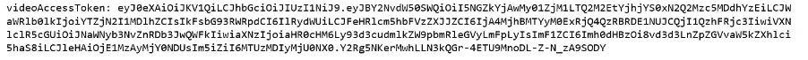

这是视频访问令牌，和上次的想法一样，一个又大又长的安全令牌。我们使用该令牌来观看视频。我们可以从视频索引器网站上获取用户界面的元素，并将其嵌入到我们自己的应用程序中，只需使用这样的代码。我们将获取该 URL，传入我们特定视频和令牌的各种细节。然后我们会在笔记本的 iframe 中显示它。

因此，我们想要做的是使用视频索引器，通过下面的代码来获得对该视频中实际发生的事情的深入了解。

它返回的是如下所示的一些见解。

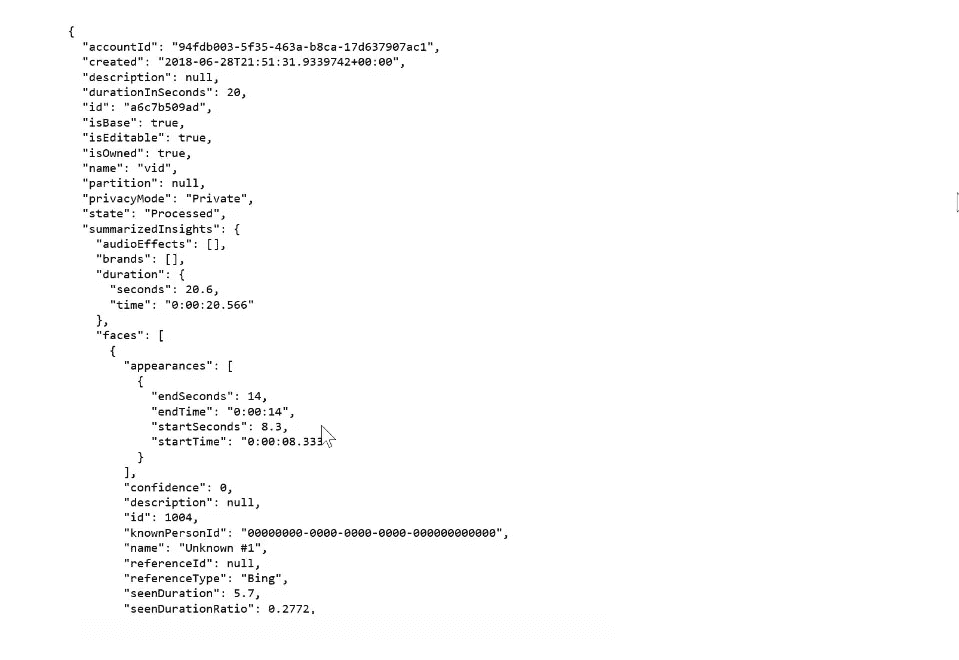

我们得到了一些关于视频的元数据，看起来至少有一张脸。它说有一张脸的出现在 14 秒后结束，它从 8.3 秒开始。我们不知道那个人是谁，我们有一个已知的身份证，但全是零。让我们去获得视频中面部识别的细节，python 代码如下。

让我们继续使用这段 python 代码以缩略图的形式查看这张脸。

正如你所看到的，它返回了下面的缩略图。

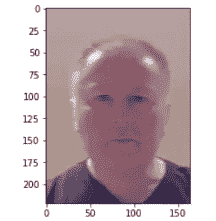

Image created by the author. Photo of Graeme Malcolm — Senior Content Developer at Microsoft Learning Experiences.

然后，我们可以使用下面的代码查看缩略图的细节。

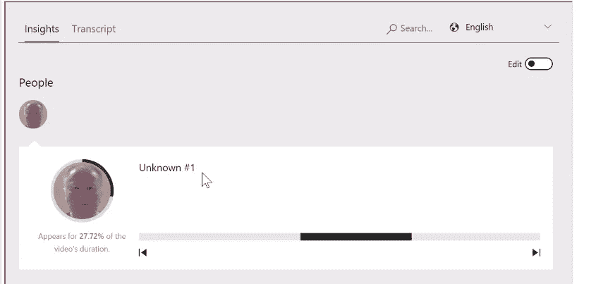

Image created by the author. Photo of Graeme Malcolm.

正如我们所看到的，这个人是未知的，但是我们知道这个人是这门课的讲师格雷姆·马尔科姆。我们可以编辑这个，把未知数改为格雷姆·马尔科姆。

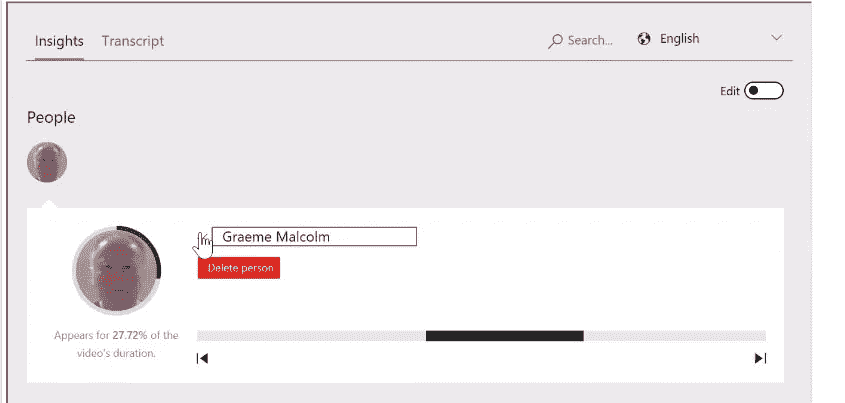

Image created by the author. Photo of Graeme Malcolm.

由于我们现在已经训练人工智能知道这是格雷姆·马尔科姆，我们可以再次测试它，看看它是否能识别它是格雷姆·马尔科姆。为此，我们需要重新加载分解，并检查更新的面部细节。我们可以用下面的代码来实现。

正如我们在元数据中看到的，它现在识别出这是 Malcolm Graeme。

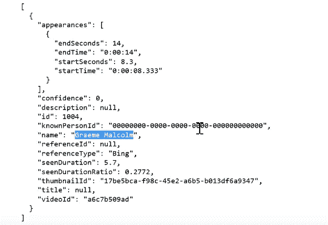

Image created by the author.

# 一锤定音

感谢您阅读这篇文章，这是微软人工智能入门课程的第 3 部分。如果你觉得这很有帮助，那么请查看我的媒体账户或数据科学 T2 的所有 4 个部分。如果你对本文中的一些概念有困难(不要担心，我花了一些时间来理解这些信息)，并且你需要更多的信息，那么就免费报名参加[微软人工智能入门课程](https://www.classcentral.com/course/edx-introduction-to-artificial-intelligence-ai-9164)。与这些笔记一起观看课程视频很有帮助。

* [如果您想了解课程笔记和其他与技术和产品设计相关的笔记背后的一些背景信息，您可以通过这里找到更多信息。](https://medium.com/@christinecalo/a-little-about-christines-notes-8ea2205594a2) *

***有点背景***

*大家好，我是 Christine:)我是一名产品设计师，在数字领域工作了很长时间，在许多不同的公司工作过；从大型公司(多达 84，000 名员工)，到中型企业，再到仍在扬名立万的小型初创企业。尽管我有很多经验，但我是一名产品设计师，害怕受到邓宁-克鲁格效应的影响，所以我不断尝试教育自己，我总是在寻找更多的光明。我相信，要成为一名伟大的设计师，你需要不断磨练自己的技能，尤其是如果你在不断变化的数字空间中工作。*