# 微软人工智能简介—第 4 部分

> 原文：<https://towardsdatascience.com/microsoft-introduction-to-ai-part-4-d310033bdb07?source=collection_archive---------19----------------------->

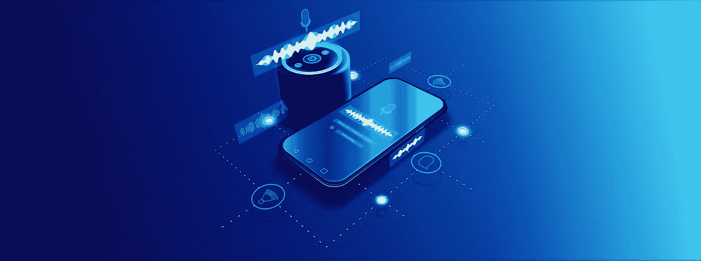

Image used under licence from Getty Images.

## 对话是一个平台

对话式人工智能允许人们每天通过语音、文本和触摸，用类似人类的自然语言与应用程序、网站和设备进行交流。它提供了一种引人入胜且直观的与技术互动的方式，这种方式正在彻底改变人类与机器的关系。我们已经从一个必须学习和适应机器的世界进化到一个它们正在学习如何理解我们并与我们互动的世界。

> “为了让人和机器一起工作，他们需要能够以更自然的方式进行交互，而对话是我们交换信息的首选方式。”
> 
> — Murray Campbell，IBM 杰出的研究员和深蓝的架构师

人工智能的进步将使计算机的对话能力变得更加复杂，为计算领域的巨变铺平道路。这是“微软人工智能导论”课程笔记的第四部分，也是最后一部分。了解智能对话机器人以及如何实现人类和计算机之间的自然交流。

# 背景

**(跳过背景信息如果你看过** [**第一部**](/microsoft-introduction-to-ai-part-1-879e31d6492a) **、** [**第二部**](/microsoft-introduction-to-ai-part-2-f7cfb6a5f1e3) **或** [**第三部**](/microsoft-introduction-to-ai-part-3-cb21d7a5e119) **)**

对于那些没有看过这个系列的[第一部](/microsoft-introduction-to-ai-part-1-879e31d6492a)、[第二部](/microsoft-introduction-to-ai-part-2-f7cfb6a5f1e3)或[第三部](/microsoft-introduction-to-ai-part-3-cb21d7a5e119)的人来说，这里有一些背景信息。我一直想学习人工智能(AI ),尽管对其中涉及的数学感到有点害怕，并认为一些概念可能超出了我的深度。幸运的是，我的好奇心战胜了我的恐惧，所以我开始学习一些与人工智能相关的课程。我最近完成了[微软人工智能入门课程](https://www.classcentral.com/course/edx-introduction-to-artificial-intelligence-ai-9164)，并写了课程笔记来帮助我记住我所学的知识。我试着用一种简单的方式来写这些笔记，让它们更容易阅读。我最近成为一名阿姨，买了几本与技术和空间相关的儿童书籍，非常喜欢作者和插图画家如何设法简化复杂的主题。因此，我受到启发，以类似的方式处理这些主题，简化它们，使它们更容易理解，特别是对那些和我一样最初对人工智能感到恐惧的人。

* [如果您想了解课程笔记以及其他与技术和产品设计相关的笔记背后的更多信息，您可以在此找到更多信息。](https://medium.com/@christinecalo/a-little-about-christines-notes-8ea2205594a2) *

# 摘要

**(如果看过** [**第一部分**](/microsoft-introduction-to-ai-part-1-879e31d6492a) **，** [**第二部分**](/microsoft-introduction-to-ai-part-2-f7cfb6a5f1e3) **或** [**第三部分**](/microsoft-introduction-to-ai-part-3-cb21d7a5e119) **)**

[微软人工智能入门课程](https://www.classcentral.com/course/edx-introduction-to-artificial-intelligence-ai-9164)提供了人工智能的概述，并探索了为人工智能提供基础的机器学习原则。从这门课程中，你可以发现将人工智能功能集成到应用程序中的基本技术。学习如何使用软件来处理、分析和提取自然语言的含义。了解软件如何处理图像和视频，以人类的方式理解世界。了解如何构建智能机器人，实现人类和人工智能系统之间的对话。

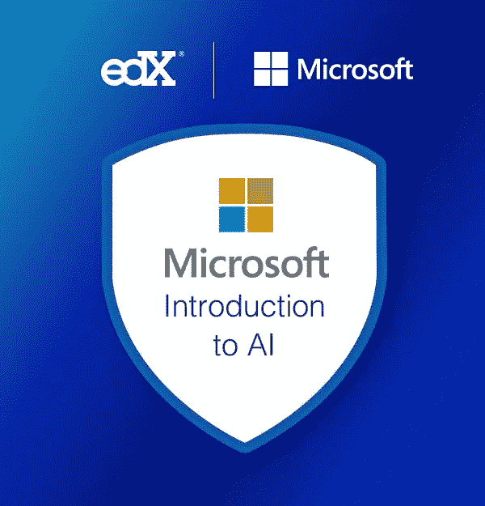

Image created by the author. [Microsoft Introduction to AI course](https://www.classcentral.com/course/edx-introduction-to-artificial-intelligence-ai-9164)

这个课程需要大约 1 个月的时间来完成，所以我写的 1 篇中型文章包含了一周的内容。这意味着你只需要花大约半个小时来阅读这篇文章，它是一周的内容。那是一种快速的学习方法。没有证书的课程是免费的，但是，如果你想要一个证书作为完成的证明，是要收费的。本课程有相关的实验，我不会在笔记中列出，因为我认为最好的学习方法是实际做实验。然而，如果你想了解人工智能背后的基本理论，并想以一种可能比其他资源简单得多的方式来学习它，这些笔记是有用的。我试着用外行人的术语来写它，并加入了视觉效果来帮助说明这个想法。如果你没有时间学习这门课程，这些笔记会很有用，这是快速浏览核心概念的一种方法。或者，如果你像我一样学过这门课，你可以用这些笔记来记住你学到的东西。

> ***教官:***
> 
> *Graeme Malcolm——微软学习体验的高级内容开发人员*

# 摘要

**(跳过教学大纲如果你看过** [**第一部分**](/microsoft-introduction-to-ai-part-1-879e31d6492a) **，** [**第二部分**](/microsoft-introduction-to-ai-part-2-f7cfb6a5f1e3) **或** [**第三部分**](/microsoft-introduction-to-ai-part-3-cb21d7a5e119) **)**

本课程分为四个部分，包括:

## 1.[机器学习](/microsoft-introduction-to-ai-part-1-879e31d6492a)

了解关于人工智能和机器学习的基础知识。

## 2.[语言与沟通](/microsoft-introduction-to-ai-part-2-f7cfb6a5f1e3)

学习如何使用软件来处理、分析和提取自然语言的含义。

## **3。** [**计算机视觉**](/microsoft-introduction-to-ai-part-3-cb21d7a5e119)

了解如何使用软件处理图像和视频，以我们的方式理解世界。

## 4.将对话作为一个平台(*这篇中型文章将只关注这一部分)

了解如何构建智能机器人，实现人类和人工智能系统之间的对话交流。

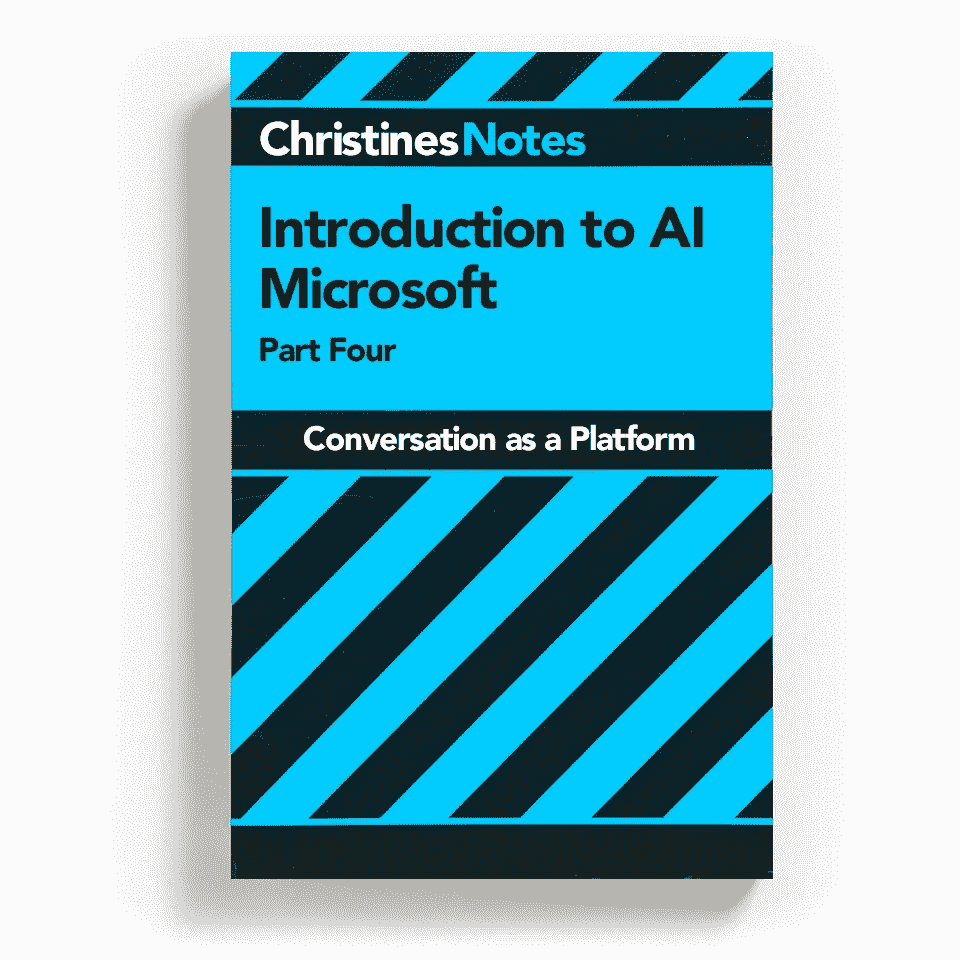

Image created by the author.

# 对话是一个平台

本课程的“计算机视觉”部分将涉及以下主题:

> ***僵尸工具简介***
> 
> *什么是 Bot？*
> 
> *微软机器人框架*
> 
> *创建基本机器人*
> 
> *频道*
> 
> ***打造智能机器人***
> 
> *机器人智能*
> 
> *创建 QnA 服务*
> 
> *创建 QnA 机器人*
> 
> *Cortana 技能*

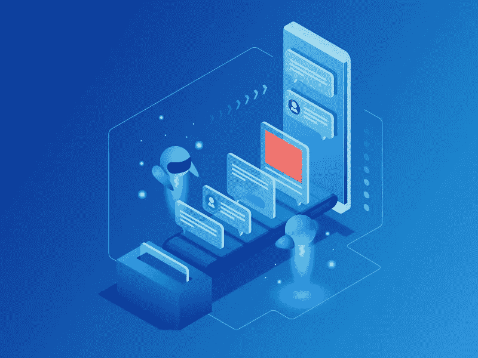

Image used under licence from Getty Images.

# 机器人简介

# 什么是机器人？

想想你通过即时通讯、社交媒体、电子邮件或其他在线技术与其他人交流的频率。对我们大多数人来说，这是我们常用的联系方式。现在，机器人是人工智能代理，它们使用这些类型的通道进行通信，通过与其他人使用的相同通信通道，实现与软件服务的自然对话。1950 年，艾伦·图灵设计了一个被称为图灵测试的模仿游戏，并假设如果对话足够自然，你可能不知道你是在和一个人还是一台计算机对话。随着人工智能变得越来越复杂，这正在成为现实。

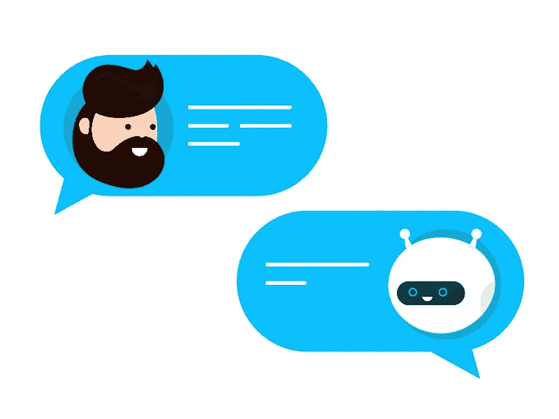

Illustration by [Vecteezy.](https://www.vecteezy.com/)

# **微软机器人框架**

[微软机器人框架](https://dev.botframework.com/)提供了一个构建和发布机器人的平台。您可以使用 bot builder SDK 或 Azure bot 服务来创建您的 bot 并将其作为 web 服务发布。您可以通过一个或多个渠道提供您的机器人，如 Skype 或其他流行的消息和社交媒体平台。bot 连接器服务处理您的 bot 与用户参与其中的通道之间的消息交换。每个交互都是一个活动，可以是一条消息，也可以是一个可视元素，比如包含图像、按钮或输入字段的卡片。当用户开始与机器人对话时，活动在通道和机器人之间自动路由。您还可以将您的机器人与认知服务集成，以便它能够智能地响应用户输入。

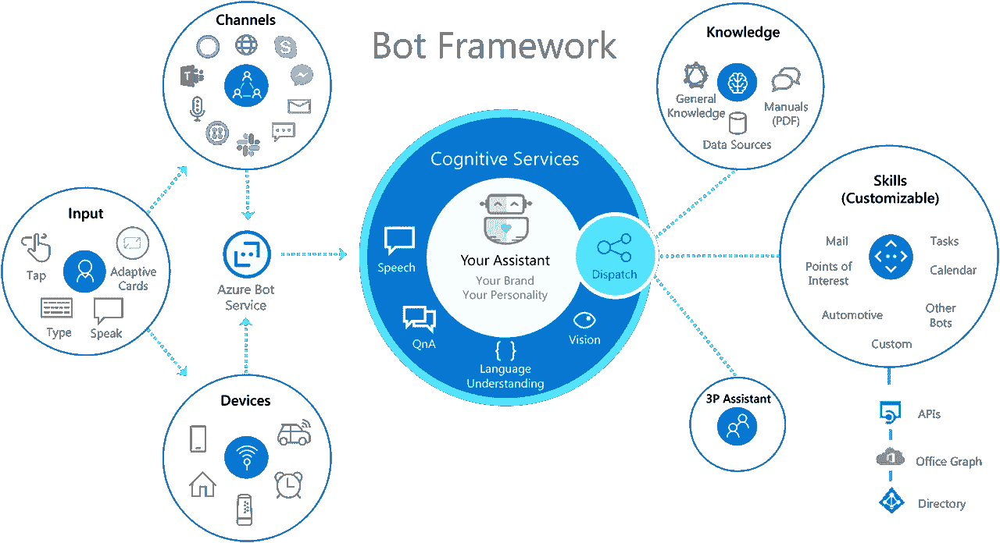

Image by [Microsoft](https://dev.botframework.com/).

# 创建一个基本机器人

让我们来看看如何使用 Azure bot 服务创建一个基本的 Bot。因此，我们现在在 Azure 门户中，我们将创建一个新的 web 应用程序机器人。为此，我们只需向您的帐户添加一个新资源。我们可以在人工智能&认知服务中找到它，或者只是简单地搜索机器人。在搜索结果中有一个 web 应用程序机器人，我们将创建其中的一个。

Image created by the author.

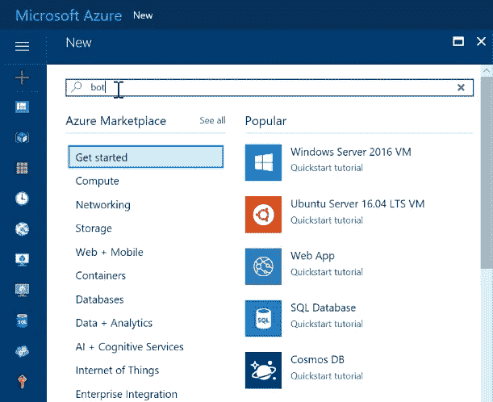

Image created by the author.

Image created by the author.

因此，我们的机器人需要的第一件事是一个名称，在这个例子中，我们将把它称为“ShoutyBot”。我们还需要在这里填写一些其他的东西。我们将为它创建一个资源组，以便集中管理所有相关资源。我们需要选择要部署的位置，因此我们将选择最近的数据中心。然后，我们需要为这个机器人选择定价层，有许多可用的定价选项。在这个例子中，我们将使用免费的。然后我们需要给它一个应用程序名称，它将创建一个 Azure web 应用程序来支持这个机器人，因此我们为它指定了一个应用程序名称，在这种情况下，它只是采用了与机器人相同的名称。

现在，我们将选择我们的机器人所基于的模板，根据您想要构建的机器人类型，您可以使用许多不同的模板。我们将简单地使用节点。JS 基本 bot 模板生成一些简单的节点。JS 代码来创建一个非常简单的机器人。接下来是进行设置这些设置。

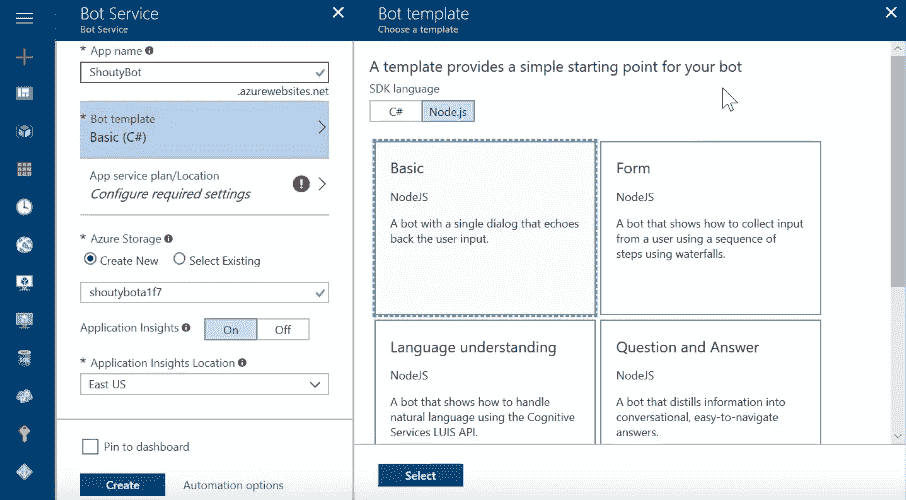

Image created by the author.

我们选择了免费层，因此我们不需要支付任何费用，但我们仍然需要设置服务计划，因此我们将设置该计划。

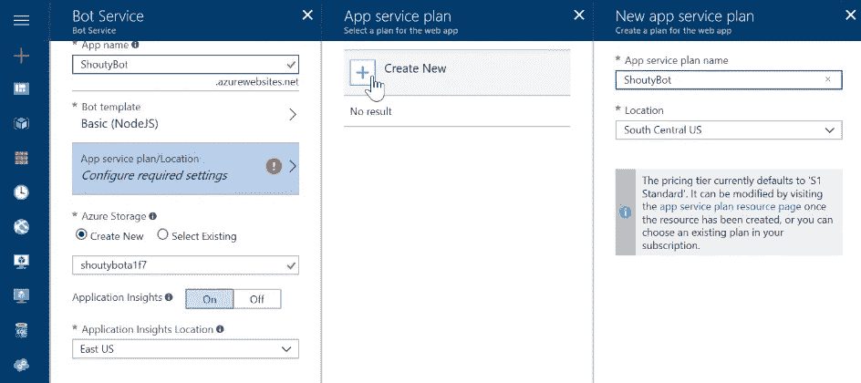

Image created by the author.

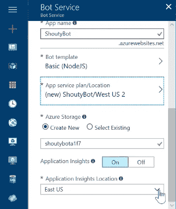

Image created by the author.

完成后，我们将创建一个存储帐户来存储机器人使用的一些数据，它会自动为其生成一个名称，因此如果我们满意，我们不需要进行任何更改。然后，它将创建一些应用程序洞察力，以便我们可以跟踪机器人的使用情况。这就是我们需要创建的所有设置。我们将继续创建我们的机器人。

它将继续验证这些设置，并确保我们准备就绪。一旦验证通过，它就会启动并开始创建我们的机器人。当部署成功时，我们会收到一条小消息，告诉我们已经创建了 bot。如果我们去看看 Azure 订阅中的资源组，我们可以看到他们有一个名为 ShoutyBot 的资源组。

Image created by the author.

如果我们在那里看一下，我们可以看到与我们的机器人相关的所有不同的资源。因此，它们都将在这个资源组中一起管理，机器人本身是这里列出的第一个“ShoutyBot”。

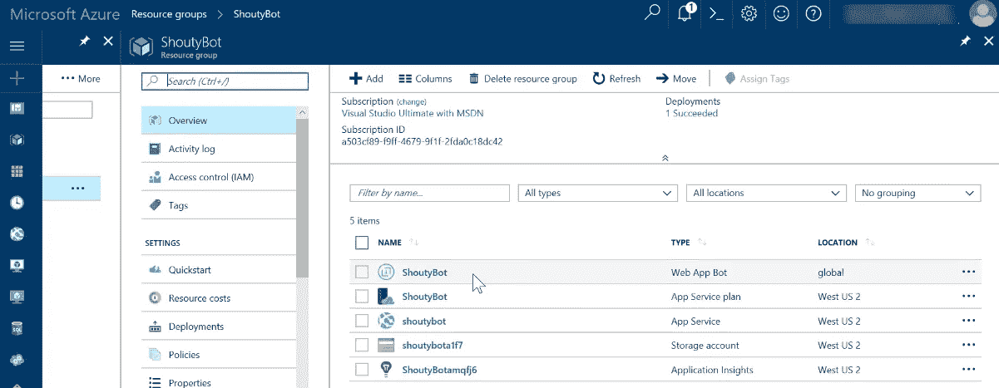

Image created by the author.

因此，我们将去看看，这里有许多页面，我们可以用来配置和使用我们的机器人。我们要做的第一件事是转到这个构建页面，这将让我们访问一个在线代码编辑器。

Image created by the author.

现在，我们可以在浏览器中在线编辑我们的机器人代码，或者我们可以在任何 IDE 中本地使用它，如 visual studio 或类似的东西。我们可以将代码下载为 zip 文件，并对其进行同步，甚至配置一种叫做持续部署的东西。因此，我们可以将代码放在源代码控制系统中，并与实际的在线机器人同步。在本例中，我们将使用在线代码编辑器，因此我们将打开它，进入这个在线环境。我们目前没有自述文件—没有为此创建的自述文件；但是我们能做的是开始查看我们的机器人的代码，它在这个 app.js JavaScript 文件中。有一些基本的代码被放在一起，以便在微软机器人框架上与我们的机器人一起工作，这是每当我们发送某种消息时机器人实际上做出响应的一点。

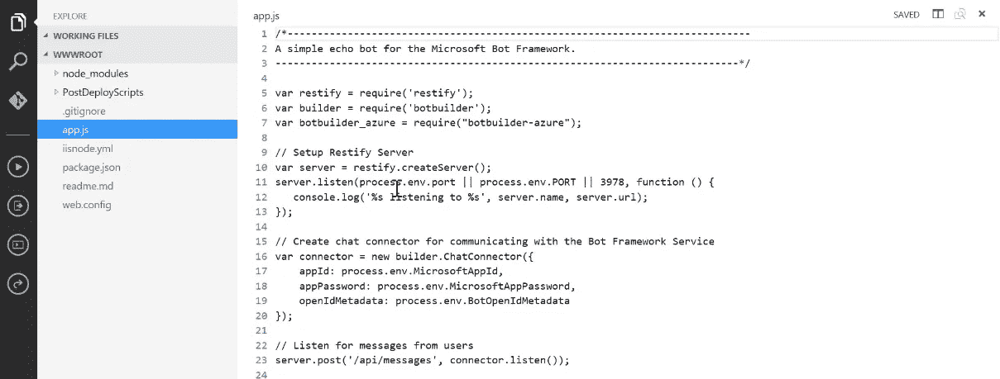

Image created by the author.

这是发送响应的代码，你可以看到它非常简单——它只是一个简单地说“你说了”的函数，它会重复用户对机器人说的任何话。

Image created by the author.

这并不是非常有用，所以我们要对它做一点小小的修改来证明我们可以做到。这不会真的更有用，但至少我们会看到它有所作为。所以我们要把它改成大写。所以我们现在所做的就是编写代码，这样无论何时我们对机器人说话，它都会用大写字母喊回来。

Image created by the author.

我们已经完成了，现在可以关闭这个代码编辑器，回到 Azure 门户中的 bot。我们要做的是在网络聊天中测试这个机器人。我们只需在网络聊天中点击测试，当机器人准备好测试时，我们只需输入一条消息。我们应该从 ShoutyBot 那里得到一个大写的回应——hello。所以你可以看到创建一个非常简单的机器人是非常容易的。只需在 Azure 门户中创建设置，然后对代码做一个小的修改，我们就会得到一个定制的消息。

Image created by the author.

我们现在可以做的是将这个机器人作为网络机器人部署在网页上，供人们使用。我们可以看到，如果我们在渠道中寻找，这里有这个网络聊天代码。我们可以在这里编辑这个频道，以获取密钥和代码，我们需要将该机器人嵌入到网页中，并使其可供人们使用。因此，我们非常简单地组装了一个 bot，并使用 Azure Bot 服务进行了部署。

Image created by the author.

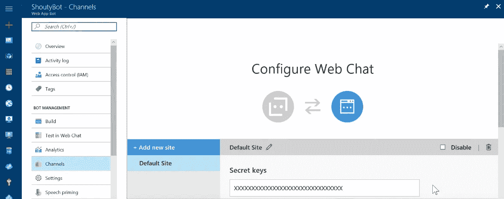

Image created by the author.

# 频道

我们已经看到了如何使用 bot 框架创建一个简单的 Bot，现在我们准备尝试通过各种不同的渠道来使用它。这是我们之前创建的 Shoutybot，我们已经看过了网络聊天频道，在那里我们可以获得代码，将该 bot 嵌入到网页中。我们还可以使用很多其他渠道，比如 Cortana、微软团队、Skype、Bing 甚至电子邮件。因此，我们可以使用这些选项中的任何一个，为用户创建一种与我们的机器人交流的方式，就像他们与其他人交流一样，例如通过发送 Skype 消息或打电话。

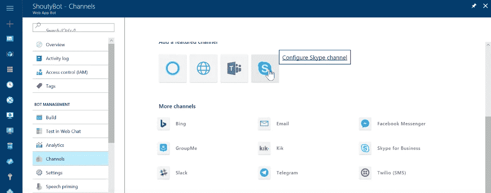

Image created by the author.

# 构建智能机器人

# 机器人智能

因此，我们已经看到了如何建立一个基本的机器人，并将其连接到一个频道，但是，要使你的机器人有用，你需要把某种智能背后。你可以将你的机器人与认知服务集成，以理解文本、语音等自然语言，分析图像或视频。你甚至可以用它在网上搜索相关信息，提供专家信息和基于知识库的建议。当然，你可以结合这些能力来创建复杂的基于对话的人工智能体验，并使用户和软件能够以一种自然的方式一起工作。

Illustration by [Vecteezy.](https://www.vecteezy.com/)

# 创建 QnA 服务

我们已经看到了如何创建一个基本的 bot，以及如何使用 Microsoft bot 框架来允许用户通过多个通道连接到该 bot，尽管我们创建的 bot 并不那么有用。我们真正需要的是机器人背后的某种人工智能服务，它将提供用户真正想要使用的有价值的东西。所以我们将使用一个名为 [QnA 服务](https://azure.microsoft.com/en-gb/services/cognitive-services/qna-maker/)的认知服务来创建一个非常简单的例子。让我们来看看如何做到这一点。

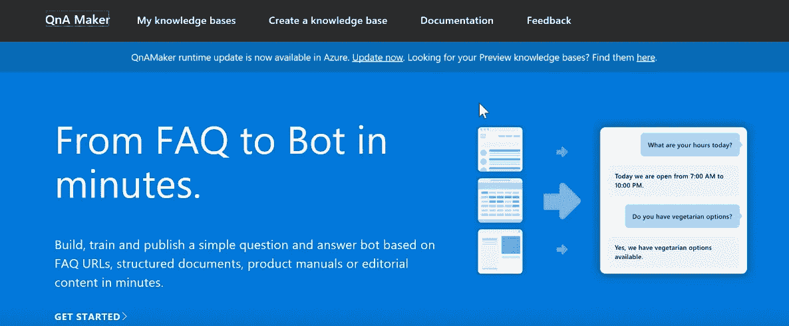

Image created by the author.

我们现在在 [QnA 制造商网站](https://azure.microsoft.com/en-gb/services/cognitive-services/qna-maker/)，这是一个门户网站，我们可以在这里使用我们的 QnA 服务来创建我们可以在我们的机器人中使用的知识库。因此，我们将了解一下如何创建新的知识库，这个过程分为三步。第一步是在我们的 Microsoft Azure 订阅中创建 QnA 服务的实例。

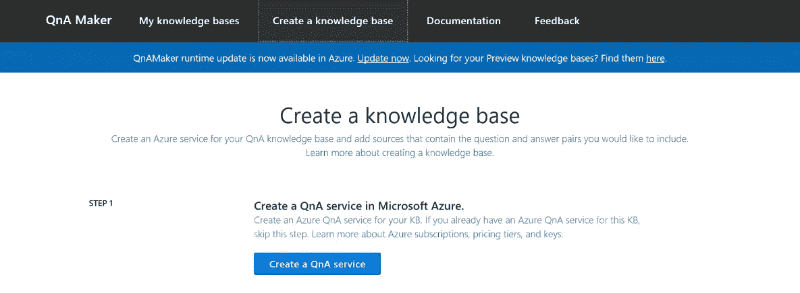

Image created by the author.

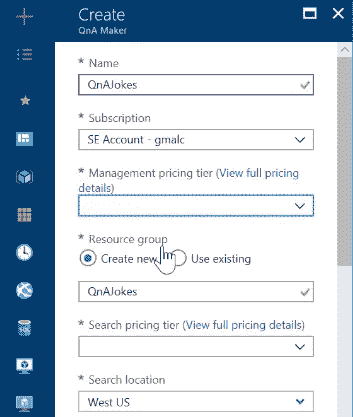

Image created by the author.

我们将继续操作，然后单击“创建 QnA 服务”。它将打开另一个选项卡，让我们登录 Azure 门户。然后，我们可以继续创建一个新的问答制作服务。所以我们给它一个独特的名字“QnAJokes ”,因为它将包含一个知识库，里面有一些相当糟糕的笑话，为此道歉。我们将选择要创建该服务的订阅，以及托管该服务的管理定价层。在本例中，我们将为此选择自由层，以便我们能够开发它。我们会有一些限制，但它让我们免费开发它。我们将为这个资源组创建一个名为 QnAJokes 的资源组，我们还必须选择搜索定价层。当知识库被搜索时，我们有一个单独的定价层，我们将再次选择免费层，因为这将有助于开发它。我们将把它存储在美国西部的数据中心，然后我们需要为此创建一个 web 应用程序——为我们的 QnAJokes 创建一个 Azure 应用程序。我们将有一些应用洞察，以便我们可以分析这项服务发生了什么，我们将把这些存储在一个中心位置。我们将继续操作，单击“create ”,它将验证这些设置。然后，它将启动并提供我们的 QnA Maker 服务和 web 应用程序来托管它。

然后，当我们的 QnA 服务部署完成后，我们可以返回到我的 QnA Maker。我们将刷新页面，以便获得关于我们实际部署的 QnA Maker 的所有信息，它将列出我们在此提供的 QnA 服务。因此，第二步是将我们即将创建的知识库连接到我们刚刚部署的 QnA 服务。因此，我们将使用我们的 Microsoft Azure 目录 ID，我们将指定创建服务的订阅。因此，我们正在创建一个新的知识库，它将为 QnA 服务提供服务。

Image created by the author.

然后我们需要给这个知识库起个名字，所以我们就称它为“Jokebook”。

Image created by the author.

现在，我们已经准备好填充我们的知识库，如果我们的网站上有一个现有的 FAQ 站点，或者如果我们有一个包含 FAQ 的文件，我们可以继续使用它们来填充它。或者，我们可以继续手动创建知识库，这就是我们在本例中要做的。

因此，我们会说创建您的知识库，我们准备好开始创建我们想要在知识库中包含的问题和答案。最初，这里什么也没有，所以我们要添加一个 QnA 对。我们要问的问题是“为什么鸡要过马路”，与之相应的答案是“到另一边去”。因此，我们在那里得到了我们的响应，我们将继续添加另一个 QnA 对。所以我们可能会有一个问题，比如“什么是红色的，看不见的”，这个问题的答案是“没有西红柿”。最后，我们将在这里添加一些东西，以便当某人第一次与知识库交互时，他们会说“你好”，并且会得到“你好”的响应。这不是一个真正的问题答案，这只是一种互动的方式，并得到适当的回应。我们已经在那里添加了这些值，我们将继续保存并训练知识库。

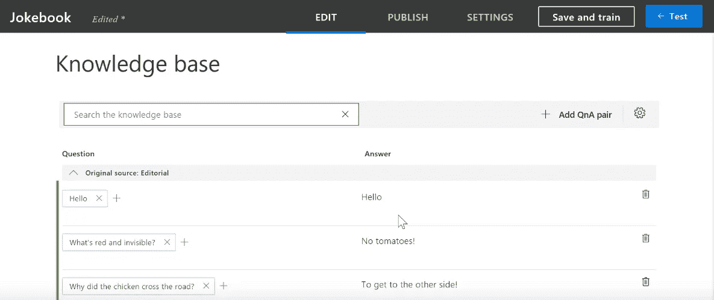

Image created by the author.

所以在它被训练之后，我们可以继续测试它。我们只需简单地输入一条消息“hello ”,然后得到相应的响应“hello”。“为什么鸡要过马路”而我得到的是适当的回应“为了到另一边”。所以我的知识库在工作。我得到了适当的回应。

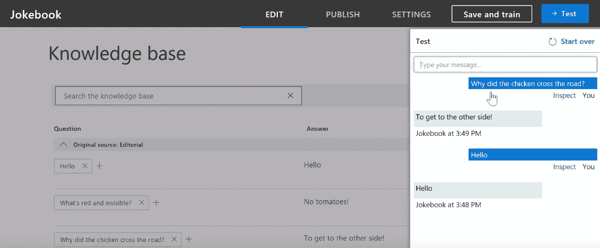

Image created by the author.

这一切似乎都很合理，所以我们准备发布这个相当简单的知识库，以便我们可以在机器人或应用程序中使用它。因此，我将点击“发布”。

Image created by the author.

为了发布它，它将把 QnAs 从测试索引移动到生产索引，这样我们就可以从我们将要创建的 bot 中访问它。所以我们会继续出版。然后将我们的知识库部署到我的 QnA maker web 服务中。我们实际上可以看到一个示例请求，我们将使用它来连接并使用它。它有各种各样的信息，在这个 URL 中有各种各样的键，当我们尝试连接一个机器人时，我们将需要这些信息，我们将在以后构建这个服务。

Image created by the author.

# 创建 QnA 机器人

我已经创建了一个 QnA 知识库，我们可以用它作为机器人的后端。所以现在我们只需要继续创建这个机器人。现在我们在 Azure 门户中准备创建我们的机器人。因此，我们将继续添加一个新的 web 应用程序机器人。

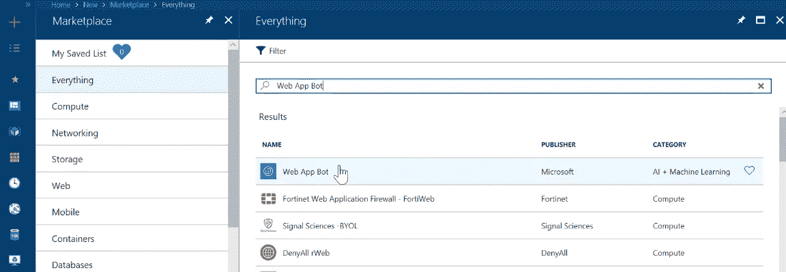

Image created by the author.

Image created by the author.

当我们创建我们的机器人时，我们必须给它一个名字，所以我们要称它为“bad skins”。我们将把它放入我们想要使用的适当订阅中，并将它放入我们之前为 QnA 服务创建的现有资源组中。所以我们要把我们放在西边。我们将为此选择合适的定价层，然后我们需要一个应用程序名称。我们将使用适当的模板，我们将使用允许我们使用 QnA maker 的模板。

这次我们将坚持使用 C#，只是为了改变一下，但我们要做的是选择问答模板。它将在美国西部创建应用服务计划，并将为该机器人创建一些存储和一些应用见解。我们将继续并选择“create ”,现在我们将验证这些设置。

Image created by the author.

它将启动并部署新的机器人，当机器人部署完成后，我们就可以开始查看该资源了。在准备使用它之前，我们必须进行一些更改，因为我们必须将它连接到我们的 QnA 服务。为此，我们将查看该应用程序服务的应用程序设置，并加载这些设置。如果我们向下滚动一点，我们可以看到我们需要使用的许多不同的应用程序设置，其中一些是专门用于 QnA 服务的。我们需要一个 QnA 身份验证密钥、一个端点主机名和一个知识库 ID。

Image created by the author.

现在，我们可以在我们部署的 QnA 知识库中获得所有这些信息。

Image created by the author.

这就是我们需要将机器人连接到 QnA 知识库的三个设置。因此，我们将继续保存这些设置，这已经为我们更新了这些应用程序设置。所以我们现在准备去测试我们的机器人。我们可以在网络聊天界面中进行测试。

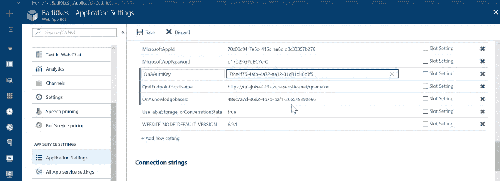

Image created by the author.

它来了，我们准备好开始了，所以我们可以礼貌地说你好，然后我们从 bad 笑话 hello 得到我的回应。“小鸡为什么要过马路”而我们得到了“到另一边”的恰当回应。因此，我们现在创建了一个机器人，并将其连接到我们的 QnA 知识库。然后，我们可以通过机器人可以连接到的任何常规渠道来部署该机器人，它将使用该知识库来回答用户提交给它的问题。

Image created by the author.

# Cortana 技能

像 Cortana 这样的个人助理越来越受欢迎，人们可以通过它来跟踪信息、自动完成任务等等。这些人工智能助手可以了解我们关心的事情，它们可以帮助简化我们的日常生活。现在你可以把你用 bot 框架发布的一个 bot 连接到 Cortana 作为一项技能。这使得用户能够通过 Cortana 界面与你的机器人进行交互。

这是我们之前创建的机器人，它连接到我们的问答服务，我们想在 Cortana 中使用它。因此，如果我们看看这个机器人的通道，我们可以看到它连接到网络聊天，现在正在运行，但我们可以继续将其添加到 Cortana 通道。

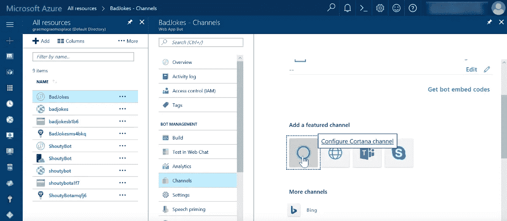

Image created by the author.

因此，如果我们继续进行配置，并设置我们自己与一个组织，在这里，我们只是简单地向一个组织注册这个机器人。所以我们要去登记。当 bot 注册后，我们可以看到 Cortana 已经列在频道列表中。如果我们现在去看看我们的商店门户，看看机器人，你可以看到有 bad 笑话机器人。

Image created by the author.

现在它已经被注册为这个组织的一部分，我们可以在这里看到关于 Cortana 技能的各种信息。所以我们想做的是进去看看这里的发布设置。我们可以做的一些事情是给它起一个名字，所以 bad jeans 是技能的名字，并给一个调用名——换句话说，我们要用这个短语告诉 Cortana 这是我们想要与之交互的服务。

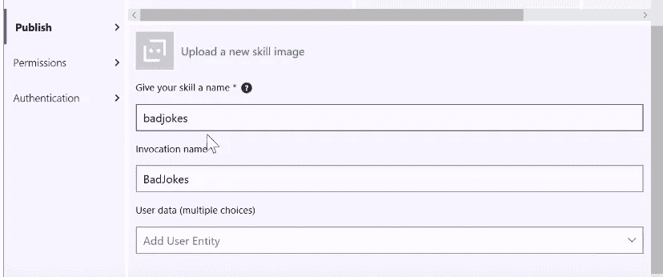

Image created by the author.

我们将继续下去，只是发布出来准备使用。这意味着，如果我们只是像平常一样使用电脑，然后去 Cortana，我们现在可以说“问一些不好的笑话，为什么鸡要过马路”。Cortana 对此进行了思考，然后它意识到我们正在尝试连接到这种叫做 badjokes 的技能。

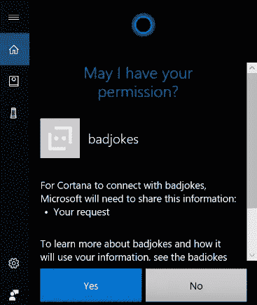

Image created by the author.

为了让它连接，我们需要给它一些权限，所以我们会同意与该技能共享我的信息。这种情况只发生在第一次，我们得到正确的回应“到另一边去”。然后我们可以问一个不同的关于糟糕笑话的问题，“什么是红色的，看不见的？”我们得到的回应是“没有西红柿”。因此，我们已经能够使用我们创建的机器人，并将其连接到问答服务，这样我们就有了一个问答知识库。然后我们能够使用 Cortana 作为一个通道与之互动，并通过输入问题甚至说话来互动地获取信息。

Image created by the author.

# 一锤定音

感谢您阅读本文第 4 部分，这是微软人工智能入门课程的最后一部分。如果你觉得这很有帮助，那么请查看我的媒体账户或数据科学 T2 的所有 4 个部分。如果你对本文中的一些概念有困难(不要担心，我花了一些时间来理解这些信息)，并且你需要更多的信息，那么就免费报名参加[微软人工智能入门课程](https://www.classcentral.com/course/edx-introduction-to-artificial-intelligence-ai-9164)。与这些笔记一起观看课程视频很有帮助。

* [如果您想了解课程笔记和其他与技术和产品设计相关的笔记背后的一些背景信息，您可以在这里找到更多信息。](https://medium.com/@christinecalo/a-little-about-christines-notes-8ea2205594a2) *

***有点背景***

*大家好，我是 Christine:)我是一名产品设计师，已经在数字领域工作了相当一段时间，在许多不同的公司工作过；从大型公司(多达 84，000 名员工)，到中型企业，再到仍在扬名立万的小型初创企业。尽管我有很多经验，但我是一名产品设计师，害怕受到邓宁-克鲁格效应的影响，所以我不断尝试教育自己，我总是在寻找更多的光明。我相信，要成为一名伟大的设计师，你需要不断磨练自己的技能，尤其是如果你在不断变化的数字空间中工作。*