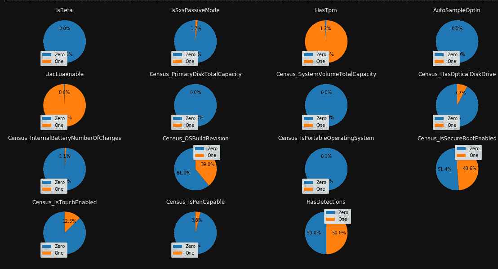

# 微软恶意软件预测—关于如何可视化数据、设计功能和训练模型的简要概述

> 原文：<https://towardsdatascience.com/microsoft-malware-prediction-a-brief-overview-on-how-to-visualize-data-engineer-features-and-222ea727be5a?source=collection_archive---------24----------------------->

# 简介:

一个寒冷的冬日，我打开电脑开始工作，不知道前方会有一场大雪。我耐心而愉快地启动电脑，开始阅读我的电子邮件。突然，我的浏览器打开了，我震惊地看到我的浏览器上有一条消息，要求我给税收机构汇些钱。显然，在盛怒之下，我中了圈套，点击了一个发件人发来的附件，看起来像是我的一个同事。我花了几乎一天半的时间才找到清除威胁并确保我安全的方法。从那天起，我小心翼翼地检查我的电子邮件和浏览互联网。不仅如此，我总是想办法找出为什么一个人会成为目标，以及如何找出他/她的电脑成为目标的可能性。当我发现[微软恶意软件预测数据](https://www.kaggle.com/c/microsoft-malware-prediction)可以公开获得时，我很想深入了解并找到更多关于这些数据的信息。我的最终目标是开发一个应用程序，从一个人的电脑上收集数据，并判断电脑是否容易受到攻击。首先，让我们看看计算机和反病毒/恶意软件市场。

# 防病毒/恶意软件市场:

在发达国家(北美、欧洲和大洋洲)，台式电脑的使用份额仍大幅领先于移动设备(手机和平板电脑)。在所有的操作系统中，微软(MS) Windows 占据了全球 77%的市场份额，Mac OS 以 13%的份额紧随其后，谷歌 Chrome 占 6%(美国市场)，Linux 占 2%。由于 MS Windows 是市场上的主要操作系统，个人和商业计算机都容易成为病毒和恶意软件攻击的目标。目前的防病毒市场份额估计约为 37 亿美元[ [2](https://www.reuters.com/brandfeatures/venture-capital/article?id=86977) ]，预计到 2024 年将达到 35 亿美元左右。市场上有许多反病毒公司(迈克菲、赛门铁克、卡巴斯基、Bitdefender、ESET、趋势科技、Avira、Avira 仅举几例)；然而，微软 Windows Defender 作为 Windows 10 中的常驻杀毒软件，已经占据了 50%的市场份额，保护了近 5 亿台电脑。[ [3](https://www.ghacks.net/2019/08/03/windows-defender-has-a-market-share-of-50/) ， [4](https://www.zdnet.com/article/top-windows-defender-expert-these-are-the-threats-security-hasnt-yet-solved/) ]在微软 Windows Defender 之前，微软 Security essential 是杀毒软件的替代品。考虑到全球范围内通过 MS Windows Defender 和 MS Security Essential (MSE)受保护的设备数量超过 5 亿台，显然微软已经收集了大量关于设备、防病毒状态和威胁的数据。对微软或其他公司或用户来说，知道什么是威胁因素或可能性是有益的。用户是否可以仅通过考虑多种因素(设备形式、Windows 版本、防病毒及其版本以及任何其他相关变量)来评估他/她的计算机是否容易受到攻击。在这篇文章中，我将简要评估这些数据，并使用两个模型来训练和测试这些数据。

# 数据:

这项研究的数据和专栏(特征)描述通过 Kaggle 恶意软件预测竞赛公开提供，可在此处找到[。](https://www.kaggle.com/c/microsoft-malware-prediction/data)我仅下载了培训数据，并尝试在我的个人电脑上分析和可视化这些数据。然后，我利用了 [Google cloud Colab 平台](https://colab.research.google.com/)，因为它有可访问的处理资源。解压缩后的训练数据为 4 GB，占用大约 2 GB 的 RAM。我使用了一个特征类型定义字典来避免大量的内存使用。对数据的简要分析表明，该数据集有 892 万条记录，包含 83 个列/特征。

## 可视化和分析数据:

我绘制了“HasDetections”功能(目标列)的分布图，以查看数据是否在检测到恶意软件或未检测到恶意软件的位置之间平均分布。然后，我尝试分离二进制列(那些值为 0 和 1 的列)并绘制它们的分布图(图 1)

相关图有助于我们理解这些特征是正相关还是负相关。如果特征是强相关的，我们可以使用其中一个特征，而不是使用多个特征，从而节省计算资源。可以看出，除了少数几列(它们彼此相邻并且负相关，例如 RtpStateBitField—IsSXSPassiveMode)之外，其余数据不相关或者稍微相关。

我还绘制了受感染机器的数量与“平台”、“外形”以及设备是否是“游戏机”的对比图 Windows 10 是受攻击最多的平台(或者记录数据最多的平台)。

应该注意的是，正在使用的笔记本电脑数量是正在使用的台式机数量的三倍。其他外形的设备落后于笔记本和台式机。

最终的图表清楚地显示，游戏电脑几乎不到台式机的一半。但是，游戏桌面比非游戏电脑更容易被感染(比较红色、绿色、橙色和蓝色)。

这些数据清楚地表明，如果某人拥有台式机并且不是游戏玩家，则不应该成为攻击的热门目标。这些数据给了我一个线索，那就是使用 Windows 10 的台式机使我更容易受到攻击。

## 特征工程:

为了准备用于训练的数据，我需要评估数据中的空值。我计算了任意特性列中 null 值的总数和百分比。我决定丢弃/忽略空值超过 25%的特性(有 9 列)，并估算其余的特性。下图显示了不同列中缺失值的百分比。

如果你有兴趣阅读不同的插补方法，可以查看这个[链接](/6-different-ways-to-compensate-for-missing-values-data-imputation-with-examples-6022d9ca0779)。插补是一个计算密集型过程(CPU ),为了节省时间和我的处理资源，我首先随机采样/选择了整个数据集的 20%;并将所有 NaN 替换为非数字特征/列的平均值。对于数字和文本/字符串特性，我用模式值替换了 NaN。用数字列中的平均值替换 NaN 值会将该列转换为非数字列。我通过检查 nan 的数量是否为零来验证该过程。在对分类特性进行热编码之后，我删除了原始分类列，并将所有特性连接在一起。在下一阶段，我保留了以下分类列(ProductName、Platform、Processor、Census _ OSArchitecture、Census_FlightRing、Census_GenuineStateName)，并删除了其余的列。我应该声明，反病毒版本是一个重要的功能；然而，在这个阶段，我把它放在一边。

## 培训、测试和参数调整:

我将使用两种不同的算法来训练和测试数据。由于预测值(标签)是数字的(0 或 1)，我将使用逻辑回归和 XGBoost 模型，并将使用网格搜索来调整参数。我对逻辑回归使用了四种不同的复杂性(0.1、1、2、10)，对 XGBoost 使用了五个参数组合的三重搜索(15 次拟合)。

逻辑回归训练的错误率与复杂性

两个模型基于最佳参数的预测结果如下:

逻辑回归:

精度= 0.6099

回忆= 0.6064

精确度= 0.6061

混淆矩阵是:

[[13847 12978]

[ 8077 18549]]

XGBoost 型号:

精度= 0.6089

回忆= 0.6056

精确度= 0.6055

混淆矩阵是:

[[13899 12874]

[ 8210 18468]]

# 结论和未来工作。

正如人们所观察到的，用它们的最佳参数测试的两个模型在两位有效数字内产生几乎相同的精确度、召回率和准确度。在没有任何硬件加速(没有 GPU)的情况下，在 Colab Python 3 平台上训练模型，logistic 回归 fit 用了近 33 分钟，XGBoost 用了 36 分钟。

我的下一步是将这一分析提升到下一个级别，并改进模型的培训/测试:

*   使用整个数据集训练模型，并在单独提供的测试数据集上测试模型。
*   通过链式方程使用多元插补对数据进行插补。
*   使用其他可以使用分类数据(没有编码)的模型。
*   使用所有分类功能，包括防病毒版本功能。

最终目标是开发一个应用程序，从你的电脑中获取数据，并预测成为攻击目标的概率。如果你感兴趣，可以在这里找到这个分析的源代码。如果你有任何意见或问题，请随时给我写信。