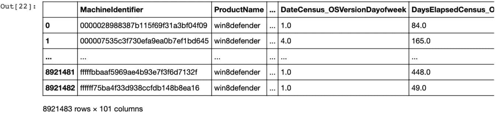
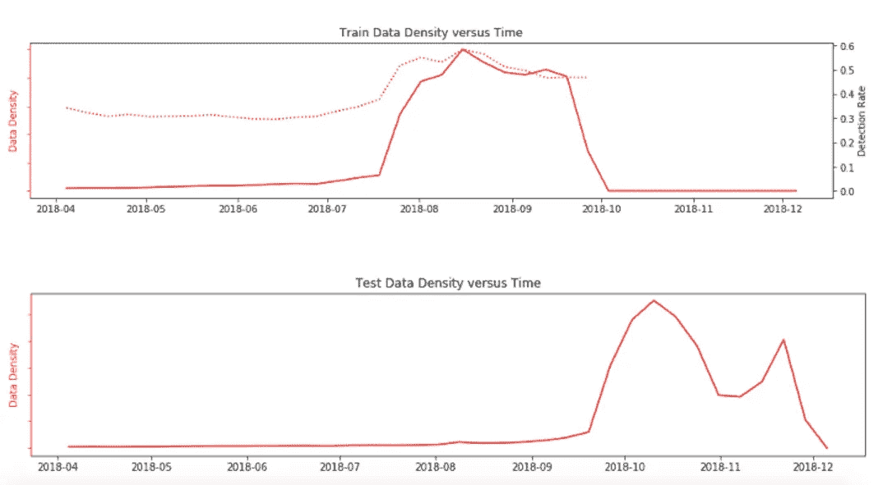
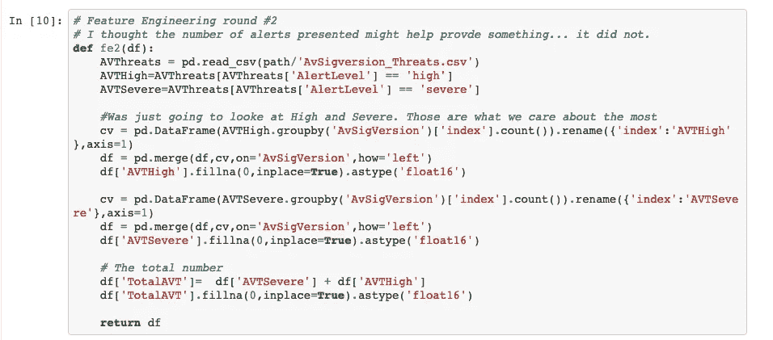
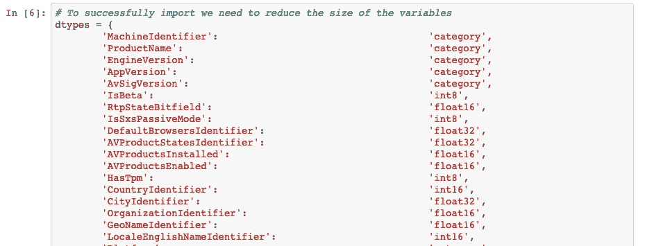
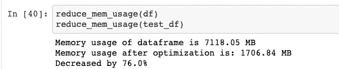
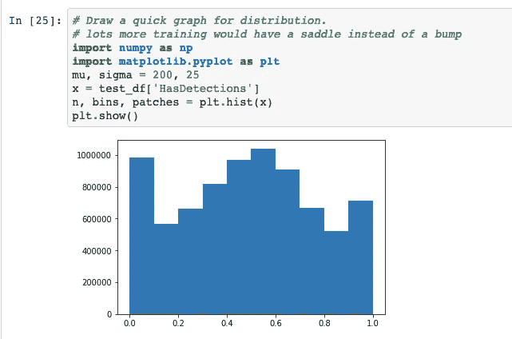

# “微软恶意软件预测”及其 900 万台机器

> 原文：<https://towardsdatascience.com/microsoft-malware-prediction-and-its-9-million-machines-22e0fe8c80c8?source=collection_archive---------13----------------------->

## 深度学习来预测机器是否会被恶意软件感染。

Kaggle 最近完成了竞赛“[微软恶意软件](https://www.kaggle.com/c/microsoft-malware-prediction)”，它要求你预测一台计算机是否被感染。竞赛声明

> “恶意软件行业仍然是一个组织完善、资金充足的市场，致力于规避传统的安全措施。一旦计算机被恶意软件感染，犯罪分子会以多种方式伤害消费者和企业。拥有超过 10 亿的企业和消费者客户，微软非常重视这个问题，并在提高安全性方面投入巨资。”

作为一名网络安全从业者，这是一个拥有大量数据的绝佳机会，可以尝试提出以下问题:

*   “为什么电脑会被感染？”
*   “最大的贡献者是什么？”
*   “补丁打得怎么样了？”

不幸的是，竞赛回答了更多关于机器学习的问题，而不是恶意软件预防或修补最佳实践。

# 目标:找到恶意软件！

这个 Kaggle 竞赛提供了表格数据供我们探索，也是我在专注于商学院、电路板设计和进入新的工作角色后第一次跳回 Kaggle 竞赛。

以下是我 8 天疯狂编码过程中的学习点。(你可以在 [Github 这里](https://github.com/jamesdietle/Kaggle2019/tree/master/microsoft-malware-kaggle)找到我的比赛代码，并且可以在你空闲的时候运行它。)

这场比赛的数据集相当大，如果你的 GPU 中没有足够的 RAM，你可以迁移到云环境或减少功能或设置以使其工作。我用的是一台定制的电脑，配有 8gb 内存的显卡。

# 对问题的初步看法:

在查看数据之前，有必要了解变量的数量。这个数据集中有超过 900 万个机器标识符，到比赛结束时，我已经为每台计算机找到了大约 100 个不同的类别。

是的，这只是试图确定计算机是否被感染的十亿个数据点中的一小部分。

通过查看各列，我们可以看到一些功能在确定计算机是否会被感染时是如何有用的。像这样的项目:

*   操作系统的版本
*   AV SIG version:AV 产品的签名
*   AVProductsInstalled:安装的 AV 产品数量

这 3 个特征显然是确定机器是否会被感染的候选特征。毕竟，如果您没有更新您的反病毒签名，没有运行反病毒产品，或者正在运行 Windows XP，您是一个更容易的目标。

其他值稍微困难一些，需要一点特性工程:

*   census _ internalbaterynumberofcharges:我们知道台式机是零费用的
*   CountryIdentifier:设备声称来自的国家表明恶意软件可能有多流行。
*   Wdft_IsGamer:他们玩游戏吗？这与其他危险的在线行为有关联吗？他们使用机器的方式不同吗？
*   census _ InternalPrimaryDisplayResolutionHorizontal:可以计算百万像素。所有小型显示器的标准是什么？大显示器？

在这些情况下，特征的重要性是微妙的。这就是这些完成的乐趣所在。

# 这不是一个时间序列…或者是？

可能都是合规培训吧。然而，我一直想把这变成一个时间序列问题。毕竟，问题不在于哪个 AV 存在，而在于它们已经过时多久了。

安全部门被告知要不断更新补丁。如果我们不知道某样东西有多过时……我们怎么能确定它是否更容易被感染。

然而，比赛组织者明确表示，这不是一个时间序列问题。作为一个目光短浅的愚蠢行为，这并没有阻止我试图创造数字来预测电脑是否过时。

我不是唯一一个，当人们发现你如果电脑有自动更新，并且你将 AVSigversion 的发布日期与那个日期进行比较时，竞争对手陷入了一个大陷阱。

许多人猜测，比赛仍然有时间序列元素隐藏在数据中，这是有充分理由的。很多 Kaggle 比赛都有隐藏数据。一些用户讨论了来自训练集的 AVSignatures，并将其与公共/私有进行了比较，您会看到这些 AVSignature 时间变量发生了显著的左移。Chris Deotte 提供了一个很好的例子。训练集看起来比公共/私有数据集有更旧的数据。

在追踪虚假时间序列问题时，我会做几件不同的事情:

1.构建我的验证集是为了使用更新的数据，确保它是公共/私有数据集的更好表示。

2.我创建了关于修补后天数的附加参数。通过设置最后一个已知补丁的基线，我可以看到这个值离提供的输出有多远。这项技术为不合规天数提供了优秀的指标。我对此感到特别自豪，但去掉了这个功能，因为我没有看到不同型号的改进。

此外，有一个外部数据集发现了反病毒签名与其解决的漏洞数量之间的相关性。那么我们如何利用这一点呢？

理想情况下，我们希望看到哪些补丁已经发布，以及系统是否在打补丁方面落后。如果我们知道一个系统有多少补丁是过时的，我们就能够为此创建一个特性。然后，我们将能够看到保持项目最新与检测之间是否存在关联。

然而，由于我们没有这些数据，我尝试通过获取最近的日期来猜测数据是何时获取的。这些数字与任何令人兴奋的事情都没有关联，也没有被证明非常有用。

需要注意的是，这更多是因为竞争。作为实践者，如果我们知道机器被收集的日期，我们就可以设计出更多的特性(比如暴露的漏洞数量、隐藏的补丁等等)。)来扯点有意思的见解。

# 更智能地使用内存

面对如此庞大的数据集，内存成为许多人的一个重要问题。甚至加载数据都很困难，因为所有数据都是以 int64 格式输入的。甚至 bools 都是以 int64 开头。这种臃肿的内存分配方法导致一些机器在加载时崩溃。

快速提醒一下，

*   Int16 — float16: 2 字节
*   Int32 — float32: 4 个字节
*   Int64 — float64: 8 字节

仔细检查并减少一点，你可能看起来是在浪费时间。2 字节还是 8 字节谁在乎？每个人都应该！

当有 800 万条记录和 100 列时，您需要存储大约 6.4 千兆字节信息。此外，您需要加载一个测试集，这将是另一个 6.3 千兆字节。突然，您看到了 12.7 GB 的数据，其中大部分都浪费了空间。

因此，我甚至无法将它加载到消费级 GPU 中。NVIDIA 1080 TI 最高可达 11 GB。通过使用 dtypes，我们可以将它减少很多。

第一个技巧是在合理的情况下将数据类型设置为较小的大小。足够让你加载数据而不会出现内存错误。

为此，您需要进行一些理智检查。您需要在如何减少 dtype 的同时为所有唯一变量保留足够的空间之间进行平衡。让我们记住这个城市有 800 万条记录。只有 X 个唯一的城市标识符。我们被传递了一个城市 id，因此我们可以看到城市“42”7000 次，而城市“28930”只出现了 2 次。

类别也是如此。这些数据通常以字符串的形式出现，因此，我们使用类别来表示这些数据是唯一的，并对它们进行分组。

如果数组的大小小于 32，768 个 uniques，可以安全地将其转换为 int16。唯一的城市数量超过 100，000，所以我们使用 float32 而不是 Int64。IsBeta 是布尔型的，所以我们可以把它设为 int8。

如果我们把它做得太小，我们会有问题，但是如果它太大，我们会浪费空间，这带来了我对 reduce_mem_usage ( [在这里找到](https://www.kaggle.com/gemartin/load-data-reduce-memory-usage))的热爱，它会为您的数据和您的惟一值找到最佳值。虽然您必须手动加载数据集，但您不必花费更多时间来为所有变量寻找最佳值。

在运行 reduce_mem-usage 之后，您可以看到内存的显著减少。突然我们有了更小的东西。正如你在下面看到的，我的大小从 7 GB 降到了 1.67 GB

这样我就可以将更多数据放入 GPU 的数据帧中。

很棒的东西！

# 用泡菜分开

我喜欢的另一个方法是将程序分成两部分。

*   **数据构建器** - [我在这里探索、创建特征、移动和操作数据。](https://github.com/jamesdietle/Kaggle2019/blob/master/microsoft-malware-kaggle/Microsoft-Dataloader-Mar10.ipynb)使用 pickle 保存信息，并为学员移动信息
*   **学习者** - [建立模型，运行学习纪元。](http://use%20pickle%20to%20save%20the%20information%20and%20move%20it%20over%20for%20the%20learner/)

通过将构建者和学习者分开，我可以保持代码更干净，并且它允许我更容易地用不同的选项运行它。再加上实验进行的比较快。如果学习者遇到问题，我可以从重置中减去 10 分钟。

# 我们表现如何？

最后，我们列出了每台机器感染恶意软件的可能性。理想情况下，我们应该看到一个最高数字在 0 或 1 上的马鞍。如果你只花几个训练时期，你会看到这个太空入侵者的样子，暗示着我们需要更多的训练才能到达那里。它不如顶级的公共内核有效，这有点令人失望。

# 我应该做得更好的事情:

**更多的数据探索和特征工作-** 可能最大的问题是没有更好地理解一些特征在问题中的重要性。我应该多检查一下相互依赖。

**数据二次抽样**——通常当数据集变得这么大时，你应该返回并把项目分成二次抽样，然后再汇总结果。

**对抗分析** -我需要更好地理解如何比较我的训练集、验证集和公开测试。这看起来并不像我希望的那样相互靠近。

**AUCROC**——我使用交叉熵作为损失函数。然而，我应该更深入地研究使用 AUCROC 来代替。虽然我可以打印出一个指标，但我无法更好地探索它的可行性。

**嵌入大小**——看起来一些嵌入向外扩展，在测试集中有许多 1 或 2 的唯一值的例子。例如，如果芝加哥只有 2 个样本，是否应该使用该特性？它既不能帮助你确定是否有感染。

我应该把它作为一个张量来保持事物快速前进。