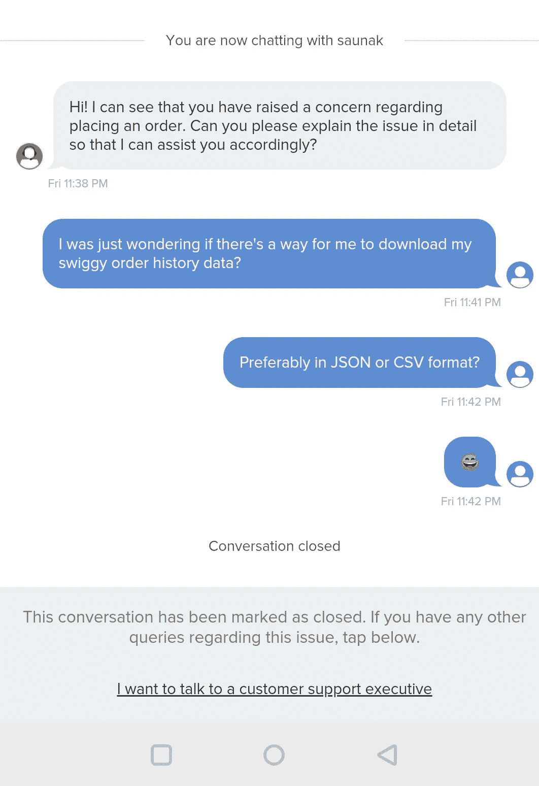
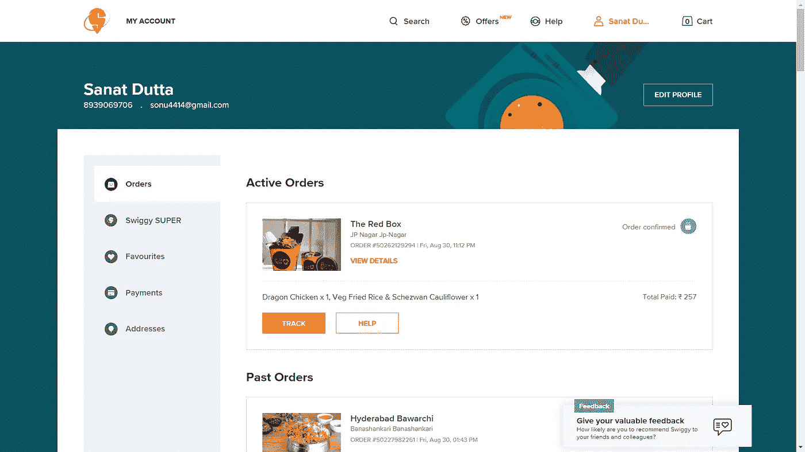
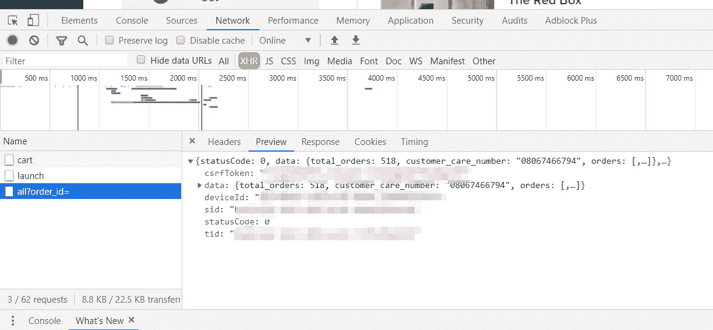
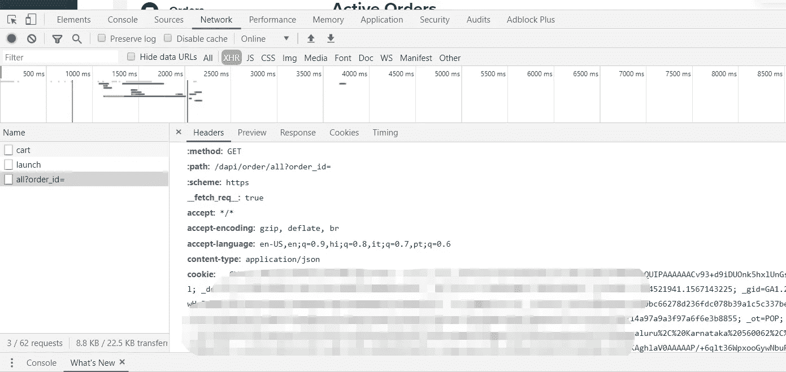
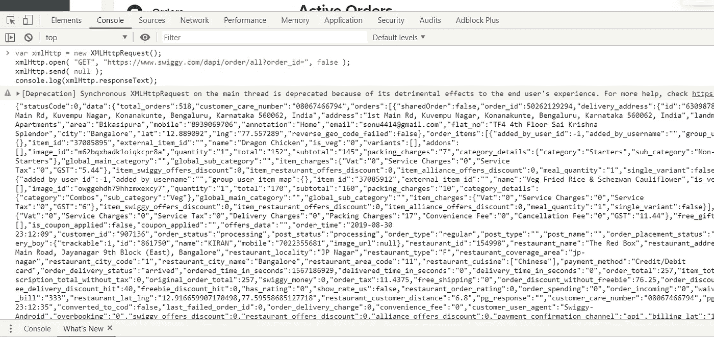
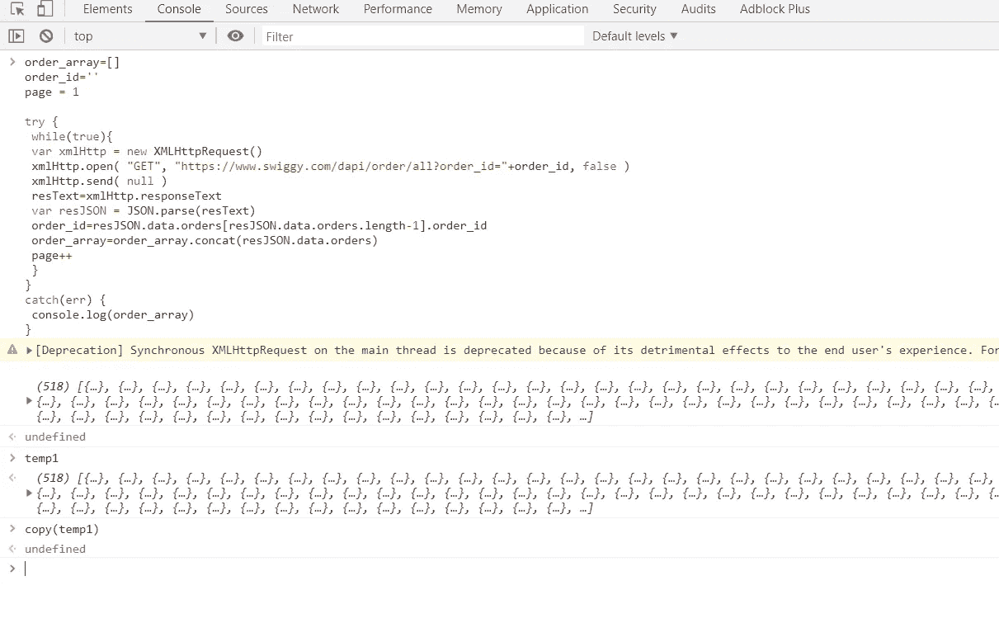
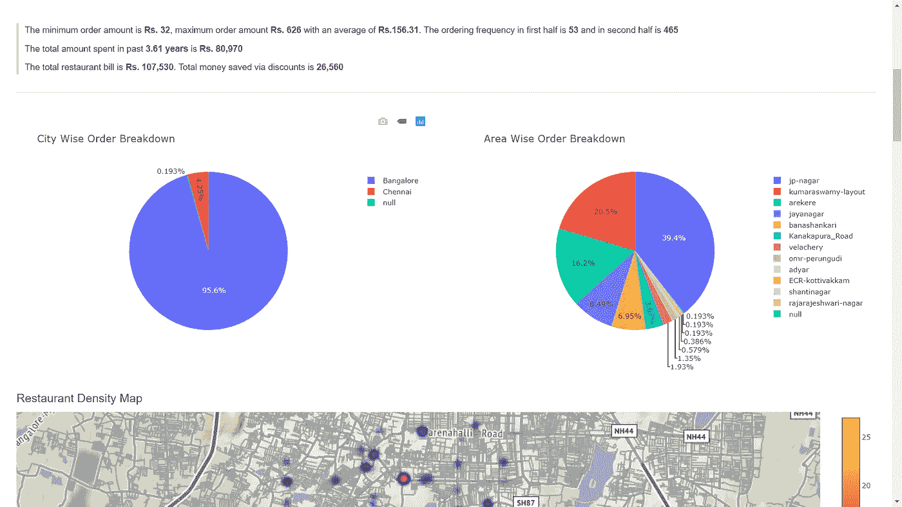

# 午夜黑客 1:可视化我的 Swiggy 订单历史

> 原文：<https://towardsdatascience.com/midnight-hack-episode-1-visualizing-my-swiggy-order-history-f1cce25cbff6?source=collection_archive---------9----------------------->

却没有耐心去阅读？别担心。

下面是 [**可视化仪表盘**](https://swiggy-order-dashboard.herokuapp.com/) **，** [**仪表盘预览**](https://www.youtube.com/watch?v=M5qhpyvUYhw) 下面是项目 [**Github 链接**](https://github.com/AtomicSpider/Swiggy-Dashboard) 。


现在是晚上 11 点，当我在去订多份午夜餐的路上时，我心想:

> 我不太清楚自己的点餐习惯。有趋势吗？我能否从我的订购历史中获得一些有意义的见解？

当我在 Swiggy(一个印度食品订购和交付应用程序)上浏览甜点选项时，我试图弄清楚如何才能获得我的订单历史数据。现在，我从过去的经验中了解到，有时友好的请求会奏效。让我们试试那个。



所以是的，那没有成功，但是有志者事竟成。

我大概可以在订单历史页面上拦截对 [Swiggy](https://www.swiggy.com/) 应用的网络请求。我知道像 Drony 这样的应用可以做到这一点。但是我必须开发一个定制的应用程序，以便遍历所有的订单页面并汇总结果。aggggggghhhhhhhhh……好像工作量太大了。我们称这个计划为 b 计划吧。如果没有别的办法，b 计划会回来的。

我想网络会是更好的选择。相对更容易黑。我只希望他们的网站上还有订单历史页面。



耶，他们有一个功能齐全的网站。我以为他们已经完全移动化了。嗯，对我来说不错。他们甚至有订单历史页面。我现在泪流满面。戴夫眼泪:')

让我们打开 chrome 开发工具，看看一些网络请求，好吗？



Order list response



GET request headers

哦，那个甜甜的 JSON 回复:)

看起来 order_id 是分页的参数。

他们似乎在使用 CSRF 代币。查看请求头，似乎他们使用 cookies 来维护会话，并使用 CSRF 令牌来避免第三方客户端请求。我以为他们会使用一些简单的 JWT 令牌，所以我打算使用 python 来处理网络请求，但我想这不是一个选项。

最好通过浏览器访问 API。不确定这是否可行，但让我们试一试。

```
var xmlHttp = new XMLHttpRequest();
xmlHttp.open( “GET”, “[https://www.swiggy.com/dapi/order/all?order_id=](https://www.swiggy.com/dapi/order/all?order_id=)", false );
xmlHttp.send( null );
console.log(xmlHttp.responseText);
```

当我登录时，这个简单的 JS 片段应该能够使用会话 cookies 获取订单数据。



Order response through JS snippet

而且成功了:')

我没想到它会和他们采取的所有安全措施一起工作，但是嘿嘿嘿…..

现在，我所要做的就是修改脚本，这样它就可以对所有页面进行分页，并为我提供汇总数据。

```
order_array=[]
order_id=’’
page = 1try {
    while(true){
        var xmlHttp = new XMLHttpRequest()
        xmlHttp.open( “GET”, “[https://www.swiggy.com/dapi/order/all?order_id=](https://www.swiggy.com/dapi/order/all?order_id=)"+order_id, false )
        xmlHttp.send( null )
        resText=xmlHttp.responseText
        var resJSON = JSON.parse(resText)
        order_id=resJSON.data.orders[resJSON.data.orders.length-1].order_id
        order_array=order_array.concat(resJSON.data.orders)
        console.log(“On page: “+page+” with last order id: “+order_id)
        page++
    }
}
catch(err) {
    console.log(order_array)
}
```



Complete order history

总计 **53** 页和 **518** 订单。

*看着他松软的肚子。

还不错。一点也不差。*内心呐喊

现在，我可以添加一些代码来保存文件中的数据，但有一个更简单的方法。右键单击数据>存储为全局变量。使用命令复制复制剪贴板中的数据。

```
copy(temp1)
```

将其粘贴到记事本中并保存。瞧，现在你有了整个 [Swiggy](https://www.swiggy.com/) 的历史。

是**文本数据**的 **5MB** ，信息很多。最初，我想以文本形式获得一些见解，但是，看看这些数据，最好创建一个可视化的仪表板。

我真的没有任何创建可视化的经验，但是在浏览了大量的文档和评估工具之后，比如 J **upyter Notebooks，Matplotlib，Plotly，Dash**；我决定和达什一起去。它有一个非常直接的布局过程，并且与 python 配合得很好。

现在是第二天下午 4:20。经过一整夜的分析和设计，这是最终的结果。



Screencap of Visualization Page

你可以在这里 查看我的可视化仪表盘 [**。如果您想可视化自己的**](https://swiggy-order-dashboard.herokuapp.com/) **[Swiggy](https://www.swiggy.com/) 订单历史，所有需要的资源都托管在 [**这里**](https://github.com/AtomicSpider/Swiggy-Dashboard) 。**

我认为我从这个项目中得到的最有用的见解是我在食物上花了多少钱，这也是从一个单一的来源得到的。我不知道自己在 Swiggy 上花了多少钱。

直到下一次…