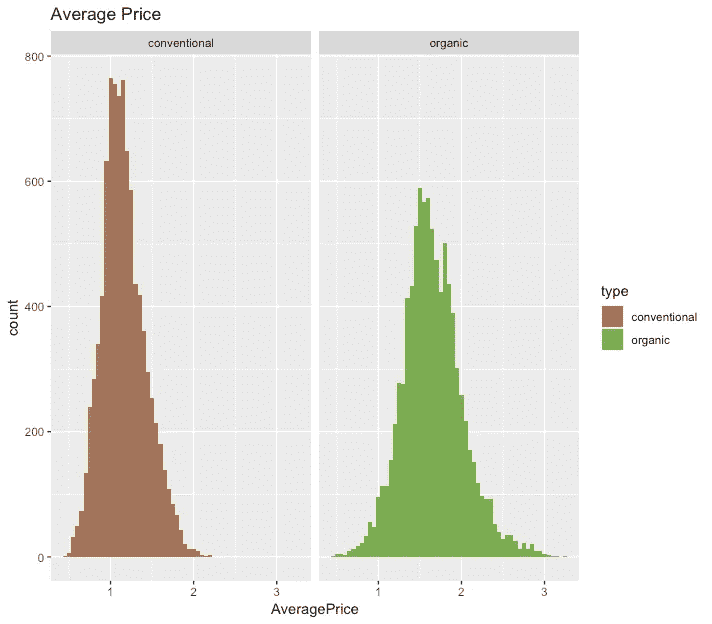
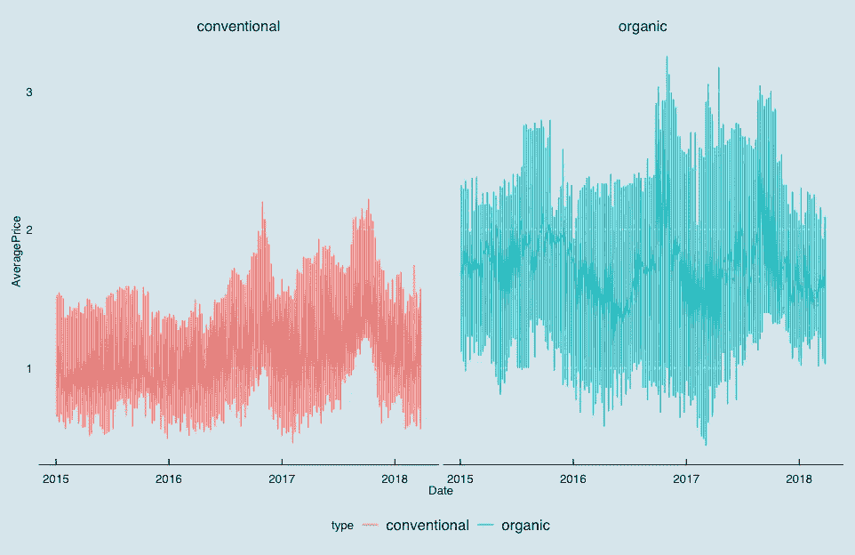
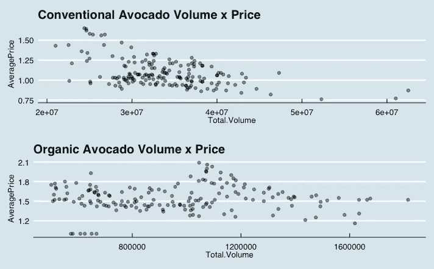
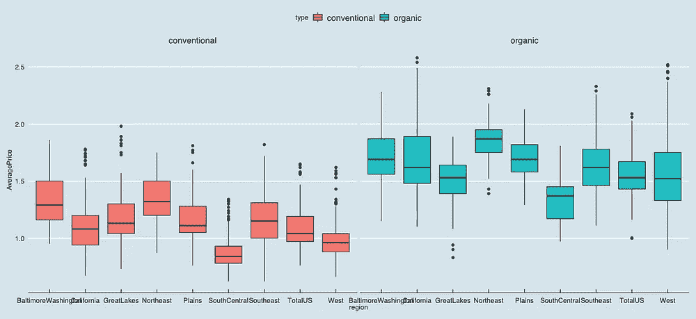
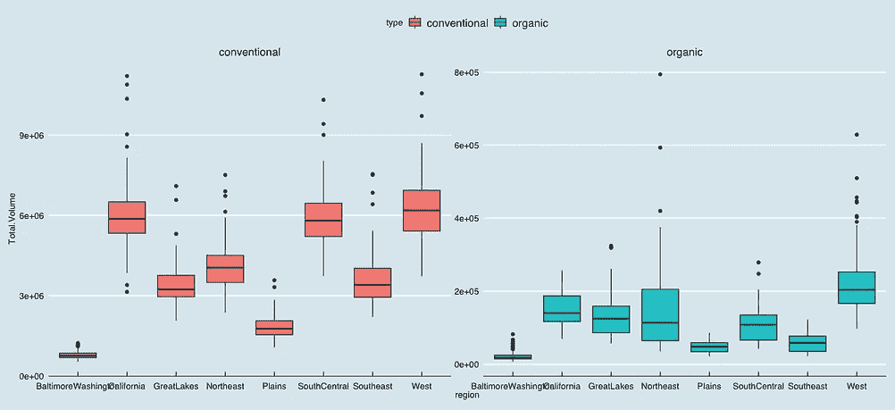
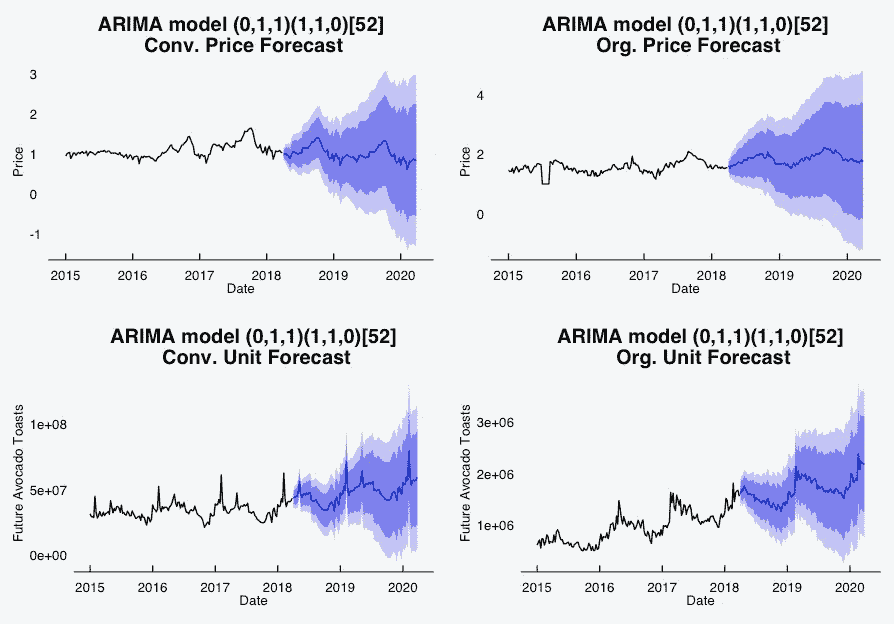
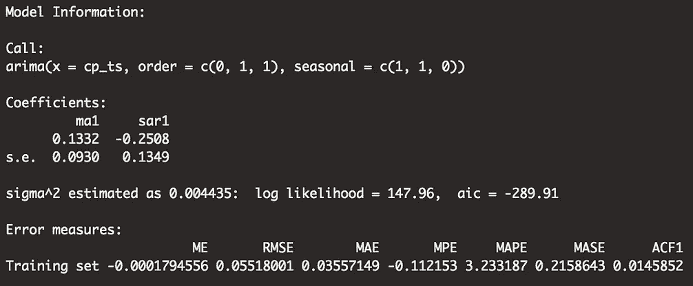
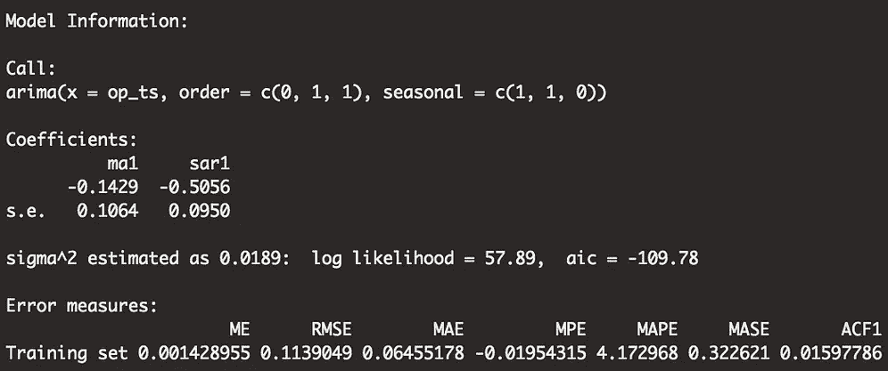
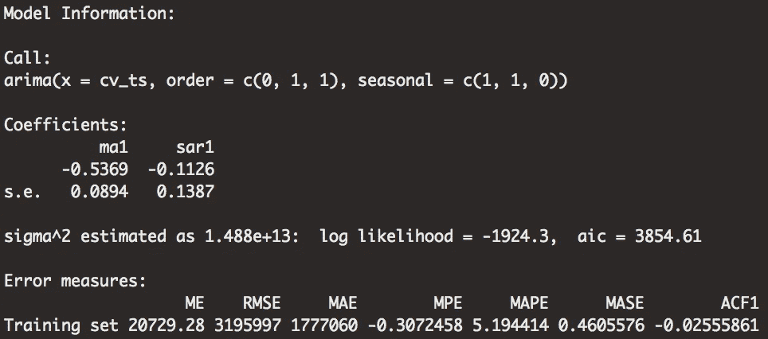
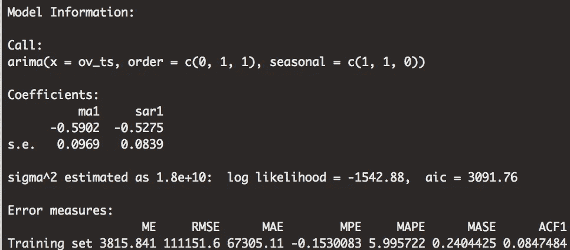

# 千禧一代最喜欢的水果:用 ARIMA 模型预测鳄梨价格

> 原文：<https://towardsdatascience.com/millennials-favorite-fruit-forecasting-avocado-prices-with-arima-models-5b46e4e0e914?source=collection_archive---------20----------------------->

It’s a fruit. — Photo by [Thought Catalog](https://unsplash.com/@thoughtcatalog?utm_source=medium&utm_medium=referral) on [Unsplash](https://unsplash.com?utm_source=medium&utm_medium=referral)

如果你知道关于金融的第一件事，你就会知道在千禧年和白色栅栏之间的唯一障碍是鳄梨吐司。如果信息时代的孩子们能站起来，离开早午餐桌，把他们捣碎的鳄梨和荷包蛋放在全麦面包上，那么他们也许能买得起他们在爱荷华州艾姆斯的[梦想中的两居室](https://medium.com/@sean.holland20/a-stroll-through-small-town-america-real-estate-data-from-ames-iowa-d02c285bb464)。*明明*。

为了声援千禧一代的鳄梨吐司引发的金融危机，我想更深入地研究一下美国最受欢迎的水果。是的，鳄梨是一种水果——甚至是一种浆果。我的研究还表明，鳄梨实际上并不是烤面包制造商为了卖出更多烤面包的阴谋。

因此，在这篇文章中，我将分析来自[哈斯牛油果委员会(HAB)](https://hassavocadoboard.com/inside-hab/) 的数据，这是一个为行业专业人士提供全球牛油果价格研究和数据的贸易组织。如果你想了解鳄梨相关的研究，你可以在这里找到数据。

**数据**

HAB 数据集由从 2015 年 1 月 4 日到 2018 年 3 月 25 日的 168 周每周时间序列数据组成。在此期间，该数据集提供了美国 54 个地区的常规和有机鳄梨的平均价格和总量数据，总计超过 18，000 次观察。

所以让我们进入正题——我们的鳄梨长什么样？

视力测试告诉我们，有机鳄梨的平均价格比传统鳄梨更高，也更不稳定。深究这些数字，所有地区传统鳄梨的平均价格为 1.16 美元，标准差为 0.26 美元。同时，有机鳄梨的平均价格为 1.65 美元，标准差为 0.36 美元。

然而，看看销售的鳄梨，发现有机鳄梨只占同期美国销售的所有鳄梨的 3%。2015 年 1 月至 2018 年 3 月期间，消费者购买了超过 3300 万个常规鳄梨和不到 100 万个有机鳄梨。

我们知道传统鳄梨的平均价格更高，在销售方面远远超过有机鳄梨。所以，这就提出了一个问题——价格和销售量之间的关系本质是什么？

(Conventional) Pearson’s Correlation = -0.51 p-value<0.001 | (Organic) Pearson’s Correlation = 0.02 p-value=0.75

在为期 168 周的研究中，传统鳄梨的平均价格和销售量呈中度负相关。这里没有什么不寻常的，而是经济学的基本原理——需求量随着价格的下降而增加。

有机鳄梨讲述了一个不同的故事。有机鳄梨的价格标签和销售量之间没有统计上的显著关系。需求持平，这意味着无论价格如何，消费者都不太可能大幅改变他们的需求量。背景对于理解这种关系很重要。

研究表明，收入较高的消费者、小孩和/或大学学历的人比他们的同龄人更有可能成为“忠实”的有机消费者。在这种情况下,“投入”表示消费者在有机水果和蔬菜上的支出高于其家庭收入的平均水平。因此，有理由认为定期有机鳄梨消费者属于一个非典型的人群。不幸的是，我没有足够的资源来找出这种平淡关系背后的因果因素，但我当然可以(也很乐意)大胆猜测。经常购买有机商品的消费者(可能)更有可能出于某种原则而购买。也许消费者认为有机食品比非有机食品更健康或更道德。因此，由于有机食品价格的简单变动，有机消费者不太可能消费非有机食品，因此我们对有机鳄梨的需求曲线是平坦的。

Right: Average Price (USD) | Left: Total Volume (Avocados Sold)

接下来，我想快速浏览一下各个地区的价格和销量。东北人(我的人民)和华盛顿人(也是我的人民)为这个国家的有机和传统鳄梨支付了最高的价格。东北人平均为传统鳄梨支付 1.34 美元，为有机鳄梨支付 1.86 美元。与此同时，普通鳄梨的全国平均价格为 1.09 美元，有机鳄梨为 1.55 美元。

就数量而言，西方人平均每周消费最多的鳄梨，包括传统的和有机的。西方人每周消费超过 618 万个传统鳄梨和 22 万个有机鳄梨。与全国平均水平相比，西方人消费了美国销售的 18%的传统鳄梨和 23%的有机鳄梨。

有很多鳄梨吐司。

**预报**

我认为可以很有把握地说，就买得起我前面提到的那套两居室而言，这艘船已经航行了几千年。我的意思是，美国人每周在鳄梨上花费大约 700 万美元，所以几千年来对白色栅栏的所有希望都应该破灭。

谢天谢地，根据皮尤研究中心的调查，我属于 Z 世代。当然，这意味着我需要了解鳄梨经济将如何影响我实现与栅栏相关梦想的*机会。*

为此，我求助于 ARIMA 预测。 [**A** uto- **R** 过度 **I** 积分 **M** 移动 **A** 平均](https://www.investopedia.com/terms/a/autoregressive-integrated-moving-average-arima.asp)模型是一类通用模型，允许通过“差分”使预测模型稳定平稳性是预测中的一个重要条件，因为非平稳性会破坏传统置信区间、假设检验和预测的可靠性。

ARIMA 模型可以分为三个部分，AR，I 和 MA。首先，AR 组件描述了一个线性多元回归，其中给定数量的 *Y* 的先前值作为 *Y(t)的预测值。*I 分量描述了使模型稳定所需的差分顺序。MA 组件类似于 ar 组件，因为它将滞后值引入模型。然而，滞后值是以前的误差项，而不是以前的值。

感谢像我这样的 ARIMA 新手，Rob Hyndman 在 R 中的“预测”包配备了 auto.arima 函数。Auto.arima 测试了几个 arima 模型，并根据 Akaike 信息标准选择了最佳模型，为选择最终模型提供了一个良好的起点。

使用扩展的 Dickey-Fuller 检验，检验可能偏向 OLS 估计量的单位根，我得出结论，对于我的四个模型——常规价格、常规交易量、有机价格和有机交易量——中的每一个，一阶差分都是必要的。此外，我选择使用季节性 ARIMA 模型，它包含另一组给定期间(在本例中为 52 周或一年)的 AR、I 和 MA 参数。

那么，我们能从我们的模型中学到什么？首先，我们的平均价格模型似乎告诉我们，鳄梨价格在每年的秋季达到顶峰。2017 年 10 月，传统鳄梨达到 1.65 美元的峰值，我们的模型预测，秋季的峰值将持续到 2018 年和 2019 年。然而，该模型预测，在接下来的两年里，传统鳄梨的价格将呈下降趋势。2015 年至 2018 年间，常规鳄梨的平均价格为 1.09 美元。2018 年至 2020 年，预测平均价格为 1.01 美元，下降约 7%。

与之形成鲜明对比的是，该模型预测有机鳄梨价格将在波动性较小的支撑下温和增长。2018 年至 2020 年的预测平均价格为 1.84 美元，而 2015 年至 2018 年为 1.55 美元。该模型当然显示了有机鳄梨价格的温和上涨趋势。

然而，平均价格的增长也部分归因于波动性的降低，预测期内价格的标准差从 2015 年至 2018 年期间的 0.36 美元标准差降至 0.16 美元。

据预测，在 2018 年至 2020 年期间，传统和有机鳄梨的销量都将出现强劲增长。传统鳄梨产量预计将增长 40%以上，平均每周售出 3370 万至 4760 万个鳄梨。

有机鳄梨预计会经历更迅猛的增长。预计 2015 年至 2018 年之间的持续增长趋势将持续到 2019 年，2018 年至 2020 年之间的增长率将高达 74%。2015 年至 2018 年间，供应商每周售出约 97 万个有机牛油果。2018 年至 2020 年间，这一数字预计将跃升至 168 万个有机鳄梨。

**讨论**

我认为这些模型真的很令人兴奋。首先，在模式识别方面，有趣的是看到模型在季节趋势上有所回升。价格模型捕捉到了秋季的价格上涨，而交易量模型捕捉到了每年 2 月鳄梨交易量的峰值。

此外，诊断看起来相当不错。平均绝对百分比误差(MAPE)用于测量预测值和观测值之间的误差，因此较低的值表示模型拟合度较好。在四个模型中，有机体积模型的 MAPE 最高，约为 6%，表明该模型的准确率约为 94%。我对这种契合度非常满意，我对所有的车型都很有信心。至少，我像一个预测新手一样自信。

如果我不得不发表评论(我很乐意这样做)，我会说有机鳄梨产量的增长预测有些乐观。我不确定仅仅两年 74%的增长有多现实，但是测试几个模型得出了类似的结果。

或者，我认为传统的鳄梨价格模型有些悲观。随着 2015 年以来秋季价格上涨逐年增加，我很惊讶该模型预测整体价格下降。然而，如果这种情况持续到 2020 年，你将不会看到我在早午餐时抱怨。

**结论**

朋友们，这就是我对 ARIMA 天气预报的小小介绍，还有一个像鳄梨这样有价值的测试主题。尽管传统鳄梨的价格可能会下降，但鳄梨销量的增加似乎将阻止下一代人实现郊区房产天堂的梦想。

我希望你喜欢我对预测的尝试，我希望很快回到这个主题，有更多改进的 ARIMA 模型和其他更复杂的模型。嘿，也许投资有机鳄梨种植者——你可能会看到 74%的回报。

嗯，可能不会。