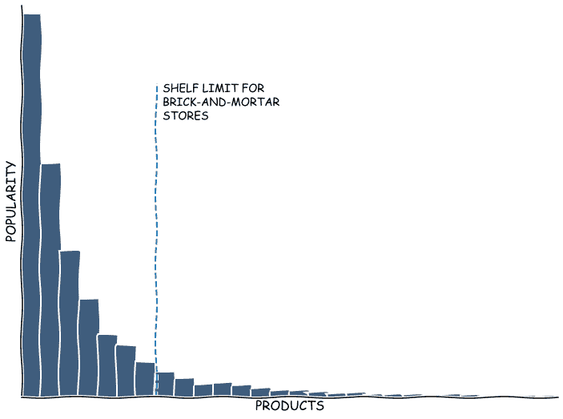

# 读心术算法

> 原文：<https://towardsdatascience.com/mind-reading-algorithms-368bdf412eb2?source=collection_archive---------17----------------------->

## 推荐系统介绍

Photo by [Virginia Johnson](https://unsplash.com/@johnsonvr) on [Unsplash](https://unsplash.com/)

今晚的游戏计划:一顿热饭，一张温暖的床，和几个小时的网飞。最棒的是，你即将让它发生。

你把钥匙放在前门，转动锁，把门推开…

《黑镜》的最后一集有点令人不安。也许今晚我应该给索尔打个电话……

你已经穿过前门一半了…

*…可能不会像《绝命毒师》那么好，但是…等等，那是什么？*

附近正在播放音乐。你出去听着。它来自你大楼旁边的那家新商店。这是你过去几天一直在想的一首歌。商店前面铺着红地毯。

*“电子商店”，*你喃喃自语，读着商店顶部发光的红色霓虹灯上的内容。你几次路过这里时，都没怎么注意这个地方。

你将对展出的东西进行快速检查。毕竟，几分钟的逛街不会伤害任何人。

你走进商店，注意到里面灯光明亮。有各种各样的货架上摆放着物品，一些店员在移动和整理物品。商店中心有一个小舞台，配有一张沙发和一个小架子。

仔细一看，你注意到舞台上小小的架子上只有你的尺码和你喜欢的运动品牌的跑鞋。你一直在考虑重新开始跑步。

是我做点什么的时候了吗？

你挑选了一双鞋，走向收银台。在去那里的路上，你看到一个放着跑步衬衫和裤子的架子。看一眼就会发现，有些可以和你的新鞋搭配成一套很棒的衣服。你很快就会看到。

我不能像个业余选手一样出去！

现在你有了完整的跑步装备，你可以继续去收银台了。在把东西交给店员时，你注意到一张海报，上面是你最喜欢的演员在跑马拉松。他们穿的衣服几乎和你将要购买的一样。唯一的区别是，你漏掉了他们戴的智能手表。

*几率有多大*？

店员微笑着指着收银台旁边展示的智能手表。你愉快地忍受着。

离开商店后，几个小时后，你开始反思你的疯狂消费。除了装备和智能手表，你还买了一副太阳镜、蛋白粉、健身房订阅和健康计划。

*也许逛街并没有那么有害……*

对于实体店来说，这似乎是一个遥不可及的故事，但却是许多互联网服务的基础。故事中的*E(vil)store*用来吸引你注意力的策略，你可以在这篇文章的参考资料中找到一个现有的数字类比。这些技术中的大多数都与被称为推荐系统的领域相关。

现在推荐人无处不在。很有可能你正在阅读这篇文章是因为一个建议产生的。他们负责用户在 Amazon⁴购买的 35%的东西，人们在网飞观看的 75%的东西，以及在 YouTube⁵.观看的 70%的时间

这些算法在我们的社会中是如此根深蒂固，以至于人们甚至开始警惕他们的 risks⁶.反 vaxxers，平地球支持者和其他阴谋论者已经学会操纵这些系统，以不成比例的高比率推荐他们的内容。那些主张一个由互联网驱动的新启蒙时代的人很可能没有想到今天的 YouTube。

到目前为止，这篇文章并没有帮助恢复推荐系统的形象。但我的目标是关注他们积极的一面。推荐者为我们提供了一项有价值的服务:通过减少选择的不确定性来做出决策。此外，正如我们将在接下来的章节中看到的，在一个充满无限选择的数字世界中，这不是一件容易的事情。

通过这篇文章，我想分享一个关于推荐人的*什么，为什么，*和*如何*的直观想法。我不打算涵盖实现或技术细节。所以，如果这就是你想要的，请小心。

简而言之，如果你需要向老板解释什么是推荐人，这篇文章可能会有所帮助。相反，如果你需要为你的老板建立一个推荐者，这篇文章可能有助于在你搜索其他文章时分散他的注意力！

# 推荐系统 101

*推荐系统*或*推荐器*是一套技术，用于根据用户的需求向他们推荐最合适的项目。尽管这个定义听起来很简单，但它隐藏了许多细节。

在推荐者的上下文中，一个项目是一个非常具有延展性的想法。它可以是娱乐应用程序中的电影或歌曲，也可以是约会应用程序中可能的爱情或配偶。基于项目的质量，推荐器试图猜测哪些项目最适合推荐给给定的用户。因此，如果你有看动作片的历史，你很可能更喜欢收到像《速度与激情》这样的推荐，而不是网飞最新的浪漫剧。

合适也是一个主观的问题。从用户的角度来看，你期望一个推荐者为你的需求尽可能快地提供最好的选择，并且支付最少的费用。另一方面，一家企业试图谋生，因此推荐者提供建议的方式需要反映这一目的。人们可以预期，用户和企业的需求有时会发生冲突。

查尔斯·杜希格(Charles Duhigg)推广了一个建议走得太远的生动例子。在《习惯的力量》一书中，他提到了一个案例，一位愤怒的父亲通过定向广告发现他十几岁的女儿怀孕了。广告公司利用他女儿的购买历史，认为她可能很快就会需要婴儿服装，并为此发送了优惠券。不知情的父亲收到了邮件，发现了优惠券。在向公司代表投诉后不久，从他女儿那里得知她确实怀孕了。

在这篇文章中，我选择了推荐系统的定义，它并不局限于*软件*或*计算机系统。*这是因为这些系统不是只有大的技术公司才能建立的技术问题。此外，它们不局限于数字世界，甚至不局限于人类事务。

狩猎采集文明需要向他人推荐他们生存的最佳觅食地。国王们有部长小组来建议政府重要领域的行动方针。即使在动物界，蚂蚁也会留下痕迹，向蚁群中的其他成员提示去 food⁷.的最佳路线

最近，推荐系统的使用扩展到广泛的数字服务。在选择过多的应用程序中，这变得很有必要。对这种系统的研究始于 70 年代的杜克大学。然而，第一个基于软件的推荐系统 *Tapestry* 花了 20 年才问世。它是在施乐帕洛阿尔托研究中心(PARC)开发的，并发表在 1992⁸.的《美国计算机学会通讯》杂志上

Xerox PARC researchers during an informal meeting⁹. Probably complaining about all the cat images filling their inboxes.

由于电子邮件的使用越来越多，施乐 PARC 公司的研究人员试图用 Tapestry 处理他们收到的所有不必要的文件。这个系统利用人们的合作，根据他们的反应来标记文档。然后，这些标签被用来创建个人过滤器，减少每个用户收到的文档数量。例如，爱丽丝可以创建过滤器，只接收鲍勃和乔标记为*有趣*的文档，接收玛丽·⁰.标记为*重要*的文档

但是，一个最初作为文档过滤器的算法是如何在我们今天的数字服务中如此根深蒂固的呢？这就是我们将在下一节讨论的内容。

为了简单起见，从现在开始我们将只关注基于软件的推荐器，并且将使用广义的术语*推荐系统、推荐器系统和* *推荐器*来指代它们。

# 小书架和无限书架的问题

想象一下，你将要在你的镇上开一家书店。现在亚马逊主导了市场，这感觉是一个可怕的想法。即便如此，没有人会阻止你的创业动力。你已经签了一个小但位置好的地方的租约，还计划向顾客提供你的招牌浓缩咖啡。

不久前，您收到了来自几家出版社的书籍目录，今天您需要挑选哪些书籍将会摆满书架。但是，当你通读第一个目录时，做决定会越来越困难。

*我应该订购保罗·柯艾略的新书吗？…*

*饥饿游戏系列怎么样？…*

还有我的朋友德里克最近出版的《牧场着装专家的回忆》？

书架的空间限制了你一次可以拥有多少本书。因为你可能想长期生存下去，所以明智的做法是只向公众提供最受欢迎的书籍。*对不起，德里克……*

在这种情况下，照顾顾客的个人需求是不可能的，因为你没有足够的空间放这么多书。如果你想赚钱，你需要展示你知道的有需求的东西。一些客户可能找不到他们想要的书，但是大多数人只要买了最受欢迎的书就会很开心。

现在，想象几年过去了。你的策略非常有效。顾客对你选择的书籍和招牌浓缩咖啡非常满意。如此之多，以至于一家大型连锁书店最近出高价收购你的书店。他们想任命你为首席执行官来推动他们新建立的数字战略。

最后，你再也不用担心有限的货架空间了。该公司的主页是一个无限的、完全可定制的书架。此外，你可以访问像亚马逊一样大的库存。你只需要从 5000 万本书中找出哪些书展示给你下个月期待的 1000 万名顾客……*嗯……*

你可以坚持以前的策略，在主页上给每个顾客展示最受欢迎的书籍。然而，数以百万计的顾客对你向他们展示的东西不感兴趣。此外，你不会开发你的巨大库存的潜力。最终结果可能是数百万愤怒的顾客和业绩不佳的销售。

另一个选择是在主页上显示所有可用的书籍。尽管如此，你还是面临着选择悖论的风险。当人类面对丰富的选择时，非但没有感到快乐，反而变得烦躁和焦虑。因此，你很有可能最终会让顾客更加恼火，减少销售额。

*你担任首席执行官才几周，董事会已经在重新考虑你的任命……*

绝望中，你走出办公室，走进雨夜。看着天空，你尖叫，要求一条出路…

突然，你的手机震动了…

你在雨中花了几秒钟努力解锁手机，直到你能看到通知…

“想看什么？在你湿淋淋的屏幕上，一条来自网飞的小横幅上写着“我们建议黑镜:Bandersnatch”。

*呃…谢谢，但现在不是时候…*

*或者……是吗？*

这就是推荐系统介入的地方。通常，以不太戏剧化的方式。

在向用户提供所有可能的选择或向所有用户提供通用选择之间存在一条中间道路。通过使用推荐器，可以向每个用户提供一些经过深思熟虑的建议。

为此，你不需要关心书籍的受欢迎程度。您可以将每个客户的兴趣与书籍的属性(如流派、长度和作者)相匹配。例如，你可能会发现一些客户会对《光明使者》系列而不是《权力的游戏》(GoT)反应更好。在网上书店，这是你可以也需要关心的事情。在实体店，这些顾客很可能需要购买 GoT 系列。

在线世界和现实世界满足顾客需求的差异被称为长尾*。下图有助于理解这一现象。水平轴上的每个条形代表一个项目。这些条按照流行度(在垂直轴中表示)以递减方式排序。*

The Long Tail. Physical stores define what they show to users by their shelf space limitations. Online stores use Recommenders to define what to show.

垂直虚线左边的条是实体店由于空间限制可以展示的商品。相比之下，网上商店可以展示所有的商品:尾巴和受欢迎的商品。推荐器旨在解决在线环境中显示过多选项的问题。

到目前为止，我们已经看到了什么是推荐器以及它们解决的问题。现在，我们将回顾推荐者产生建议的不同方式。

# 神奇的推荐者和在哪里可以找到他们

除了推荐器的 *What* 和 *Why* 之外，了解这些系统通常是如何构建的也是有意义的。为此，我们将回顾标准的六类推荐人⁴以及哪些科技公司使用了它们⁵:

*   **基于内容(CB):** 推荐与用户喜欢的项目相似的项目。为了识别相似性，推荐器使用项目的特性或特征。对于书籍推荐者，该算法可以使用流派、作者或书籍长度作为推荐类似书籍的特征。使用者:脸书和亚马逊
*   **协同过滤(CF):** 推荐其他口味相似的用户过去喜欢的用户项目。CF 背后的推理是“两个或两个以上在一个领域有相似兴趣的人也倾向于购买其他领域的相似物品或产品。”使用者:亚马逊、脸书、LinkedIn 和 Twitter
*   **人口统计:**根据用户的人口统计资料推荐商品。这些系统通常按照特定于业务的规则对用户进行细分，并基于这些细分生成推荐。使用人:易贝
*   **基于知识:**通过将明确的用户需求与商品特征相匹配来推荐商品。例如，您指定卧室的数量、占地面积，网站会返回最佳匹配房屋的列表。
*   **基于社区:**利用用户朋友的喜好推荐物品:*告诉我你的朋友是谁，我告诉你你喜欢什么。*
*   **混合:**这种类型的推荐器推荐结合了两种或两种以上先前技术的项目。一个典型的例子是将协同过滤方法与基于内容的系统相结合。使用者:亚马逊和网飞

在这六种类型的推荐器中，前两种，基于内容和协同过滤，是最受欢迎的。这两个网站上都有丰富的资料。如果你想深入挖掘推荐者或者自己建立一个，就从这里开始吧。

# 结束语

本文从推荐系统的技术介绍开始。然而，经过一点研究，我注意到已经有数百篇文章有类似的目标。

因为我没有动力去做同样的事情，所以我把一些叙述和理论混合在一起，写了这篇科学怪人的文章。我希望它对理解推荐者有所帮助，也许会给你——至少——一个同情的笑声。

我们现在处于一个时代，这些算法正在塑造我们日常生活的重要部分。我们应该理解我们在社交媒体订阅源、在线购物建议和其他数字服务中看到的东西背后的含义。本文试图以一种可理解的方式填补这一空白。

我希望你喜欢这篇文章。如果你有任何问题或意见，请随时给我留言。

# 后续步骤

最后，如果你想了解更多关于推荐者的信息，我有一些建议作为起点:

**理论**

*   [挖掘海量数据集，第九章](http://www.mmds.org/#ver21)
*   [推荐系统手册](https://www.springer.com/gp/book/9780387858203)

**申请**

*   [Python 初学者推荐系统](/beginners-recommendation-systems-with-python-ee1b08d2efb6)
*   [基于 PySpark 的推荐系统](https://www.kaggle.com/vchulski/tutorial-collaborative-filtering-with-pyspark)
*   [用 TensorFlow 构建协同过滤推荐系统](/building-a-collaborative-filtering-recommender-system-with-tensorflow-82e63d27b420)

**数据集**

*   [电影镜头](https://grouplens.org/datasets/movielens/)
*   [TMDB 5000](https://www.kaggle.com/tmdb/tmdb-movie-metadata)
*   [带有消费者评级的餐厅数据](https://www.kaggle.com/uciml/restaurant-data-with-consumer-ratings)

# 参考

[1] Mailchimp，[什么是重定目标？](https://mailchimp.com/resources/what-is-retargeting/) (2019，访问日期)

[2] R. Reshef，[了解协同过滤方法](https://datasciencemadesimpler.wordpress.com/2015/12/16/understanding-collaborative-filtering-approach-to-recommendations/) (2015)

[3] A .钱德拉舍卡，f .艾买提，j .巴西利科和 t .杰巴拉，[网飞的艺术作品个性化](https://medium.com/netflix-techblog/artwork-personalization-c589f074ad76) (2017)

[4] I. MacKenzie、C. Meyer 和 S. Noble，[零售商如何跟上消费者步伐](https://www.mckinsey.com/industries/retail/our-insights/how-retailers-can-keep-up-with-consumers) (2013 年)

[5] A. Rodriguez， [YouTube 的推荐驱动了我们观看的 70%](https://qz.com/1178125/youtubes-recommendations-drive-70-of-what-we-watch/)(2018)

[6] G. Chalot，[YouTube 上的 Twitter 帖子的推荐](https://twitter.com/gchaslot/status/1094359564559044610) (2019)

[7] R. Sharma，R. Singh，[推荐系统从古代到现代的演变:调查](http://www.indjst.org/index.php/indjst/article/view/88005/0) (2016)

[8] R. Sharma，R. Singh，[推荐系统从古代到现代的演变:调查](http://www.indjst.org/index.php/indjst/article/view/88005/0) (2016)

[9]计算机历史，[施乐 PARC](https://www.computerhistory.org/revolution/input-output/14/348) (2019，访问日期)

[10] Huttner，Joseph，[从 Tapestry 到 SVD:为推荐系统提供动力的算法综述](https://scholarship.tricolib.brynmawr.edu/handle/10066/3706) (2009)

[11]_ Curly _ Council，[这是一个我可以预见自己会进入的职业](https://www.reddit.com/r/funny/comments/xdgdq/this_is_a_profession_i_can_see_myself_getting_into/) (2013)

[12] P .希伯特，[选择的悖论，10 年后](https://psmag.com/social-justice/paradox-choice-barry-schwartz-psychology-10-years-later-96706) (2017)

[13] J. Leskovec，A. Rajaraman，J. Ullman，[挖掘海量数据集，第 9 章](http://infolab.stanford.edu/~ullman/mmds/ch9.pdf) (2014)

[14] F. Ricci，L. Rokach，B. Shapira，[推荐系统手册介绍，第 1 章](http://www.inf.unibz.it/~ricci/papers/intro-rec-sys-handbook.pdf) (2011)

[15] R. Sharma，R. Singh，[推荐系统从古代到现代的演变:调查](http://www.indjst.org/index.php/indjst/article/view/88005/0) (2016)