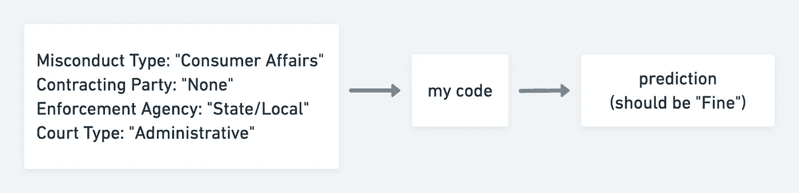
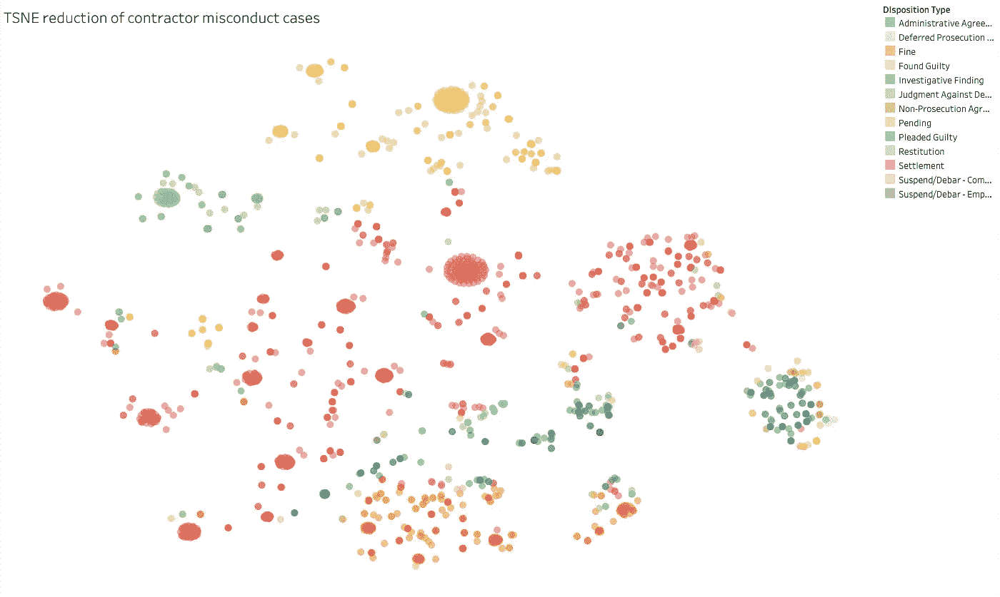
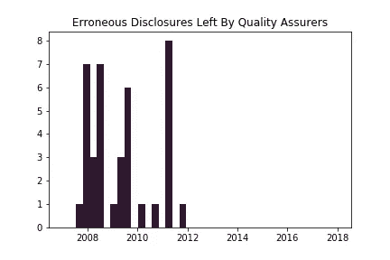

# 读心术正义女士

> 原文：<https://towardsdatascience.com/mind-reading-lady-justice-215ec8e2c2f5?source=collection_archive---------27----------------------->

## 使用机器学习预测法院判决


Photo by walknboston

几个月前，我正在寻找一个机器学习的兼职项目，这时我撞上了[联邦承包商不当行为数据库](https://www.contractormisconduct.org/)。由非营利组织[政府监督项目](https://www.pogo.org/) (POGO)策划，数据库中的每个条目都代表一家为联邦政府工作的公司被指控违反法律或法规的事件。POGO 公开发布数据库，以阻止联邦机构与罪犯签署进一步的协议。

一个示例条目:

```
**Instance**            Inadequate Number of Anesthesiologists in Texas
**Contractor(s)**       Humana
**Misconduct Type**     Consumer Affairs
**Date Type**           Date of Consent Orders
**Date**                10/8/2018
**Contracting Party**   None
**Enforcement Agency**  State/Local
**Court Type**          Administrative
**Disposition Type**    Fine
**Total Penalties**     700000
```

上图中，你可以看到保险公司 Humana 被指控在德克萨斯州的医疗保健网络中没有足够的麻醉师。他们必须是联邦承包商才能进入数据库，但没有列出合同方，所以违规不是特定工作的一部分。德克萨斯州政府将他们告上行政法庭，最终他们被罚款 70 万美元。

我决定开发一个机器学习软件，它可以根据数据库中的其他信息预测承包商不当行为的结果。在上面的例子中，如果系统正确地预测到 Humana 将被罚款，那么它将运行良好。

还有其他[机器学习系统](https://blog.rossintelligence.com/post/could-artificial-intelligence-help-settle-cases) [预测](http://vista-analytics.com/wp-content/uploads/2017/08/SettlementPrediction.pdf) [法院案件结果](https://premonition.ai/)。在我看来，最强有力的价值主张是，知道你胜诉的可能性有助于你决定你应该有多愿意庭外和解，这要么改善结果，要么节省时间和金钱。对于这个项目，我们可以想象，要么是被指控行为不当的承包商，要么是指控他们的执法机构，可能会为法院判决的足够好的预测买单。出于我在这里的目的，我没有考虑一些对熟悉这一法律领域的人来说显而易见的事情，例如，我的系统不知道只有当法院类型是`Criminal`时结果`Found Guilty`才是可能的。

我开始筛选我的系统可用的输入字段或特征。我放弃了日期字段，因为它的含义不一致，还放弃了承包商的身份，因为我希望我的预测器同样适用于没有事故记录的承包商。这给我留下了四个特征，都是绝对的。



High level data flow of prediction in this project

和机器学习问题一样，我的主要问题是可用的数据量有限。POGO 的数据库维护得很好，但只有大约 2500 个条目。在[分离出一些测试数据](https://github.com/Persola/contractor-misconduct/blob/master/notebooks/wrangle/misconduct_clean.ipynb)后，我降到了 2000 以下。并且[一键编码我的分类特征](https://github.com/Persola/contractor-misconduct/blob/master/notebooks/wrangle/misconduct_add_indicators.ipynb)使维度数量膨胀到 112。虽然还可以更好，但这个比例符合通常使用的经验法则，即每个特性有十个训练示例。但是我也有 14 个目标类，或者可能的结果，来匹配输入，所以我没有让我的期望太高。

在建模之前，我[t-SNE](https://en.wikipedia.org/wiki/T-distributed_stochastic_neighbor_embedding)d 并绘制了数据:

[](https://public.tableau.com/profile/luke.persola#!/vizhome/misconduct_3/MisconductTSNE)

The relatively orderly separation between the colors here implies it should be possible to make decent predictions. Click through to explore individual incidents.

准备好开始建模，我[从 scikit-learn 建立了一系列标准分类器](https://github.com/Persola/contractor-misconduct/blob/master/notebooks/predict/predict_disposition_type_by_F1.ipynb)，在缺乏更具体目标的情况下，通过对所有可能结果进行平均的 [F₁评分](https://en.wikipedia.org/wiki/F1_score)来比较它们。非线性支持向量分类器表现最好，径向基函数核 SVC 位于顶部，平均 F₁为 0.663。不是特别靠谱，但是比猜测好多了。(随机猜测处置类型但频率正确的虚拟分类器得分为 0.087。)

## 说客数据

不当行为数据库的前提是，政府机构倾向于错误地重新雇用有不良记录的承包商，忽略更合适的投标。如果这种偏袒是真实的，它会不会也影响到不当行为案件的判决呢？例如，如果一家公司的高管与政府决策者生活在同一个社交圈，那么该公司可能会赢得不应得的合同，也会得到监管机构的宽大处理。如果是这样的话，知道一家公司关系良好将有助于我们更好地预测他们在法庭上的结果。

我决定加入第二个数据源，这个数据源反映了一家公司在华盛顿的整体影响力。游说似乎是一个很好的起点。由于 2007 年通过的透明法[，国会游说者](https://lobbyingdisclosure.house.gov/110-81.pdf)[被要求](https://lobbyingdisclosure.house.gov/)公开报告关于他们的客户、员工和活动的信息。每个季度，每个游说公司都会提交一份包含这些信息的披露表，然后以 XML 文件的形式在网上公开。

为了从披露表中获取数据，我必须编写[代码来解析它们，并提取我需要的部分](https://github.com/Persola/contractor-misconduct/blob/master/notebooks/wrangle/disclosures_extract_clean.ipynb)。这些表格是由游说公司手工填写的，标准化程度很低，具有固有的灵活结构(例如，列出的游说者人数各不相同)，所以我不得不在获取干净数据时制定启发式规则。在我的探索性分析中，我很高兴地看到，无论是谁在管理众议院游说者的披露，都没有费心从生产数据库中删除他们的测试提交，留下了几十个标题类似`Ms. QA Test Cycle 6.0.0`的表格。



一旦我的数据提取开始运行，我试图从原始数据库中找出哪些承包商也被列为游说公司的客户。令我惊讶的是，通过编写一些简单的字符串匹配代码，我能够为其中的 70%找到说客。我从说客披露的信息中提取了几个字段，并将其添加到承包商数据集中，即:

*   承包商是否有说客
*   游说公司将他们列为客户的总次数
*   这些条目下列出的个人游说者的总数

将这些特征添加到我的数据集中，并重新运行基于 RBF 的 SVC，我的平均 F₁略有提高，从 0.663 提高到 0.676。

这一结果表明，了解一家公司游说努力的规模有助于你判断他们在法庭上会得到什么结果。很难说为什么。也许公司明确地与国会议员合谋来逃避起诉。也许法官会无意识地偏袒更有声望的公司，这些公司也往往有更多的说客。也许公司雇佣了很多说客以为他们可以绕过监管，但是他们还是被抓住了。我的最佳猜测是，这只是钱的问题；在法庭上花更多钱请律师的公司，可能也会花更多钱请律师代表他们去见国会议员。

有很多方法可以改进这个项目，但是我最感兴趣的是引入另一个新的数据源。我们可以通过将游说者的数据与同一家公司更丰富的信息来源进行比较，来测试这些数据是否提供了任何独特的见解，这些信息来源在商业上有很多。另一种选择是提取与不当行为指控本身相关的特征。在法律文件上使用自然语言处理和其他技术是[研究](https://law.stanford.edu/codex-the-stanford-center-for-legal-informatics/)和[创业](https://kirasystems.com/)的活跃领域。考虑到项目的范围，我最满意的是我能够获得两个最初看起来不相关的公开可用的数据源，并迅速将它们组合起来，以产生对我的预测器的具体改进。

你可以在这里找到我这个项目[的代码](https://github.com/Persola/contractor-misconduct)。

*Luke Persola 是旧金山的一名数据科学家和工程师。我目前正在寻找一个全职的数据科学职位！更在*[](http://www.lukepersola.com/)**。**