# MindfulR —应用商店评论挖掘

> 原文：<https://towardsdatascience.com/mindfulr-how-app-store-review-mining-can-boost-growth-improve-product-and-increase-monetization-4d50e20e9834?source=collection_archive---------23----------------------->

你有没有被淹没在思绪中？你希望变得更加专注和专注吗？

冥想已经被证明可以减轻压力，提高注意力，为健康、宁静的睡眠创造合适的条件。训练头脑比许多人想象的更具挑战性。因此，引导冥想应用市场有了巨大的增长，以帮助人们改善心理健康，获得更多的正念。

基于我过去在 6 个不同冥想应用中的经历，我一直想知道哪一个应用应该推荐给哪一种类型的观众。因为每个应用程序都有不同的内容，解决心理健康方面因人而异的特殊问题。所以我想:“为什么不挖掘应用评论的数据来比较这些应用呢？”。我挑选了 App Store 和我自己的经历认可的前 6 个冥想应用来分析——[head space](https://medium.com/u/3da90e297190?source=post_page-----4d50e20e9834--------------------------------)、Calm、 [Insight Timer](https://medium.com/u/620cd97a4aec?source=post_page-----4d50e20e9834--------------------------------) 、Oak、冥想工作室和 [Shine](https://medium.com/u/d1a511ecd43d?source=post_page-----4d50e20e9834--------------------------------) 。

为了保持文章的简洁，我只展示了一些精选的可视化效果，并对代码进行了匿名处理。更多的可视化和数据集可以在我的 Github 上找到

 [## 吉金恩/明德富尔

### 对顶级冥想应用的应用商店评论的自然语言处理分析

github.com](https://github.com/giginghn/mindfulR) 

你准备好今天获得一些正念了吗？

***本帖期待什么？***

1.  概观
2.  数据
3.  应用评级分布
4.  应用评级季节性
5.  每个版本的应用评级
6.  情感分析

*   AFINN 词典
*   NRC 词典

7.文本挖掘

*   二元模型分布
*   二元关系

8.使用自然语言处理的上下文分析

*   词性标注
*   每个应用评论中的独特名词
*   每个应用评论中的唯一动词

9.结论

***这个帖子的灵感来自于:*** 的伟大作品

1.  [*泰勒*](https://medium.com/@simranvatsa5/taylor-f656e2a09cc3) *西姆兰·瓦斯塔*
2.  [*App Store 评论挖掘与 R*](/spotify-app-review-mining-with-r-google-cloud-machine-learning-feb6f9c3b75f) *作者弗雷德里克·塞德洛夫*
3.  [*《圣经》中整齐的文字、词性、独特的词语*](https://www.andrewheiss.com/blog/2018/12/26/tidytext-pos-john/) *作者安德鲁·海斯*

# **1。概述**

**为什么 app 评论分析很重要？**

应用程序评论可以包含来自用户的宝贵见解，这些见解可以纳入产品改进流程，包括用户可用性、UX/用户界面、痛点、产品支持，等等！应用评论最棒的地方在于，它们经常是最新的，所以你可以利用它们来获得最新的见解。因此，利用最先进的文本分析来提高用户满意度和构建杀手级应用程序是至关重要的！

**评分和评论对你的应用有多重要？**

*   应用评级揭示了用户喜爱的应用功能，这有利于市场研究和竞争分析
*   [应投入 App 评论情感分析，了解用户行为，在竞争中取得领先优势](https://www.rankmyapp.com/market/what-is-sentiment-analysis-and-how-does-it-influence-your-app-strategy/)
*   [对已有产品或新产品的评论进行情感分析可以更容易地预测客户趋势，可以制定策略来利用它们](https://hackernoon.com/applications-of-sentiment-analysis-in-business-7b8682d70335)
*   [根据 Bright Local 的调查，85%的消费者对在线评论的信任程度不亚于个人推荐](https://www.brightlocal.com/research/local-consumer-review-survey/)
*   评级和评论对应用程序在应用程序搜索结果(ASO)中的排名有很大影响
*   应用评论可以让用户在产品改进过程中感受到参与和影响，这最终会增加用户的忠诚度
*   [据 Appentive 称，他们的研究表明，移动应用可以积极影响品牌的声誉，用户下载未知品牌的评分高的应用的可能性是知名品牌评分低的应用的 8 倍](https://www.apptentive.com/blog/2016/06/23/mobile-ratings-good-bad-ugly/)
*   对正面和负面的评论(或错误)进行分类可以有利于 UX 的改进或特性建议，从而提高效率并促进未来的优先级

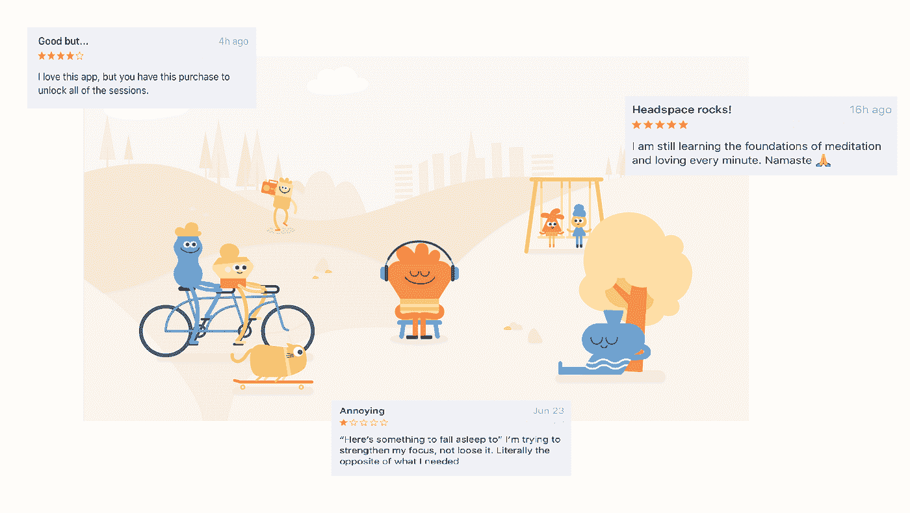

下面是一个简洁的例子，说明了文本分析如何作为基础来构建更强大的功能，以加速应用程序的增长并提高其健康程度。

# **2。数据**

**a .使用的工具:**

我在这个分析中使用了大量的 R 包，但是上面的 6 个包是我用来操作和挖掘文本数据的主要工具。我将谈论我特别用于文本分析的四大工具:

1.  itunesr 是一个健壮的包，它读取 App Store review 的 API 并提取到 R

*阅读 App Store API 的一个小缺点是，用户只能导出每个国家最新的 500 条评论。因此，这将导致 6 个冥想应用程序的聚合数据不具有相同的日期范围。*

2. [dplyr](https://cran.r-project.org/web/packages/dplyr/vignettes/dplyr.html) 是 R 中非常流行的工具，被许多数据科学家广泛使用。我们将使用 dplyr 中的 tidytext 来标记评论并删除停用词。

3. [spaCyr](https://cran.r-project.org/web/packages/spacyr/index.html) 是 Python 中的 [spaCy](https://spacy.io/usage/spacy-101) 和 r 之间的集成。这是用于自然语言处理的最先进的工具，如词性标注、名称实体标注、翻译等。它还可以利用机器学习来进行预测。

4.[脸书预言家](https://facebook.github.io/prophet/)是一种基于加法模型预测时间序列数据的程序，其中非线性趋势符合每年、每周和每天的季节性，加上假日影响。它最适用于具有强烈季节效应的时间序列和几个季节的历史数据。 ***这是我在 iPython Jupyter 笔记本:D*** 中编写的项目中唯一的包

我将使用**itunes Sr**包简要介绍一下我的数据收集过程:

1.  安装包后，我去 App Store 找我要刮的 App ID

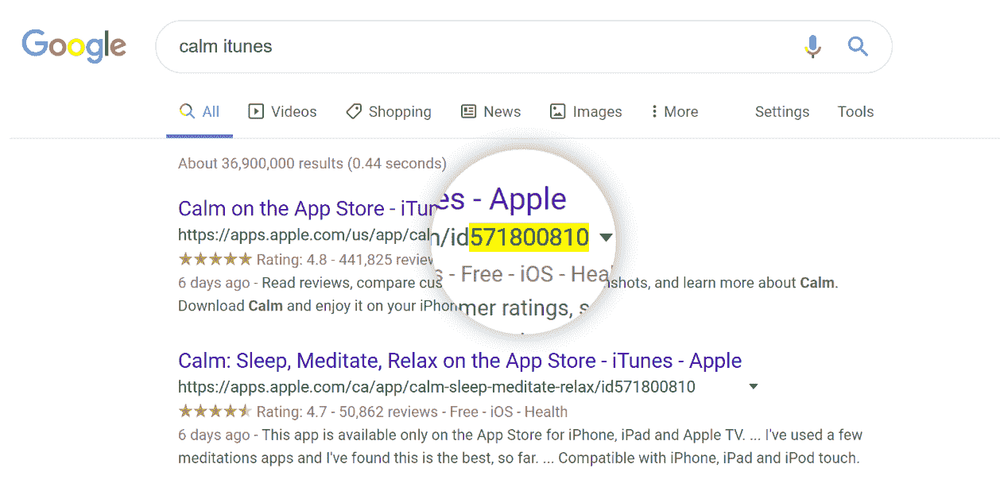

2.将应用 ID 和国家代码一起插入到包命令中

3.出于分析的目的，我们可以

只保留美国的人口，所以我使用国家代码“us”

4.最后，我输入了行号，让它知道应该检索多少行评论，在本例中是每个应用程序最近的 500 行

**b .数据帧概述**

数据结构

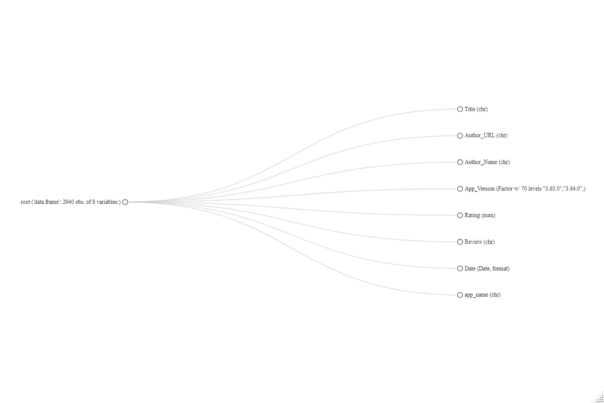

以下是数据框的一个片段

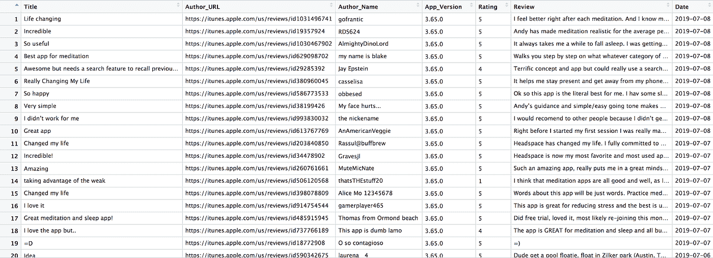

在让你对我们的数据有一个大概的了解之后，让我们直接进入分析。我将首先向您介绍高级分析流程，然后我们开始挖掘 6 款冥想应用的季节性、情绪和独特性。

**3。App 评分分布**

**a. App 评分分布**

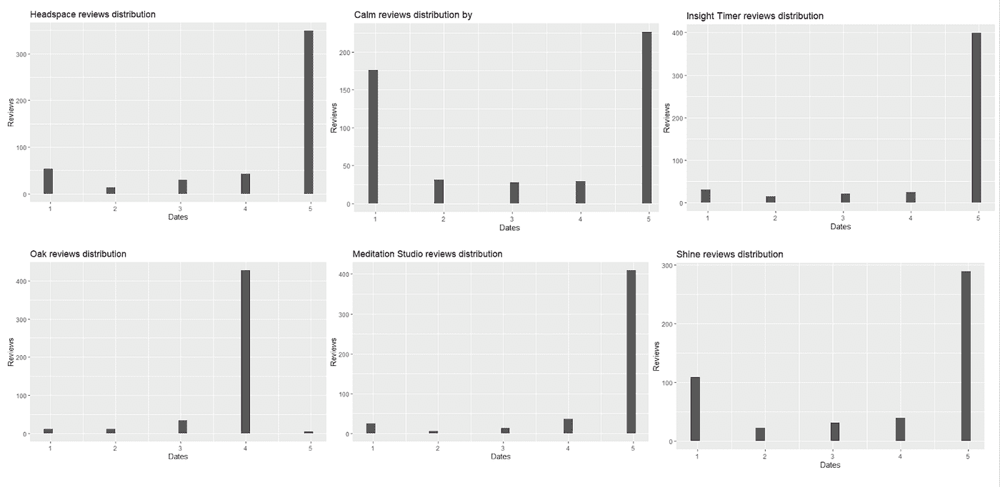

总体而言，这 6 款应用中的大多数在 App Store 上获得了相当高的评分。但是，有一些亮点我想指出来:

*   可悲的是,《平静》的 1 星低评数量约等于 5 星低评数量，我们将在后面的文章中更多地讨论人们评价低的原因
*   Shine 与 calendar 也遵循类似的模式，1 星相对于 2 星、3 星和 4 星评价较高
*   橡树对我来说是最突出的，因为它几乎没有任何 5 星评价，接受 4 星评价

**b .一段时间内的评级数量**

从每个应用程序的评分量可以看出，Headspace，Calm，Insight Timer 和 Shine 在 2019 年 2 月至 7 月期间都有最近的 500 条用户评论。然而，Oak 和冥想工作室没有太多的用户参与，所以他们最近的 500 条评论包含了从 2017 年到现在的评论。

**4。App 评分季节性**

了解平均收视率在一个月的不同日子里是如何变化的会很有趣。操纵时间序列数据来检测一周中各天的季节性，以发现季节性和高/低评级之间是否存在任何相关性，这也很重要。

首先，我们根据每月的每一天来查看应用评级的平均分布。

从这个柱状图来看，评级在整个月内波动几乎相同。因此，检查季节性图更有帮助。为了使数据平稳，并绘制出一周中各天的季节性，我使用了来自[脸书预言家](https://facebook.github.io/prophet/)的时间序列包来拟合每周季节性模型。

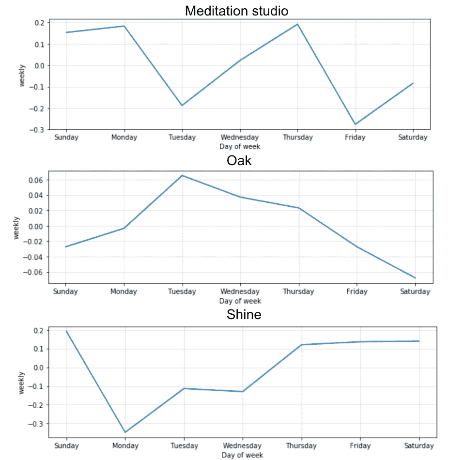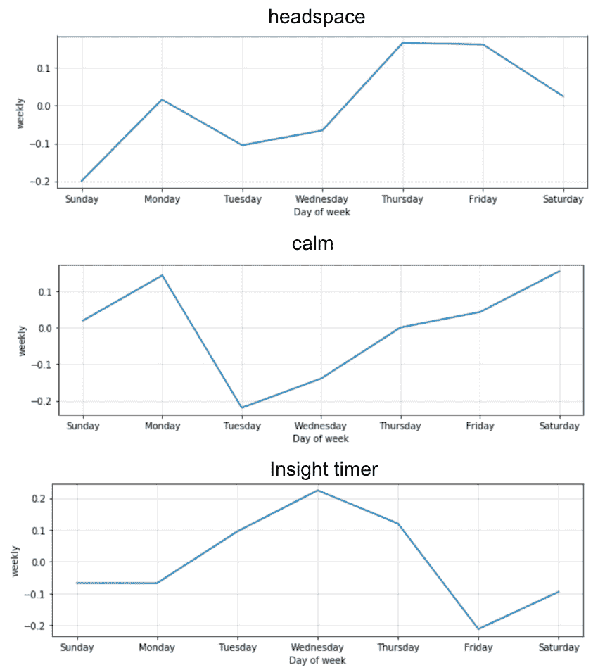

从拟合模型中，我们可以看到 Headspace、calculate、冥想工作室和 Shine 通常在一周开始时评级较低，而在一周结束时评级攀升。另一方面，Oak 和 Insight Timer 从周一到周四有相当高的收视率，然后他们就暴跌了。

→这可用于制定策略，在应用程序中显示何时发送用户应用程序评级弹出窗口，以获得最高评级。

**5。每个版本的应用评级**

为了了解用户对每个具有更新功能的新版本的反应，我们可以绘制每个应用程序版本的平均评分。这将为公司提供衡量每个发布版本成功与否的大图。

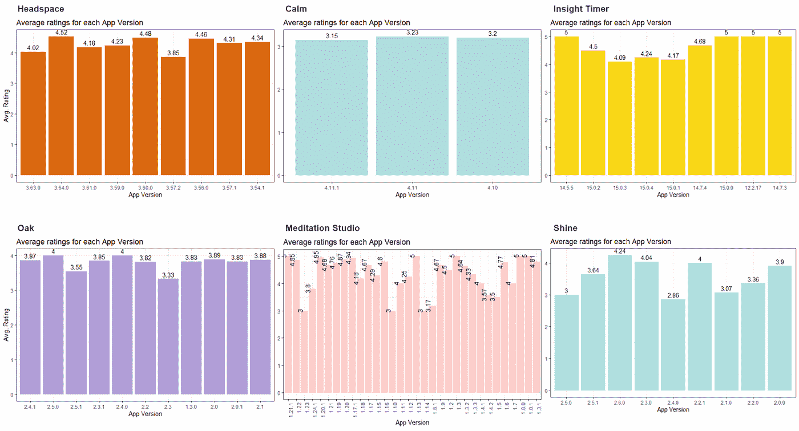

**6。情绪分析**

在对应用评级进行整体概述后，我想全面了解每个评论的核心，以及每个词的情绪如何影响应用的整体品牌。为此，我们需要将复习句子分解成单词，这可以通过 R tidytext 中的标记化文本来完成。

机器学习和 NLP 算法中有一个常用短语——垃圾进，垃圾出。没有同样好的数据，我们不可能有最先进的结果。因此，我们首先清理和删除停用词，标点符号和罕见的短语。文字清理功能请参考我的 Github。

然后，我们在 3 种通用词典中分析情感:

*   Finn RUP Nielsen 的“AFINN”

“AFINN”词典给单词打分在-5 到 5 之间，负分表示消极情绪，正分表示积极情绪。

*   来自赛义夫·穆罕默德和彼得·特尼。

*“NRC”词典将单词分为积极、消极、愤怒、期待、厌恶、恐惧、快乐、悲伤、惊讶和信任等类别。*

**答)阿芬:**

由于“AFINN”会根据积极/消极的程度给这些词分配一个情感分数，我计算了分数的总和以及这些词在每次评论中出现的次数，列出了计数最多的前 20 个词，并绘制了它们的分布图。

从图表中我们可以看到，6 款冥想类 app 在评论中的正面词都多于负面词，尤其是“爱”这个词在评论中出现了 2500 多次。

“焦虑”是最负面的词，这是有道理的，因为这些冥想应用程序旨在解决焦虑，并给用户带来更多的快乐。然而，如果我们看第二个最消极的词，我们有“支付”。

当我查看 6 个应用程序的订阅价格时，他们仍然收取非常高的价格——大约 59 美元到 69 美元/月。我认为情况不应该是这样的，因为这些应用程序旨在缓解压力，改善心理健康，而不是给用户增加更多的经济负担。因此，解决和改进这些应用程序，让世界各地的人们更容易使用，将是一个新出现的问题。Headspace Student 的案例是一个很好的例子，说明了这款应用如何让有需要的人买得起。

我还对每个应用程序的分布进行了细分，并绘制了积极和消极字数之间的比较。这张图表证实了我们之前的评级分布图，即 Calm 仍然是负面评价高、1 星评级多的应用程序。

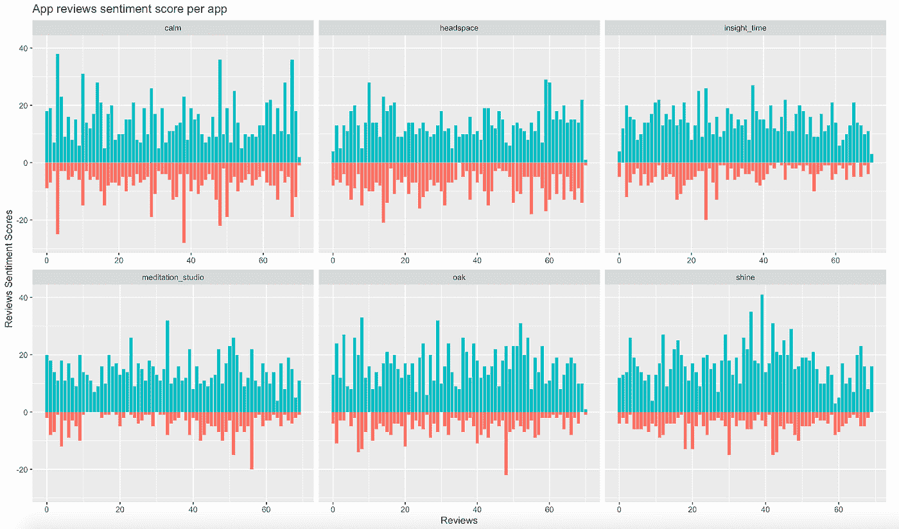

为了了解应用的情绪如何随着时间的推移而发展，我们可视化了每个应用的应用评论数据中的平均情绪得分。

我们可以看到，对应用程序评论的看法随着时间的推移而波动，然而，Oak 是唯一一个应用程序评论情绪得分最稳定的应用程序，并且直到现在都在略微下降。

**b. NRC 词典**

NRC lexicon 是 Saif M. Mohammad 和 Peter D. Turney 在“众包一个单词情感关联词典”的研究中的惊人成果，该词典将单词分为不同的类别，而不仅仅是积极和消极的类别——愤怒、预期、厌恶、恐惧、快乐、悲伤、惊讶和信任。

*请遵循他们网站上关于如何为您的项目检索数据集用于非商业用途的说明:*[*【http://sentiment.nrc.ca/lexicons-for-research/】*](http://sentiment.nrc.ca/lexicons-for-research/)

对于 NRC lexicon 的最后一次可视化，我使用雷达图来查看每个应用程序中的评论如何根据这八种情绪相互叠加。

根据 NRC 雷达图，我们清楚地看到，与用户评价中的其他 5 款应用相比，Calm 缺乏“快乐”、“预期”，尤其是“信任”。同时，冷静的评论更倾向于“愤怒”和“悲伤”。

→这可能是为什么与其他应用程序相比，Calm 的差评如此之多的原因之一。但是是因为教训还是因为付出才让人对平静感到忧郁？ 让我们在接下来的几个环节中一探究竟。

**7。文本挖掘**

到目前为止，我们认为单词是一个词，意思是个体单位，以及它们与情感的关系。然而，大多数有见地的文本分析通常基于单词之间的关系，无论是检查哪些单词倾向于紧随其他单词，还是检查哪些单词在同一文档中同时出现。这被称为 N-grams 单词分析。

通过检查单词之间的关系，我们提供了更多关于单词在评论中如何措辞的上下文，而不仅仅是情感。在这篇文章中，我在二元模型中标记了评论并分析了数据。

**a .二元模型分布**

在 bigrams 标记化之后，我对每个应用程序中的前 20 个词进行了排名，并绘制了它们的分布。

总的来说，大多数应用程序都提供指导冥想课程，但顿悟计时器似乎在这个功能上胜过其他应用程序。另一方面，Oak 是唯一一款提供 ***引导和非引导冥想*** 课程以及有效呼吸练习的应用。

如果我们仔细看看 Calm，除了它的主要功能“睡眠故事”和“入睡”之外，还有许多词围绕着订阅和支付问题，如“支付 70”、“70 美元”或“花钱”，而其他 5 个应用程序则不是这样。

Headspace 主要关注正念、生活方式和压力缓解，因此用户如何享受他们的指导冥想以“*”是完全令人惊讶的。这很有趣，因为 Sleep Story 是 Calm 上最受欢迎的功能，现在用户正在转向 Headspace。*

*→在检查了 bigrams 之后，我们对 Calm 如何接受这些评论家的评论有了更好的了解，同时也揭示了用户喜爱的每个应用程序的功能。*

***b .二元模型关系***

*除了分布图之外，我们还可以查看二元模型关系网络，以便在更清晰的上下文中充分理解短语是如何相互连接的。*

*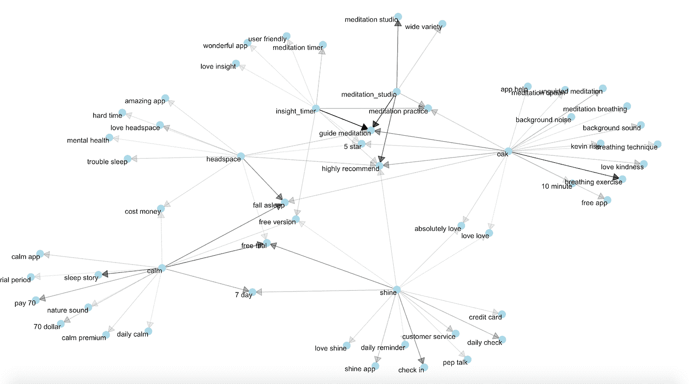*

***8。使用 NLP 进行上下文分析***

*我们一直在使用 tidytext 来标记单词，并应用不同的词汇来分析单词的情感。现在，我进一步尝试机器学习方法。在这篇文章的 NLP 部分，我使用 spaCy 来对标记进行词汇化，并应用词性标注(POS tagging)。这种方法的目的是更深入地挖掘每个应用程序的用户评论的独特名词和动词。*

***答:词性标注:***

*你可以通过我的 [Github](https://github.com/giginghn/mindfulR/blob/master/README.md) 找到在 R 中实现 spaCy 的代码，这里我只给你展示了词汇化和词性标注的结果数据框。*

*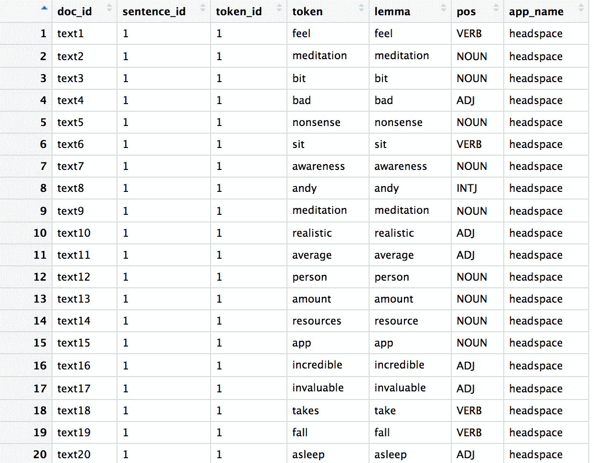*

*在我们跳入寻找 App 评论中独特的名词和动词之前，我们要计算每个词的 ***词频-逆文档频率(tf-idf)*** 来确定它们的独特性。Tf-idf 只是作为一个词出现在文档中的频率，但被该词在总共 6 个应用程序的评论中的频率所抵消。*

*在这一节中，我给出了 tf-idf 对 6 个应用程序中独特的名词和动词的概述，并只展示了一些最重要的应用程序的 wordcloud 图。*

***b .独特名词***

*以下是每个应用程序中出现频率最高的 3 个名词的 tf-idf 概述。*

*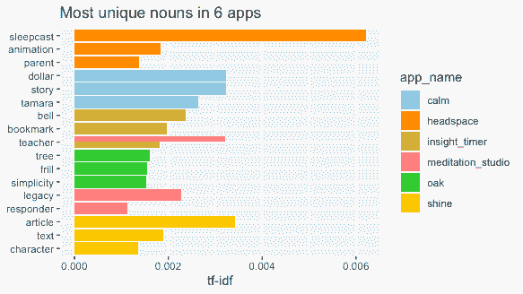*

*我们注意到 Insight Timer 和冥想工作室共享一个最常见的名词“老师”，因为这两个应用程序强调从不同的老师那里选择冥想课程的灵活性。*

*现在我对每个应用程序进行 wordcloud 绘图，看看每个应用程序有哪些独特的名词脱颖而出。*

*   ****顶空****

*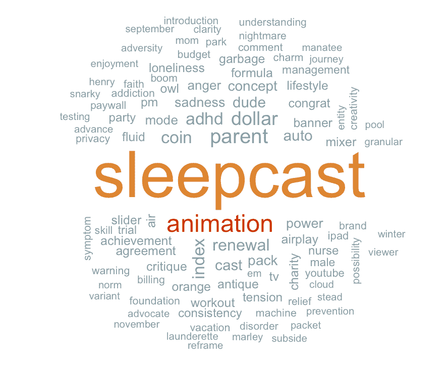*

*这个图加强了我们上面的发现。尽管 ***Sleepcast*** 在 Headspace 上并不是一个大张旗鼓宣传的功能，但这个隐藏的 gem 功能显然是一个杀手级应用！此外， ***友好可爱的动画*** 似乎极大地吸引了更多用户对应用的参与。*

*   ****洞察计时器****

*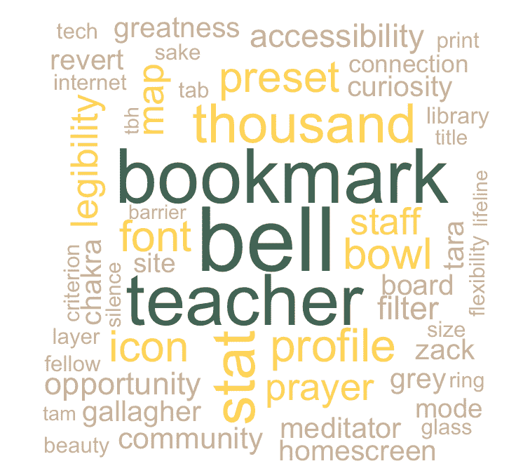*

*顿悟计时器专注于传统的冥想方法，因此毫不奇怪，该应用程序中最独特的名词是“*”、“ ***祈祷*** ”、“ ***千*** ”等。此外，我们可以在应用程序上发现一些杀手级功能，如 ***课程书签*** 和 ***个人资料统计*** 。**

*   *****冥想工作室*****

**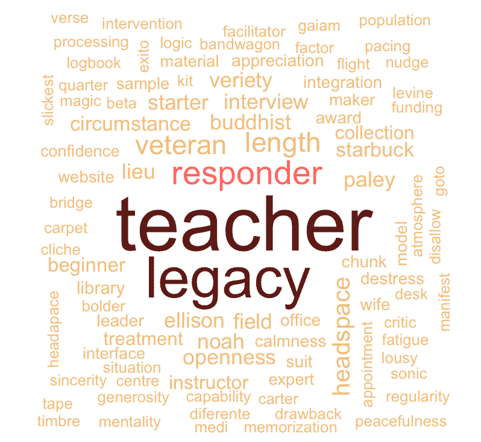**

**冥想工作室似乎是最好的应用程序，可以让用户选择各种各样的 ***冥想老师*** ，并将冥想的 ***遗产*** 【传递给更多的人。"*"也许是冥想工作室的潜在市场利基，因为它在其他应用程序的其他地方没有提到。***

*****b .独特动词*****

***以下是每个应用程序中出现频率最高的 3 个动词的 tf-idf 概述。***

***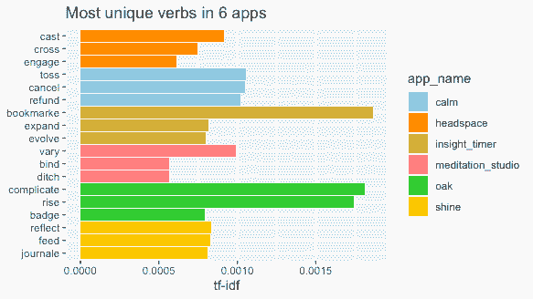***

***现在让我们来挖掘这些独特动词的 wordcloud 情节！***

*   ******平静******

**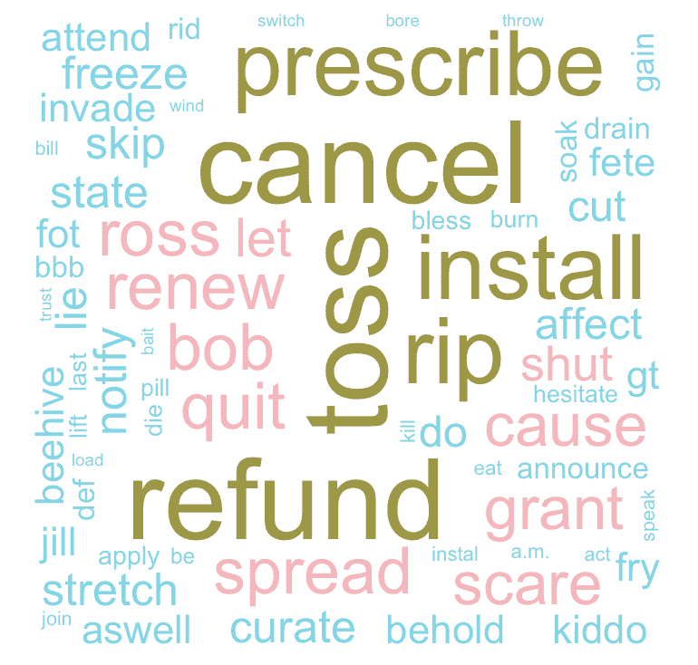**

**我们现在完全可以理解 App Store 上差评冷静的原因了。评论中提到的大多数动词大多与认购问题相关— ***【取消】******【退款】******【折腾】******【rip】【退出】*** 等。这是红旗，以冷静的价格策略来赢回用户，并有更多的战略货币化计划！**

*   *****橡木*****

****

**Oak 给用户一种成就感，这种成就感带有个人色彩。他们用橡木“ ***【挣徽章】*** ”、 ***上升*** ”和 ***振动*** 。然而，设计或用户可用性仍然相当“*”以供用户在应用程序中导航。***

*   ******闪耀******

**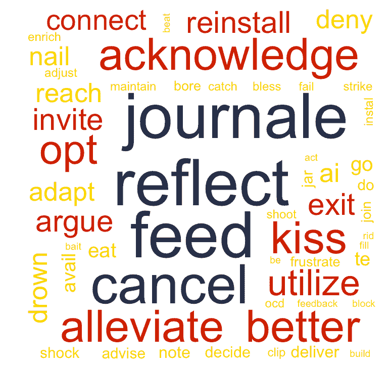**

**尽管 Shine 也面临类似的问题，如冷静对待“ ***”取消*** ”付款，但在 App 评论上的动词频率要少得多。另一方面，灵儿似乎做得很好，通过冥想帮助用户“ ***反映*** ”、“ ***杂志*** ”、“ ***认知*** ”和“ ***连接*** 。**

****8。结论****

**这个项目花费了我大量的时间和精力，但帮助我学会了如何在应用商店评论中利用文本挖掘和自然语言处理，并对产品、增长和盈利产生影响。**

**对于那些对其他冥想应用的可视化感兴趣的人，他们可以在这里找到。请随意阅读我的 [Github Repo](https://github.com/giginghn/mindfulR) 并摆弄数据&代码。**

**我知道每个单词的不同大小会有更多的改进空间，请随时通过我的 [Linkedin](https://www.linkedin.com/in/giangnghn/) 或 [Twitter 与我分享你可能发现的任何有趣的事情。](https://twitter.com/GiangTHNguyen)**

**鸣谢:我要感谢 Simran Vasta、Keith 阿蒂恩萨、陈彦蓉和 Sylvia Tran 与我分享资源并帮助我完成这篇文章。我觉得自己很幸运，在我的生命中有这么多了不起的人。**

** [## 吉金恩/明德富尔

### 对顶级冥想应用的应用商店评论的自然语言处理分析

github.com](https://github.com/giginghn/mindfulR)**