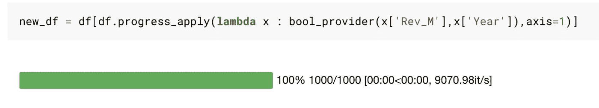

# 数据科学家的最小熊猫子集

> 原文：<https://towardsdatascience.com/minimal-pandas-subset-for-data-scientists-6355059629ae?source=collection_archive---------5----------------------->


## 您需要的所有熊猫功能

熊猫是一个巨大的图书馆。

对于 pandas 来说，数据操作轻而易举，它已经成为 it 的一个标准，许多并行化库，如 Rapids 和 Dask，都是按照 Pandas 的语法创建的。

尽管如此，我总的来说还是有一些问题。

在 Pandas 中有多种方法可以做同样的事情，这可能会给初学者带来麻烦。

这启发了我想出一个我在编码时使用的熊猫函数的最小子集。

我都试过了，目前，我坚持一种特定的方式。它就像一个思维导图。

有时是因为它很快，有时是因为它更易读，有时是因为我可以用我现有的知识来做。而且有时候因为知道某个特定的方式长期下去会很头疼(想多指标)

***这篇文章是关于用一种简单明了的方式来处理 Python 中的大多数数据操作。***

通篇都是一些零星的建议。

我将使用 IMDB 上过去十年中 1000 部流行电影的数据集。你也可以在 [Kaggle 内核](https://www.kaggle.com/mlwhiz/minimal-pandas-subset)中跟随。

# 一些默认的熊猫要求


尽管 Jupyter 笔记本很好，但在与熊猫一起工作时，有些事情仍然需要详细说明。

***有时候你的笔记本不会把所有栏目都给你看。如果你打印数据帧，有时它会显示所有的行。在导入熊猫时，您可以通过设置自己的一些默认值来控制这种行为。你可以使用[将这个](/three-great-additions-for-your-jupyter-notebooks-cd7373b00e96)添加到你的笔记本上来实现自动化。***

例如，这是我使用的设置。

```
import pandas as pd
# pandas defaults
pd.options.display.max_columns = 500
pd.options.display.max_rows = 500
```

# 用熊猫读取数据


我们做的第一件事是读取数据源，这是代码。

```
df = pd.read_csv("IMDB-Movie-Data.csv")
```

***推荐:*** 我本来也可以用`pd.read_table`来读文件的。问题是`pd.read_csv`的默认分隔符是`,`，这样可以节省一些代码。我也真心不明白`pd.read_table`的用途

如果您的数据在某个 SQL 数据源中，您可以使用下面的代码。您将获得数据帧格式的结果。

```
# Reading from SQL Datasourceimport MySQLdb
from pandas import DataFrame
from pandas.io.sql import read_sqldb = MySQLdb.connect(host="localhost",    # your host, usually localhost
                     user="root",         # your username
                     passwd="password",   # your password
                     db="dbname")         # name of the data basequery = "SELECT * FROM tablename"df = read_sql(query, db)
```

# 数据快照


看到一些数据总是有用的。

您可以使用带有选项的简单的`head`和`tail`命令来指定行数。

```
# top 5 rows
df.head()# top 50 rows
df.head(50)# last 5 rows
df.tail()# last 50 rows
df.tail(50)
```

您还可以使用以下命令查看简单的数据帧统计信息。

```
# To get statistics of numerical columns
df.describe()
```


```
# To get maximum value of a column. When you take a single column you can think of it as a list and apply functions you would apply to a list. You can also use min for instance.print(max(df['rating']))# no of rows in dataframe
print(len(df))# Shape of Dataframe
print(df.shape)---------------------------------------------------------------
9.0
1000
(1000,12)
```

***推荐:*** 一般用 Jupyter 笔记本工作， ***我特别注意让笔记本的前几个单元格包含这些数据的快照*** 。这有助于我随时看到数据的结构。如果我不遵循这个实践，我注意到我在代码中重复了很多次`.head()`命令。

# 处理数据框架中的列


## a.选择列

出于某种原因，Pandas 允许您以两种方式选择列。像`df.Title`一样使用点运算符，像`df['Title']`一样使用方括号

我更喜欢第二个版本。为什么？

从长远来看，使用方括号版本会更好，这有几个原因。

*   如果您的列名包含空格，那么点版本将不起作用。比如`df.Revenue (Millions)`不会工作而`df['Revenue (Millions)]’`会。
*   如果您的列名是`count`或`mean`或任何 pandas 预定义的函数，它也不会工作。
*   有时您可能需要在列名上创建一个 for 循环，其中列名可能在变量中。在这种情况下，点符号将不起作用。例如，这是可行的:

```
colname = 'height'
df[colname]
```

虽然这不会:

```
colname = 'height'
df.colname
```

相信我。省几个字不值得。

***建议:停止使用点运算符*** 。它是一个源自不同语言(R)的结构，应该保留在那里。

## b.获取列表中的列名

您可能需要一个列列表，以便进行后续处理。

```
columnnames = df.columns
```

## c.指定用户定义的列名:

有时您想根据自己的喜好更改列名。我不喜欢我的列名中有空格，所以我这样更改它们。

```
df.columns = ['Rank', 'Title', 'Genre', 'Description', 'Director', 'Actors', 'Year',
       'Runtime_Minutes', 'Rating', 'Votes', 'Revenue_Millions',
       'Metascore']
```

我本可以用另一种方式。

在这种情况下，两个版本都很重要。当我必须更改许多列名时，我使用上面的方法。当我必须更改一两个列的名称时，我会使用:

```
df.rename(columns = {'Revenue (Millions)':'Rev_M','Runtime (Minutes)':'Runtime_min'},inplace=True)
```

## d.设置特定列的子集:

有时，您只需要处理数据帧中的特定列。例如，分离数字列和分类列，或者移除不必要的列。比如说在我们的例子中。我们不需要描述、导演和演员栏。

```
df = df[['Rank', 'Title', 'Genre', 'Year','Runtime_min', 'Rating', 'Votes', 'Rev_M', 'Metascore']]
```

## e.查看列类型:

调试时非常有用。如果您的代码抛出一个错误，说明您不能添加一个`str`和`int`，您将希望运行这个命令。

```
df.dtypes
```

# 在数据帧上应用函数:Apply 和 Lambda


`apply`和`lambda`是我在熊猫身上学到的一些最好的东西。

每当我为一个新的列或过滤器构建复杂的逻辑时遇到困难，我就会使用`apply`和`lambda`。

## a.创建列

您可以通过多种方式创建新列。

如果你想要一个列是列的和或差，你可以使用简单的基本算法。在这里，我得到了基于 IMDB 和标准化 Metascore 的平均评级。

```
df['AvgRating'] = (df['Rating'] + df['Metascore']/10)/2
```

但是有时我们可能需要围绕新列的创建构建复杂的逻辑。

举一个复杂的例子，假设我们想要基于各种因素构建一个自定义的电影评分。

比方说，如果电影是惊悚片，我想在 IMDB 评分保持小于或等于 10 的条件下，在 IMDB 评分上加 1。如果一部电影是喜剧，我想从评分中减去一分。

***我们怎么做呢？***

每当我掌握了如此复杂的问题，我就使用`apply/lambda`。让我首先向您展示我将如何做这件事。

```
def custom_rating(genre,rating):
    if 'Thriller' in genre:
        return min(10,rating+1)
    elif 'Comedy' in genre:
        return max(0,rating-1)
    else:
        return rating

df['CustomRating'] = df.apply(lambda x: custom_rating(x['Genre'],x['Rating']),axis=1)
```

一般结构是:

*   您定义了一个函数，该函数将接受您想要处理的列值，以得出您的逻辑。在这里，我们最终使用的两列是流派和评级。
*   沿着 axis=1 的行使用带有 lambda 的应用函数。一般语法是:

```
df.apply(lambda x: func(x['col1'],x['col2']),axis=1)
```

您应该能够使用 apply/lambda 创建几乎任何逻辑，因为您只需担心自定义函数。

## b.过滤数据帧


熊猫使过滤和子集化数据框架变得相当容易。您可以使用普通运算符和`&,|,~`运算符对数据帧进行过滤和子集化。

```
# Single condition: dataframe with all movies rated greater than 8df_gt_8 = df[df['Rating']>8]# Multiple conditions: AND - dataframe with all movies rated greater than 8 and having more than 100000 votesAnd_df = df[(df['Rating']>8) & (df['Votes']>100000)]# Multiple conditions: OR - dataframe with all movies rated greater than 8 or having a metascore more than 90Or_df = df[(df['Rating']>8) | (df['Metascore']>80)]# Multiple conditions: NOT - dataframe with all emovies rated greater than 8 or having a metascore more than 90 have to be excludedNot_df = df[~((df['Rating']>8) | (df['Metascore']>80))]
```

很简单的东西。

但有时我们可能需要进行复杂的过滤操作。

有时我们需要做一些操作，而仅仅使用上面的格式是做不到的。

例如:我们假设 ***我们想要过滤电影标题中字数大于或等于 4 的那些行。***

***你会怎么做？***

尝试下面的会给你一个错误。显然，你不能做任何简单的事情，比如用一个系列分割。

```
new_df = df[len(df['Title'].split(" "))>=4]
-------------------------------------------
AttributeError: 'Series' object has no attribute 'split'
```

一种方法是首先使用 apply 创建一个标题中包含字数的列，然后对该列进行过滤。

```
#create a new column
df['num_words_title'] = df.apply(lambda x : len(x['Title'].split(" ")),axis=1)#simple filter on new column
new_df = df[df['num_words_title']>=4]
```

这是一个非常好的方法，只要你不需要创建很多列。但我更喜欢这个:

```
new_df = df[df.apply(lambda x : len(x['Title'].split(" "))>=4,axis=1)]
```

我在这里做的是 ***我的 apply 函数返回一个可以用来过滤的布尔值。***

现在，一旦你理解了你只需要创建一个布尔列来过滤，你就可以在你的`apply`语句中使用任何函数/逻辑来得到你想要构建的复杂逻辑。

让我们看另一个例子。我会试着做一些复杂的事情来展示这个结构。

***我们想找到收入低于该年平均收入的电影？***

```
year_revenue_dict = df.groupby(['Year']).agg({'Rev_M':np.mean}).to_dict()['Rev_M']def bool_provider(revenue, year):
    return revenue<year_revenue_dict[year]

new_df = df[df.apply(lambda x : bool_provider(x['Rev_M'],x['Year']),axis=1)]
```

这里有一个函数，可以用来写任何逻辑。只要我们能够处理简单的变量，这就为高级过滤提供了强大的功能。

## c.更改列类型

我甚至使用 apply 来更改列类型，因为我不想记住更改列类型的语法，也因为它让我可以做更复杂的事情。

在 Pandas 中，更改列类型的常用语法是`astype`。因此，如果我的数据中有一个`str`格式的名为 price 的列。我可以这样做:

```
df['Price'] = newDf['Price'].astype('int')
```

但有时并不会如预期般奏效。

你可能会得到错误:`ValueError: invalid literal for long() with base 10: ‘13,000’.`也就是说，你不能将一个带有`“,”`的字符串转换为整型。要做到这一点，我们首先要去掉逗号。

在一次又一次地面对这个问题之后，我现在已经完全停止使用`astype` 了，只使用 apply 来改变列类型。

```
df['Price'] = df.apply(lambda x: int(x['Price'].replace(',', '')),axis=1)
```

## 最后，还有`progress_apply`


`progress_apply`是`tqdm`包附带的单一功能。

这为我节省了很多时间。

有时，当您的数据中有很多行，或者您最终编写了一个非常复杂的 apply 函数时，您会发现 apply 可能需要很长时间。

我见过应用程序在使用 Spacy 时花费数小时。在这种情况下，您可能希望看到带有`apply`的进度条。

你可以使用`tqdm`来实现。

在笔记本顶部进行初始导入后，只需将`apply`替换为`progress_apply`，一切都保持不变。

```
from tqdm import tqdm, tqdm_notebook
tqdm_notebook().pandas()df.progress_apply(lambda x: custom_rating_function(x['Genre'],x['Rating']),axis=1)
```

你会看到进度条。



***推荐:*** 每当看到要创建自定义复杂逻辑的列，就想到`apply`和`lambda`。也尝试使用`progress_apply`。

# 数据帧上的聚合:g `roupby`


`groupby`会在你想汇总数据的时候出现很多次。Pandas 通过`groupby`功能让你高效地完成这项工作。

有很多方法可以使用`groupby`。我见过很多版本，但我更喜欢一种特定的风格，因为我觉得我使用的版本简单、直观，并且可以针对不同的用例进行扩展。

```
df.groupby(list of columns to groupby on).aggregate({'colname':func1, 'colname2':func2}).reset_index()
```

现在你看到它是非常简单的。你只需要担心提供两个主要的信息。

*   到`groupby`的列列表，以及
*   列和要应用于这些列的函数的字典

`reset_index()`是一个重置数据帧索引的函数。每当我执行 groupby 时，我总是应用这个函数，您可能会认为它是 groupby 操作的默认语法。

让我们来看一个例子。

```
# Find out the sum of votes and revenue by yearimport numpy as np
df.groupby(['Year']).aggregate({'Votes':np.sum, 'Rev_M':np.sum}).reset_index()
```


您可能还想按多列进行分组。这相当简单。

```
df.groupby(['Year','Genre']).aggregate({'Votes':np.sum, 'Rev_M':np.sum}).reset_index()
```


***推荐:*** 坚持一个语法对于`groupby.`不喜欢我的就挑自己的但是坚持一个。

# 处理多个数据帧:连接和合并:


## `a. concat`

有时我们从不同的来源获得数据。或者有人带着多个文件来找你，每个文件都有特定年份的数据。

***我们如何从单个数据帧创建单个数据帧？***

这里我们将人工创建我们的用例，因为我们只有一个文件。我们首先使用已知的基本过滤操作创建两个数据帧。

```
movies_2006 = df[df['Year']==2006]
movies_2007 = df[df['Year']==2007]
```

这里我们从两个数据帧开始:`movies_2006`包含 2006 年发行的电影的信息，而`movies_2007`包含 2007 年发行的电影的信息。我们希望创建一个包含 2006 年和 2007 年电影的单一数据框架

```
movies_06_07 = pd.concat([movies_2006,movies_2007])
```

## b.合并

您将遇到的大多数数据永远不会出现在单个文件中。其中一个文件可能包含特定电影的评级，另一个文件可能提供电影的投票数。

在这种情况下，我们有两个需要合并的数据帧，这样我们就可以在一个视图中拥有所有的信息。

这里我们将人工创建我们的用例，因为我们只有一个文件。我们首先使用已知的基本列子集操作创建两个数据帧。

```
rating_dataframe = df[['Title','Rating']]
votes_dataframe =  df[['Title','Votes']]
```


我们需要在一个数据框架中包含所有这些信息。我们该怎么做？

```
rating_vote_df = pd.merge(rating_dataframe,votes_dataframe,on='Title',how='left')rating_vote_df.head()
```


我们为这个合并函数提供了四个属性——第一个 DF、第二个 DF、在哪一列上连接以及连接标准:`['left','right','inner','outer']`

***推荐:*** 我通常最后总是用`left` join。你将很少需要使用`outer`或`right.`来连接，实际上无论何时你需要做一个`right` 连接，你实际上只需要一个左连接，在合并函数中数据帧的顺序是相反的。

# 重塑数据框架:熔化和透视表(reverseMelt)


大多数时候，我们并没有得到我们想要的精确形式的数据。

例如，有时我们可能有列中的数据，而我们可能需要行中的数据。

让我们再创造一个人为的例子。你可以看看下面我用来创建这个例子的代码，但是真的没关系。

```
genre_set = set()
for genre in df['Genre'].unique():
    for g in genre.split(","):
        genre_set.add(g)
for genre in genre_set:
    df[genre] = df['Genre'].apply(lambda x: 1 if genre in x else 0)working_df = df[['Title','Rating', 'Votes',
       'Rev_M']+list(genre_set)]working_df.head()
```

所以我们从这样一个`working_df`开始:


现在，这并不是一个特别好的存放数据的结构。如果我们有一个只有一个列类型的数据帧，我们可能会更喜欢它，并且我们可以为同一部电影重复多行。所以电影《普罗米修斯》可能有三行，因为它有三种类型。我们如何做到这一点？

我们使用`melt:`

```
reshaped_df = pd.melt(working_df,id_vars = ['Title','Rating','Votes','Rev_M'],value_vars = list(genre_set),var_name = 'Genre', value_name ='Flag')reshaped_df.head()
```


所以在这个融化函数中，我们提供了五个属性:

*   数据帧名称=工作数据帧
*   id_vars:仅在当前表单中需要的变量列表。
*   value_vars:我们希望融合/放入同一列的变量列表
*   for value _ vars 的列名
*   value _ name:value _ vars 的值的列名

还剩下一件事。对于普罗米修斯，我们看到它是一部惊悚片，旗帜为 0。标志 0 是我们可以过滤掉的不必要的数据，我们将得到我们的结果。我们只保留带有标志 1 的类型

```
reshaped_df  = reshaped_df[reshaped_df['Flag']==1]
```


***如果我们想回去呢？***

我们需要将一列中的值变成多列。怎么会？我们用`pivot_table`

```
re_reshaped_df = reshaped_df.pivot_table(index=['Title','Rating','Votes','Rev_M'], columns='Genre', 
                    values='Flag', aggfunc='sum').reset_index()re_reshaped_df.head()
```


我们为 pivot_table 函数提供了四个属性。

*   索引:我们不想改变这些列结构
*   列:将该列分解为多个列
*   值:使用此列进行汇总
*   aggfunc:聚合函数。

然后我们可以使用`fillna`用 0 填充缺失的值

```
re_reshaped_df=re_reshaped_df.fillna(0)
```


***推荐:*** 多列对一列:`melt`和一列对多列:`pivot_table`。做`melt`——`stack`还有其他方式做`pivot_table` : `pivot`、`unstack.`不要管他们，只用`melt`和`pivot_table`。这有一些合理的原因，比如`unstack`和`stack`会创建多索引，我们不想处理这个问题，而且`pivot`不能将多个列作为索引。

# 结论


> 有了熊猫，选择就越少

在这里，我试着描述了熊猫中我最常用的一些最有用的功能。

Pandas 是一个庞大的库，有很多功能和定制选项。这使得你必须有一个思维导图，在这个思维导图中，你要坚持使用特定的语法来处理特定的事情。

我在这里分享了我的，你可以继续下去，随着你对这个库的理解的增长，它会变得更好。

我希望这篇文章对你有用，值得你花时间。我试图让这尽可能简单，但是你可能总是**问我**或者查看文档中的疑问。

全部代码和数据都发布在 [Kaggle 内核](https://www.kaggle.com/mlwhiz/minimal-pandas-subset)中。

另外，如果你想学习更多关于 Python 3 的知识，我想从密歇根大学调出一门关于学习[中级 Python](https://coursera.pxf.io/0JMOOY) 的优秀课程。一定要去看看。

我以后也会写更多这样的帖子。让我知道你对他们的看法。在 [**媒体**](https://medium.com/@rahul_agarwal) 关注我或者订阅我的 [**博客**](http://eepurl.com/dbQnuX) 了解他们。一如既往，我欢迎反馈和建设性的批评，可以通过 Twitter [@mlwhiz](https://twitter.com/MLWhiz) 联系到我。