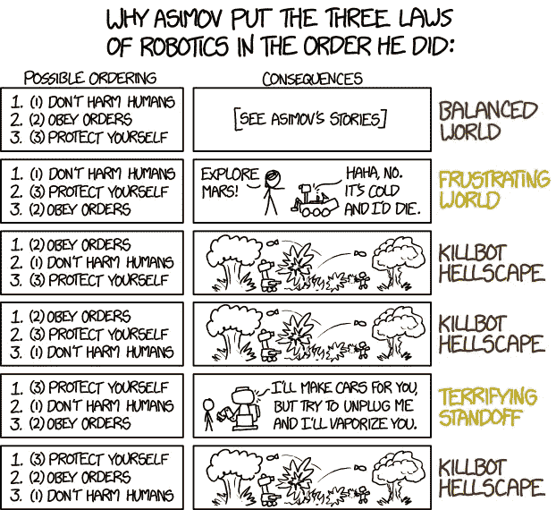

# 尽量减少 Python 中 for 循环的使用

> 原文：<https://towardsdatascience.com/minimize-for-loop-usage-in-python-78e3bc42f03f?source=collection_archive---------10----------------------->

## [蟒蛇短裤](https://towardsdatascience.com/tagged/python-shorts)

## 如何以及为什么应该在 Python 代码中最小化 for 循环的使用？


Photo by [Etienne Girardet](https://unsplash.com/@etiennegirardet?utm_source=medium&utm_medium=referral) on [Unsplash](https://unsplash.com?utm_source=medium&utm_medium=referral)

[Python](https://amzn.to/2XPSiiG) 为我们提供了多种风格的编码。

在某种程度上，它是相当包容的。

一个人可以来自任何语言，开始写 Python。

***但是，学会写语言和用优化的方式写语言是两回事。***

在这一系列名为 [**Python Shorts**](https://towardsdatascience.com/tagged/python-shorts) 的帖子中，我将解释 Python 提供的一些简单但非常有用的构造，一些基本的技巧和我在数据科学工作中经常遇到的一些用例。

在这篇文章中， ***我将谈论 Python 中的*** `***for***` ***循环以及你应该如何尽可能避免它们。***

# 编写 for 循环的 3 种方法:

让我用一个简单的例子来解释这一点。

假设你想在一个列表中取 ***的平方和。***

每当我们想要计算 n 维中两点之间的距离时，这是机器学习中我们都面临的一个有效问题。

使用循环可以很容易地做到这一点。

事实上，我将向你展示三种我见过人们使用的完成相同任务的方法，并让你自己选择你认为最好的方法。

```
x = [1,3,5,7,9]
sum_squared = 0for i in range(len(x)):
    sum_squared+=x[i]**2
```

每当我在一个 python 代码库中看到上面的代码，我就明白这个人来自 C 或 Java 背景。

一个**稍微大一点的**的做法是:

```
x = [1,3,5,7,9]
sum_squared = 0for y in x:
    sum_squared+=y**2
```

好多了。

我没有给名单编索引。我的代码可读性更好。

但是，pythonic 的方法仍然是在一行中。

```
x = [1,3,5,7,9]
sum_squared = sum([y**2 for y in x])
```

这种方法叫做列表理解，这可能是我喜欢 Python 的原因之一。

在列表理解中也可以使用`if`。

假设我们想要一个偶数的平方数列表。

```
x = [1,2,3,4,5,6,7,8,9]
even_squared = [y**2 for y in x if y%2==0]
--------------------------------------------
[4,16,36,64]
```

`***if-else?***`

如果我们想要偶数的平方和奇数的立方呢？

```
x = [1,2,3,4,5,6,7,8,9]
squared_cubed = [y**2 if y%2==0 else y**3 for y in x]
--------------------------------------------
[1, 4, 27, 16, 125, 36, 343, 64, 729]
```

太好了！！！



所以基本上遵循特定的**准则:**每当你想写一个`for`陈述的时候，你应该问自己以下问题:

*   没有`for`环能做到吗？大多数蟒蛇
*   使用**列表理解**可以做到吗？如果有，就用吧。
*   不索引数组可以吗？如果没有，可以考虑使用`enumerate`

什么是`enumerate?`

有时我们既需要数组中的索引，也需要数组中的值。

在这种情况下，我更喜欢用**枚举**而不是索引列表。

```
L = ['blue', 'yellow', 'orange']
for i, val in enumerate(L):
    print("index is %d and value is %s" % (i, val))
---------------------------------------------------------------
index is 0 and value is blue
index is 1 and value is yellow
index is 2 and value is orange
```

规则是:

> 如果没有列表也可以，那就不要索引列表。

# 试着用字典理解

还可以尝试使用**字典理解**，这是 Python 中一个相对较新的功能。语法非常类似于列表理解。

让我用一个例子来解释。我想为 x 中的每个值得到一个(key: squared value)的字典。

```
x = [1,2,3,4,5,6,7,8,9]
{k:k**2 for k in x}
---------------------------------------------------------
{1: 1, 2: 4, 3: 9, 4: 16, 5: 25, 6: 36, 7: 49, 8: 64, 9: 81}
```

如果我想要一个偶数值的字典呢？

```
x = [1,2,3,4,5,6,7,8,9]
{k:k**2 for k in x if x%2==0}
---------------------------------------------------------
{2: 4, 4: 16, 6: 36, 8: 64}
```

如果我们想要偶数键的平方值和奇数键的立方数呢？

```
x = [1,2,3,4,5,6,7,8,9]
{k:k**2 if k%2==0 else k**3 for k in x}
---------------------------------------------------------
{1: 1, 2: 4, 3: 27, 4: 16, 5: 125, 6: 36, 7: 343, 8: 64, 9: 729}
```

# 结论

最后，我要说的是，虽然将你从其他语言中获得的知识转移到 Python 中似乎很容易，但如果你一直这样做，你将无法欣赏到 Python 的美妙之处。当我们使用 Python 的方式时，它会更加强大，也更有趣。

**所以，当你需要一个** `**for**` **循环的时候，使用列表理解和字典理解。如果需要数组索引，使用** `**enumerate**` **。**

> 避免像瘟疫一样形成循环

从长远来看，您的代码将更具可读性和可维护性。

另外，如果你想了解更多关于 Python 3 的知识，我想向你推荐密歇根大学的一门优秀的中级 Python 课程。一定要去看看。

将来我也会写更多初学者友好的帖子。让我知道你对这个系列的看法。在 [**媒体**](https://medium.com/@rahul_agarwal) 关注我或者订阅我的 [**博客**](https://mlwhiz.com/) 了解他们。

一如既往，我欢迎反馈和建设性的批评，可以通过 Twitter [@mlwhiz](https://twitter.com/MLWhiz) 联系。

*原载于 2019 年 4 月 23 日*[*https://mlwhiz.com*](https://mlwhiz.com/blog/2019/04/22/python_forloops/)*。*