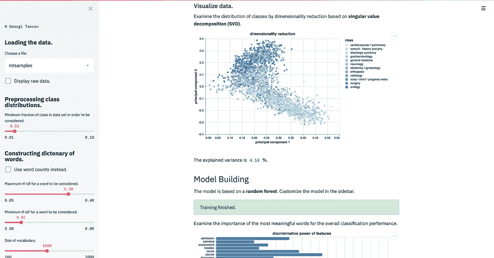
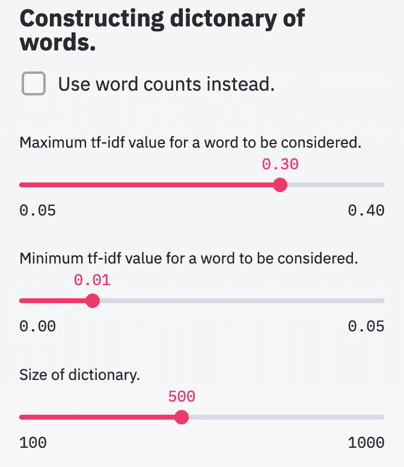
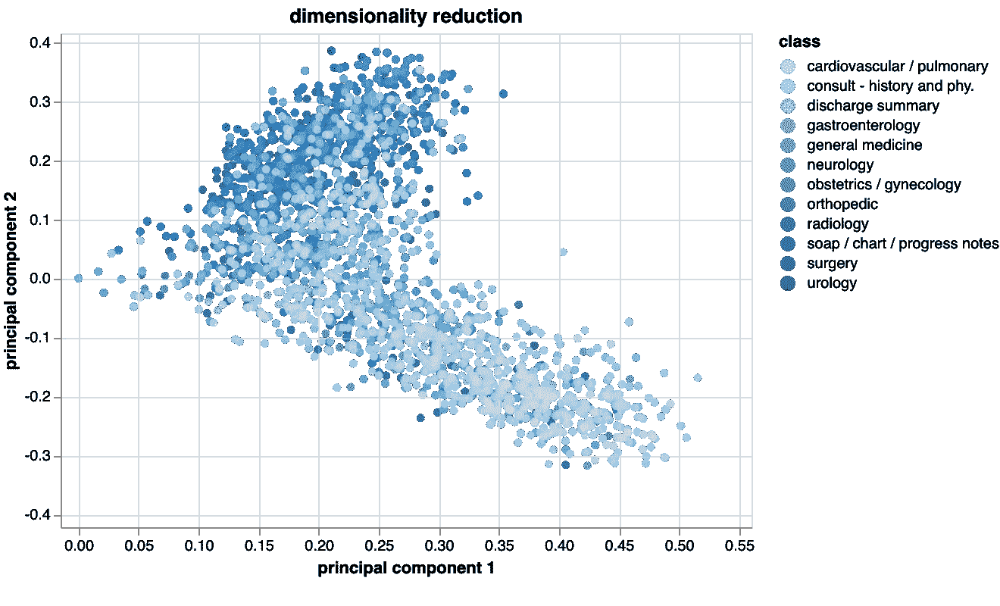
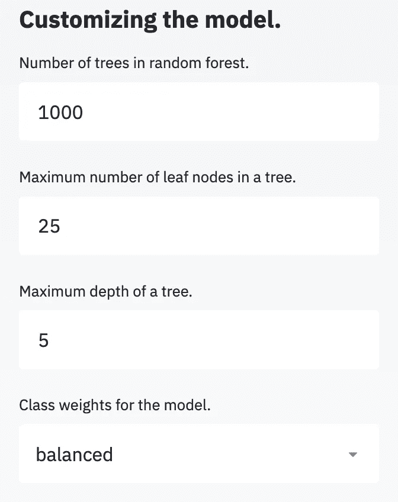
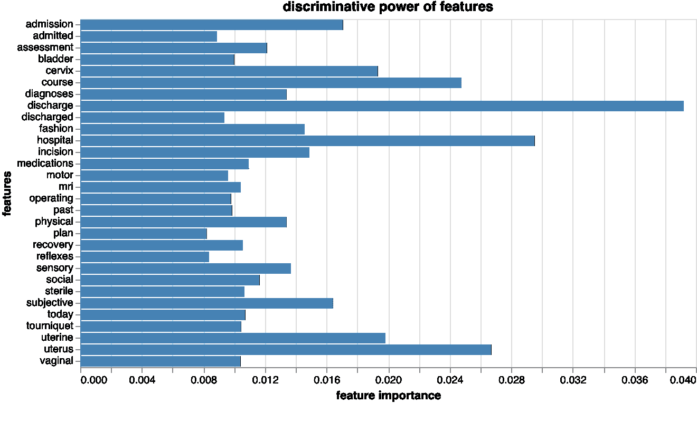
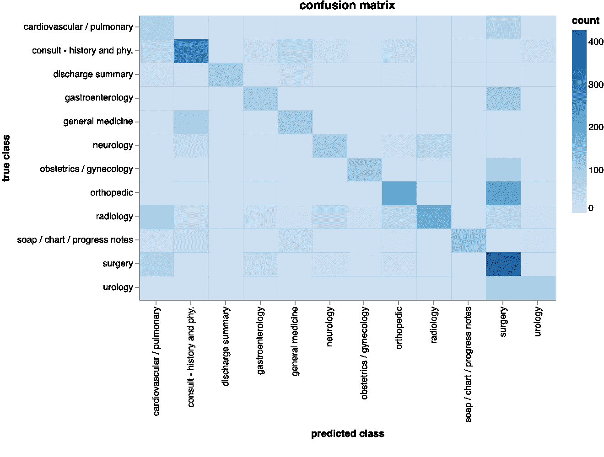

# 医学文档的挖掘和分类

> 原文：<https://towardsdatascience.com/mining-and-classifying-medical-text-documents-1876462f73bc?source=collection_archive---------8----------------------->

## [临床数据科学](https://towardsdatascience.com/tagged/clinical-data-science)

## 使用 Scikit-Learn 和 Streamlit 为自然语言处理开发和部署机器学习应用程序。


Photo by [Annie Spratt](https://unsplash.com/@anniespratt?utm_source=medium&utm_medium=referral) on [Unsplash](https://unsplash.com?utm_source=medium&utm_medium=referral)

# 介绍

在医疗领域，会产生来自多个专业的大量(数字)文本文档，无论是患者健康记录、信件还是临床研究文档。事实上，文本数据，通常是[非结构化](https://en.wikipedia.org/wiki/Unstructured_data)，促成了全球数据量的巨大增长——仅社交媒体一项。因此，从文本中检索信息成为一项越来越重要的任务。

这篇文章的目的有两个:

1.  演示方法为 [**文本挖掘**](https://en.wikipedia.org/wiki/Text_mining) 和**文档分类**用于 [**自然语言处理**](https://en.wikipedia.org/wiki/Natural_language_processing)
2.  展示使用 [Scikit-Learn](https://scikit-learn.org/stable/) 和 [Streamlit](https://streamlit.io/) 在 Python 中自动生成文本分类器的应用的**开发**和**部署**。

最终产品看起来像这个应用程序，名称为 [**医学语言模型学习者(MLML)**](http://ml-ml.herokuapp.com/) 。(原始数据可在 [**kaggle**](https://www.kaggle.com/tboyle10/medicaltranscriptions) 上获得)。)

> **自然语言处理** ( **NLP** )是[语言学](https://en.wikipedia.org/wiki/Linguistics)、[计算机科学](https://en.wikipedia.org/wiki/Computer_science)、[信息工程](https://en.wikipedia.org/wiki/Information_engineering_(field))、[人工智能](https://en.wikipedia.org/wiki/Artificial_intelligence)的一个子领域，涉及计算机与人类(自然)语言之间的交互，特别是如何编程计算机处理和分析大量的[自然语言](https://en.wikipedia.org/wiki/Natural_language)数据。



Possible look of a Streamlit application. (image by author)

# 语言建模

Andrew Ng explaining embeddings, sequence models, recurrent neural networks.

## 嵌入

一个重要的考虑是，文本由 [**字符串**](https://en.wikipedia.org/wiki/String_(computer_science)) 组成，但是数学模型依赖于数字，有不同的方式将文字转换成数字向量。另外，根据问题的定义，对语言建模有不同的可能性。一个常见的任务是将来自某个领域的序列(例如某种语言的文本/语音)映射到另一个领域的序列(例如另一种语言的文本/语音)，称为 [**序列到序列模型**](https://en.wikipedia.org/wiki/Seq2seq) 。例如，为了从文本( [**文本到语音**](http://An important consideration is the fact that text consists of strings, but mathematical models rely on numbers.) )生成语音，使用 [**递归神经网络**](https://en.wikipedia.org/wiki/Recurrent_neural_network) 以及预训练的单词[](https://en.wikipedia.org/wiki/Embedding)**(例如用于单词表示的 [**全局向量**](https://nlp.stanford.edu/projects/glove/) 、*手套*)。在那种情况下，一个单词就变成了一个 *n* 维空间中的向量，类似于具有 *n* 个主成分的空间中的数据点。**

**不同的维度(也称为 [**、潜在变量**](https://en.wikipedia.org/wiki/Latent_variable) )可以被认为是描述单词的属性/特性，例如面包、水果和苹果等单词的属性“可食用”；像椅子、汽车和动物这样的词会出现在相反的方向。因此，在这个维度上，“苹果”和“椅子”会相距更远，但是“苹果”和“水果”会更近。至于“动物”这个词，这应该是中间的某个地方，因为有些动物是被吃掉的。请注意，通常不可能提取不同潜在变量的含义。**

**由于这些嵌入，与 1 选 1 的 *K* 编码方法相比，维数降低了。例如，具有 *K* 个单词的字典在 1-out-of-t 10】K 空间中具有 *K* 个维度(每个单词都是与所有其他单词正交的向量)，但是嵌入可以将维度降低到 100，从而降低计算复杂度。(如果 *K* =10.000 且 *n* =100，则压缩系数为 100。)**

**预训练的嵌入可以下载，不必先构建。然而，每一个可能的单词都必须已经在嵌入中可用——或者嵌入必须首先被训练。嵌入是与上下文无关的，即单词“bank”在类似于“bank account”或“he sat on a bank”的表达中被视为相似。**

## **词汇袋**

**或者，可以忽略语言的顺序方面，将文本建模为单词的集合( [**单词袋**](https://en.wikipedia.org/wiki/Bag-of-words_model) 方法)。这是文本挖掘中最常见的表现形式，是从[文本](https://en.wikipedia.org/wiki/Plain_text)中获取高质量信息的过程。为了以这种方式描述文本，通过使用**最频繁出现的单词**或[**n-grams**](https://en.wikipedia.org/wiki/N-gram)**(根据文本中的单词总数进行原始计数或归一化)来构建字典，但是这样的字典可能不太具有区分性，因为每个文本都包含像“a”、“the”、“is”等表达。****

****为了解决这个问题，开发了一种叫做 [**词频-逆文档频率**](https://en.wikipedia.org/wiki/Tf%E2%80%93idf) ( **tf-idf** 或 **TFIDF** )的解决方案；tf-idf 是一个**数字统计量**，旨在反映一个单词对文档集合中的一个文档有多重要。tf-idf 值与单词在文档中出现的次数成比例地增加，并根据语料库中包含该单词的文档数量进行修改，这有助于调整某些单词通常更频繁出现的事实。tf-idf 是当今最流行的术语加权方案之一；[数字图书馆中 83%的基于文本的推荐系统使用 TF–IDF](https://link.springer.com/article/10.1007%2Fs00799-015-0156-0)。****

## ****术语频率-逆文档频率****

******词频**(针对每个文档进行计算)通常是特定单词 *i* (例如“子宫颈”)的计数除以文本 *L* 中的总单词量，从而调整文档长度。****

******逆文档频率**通过计算包含单词 *i* 的文档的逆分数( *N/ni* )并应用对数变换来获得。出现在几乎每个文档中的单词在对数变换之前将具有接近 1 的值，因此在对数变换之后接近 0。****

****tf-idf 是为一组 *N* 文档中的每个文档 *k* 中的每个单词 *i* 定义的。它由 tf 和 idf 相乘计算得出。这样，几乎每个文档 *k* 中都出现的一个字 *i* 降低了 tf-idf 值。对于文本挖掘，在字典中保留具有低 tf-idf 值的单词是没有意义的，因为它们对于特定的文档类没有区别。****

****想象一下，一个数据科学家想要建立一个区分生物和法律文档的模型；他应该关注哪些单词？像“是”或“a”这样无处不在的词一点帮助都没有，但是像“蛋白质”或“合同”这样的术语有帮助——这些是有趣的。如果模型应该进一步区分生物文档的子类(更高的分辨率)，它需要细化字典。例如，“DNA”、“酶”或“途径”等词在微生物学中比在生态学中使用得更频繁，而“生物多样性”、“栖息地”或“种群”等词则相反。如果期望所述更高的分辨率，可能需要更大的字典。或者，人们必须更有选择性地将最大和最小 tf-idf 值包括在尺寸为 d 的字典中。****

****tf-idf 计算的结果是一个维数为 N *x* D 的矩阵，即文档数乘以字典大小，其中填充了用作特征的 tf-idf 值**T3。注意，这很可能是一个 [**稀疏矩阵**](https://en.wikipedia.org/wiki/Sparse_matrix) 。此外，在矩阵构造过程中存在可调参数，并且显然 tf-idf 变换对于模型性能具有一些影响。******

**sci kit-作为文本文档的内置**转换器**学习。**

```
**import** pandas **as** pd **from** sklearn.feature_extraction.text **import** TfidfVectorizer
**from** sklearn.preprocessing **import** LabelEncoder
enc = LabelEncoder()# Load data.
data = pd.read_csv("mtsamples.csv", index_col=0, usecols=[0,1,2,4])
data = data.dropna()
samples = data.transcription
text_labels  = [label_name.lower() for label_name in data.medical_specialty]
labels = enc.fit_transform(np.array(text_labels))# Transform data.
max_df = 0.2
min_df = 0.001
max_features = 1000
ngram_range = (1,1)tfidf_vectorizer = TfidfVectorizer(max_df=max_df, min_df=min_df, max_features=max_features, stop_words='english', ngram_range=ngram_range)tfidf = tfidf_vectorizer.fit_transform(samples)
feature_names = tfidf_vectorizer.get_feature_names()
```

**由于有几个自由参数，Streamlit 可用于构建滑块来更改值，并手动尝试不同的组合；这样，可以快速评估许多不同的选项。**

```
**import** streamlit **as** st
**from** streamlit.logger **import** get_logger# Title.
st.sidebar.header("Constructing dictonary of words.")# Upper bound for tf-idf value.
max_df = st.sidebar.slider("Maximum tf-idf value for a word to be considered.", min_value=0.05, max_value=0.4, value=0.3, step=0.01)# Lower bound for tf-idf value.
min_df = st.sidebar.slider("Minimum tf-idf value for a word to be considered.", min_value=0.00, max_value=0.05, value=0.01, step=0.01)# Size of dictionary.
max_features = st.sidebar.slider("Size of dictionary.", min_value=100, max_value=1000, value=500, step=100)
```

**最终产品看起来应该是这样的。**

****

**Checkboxes and sliders. (image by author)**

# **降维**

**一个可能的应用是根据医学文档的医学专业对其进行分类。一旦构建了文档-单词矩阵，并且将文本转换成数学表示，就可以使用维数减少方法，例如 [**截断奇异值分解**](https://en.wikipedia.org/wiki/Singular_value_decomposition#Truncated_SVD) 和图表库，例如 [Altair](https://altair-viz.github.io/index.html) 来可视化它们。**

```
**from** sklearn.decomposition **import** TruncatedSVD
**import** altair **as** alt# Dimensionality reduction.
dim_red = TruncatedSVD(n_components=2)
data_red = dim_red.fit_transform(tfidf)# Plot.
scatter = alt.Chart(data_red,title="dimensionality reduction",height=400).mark_circle().encode(x='principal component 1', y='principal component 2', color=alt.Color('class', scale=alt.Scale(scheme='blues')),tooltip=["class"]).interactive()st.altair_chart(scatter)
```

****

**Dimensionality reduction of medical documents. (image by author)**

**该图显示了两个主成分空间中的不同文档，解释了原始 tf-idf 空间中的最高方差。已经可以看出，这些类之间有很多重叠——至少对于构造的字典来说是这样——并且分类器的性能会很低。**

**数据集包含 40 个类。然而，还不知道一个特定的类在数据集中出现的频率。例如，可以预期在倾斜的数据集中，低丰度类被错误分类的频率更高，因此丢弃或合并稀有类可能是合理的。**

# **模型结构**

**为了建立文本模型，可以使用任何分类算法，例如 [**随机森林**](https://en.wikipedia.org/wiki/Random_forest)；与 [**逻辑回归**](https://en.wikipedia.org/wiki/Logistic_regression) 相比，随机森林的优势在于可以构造任意形状的决策边界，而无需基扩展。为了找到最佳的随机森林超参数，可以执行网格搜索。**

```
**from** sklearn.ensemble **import** RandomForestClassifier# Number of trees.
n_estimators = 1000# Define classifier.
forest_clf = RandomForestClassifier(n_estimators=n_estimators, max_depth=None, max_leaf_nodes=None, class_weight='balanced', oob_score=True, n_jobs=-1, random_state=0)# Define grid.
parameters = {'max_leaf_nodes':np.linspace(20,35,14,dtype='int')}# Balanced accuracy as performance measure.
clf = RandomizedSearchCV(forest_clf, parameters, n_iter=10, cv=3,iid=False, scoring='accuracy',n_jobs=-1)# Train/optimize classifier.
classifier = clf.fit(tfidf, labels)# Retrieve optimum.
forest = classifier.best_estimator_
feature_importances = forest.feature_importances_
indices = np.argsort(feature_importances)[::-1]
```

**手动调整这些超参数可能也很有趣。(在当前版本中，只有一个文本输入容器，所以必须将字符串转换为整数。)**

```
st.sidebar.header("Customizing the model.")n_estimators = st.sidebar.text_input('Number of trees in random forest.', '1000')max_leaf_nodes = st.sidebar.text_input('Maximum number of leaf nodes in a tree.', '25')max_depth = st.sidebar.text_input('Maximum depth of a tree.', '5')class_weight = st.sidebar.selectbox("Class weights for the model.",('balanced','balanced_subsample'))
```

****

**Input and selection fields. (image by author)**

**为了解释该模型，从随机森林获得的特征重要性应该在用条形图训练之后进行评估。**

```
# Retrieve values.
feature_importance = classifier.feature_importances_# Plot.
bars = alt.Chart(feature_importance, height=400, title="discriminative power of features").mark_bar(color='steelblue', opacity=0.7).encode(y='features:N', x='feature importance:Q', tooltip="feature importance")st.altair_chart(bars)
```

****

**Feature importance of words to discriminate between documents. (image by author)**

**可以看出，大多数重要程度是相似的。由**外袋得分**确定的整体表现较低(0.41)。很可能在类别之间有太多的重叠，这由维度减少来支持。**

# **模型评估**

**评估模型相对于[](https://en.wikipedia.org/wiki/Precision_and_recall)****[**F1 得分**](https://en.wikipedia.org/wiki/F1_score)[**混淆矩阵**](https://en.wikipedia.org/wiki/Confusion_matrix) 进行计算。******

```
****from** sklearn.metrics **import** f1_score, confusion_matrix# Retrieve values.
y_true = labels
y_pred = classifier.predict(tfidf)# Compute scores.
f1_score_ = f1_score(y_true,y_pred,average="weighted")
cm = confusion_matrix(y_true,y_pred)# Plot.
heat = alt.Chart(source, height=500, title="confusion matrix").mark_rect(opacity=0.7).encode(x='predicted class:N', y='true class:N', color=alt.Color('count:Q', scale=alt.Scale(scheme='blues')), tooltip="count")
st.altair_chart(heat)**
```

****F1 分数为 0.49，因此精确度和/或召回率较低。从混淆矩阵中可以看出，该模型在区分医学文档方面存在困难。目前，文档之间使用的单词似乎过于相似，即许多相同的单词在不同的医学专业中使用，或者根本找不到任何模式。****

********

****Confusion matrix for all classes. (image by author)****

****显然，该模型现在可以用于预测。在这种情况下，必须提供一个样本作为输入，将其转换为 tf-idf 格式，并提供给分类器，然后分类器将返回该样本属于任何类别的概率预测。****

# ****部署****

****应用程序中的代码应该如下所示:****

```
**LOGGER = get_logger(__name__)def run():
   # code for appif __name__ == "__main__":
    run()**
```

****为了在本地测试它，终端被打开并被引导到带有“app.py”文件的位置。键入以下代码启动本地测试会话。****

```
**streamlit run app.py**
```

****要在云提供商如 [**Heroku**](http://heroku.com) 上部署应用程序，需要一个帐户和 [**git**](https://git-scm.com/) 。首先，创建一个文件名为“setup.sh”、内容如下的 **shell 脚本**。****

```
**mkdir -p ~/.streamlit/echo "\
[general]\n\
email = \"email@website.com\"\n\
" > ~/.streamlit/credentials.tomlecho "\
[server]\n\
headless = true\n\
enableCORS=false\n\
port = $PORT\n\
" > ~/.streamlit/config.toml**
```

****接下来，创建一个 **requirements.txt** 文件。它的内容应该是这样的。****

```
**pandas
sklearn
numpy
streamlit
altair**
```

****对于 Heroku 来说，必须编写一个所谓的 **Procfile** ，其中包含以下代码行——假设该应用程序名为“app.py”。请注意，Procfile 没有类型规范。****

```
**web: sh setup.sh && streamlit run app.py**
```

****该应用程序可以部署在终端中(这里是在 Unix/Mac 操作系统上)。为此，shell 和所有文件都是定向的。****

```
**$ cd Documents/Projects/App**
```

****接下来，必须在 Heroku 上创建一个应用程序(这里命名为“myapp”)。之后，使用“app.py”文件在目录中初始化 git 存储库。****

```
**$ git init
$ heroku git:remote -a myapp**
```

****代码被提交到存储库并部署在 Heroku 上。****

```
**$ git add .
$ git commit -am "make it better"
$ git push heroku master**
```

****最后，应用程序应该是在线的。****

********

****Photo by [Chris Ried](https://unsplash.com/@cdr6934?utm_source=medium&utm_medium=referral) on [Unsplash](https://unsplash.com?utm_source=medium&utm_medium=referral)****