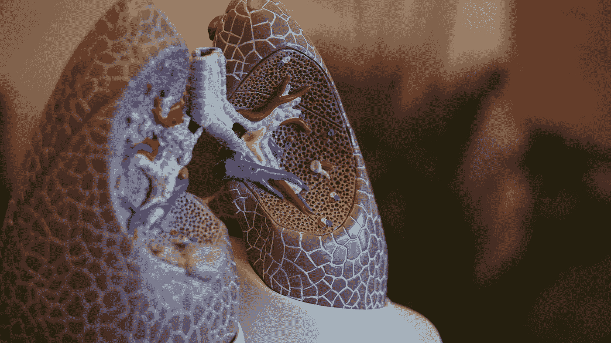
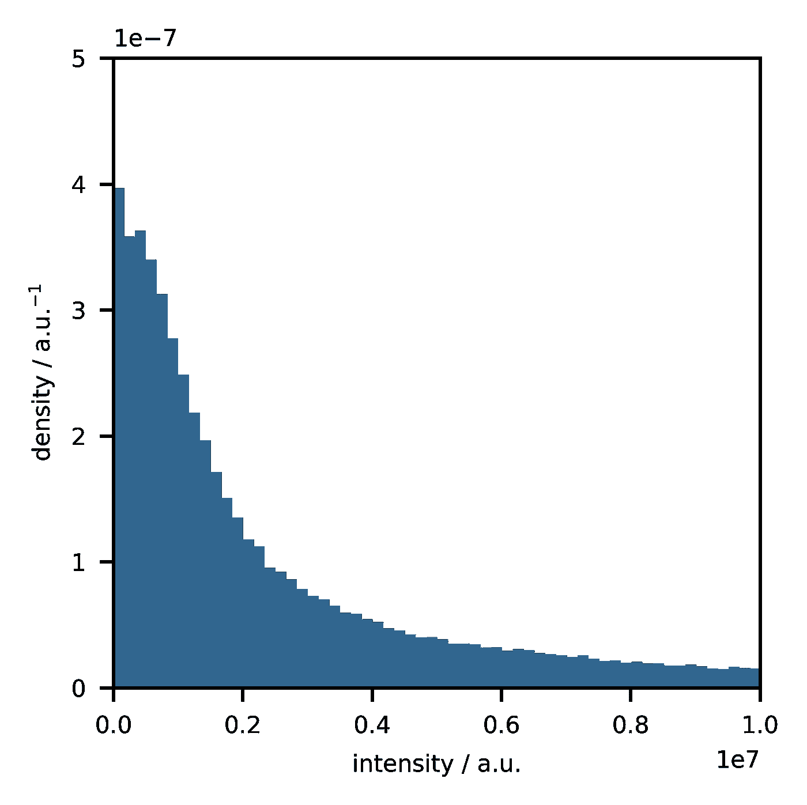
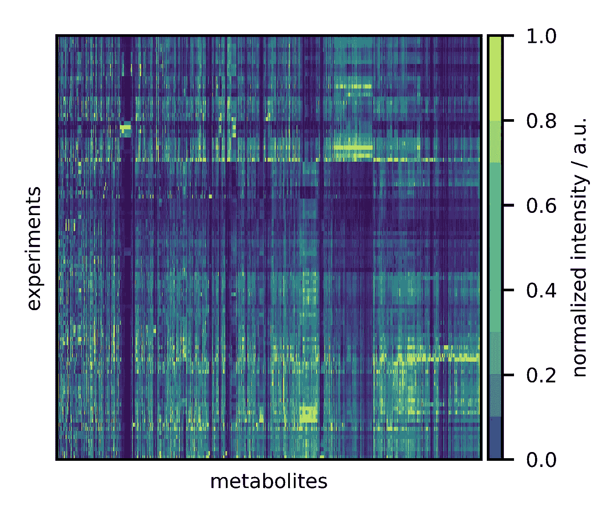
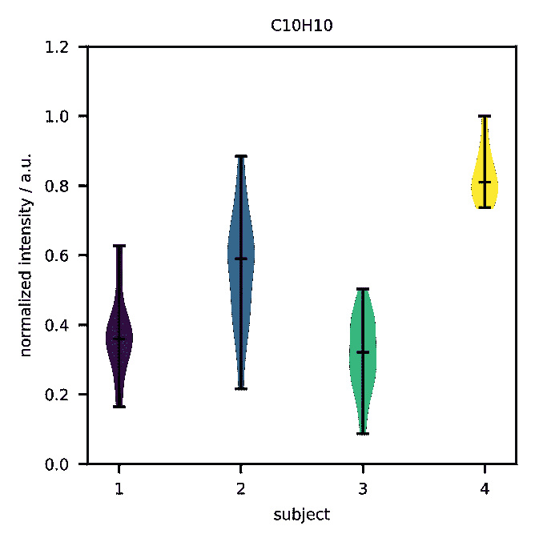
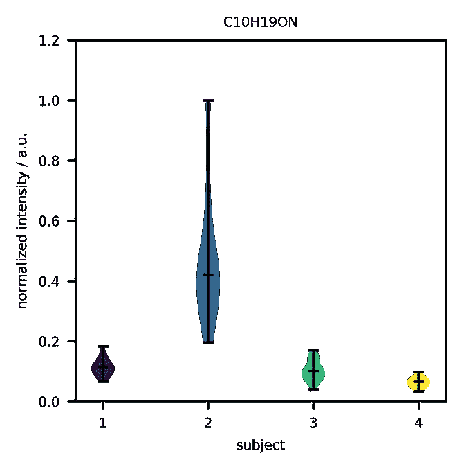
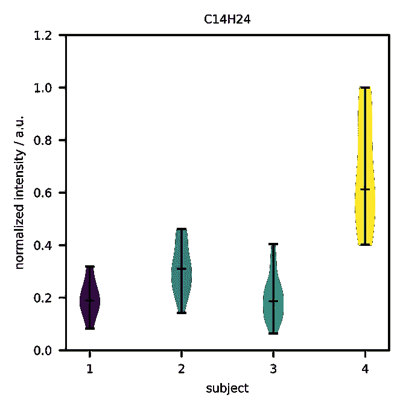
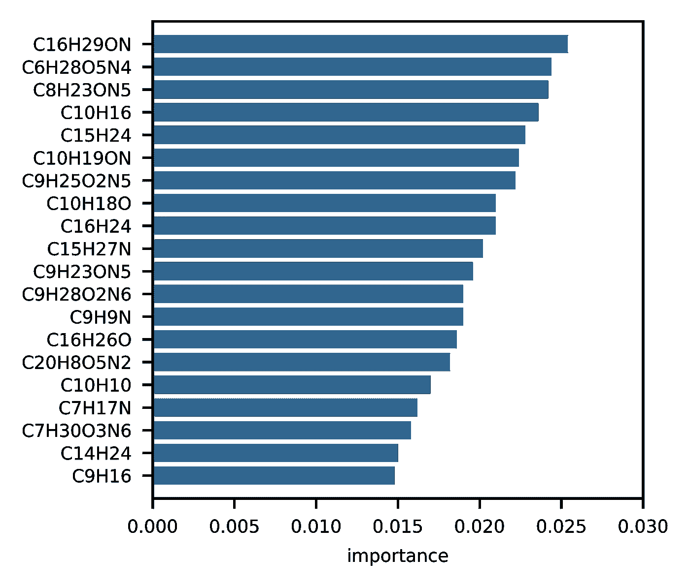
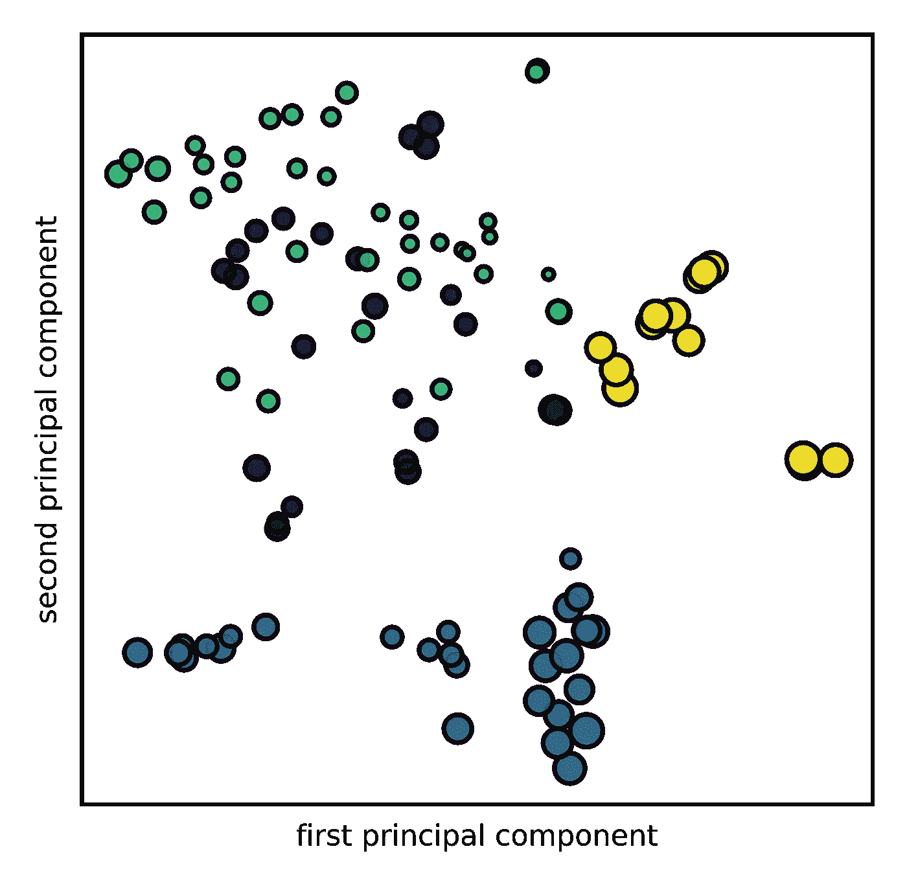

# 用组学和机器学习诊断疾病

> 原文：<https://towardsdatascience.com/mining-biomarkers-from-breath-2975740b2d24?source=collection_archive---------22----------------------->

## [临床数据科学](https://towardsdatascience.com/tagged/clinical-data-science)

## 使用特征选择方法发现生物标记。



Photo by [Robina Weermeijer](https://unsplash.com/@averey?utm_source=medium&utm_medium=referral) on [Unsplash](https://unsplash.com?utm_source=medium&utm_medium=referral)

# 介绍

组学领域包括[生物学](https://en.wikipedia.org/wiki/Biology)(名称以后缀*-组学*结尾)中的各个学科，如 [**基因组学**](https://en.wikipedia.org/wiki/Genomics) 、 [**蛋白质组学**](https://en.wikipedia.org/wiki/Proteomics) 、 [**代谢组学**](https://en.wikipedia.org/wiki/Metabolomics) 或 [**糖组学**](https://en.wikipedia.org/wiki/Glycomics) 。 [**中的组学问题**](https://en.wikipedia.org/wiki/Bioinformatics) 中的组学问题的共同点是变量(*特征*)的数量远大于样本的数量，因此遭受所谓的 [**维数灾难**](https://en.wikipedia.org/wiki/Curse_of_dimensionality) ，因此需要控制模型复杂度的方法(例如正则化)。

通过研究不同人群(例如健康和非健康患者)的**基因组**、**蛋白质组**、**代谢组**，研究人员旨在发现疾病的潜在机制，同时也发现可用于诊断/监测疾病的新的 [**生物标志物**](https://en.wikipedia.org/wiki/Biomarker) 。来自[肺病学](https://en.wikipedia.org/wiki/Pulmonology)的一个例子(基于[在医疗设备开发、生物标记发现和病理学领域的一些出版作品](https://www.ncbi.nlm.nih.gov/pmc/articles/PMC6611759/))很好地说明了这一点。关于 [**呼吸分析**](https://en.wikipedia.org/wiki/Breath_analysis) 、是**诊断学**中的一项新兴技术，能够实现呼吸成分表征。

“小”分子在肺部从血液分配到空气中，然后被呼出。这些化合物通常是属于某些代谢途径的代谢物(偶尔我们也会发现从环境中吸收的分子，如污染物/增塑剂)。疾病可以通过改变基因组、转录组或蛋白质组(例如，由于 [**活性位点**](https://en.wikipedia.org/wiki/Active_site) 的突变或阻断)来扰乱路径，因此将导致代谢组的“移位”。

这个想法是通过 [**质谱**](https://en.wikipedia.org/wiki/Mass_spectrometry) 监测呼吸成分的“扭曲”(以及代谢组的变化)。为此目的，受试者对着一个装置呼气，在 15 到 20 分钟的短暂实验中获得呼吸成分(作为每个单独化合物的**信号** **强度**)。相比之下，血液测试(或多或少)是痛苦的，可能需要几个小时到几天，直到测试结果出来。由于是非侵入性和快速的，呼吸分析将是临床领域的一个巨大突破。通常，在一个实验中可以测量多达两千种不同的化合物，其中一个研究问题是如何从这些数据中找到生物标志物。(例如，研究人员在最近的一项研究中研究了肺癌患者呼出气体的成分。)

在本研究中，检验了该方法的**再现性**和**再现性**，并在一个月的时间内收集了四名受试者的数据。尽管没有发现病理——因为所有受试者都应该是健康的——但这里的想法是展示一些从呼吸中检索生物标志物的可能技术。

# 预处理

分析是在 **Python** 中完成的，带有像 [Pandas](https://pandas.pydata.org/) 、 [Matplotlib](https://matplotlib.org/) 和 [Scikit-Learn](https://scikit-learn.org/stable/) 这样的库。首先，导入所有库。

```
**import** pandas as **pd**
**import** matplotlib.pyplot as **plt
from** sklearn.feature_selection **import** SelectKBest, f_classif
**from** sklearn.ensemble **import** RandomForestClassifier
**from** sklearn.manifold **import** TSNE
```

现在，数据被加载到具有多级索引的数据框中。

```
filename = 'metabolites.xlsx'
data = pd.read_excel(filename, header=0, index_col=[0,1])
```

在下一步中，必须清理数据。因为它包含一些现在不相关的列，所以它们将被删除(“就地”以节省内存)。

```
data.drop(columns=['CO2','V','Q','p'], inplace=**True**)
```

此外，由于测量中有许多**伪像**，因此去除它们也很重要。为此，太弱和太强的信号(低于/高于某个阈值的中值)被确定，并且相应的特征被丢弃(阈值由领域知识确定)。

```
data.drop(columns=data.keys([data.median().values<1e5], inplace=**True**)
data.drop(columns=data.keys([data.median().values>1e9], inplace=**True**)
```

在 104 次实验中得到的特征数是 1510。我们将通过绘制直方图来查看所有信号的分布。

```
fig = plt.figure(figsize=(2.95,2.95))
ax = fig.add_subplot(111)
ax.hist(data.values.flatten(), 40000, stacked=**True**, density=**True**)
plt.show()
```



**Figure 1:** Distribution of intensities across all metabolites, subjects, and experiments. (image by author)

所得的强度分布如下所示，并且数据不是正态分布的，即大多数代谢物的强度较低。其强度与血浆中代谢物的**浓度**成正比，也与其 [**波动性**](https://de.wikipedia.org/wiki/Volatilit%C3%A4t) 和[**膜通透性**](https://en.wikipedia.org/wiki/Cell_membrane) 成正比。不能蒸发或不能透过细胞膜扩散的代谢物是不可测量的。

因此，如果代谢物 *A* 比代谢物 *B* 的强度更高，血液水平不一定要包含相同的关系，甚至可能完全相反——只是因为代谢物 *A* 可能更具挥发性或渗透性。只要存在从血液水平到信号强度的唯一映射，这就不是问题。此外，将不会有一个单独的分子作为一种特定疾病的标记，而是一整套分子，你可以想象这将更加可靠。

# 特征选择



**Figure 2:** Representation of all metabolites in all experiments. (image by author)

在将每个特征缩放到 0 和 1 之间的范围后(*归一化*)，通过将数据绘制成图像来“从顶部”查看数据可能是有用的。首先，有一些特征(代谢物)在大多数实验中强度较低。接下来，有许多样本显示强度降低，这可能暗示了 [**批次效应**](https://www.sciencedirect.com/science/article/abs/pii/S0167779917300367) 。最后，大多数特征以相似的方式表现，均匀地分散在 0 和 1 之间的区间中。(有可能在绘制图像之前对患者或分子集进行聚类，这称为 [**聚类图**](https://www.researchgate.net/publication/24096524_The_Clustergram_A_Graph_for_Visualizing_Hierarchical_and_Nonhierarchical_Cluster_Analyses) 。)

数据现在可以被挖掘了。提取受试者中具有不同水平的分子的一种可能性是进行**单变量统计测试**。由于有两组以上，方差分析( [**F 检验**](https://en.wikipedia.org/wiki/F-test) )是选择的方法。该算法将找到最重要的分子(即具有最低的 **p 值**)。

```
selector = SelectKBest(f_classif, k=9)
data_red = selector.fit(data, data.index.get_level_values("Subject")).transform(data)
selected_features = data.columns[selector.get_support()]
```

由于这是一种参数方法，每个受试者的强度分布必须是正态的，这可以通过绘制小提琴图来检查。为了自动生成概述，使用了下面的代码块。

```
for i in range(0,9):
    to_plot = [data_reduced[data.index.get_level_values("Subject")==1,i]/max(data_reduced[:,i]),             data_reduced[data.index.get_level_values("Subject")==2,i]/max(data_reduced[:,i]),          data_reduced[data.index.get_level_values("Subject")==3,i]/max(data_reduced[:,i]),         data_reduced[data.index.get_level_values("Subject")==4,i]/max(data_reduced[:,i])] fig = plt.figure(figsize=(2.95,2.95))
    ax = fig.add_subplot(1,1,1)
    ax.set_title(selected_features[i])
    vp = ax.violinplot(to_plot, widths=0.2, points=100, showmeans=False, showmedians=True, showextrema=True)
    ax.set_ylim((0, 1.2))
    ax.set_ylabel('normalized intensity / a.u.')
    ax.set_xlabel('subject')
    plt.show()
```



**Figure 3:** Statistically significant different biomarkers. (images by author)

尽管一些分子的分布范围很广，但受试者之间的差异是明显的。这种特征选择方法的缺点是它受样本大小的驱动。对于许多样本，组间的每个微小差异都可能具有统计学意义，尽管这可能是不相关的。

一个 [**随机森林**](https://en.wikipedia.org/wiki/Random_forest) 也可以确定最重要的特征来区分四个主体。特征的重要性可以在训练后恢复。

```
forest = RandomForestClassifier(n_estimators=5000)
forest.fit(data, data.index.get_level_values("Subject"))
importances = forest.feature_importances_
```



**Figure 4:** Feature importances as determined by a random forest. (image by author)

相应的特征重要性标绘了所有有助于区分四个受试者的分子。或者，一个规则化的**支持向量机**或**神经网络**会做类似的工作。请注意，这些分子中的一些(例如 C10H10、C14H24)之前已经被发现，因此这些方法之间存在**一致性**。

# 结论

最后，知道受试者是否与他们自己聚集在一起，也就是说，如果每个受试者都有一些“平均”的呼吸成分，围绕着它波动，这可能是有趣的。为此，我们可以使用像 [**t 分布随机邻居嵌入**](https://en.wikipedia.org/wiki/T-distributed_stochastic_neighbor_embedding) 这样的无监督学习方法。

```
dim_red = TSNE(n_components=2, perplexity=30)
Y = dim_red.fit_transform(data)
```

标记的大小设置为与之前发现的分子之一成比例(C13H16)。

```
fig = plt.figure(figsize=(2.95,2.95))
ax = fig.add_subplot(111)
ax.scatter(Y[:, 0], Y[:, 1], c=data.index.get_level_values("Subject"), cmap=plt.cm.viridis, s=50*data['C13H16']/np.max(data['C13H16']), edgecolors='k', alpha=0.75)
plt.show()
```



**Figure 5:** Scatter plot that captures the complete metabolome. Each subject clusters with himself (more or less). (image by author)

事实上，受试者似乎有一种**呼吸印记**，这种印记在一个月的时间内或多或少是稳定的。(注意，如果使用稀疏的 [**主成分分析**](https://en.wikipedia.org/wiki/Principal_component_analysis) 来代替，负载的大小也可以用作特征选择方法。)

这个简短的分析表明，在不久的将来，呼吸分析可以用作诊断疾病(甚至可能识别个体)的技术。


Photo by [Jair Lázaro](https://unsplash.com/@jairlazaro?utm_source=medium&utm_medium=referral) on [Unsplash](https://unsplash.com?utm_source=medium&utm_medium=referral)