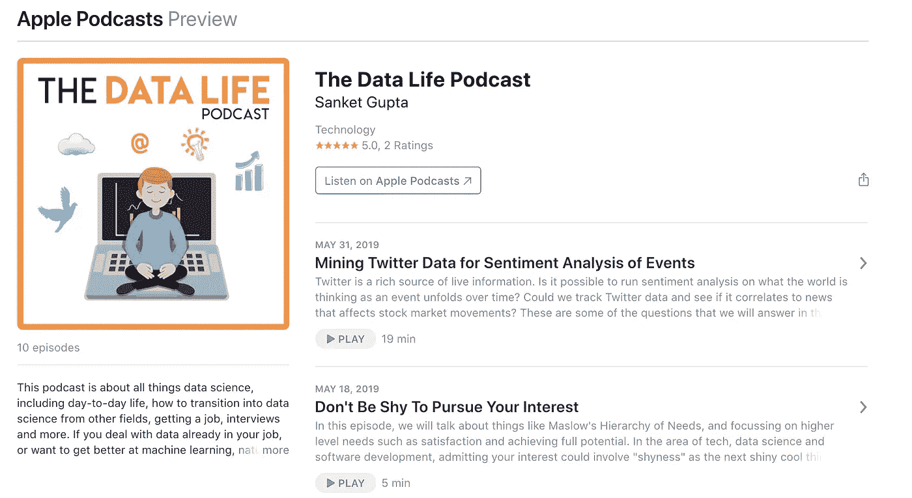
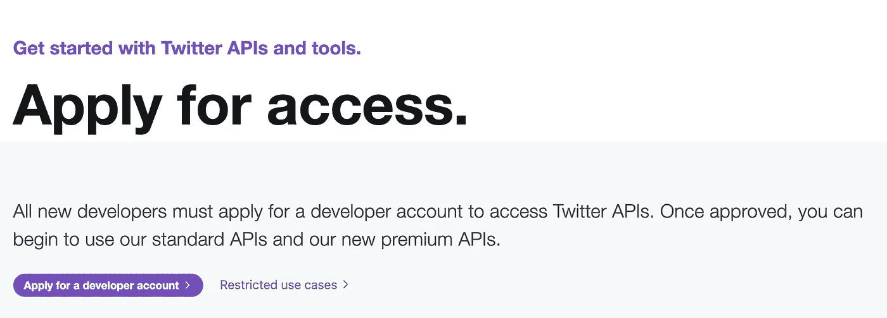
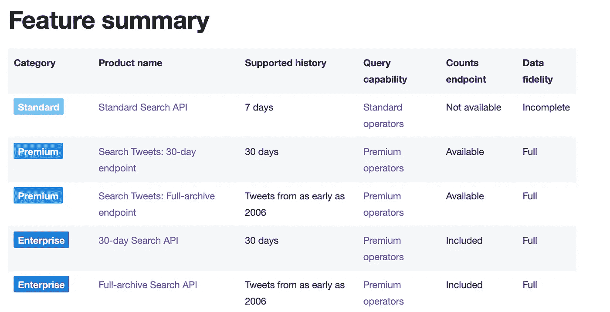
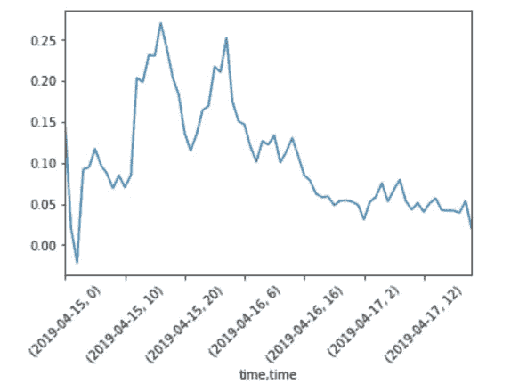
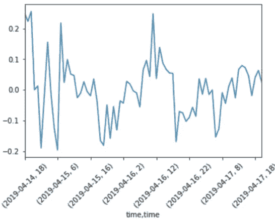

# 挖掘 Twitter 数据进行事件情感分析

> 原文：<https://towardsdatascience.com/mining-live-twitter-data-for-sentiment-analysis-of-events-d69aa2d136a1?source=collection_archive---------9----------------------->

Twitter 是一个丰富的信息来源。从每分钟的趋势到围绕主题的一般性讨论，Twitter 是一个项目的巨大数据源。此外，Twitter 已经为开发人员构建了一个惊人的 API 来使用这些数据。我们能追踪一个事件，看看人们在想什么吗？随着事件的发展，有可能对世界的想法进行情绪分析吗？我们能否追踪 Twitter 数据，看看它是否与影响股市走势的新闻相关？当我最近开始挖掘 Twitter 数据时，这些是我脑海中的一些问题。


Let’s Use Twitter for Sentiment Analysis of Events

如果你更喜欢听这个博客的音频版本，我也为这个博客录了一段播客——在这里我会详细介绍每个步骤，包括注意事项和需要避免的事情。你可以在[苹果播客](https://podcasts.apple.com/us/podcast/the-data-life-podcast/id1453716761)、 [Spotify](https://open.spotify.com/show/6xWi36lOBHpHRabi9eO1Bj) 或 [Anchor.fm](https://anchor.fm/the-data-life-podcast) 上听，或者在我最喜欢的播客应用之一:[阴天](https://overcast.fm/itunes1453716761/the-data-life-podcast)上听。



[Audio version of this available in podcast episode](https://podcasts.apple.com/us/podcast/the-data-life-podcast/id1453716761)

让我们进入使用 Twitter 数据进行事件情感分析的步骤:

## 1.获取 Twitter API 凭据:

首先，访问这个[链接](https://developer.twitter.com/en/apply-for-access.html)并访问一个开发者账户。



Apply for access to Twitter API

一旦您注册，您将有权访问消费者令牌，消费者秘密，访问密钥以及访问秘密。你将需要提到申请 API 访问的原因，你可以提到“学生学习项目”或“学习使用 Python 进行数据科学”等原因作为理由。

## 2.在 Python 中设置 API 凭证:

将您的凭证保存在一个配置文件中，并运行`source ./config`将密钥作为环境变量加载。这是为了避免在 Python 脚本中暴露您的键。确保不要将这个`config`文件提交到 Github 中。
我们将用 Python 中的`tweepy`库来访问 Twitter API。它是原始 Twitter API 的一个很好的包装器，为创建 API URLs 和 http 请求提供了大量的支持。我们只需要提供第一步中的密钥，Tweepy 负责与 Twitter API 对话——这很酷。
运行`pip install tweepy`在您的虚拟环境中获得`tweepy`包。(我一直在用`[pyenv](https://github.com/pyenv/pyenv-virtualenv)`管理不同版本的 Python，印象非常深刻。您还需要`[pyenv-virtualenv](https://github.com/pyenv/pyenv-virtualenv)`包来为您管理虚拟环境——但这本身是另一个博客)
在 Python 中，您可以键入:

```
import os
**import json
import** tweepy
**from** tweepy **import** Stream                   # Useful in Step 3
**from** tweepy.streaming **import** StreamListener # Useful in Step 3consumer_key = os.getenv(**“CONSUMER_KEY_TWITTER”**)
consumer_secret = os.getenv(**“CONSUMER_SECRET_TWITTER”**)
access_token = os.getenv(**“ACCESS_KEY_TWITTER”**)
access_token_secret = os.getenv(**“ACCESS_SECRET_TWITTER”**)auth = tweepy.OAuthHandler(consumer_key, consumer_secret)
auth.set_access_token(access_token, access_token_secret)
api = tweepy.API(auth)
```

这将设置您的环境变量，并设置可用于访问 Twitter API 数据的`api`对象。

## 3.通过流式 API 获取推文数据:

设置好凭证后，现在是时候通过 API 获取 Tweet 数据了。我喜欢使用流式 API 来过滤我感兴趣的话题的实时推文。还有 Search API，它允许您搜索历史数据，但是正如您从这个图表中看到的，它对免费访问的限制很少，最多可以访问过去 7 天的数据。对于付费计划，根据我在网上看到的情况，价格可以从 149 美元到 2499 美元/月(甚至更多)——我在 Twitter 网站上找不到确切价格的页面。



[Types of Categories for Twitter Search API](https://developer.twitter.com/en/docs/tweets/search/overview)

要设置流式 API，您需要定义自己的类方法`on_data`，该方法从流式 API 的`data`对象中执行一些操作。

```
**class** listener(StreamListener):
    **def** on_data(self, data):
        data = json.loads(data)
        # Filter out non-English Tweets**if** data.get(**"lang"**) != **"en"**: **return True****try**:
            timestamp = data[**'timestamp_ms'**]            
            # Get longer 280 char tweets if possible
            **if** data.get(**"extended_tweet"**):
                tweet = data[**'extended_tweet'**][**"full_text"**]**else**:
                tweet = data[**"text"**]
            url = **"https://www.twitter.com/i/web/status/" +** data[**"id_str"**]
            user = data[**"user"**][**"screen_name"**]
            verified = data[**"user"**][**"verified"]  **                
            write_to_csv([timestamp, tweet, user, verified, url])

        **except** KeyError **as** e:
            print(**"Keyerror:"**, e)

        **return True

    def** on_error(self, status):
        print(status)
```

我没有包含`write_to_csv`函数，但它可以使用`csv`库实现，一些例子可以在这里看到[。](https://stackoverflow.com/questions/2363731/append-new-row-to-old-csv-file-python)

你也可以将推文保存到 SQLite 数据库 esp 中。如果有几十万条推文。SQLite 还允许您通过 SQL 命令对所有信息进行命令行访问。对于 CSV，你必须在笔记本上加载一个熊猫数据框。只是看你更喜欢哪个工作流程了。通常情况下，您可以保存到 SQLite 数据库中，并使用 pandas 中的`read_sql`命令将其转换为 dataframe 对象。这允许我从命令行和 pandas 访问数据。

最后，运行这个函数`stream_and_write`来启动流 API 并调用我们上面写的监听器。最主要的是使用`extended`模式调用`Stream` API，因为它会让你访问更长的、潜在的信息丰富的推文。

```
**def** stream_and_write(table, track=**None**):
    **try**:
        twitterStream = Stream(auth, listener(), 
                               tweet_mode=**'extended'**)
        twitterStream.filter(track=["AAPL", "AMZN", "UBER"])**except** Exception **as** e:
        print("Error:", str(e))
        time.sleep(5)
```

另一件需要注意的重要事情是，您可以使用流式 API 跟踪的项目数量。在我的测试中，我无法跟踪超过 400 个左右的`track`列表中的项目。在构思你的想法时，请记住这一点。

## 4.获取情感信息:

一旦我们收集了所有的 tweet 数据，情感分析可以在上面的监听器中完成，也可以离线完成。
我们可以在 Python 中使用开箱即用的情感处理库。从我看到的，我喜欢 [TextBlob](https://textblob.readthedocs.io/en/dev/quickstart.html#sentiment-analysis) 和 [Vader 感悟](https://github.com/cjhutto/vaderSentiment)。`TextBlob`提供主观性评分和极性评分。`Vader`提供一个`pos`、`neu`、 `neg`和一个`compound`分数。对于两个库的-1 和 1 之间的单个情感分数，使用来自 TextBlob 的`polarity`和来自 Vader 情感的`compound`。
根据维达情怀的 Github 页面，

> VADER 情绪分析。VADER (Valence Aware 字典和情感推理器)是一个基于词典和规则的情感分析工具，专门针对社交媒体中表达的情感，对其他领域的文本也很有效。

对于 TextBlob，

```
**from** textblob **import** TextBlob
ts = TextBlob(tweet).sentiment
print(ts.subjectivity, ts.polarity) # Subjectivity, Sentiment Scores
```

对维德来说:

```
**from** vaderSentiment.vaderSentiment **import** SentimentIntensityAnalyzer
analyzer = SentimentIntensityAnalyzer()
vs = analyzer.polarity_scores(tweet)
print(vs["compound"], vs["pos"], vs["neu"], vs["neg"])
```

将情绪信息与推文一起保存，可以让您随着时间的推移为不同的股票或事件构建情绪得分图。Vader vs TextBlob 将取决于您自己的项目，我也尝试了上述两个库的组合，但不知何故喜欢使用一个库完成不同任务的简单性。
理想情况下，你可以用对你来说重要的东西来训练你自己的情感分析模型，但这需要收集你自己的训练数据，并建立和评估一个机器学习模型。为了能够捕捉像“我期待一部精彩的电影，但结果不是”这样的句子中的负面情绪，我们需要能够处理序列数据的模型，并认识到`not to be`正在否定早先的`amazing`，这需要从神经网络中的长短期记忆(LSTM)细胞建立的模型。训练和建立一个 LSTM 情感分析网络可能是另一篇博文，如果你有兴趣阅读，请在下面留下评论。

## **5。剧情情感信息:**

当曼联在冠军联赛四分之一决赛中 0:3 输给巴塞罗那时，我绘制了这种情绪。正如你所看到的，情绪随着时间的推移而下降，当球队在 4 月 16 日下午比赛时，情绪开始下降。



Sentiment Dropping as Manchester United lose to Barcelona

虽然情绪得分在体育赛事中表现不错，但股市呢？以下是高通(QCOM)在苹果放弃与高通的诉讼的一周内的表现(确切消息来自 4 月 16 日)。我们预计围绕这一消息的积极情绪会显著增加，但很难在下面得出结论:



QCOM stock performance during the week when their lawsuit with Apple was dropped

这使得从情感分析中提取 alpha 变得更加困难。我觉得这是一个很好的工具，可以用来观察新闻事件或体育活动的情绪，但试图将情绪与股市表现联系起来更难，因为这涉及到过滤掉嘈杂的推文，还需要做大量的特征工程工作来获得信号。

## 6.在 AWS 或 Google 云平台上进行设置:

你不希望在你的计算机上运行流式 API，因为当你关闭它时，脚本也会停止。您应该在 AWS EC2 实例或 Google 云平台服务器上运行它。我不打算详细说明如何设置，有很多很棒的资源可以使用[[AWS](https://aws.amazon.com/ec2/getting-started/)和[GCP](https://cloud.google.com/compute/docs/quickstart-linux)]。使用`tmux`或`screen`运行上述脚本，并在 Twitter 上访问您感兴趣的话题！

从 Twitter 上获取数据和构建情感分析引擎非常有趣。正如你所期望的那样，看到事件的向下或向上的情绪趋势是非常令人满意的。下一步将是准确地绘制情绪，而不是先保存推文，这将需要像`[dash](https://plot.ly/products/dash/)`这样的库。

祝你探索 Twitter 数据好运——愿你能如你所愿看到趋势！感谢阅读。

资源:
1。text blob:【https://textblob.readthedocs.io/en/dev/
2[。维德:](https://textblob.readthedocs.io/en/dev/)[https://github.com/cjhutto/vaderSentiment](https://github.com/cjhutto/vaderSentiment)3。获得 Twitter API 访问:[https://developer.twitter.com/en/apply-for-access](https://developer.twitter.com/en/apply-for-access)
4。比较其中一些库的博客:[https://Neptune . ai/blog/情操分析-python-text blob-vs-Vader-vs-flair](https://neptune.ai/blog/sentiment-analysis-python-textblob-vs-vader-vs-flair)