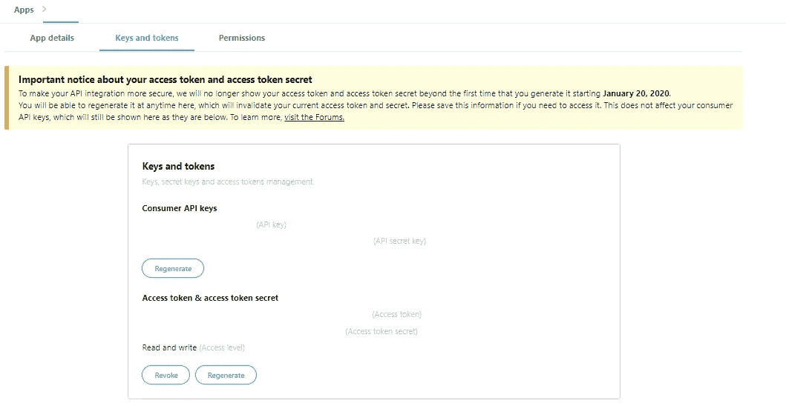
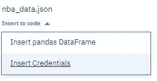
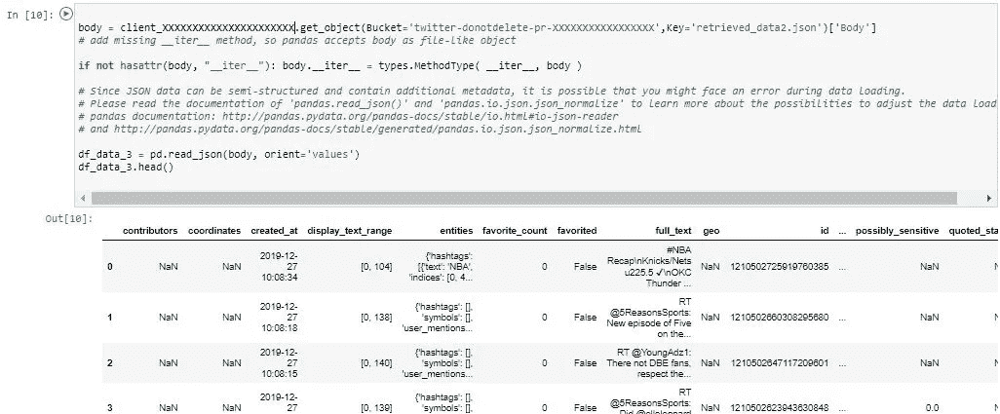

# 在 IBM 云平台上挖掘 Twitter

> 原文：<https://towardsdatascience.com/mining-twitter-on-ibm-cloud-platform-2adab9fb60ed?source=collection_archive---------23----------------------->

## 在 IBM 云存储上将 Tweets 保存为 JSON

This photo is made from a photo in this ©twitter [post](https://blog.twitter.com/en_us/a/ibm.html) and ©[IBM Watson Studio](https://cloud.ibm.com/catalog/services/watson-studio) Logo

去年，我开始了对网络说服的多学科研究。我找不到足够的推特数据集。我需要创建自己的推特数据集，让我能够实现研究目标。

Twitter 免费 API 是有限的，根据我的经验，它会在检索 4000 条左右的推文后暂停大约 15 分钟。为了克服这一点，我使用了时间循环。我需要一个云平台来检索带有时间循环的 50 个查询的推文。

我第一次尝试从 twitter 流中检索推文是在 Watson——IBM 云平台上。Tweet 对象呈现为 JSON，因此保存它们是明智的。嗯——在 IBM 云存储上保存为 JSON 和在本地保存是不一样的。此外，以前没有人问如何做，尽管如此，回答它，所以这里是我的答案。

关于 IBM Watson studio 的几句好话:它是一个非常友好的云计算平台，尤其是对于第一次使用它的人。你可以在这里报名[。点击几下之后，你就可以在 Jupyter 笔记本上工作了。你可以在这里](https://dataplatform.cloud.ibm.com/)阅读[关于如何开始使用沃森工作室。](https://dataplatform.cloud.ibm.com/docs/content/wsj/getting-started/get-started-wdp.html?linkInPage=true)

## 连接

在处理任何云项目时，一个必要的步骤是将您的项目连接到您的项目资源。正如我所说，Watson Studio 非常友好，只需两次点击:一次点击工具栏上的三个垂直点，第二次点击`Insert project token`，如下图所示:

将创建如下代码:

作为该项目的管理员，您可能需要批准这一点，但 Watson 将指导您并重新引导您。

在 Watson 上工作时，您可能需要在每次重新连接时安装`[tweepy](https://www.tweepy.org/)` 。为了检索推文，这些是最少的必要导入和安装:

为了[连接到 twitter API](https://developer.twitter.com/en/docs/basics/getting-started) ，你需要一个 twitter [开发者账户](https://developer.twitter.com/en.html)和你的账户凭证。访问您的密钥和令牌的一种方式是通过[应用](https://developer.twitter.com/en/apps)和应用详细信息——如果需要，您还可以在那里重新生成它们。
如此处所示:

稍后插入您的凭证，如下所示:

在连接您的项目和资源，并连接到您的 twitter API 之后，下一步是检索 tweets。

## 检索推文

在下面的代码要点中，有一个如何使用 tweepy 的示例，它包含过滤器、查询、语言和要检索的项数。你可以[过滤推文](https://developer.twitter.com/en/docs/tweets/rules-and-filtering/overview/standard-operators)并使用任何你喜欢的查询。

## 保存到 JSON

挖掘 twitter 数据的最后一步是保存它。
沃森存储上的节约语法是:

`project.save_data(data=json.dumps(all_data),file_name=`data.json`,overwrite=True)`

与本地保存 JSON 文件的语法不同:
`with open(`data.json`, `w`) as f:
... json.dump(all_data, f)`

[在 Wason 上加载数据](https://dataplatform.cloud.ibm.com/docs/content/wsj/analyze-data/load-and-access-data.html)也只需两次点击:

它将插入连接到您的云存储的代码，将添加所需的导入，并将数据作为 pandas 数据帧读取。它看起来像这样:

使用 Watson studio 非常简单:

1.连接到云资源和 twitter API。

2.检索推文。

3.节约。

Photo by [freestocks.org](https://www.pexels.com/@freestocks?utm_content=attributionCopyText&utm_medium=referral&utm_source=pexels) from [Pexels](https://www.pexels.com/photo/coffee-smartphone-twitter-application-58639/?utm_content=attributionCopyText&utm_medium=referral&utm_source=pexels)

现在，至于理解 twitter 元数据？好吧，那是另一个时间的另一篇博文。