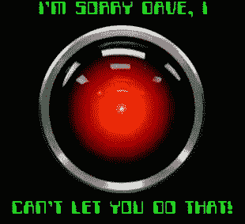
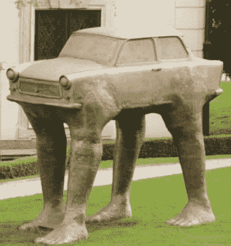

# 镜子、自动驾驶卡车、无意识偏见和机器学习/人工智能

> 原文：<https://towardsdatascience.com/mirrors-self-driving-trucks-unconscious-bias-and-machine-learning-artificial-intelligence-24c162c55eb?source=collection_archive---------34----------------------->

[https://www.youtube.com/watch?time_continue=82&v=ARJ8cAGm6JE](https://www.youtube.com/watch?time_continue=82&v=ARJ8cAGm6JE)

这个月我去拜访了我在爱尔兰的一个朋友，他刚刚改造了一所房子。她买了一面大镜子，问现场的工人是否可以把它挂在餐厅里，然后她就出去了。当她回来时，她发现虽然镜子被正确地挂在墙上，但她只能在镜子里看到自己的头顶。考虑到镜子已经存在了几个世纪，而且它们的用途也很好理解，为什么镜子被挂得这么高呢？会不会是挂镜子的人只能看到自己，而无法进入他人的体验？

给定精确的统计数据，机器人会做得更好吗？2014 年，爱尔兰男性的平均身高为 178.9 厘米(5 英尺 10 英寸)，女性的平均身高为 165.1 厘米(5 英尺 5 英寸)。也许机器人在摆放位置上会更客观？

我再次阅读和与跨行业的人聊天，思考各种形式的无意偏见。对于那些喜欢了解他人思维基础的读者，你可以通过阅读这篇[纽约时报文章](https://www.nytimes.com/2019/09/20/arts/design/imagenet-trevor-paglen-ai-facial-recognition.html)或这篇来自麻省理工学院的[白皮书](https://workofthefuture.mit.edu/sites/default/files/2019-09/WorkoftheFuture_Report_Shaping_Technology_and_Institutions.pdf?utm_medium=email&utm_source=topic+optin&utm_campaign=awareness&utm_content=20190923+ai+nl&mkt_tok=eyJpIjoiWWpZNVlUQTVZemxpTWpWaiIsInQiOiJWQXZJZlBVbTdibzU3XC9sSkFkMk5JWXlhUUZwRGxURWloNkhIcU41MVllVGV3NDR1TjZKczNhUlZhMWVmcmNMSlErU05LZ0RoQzJsYytrYk8xdGdIQmJxMDRubDNqMTNtWEY0YlZKRmdobHRlQjhrYXNrbDVGTzhJcHFLU2FKVXkifQ%3D%3D)来了解我的想法。还有，我刚刚开始读这本[书](https://www.penguinrandomhouse.com/books/603982/rebooting-ai-by-gary-marcus-and-ernest-davis/9781524748258/)。

让我们从一个有趣的事实开始:美国劳工统计局预计，在 2006 年到 2028 年间，55 岁及以上的美国工人的比例将从 16.8%上升到 25.2%。2018 年，55 岁以上潜在工薪阶层的比例为 23.1 %。2019 年 7 月，他们的失业率约为 2.7%。如果你从事技术和/或软件行业，看看你的办公室。你看到这些超过 55 岁的工人了吗？他们中有没有人参与针对这群打工仔的产品设计？

鉴于预测在不到十年的时间里，超过四分之一的潜在劳动力年龄将超过 55 岁，这将是机器人可能做出更理性决定的又一个例子吗？如果人们的预期是，人口中某一部分的工薪阶层将会增加，那么机器人/智能代理进行招聘是否反映了对更大的潜在客户同理心的需求？根据最近的一篇关于[雇佣](https://hired.com/page/state-of-salaries/average-tech-salary-by-age)的文章，我们确实知道，按照人类的雇佣方式，在美国，科技工作者的平均工资在 40 岁之后会趋于稳定。

一个聪明的代理人真的会做得更好，在招聘中更少年龄歧视吗(假设相同的技能)？也许不是。基于 [ImageNet 轮盘](https://imagenet-roulette.paglen.com/)；如果把外表考虑进去的话，肯定不是。人工智能模型对训练数据的依赖意味着，同样的偏见(甚至可能被标记数据的一小部分人放大)可能会使智能代理比人类更有偏见。

[https://www.travelblog.org/Photos/2494174](https://www.travelblog.org/Photos/2494174)

转向自动驾驶卡车或其他自动驾驶车辆。无人驾驶车辆的一个明显好处是，机器比人类需要更长的时间才会疲劳。人们最初可能会认为，对于卡车运输公司来说，让他们的司机在公路上睡觉，而卡车自己行驶，然后让司机接管更具挑战性的外城/内城地区或有驼鹿的山口，会更安全、更具成本效益。这种方法将保持目前每辆卡车一名司机的做法，并利用我们现有的公路基础设施。可能会增加一些州提议的卡车专用车道。

从我们对个人主义和对汽车的热爱的历史偏见中退一步，如果为了长途运输和公共交通而放弃或建设宝贵的土地是一个挑战，你将如何设计一个既能处理轻轨又能处理小型货运的系统？轮子？足迹？集装箱在下面，人坐在上面？你将如何装载它们？如果这能让变形金刚想起你的童年，那就更好了！

无意识的偏见可以被那些经验有限的人和那些“思想陈旧”的人植入非人类的“智力”中:那些年龄在 30-90 岁之间的人，他们的思想因为工作或生活环境缺乏改变而变得停滞不前。

**周末愉快，尽情发挥你的想象力，挑战你的偏见！**

